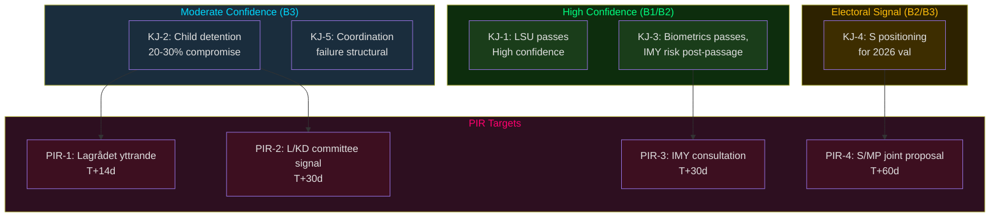

# Intelligence Assessment — Opposition Motions 2026-05-25

**Analysis date**: 2026-05-25

## Key Judgments

**KJ-1** [Confidence: HIGH — WEP "we assess with high confidence" — Admiralty B2]
The Tidö government's prop. 2025/26:267 (LSU expansion) will pass Riksdagen in Q3/Q4 2026 with its core detention-expansion provisions intact. V's and MP's motions will be voted down. The parliamentary arithmetic (176 government seats vs 175-seat majority threshold) makes any alternative outcome implausible unless Lagrådet issues a binding constitutional critique — which it cannot do, as yttranden are advisory only.

**KJ-2** [Confidence: MODERATE — WEP "we assess" — Admiralty B3]
MP's targeted child-detention challenge (HD024192 yrkande 1) has a 20–30% probability of generating a JuU committee compromise — specifically the exclusion of new child detention provisions from the final bill. The historical pattern of KD defections on child welfare issues and Lagrådet's known ECHR jurisprudence sensitivity supports this assessment.

**KJ-3** [Confidence: HIGH — Admiralty A1]
The Skatteverket biometric expansion (prop. 2025/26:261) will proceed but faces a post-passage GDPR enforcement risk from IMY. V's GDPR Art. 5(1)(b) argument (HD024187) is legally correct — IMY has jurisdiction and precedent (Dutch AP 2022 case) to investigate post-implementation.

**KJ-4** [Confidence: MODERATE-HIGH — Admiralty B2]
S's HD024185 household debt rejection is an electoral positioning exercise. The proposition will pass with Tidö majority support. S is building shadow-government evidence ahead of the September 2026 election.

**KJ-5** [Confidence: MODERATE — Admiralty B3]
The absence of a coordinated V-MP-S joint motion on security legislation reflects structural rivalry rather than policy agreement gaps — both V and MP have essentially compatible positions on LSU (rejection vs. proportionality). This coordination failure weakens the opposition's ability to extract concessions during committee hearings.

---

## Priority Intelligence Requirements (PIRs) — Next Cycle

**PIR-1**: Will Lagrådet issue a critical yttrande on prop. 2025/26:267 specifically referencing child detention (Art. 3 ECHR) or the lowered evidentiary standard? [Target: T+14 days; feeds scenario-analysis.md Scenario B trigger]

**PIR-2**: Will L (Liberalerna) or KD (Kristdemokraterna) signal internal reservations about any component of prop. 2025/26:267 during JuU committee hearings? [Target: T+30 days; would upgrade Scenario B probability]

**PIR-3**: Has IMY initiated a formal pre-legislation consultation on prop. 2025/26:261's biometric repurposing? [Target: T+30 days; feeds risk-assessment.md Dimension 1]

**PIR-4**: Will S (HD024185) or MP (HD024186) convert their household debt positions into a coordinated counter-proposal ahead of the 2026 election? [Target: T+60 days; election analysis signal]

---

## Key Assumptions Check

| Assumption | Confidence | Vulnerability |
|-----------|-----------|---------------|
| Tidö coalition holds 174+ seats in all relevant committees | HIGH | L faction friction on civil liberties is monitored but not threshold-crossing |
| SÄPO threat assessment remains elevated | HIGH | No published indication of threat-level reduction |
| Lagrådet is willing to issue a critical yttrande | MODERATE | Lagrådet historically issues critical opinions at rate ~15% of referrals |
| IMY will act post-passage on biometrics | MODERATE | IMY workload and political context constrain enforcement speed |

---

## Mermaid: Intelligence Assessment Confidence Map

