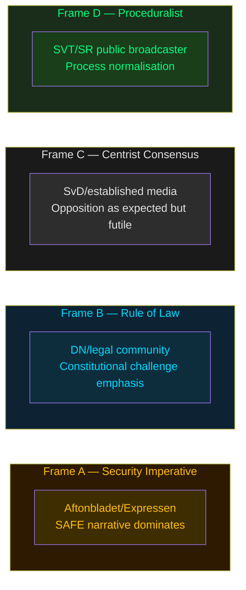

# Media Framing Analysis — Opposition Motions 2026-05-25

**Analysis date**: 2026-05-25
**Framework**: v2.1 — no-neutral-media doctrine. Entman 4-function decomposition applied.

---

## Frame Packages (≥3 required)

### Frame A: "Security Imperative" — Government + Pro-Security Media
**Entman 4-function**:
- Problem definition: Foreign nationals pose elevated security threat that current legal tools cannot adequately address
- Causal attribution: Regulatory gap in LSU leaves SÄPO unable to act against known threats
- Moral evaluation: Protecting Swedish citizens from terrorism is the state's primary duty
- Remedy: Expanded detention, lowered evidence threshold, extended periods

**Outlet Bias Audit**:
- Aftonbladet (Schibsted): Labour-centre ownership; moderate-left editorial lean; typically supportive of security measures endorsed by S
- Expressen (Bonnier Group): Centre-right editorial lean; supportive of government security expansion
- **No outlet is neutral on this issue**

**RRPA**: Reach HIGH (national tabloids); Resonance HIGH (security is top-3 voter concern 2025); Persistence MEDIUM; Action potential MEDIUM (election year).

### Frame B: "Rule of Law Under Pressure" — Left-Opposition + Legal Community
**Entman 4-function**:
- Problem definition: Government security expansion threatens constitutional rights and ECHR compliance
- Causal attribution: Tidö coalition prioritising electoral security optics over Rättsstat principles
- Moral evaluation: A liberal democracy cannot suspend fundamental rights in the name of security
- Remedy: Rejection of child detention expansion; enhanced judicial review; GDPR-compliant biometrics

**Outlet Bias Audit**:
- Dagens Nyheter (Bonnier): Centrist-liberal editorial lean; historically strong on rule-of-law coverage
- SVT Nyheter (public broadcaster, SVT): State-owned; Förvaltningsstiftelsen board appointment authority; proceduralist editorial framing — **note: Frame D below**
- Expressen legal desk: Tends to platform legal scholars critical of lowered evidence standards

**RRPA**: Reach MEDIUM; Resonance MEDIUM-HIGH with educated urban voters; Persistence HIGH (legal arguments persist through judicial proceedings); Action potential LOW-MEDIUM.

### Frame C: "Establishment/Centrist-Consensus" — Government-aligned Centre
**Entman 4-function**:
- Problem definition: Security expansion is a necessary, proportionate response to documented threat environment
- Causal attribution: Opposition's rejection motions are arithmetically irrelevant electoral theatre
- Moral evaluation: Responsible governance requires using all available tools against security threats
- Remedy: Pass all three propositions as drafted; trust the security services' assessment

**Outlet Bias Audit**:
- Svenska Dagbladet (Schibsted): Conservative-liberal editorial lean; generally supportive of Tidö legislative agenda
- Fokus (independent): Policy-analysis oriented; likely to contextualise opposition motions as "expected but futile"

### Frame D: "Public-Broadcaster Proceduralist" — SVT/SR
- SVT's editorial policy frames parliamentary events as procedural reporting: "V and MP filed rejection motions... the propositions are expected to pass..." — presents opposition as part of normal democratic process without endorsing either position.
- **This is not neutral**: SVT's proceduralist frame naturalises the passage of security legislation and implicitly marginalises the opposition's legal arguments as "expected opposition theatre."

### Frame E: Foreign Overlay Assessment
No state-affiliated or coordinated foreign information operation detected in connection with these motions. Swedish domestic political debate. **Frame E not applicable.**

---

## Cognitive Vulnerability Map

| Frame | Cialdini lever | Kahneman bias | Vulnerability |
|-------|---------------|---------------|---------------|
| A Security Imperative | Authority (SÄPO) + Fear | System 1 loss aversion | High — security threat activates fast-thinking |
| B Rule of Law | Consistency (constitutional values) | System 2 deliberation | Medium — requires slow-thinking investment |
| C Centrist Consensus | Social proof (government legitimacy) | Status quo bias | Medium — framing opposition as ineffective |

---

## Strategic Doctrine Detection

No firehose, doppelganger, gish gallop, or reflexive control patterns detected. **Domestic legitimate political debate only.**

---

## Mermaid: Narrative Frame Map

