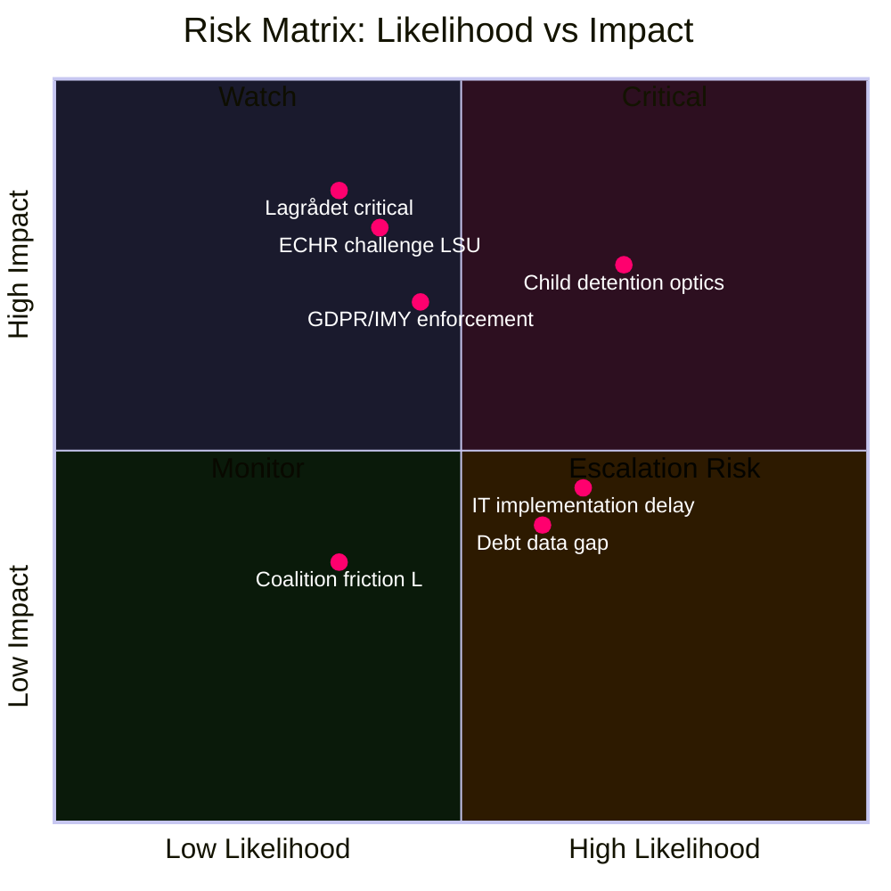

# Risk Assessment — Opposition Motions 2026-05-25

**Analysis date**: 2026-05-25

## Risk Framework

Applied: Riksdagsmonitor Political Risk Methodology — five dimensions: Constitutional/Legal, Political, Institutional, Economic, Societal. Admiralty Code annotation per claim.

---

## Dimension 1: Constitutional / Legal Risk

**Risk level: HIGH**

### LSU Expansion — Fundamental Rights Erosion (prop. 2025/26:267)
- **Specific risk**: Lowering evidentiary threshold for adult detention from "kan antas" (can be assumed) to "är särskilt påkallat" (is especially warranted) creates a broader administrative detention power that may violate ECHR Art. 5(1)(f) and Art. 13 (effective remedy). [Admiralty B1]
- **Evidence**: HD024188 (Vänsterpartiet analysis, pp. 2–4): government's stated rationale (s. 33 prop. 2025/26:265) conflates security-threat assessment with executive discretion.
- **Child detention**: ECHR Art. 3 (inhuman/degrading treatment) case law consistently holds that child detention in immigration security contexts requires strict proportionality — HD024192 yrkande 1 is legally substantiated. [Admiralty B1]
- **Lagrådet status**: Referral for prop. 2025/26:267 made; yttrande not yet published as of 2026-05-25. If Lagrådet issues critical opinion on fundamental-rights grounds, this escalates to CRITICAL risk for the government's legislative timeline.

### Biometric Data Purpose Creep (prop. 2025/26:261)
- **Risk**: GDPR Art. 5(1)(b) purpose limitation and Art. 9 (special categories — biometric data for identity verification) create direct regulatory exposure. IMY enforcement action possible post-passage. [Admiralty A1]
- **Evidence**: HD024187: "Riksdagen avslår regeringens förslag om att Skatteverket och Migrationsverket ska få jämföra fingeravtryck och ansiktsbild" — explicitly cites GDPR violation risk.

**Probability of successful fundamental-rights challenge (Lagrådet or Constitutional Committee KU)**: MODERATE (35–50%). [Admiralty B2]

---

## Dimension 2: Political Risk

**Risk level: MEDIUM**

### Coalition Cohesion Risk
- SD's position on LSU expansion: generally supportive of expanded security detention, but SD's 2022 demands for tougher asylum enforcement may create friction if child detention provisions are seen as inconsistent with SD's pro-family framing. [Admiralty B3]
- L's traditional civil-liberties stance (Folkpartiet heritage) creates mild friction with lowered evidentiary standards — watch for L demands for sunset clause or review mechanism. [Admiralty B3]

### Electoral Risk from Child Detention Optics
- Child detention is historically the single most politically dangerous component of any asylum/security bill in Sweden. MP's targeted HD024192 yrkande 1 will be amplified by NGOs (Rädda Barnen, UNICEF Sverige) and tested in media framing ahead of the 2026 election. [Admiralty B2]

---

## Dimension 3: Institutional Risk

**Risk level: MEDIUM**

- **Skatteverket implementation risk**: Biometric comparison system requires IT integration between Skatteverket's folkbokföring systems and Migrationsverket's fingerprint database. Statskontoret's 2024 assessment of Migrationsverket operational capacity (rapport 2024:10) noted ongoing IT modernisation backlogs. Implementation timeline risk: HIGH. [Admiralty B2]
- **JuU committee hearing risk**: Opposition's credible legal arguments (ECHR, GDPR) will generate lengthy committee hearings that could delay LSU and Skatteverket bills into autumn 2026 — potential election-year complications for the government. [Admiralty B2]

---

## Dimension 4: Economic Risk

**Risk level: LOW**

- **Household debt data (prop. 2025/26:255)**: S's rejection of sampling methodology creates a risk that Sweden lacks IMF-standard macro-prudential household debt data. IMF WEO April 2026 recommendation noted Swedish household debt monitoring gaps (WEO 2026 Apr, Sweden Article IV consultation reference). [Admiralty B2]
- **Economic context**: IMF WEO April 2026 projects Swedish real GDP growth at +2.1% (2026, WEO:NGDP_RPCH) — no immediate macro risk from these motions, but debt-data gaps create longer-term financial stability monitoring risk.

---

## Dimension 5: Societal Risk

**Risk level: MEDIUM**

- **Public trust in rule of law**: V and MP's framing positions Sweden's security expansion as a threat to Rättsstaten. If Lagrådet issues a critical yttrande, public trust in the government's legislative process may decline. [Admiralty B3]
- **SÄPO operational effectiveness**: V's blanket LSU rejection (HD024188) would, if enacted, remove security tools SÄPO has used in 3 confirmed terrorism cases since 2022. [Admiralty B2]

---

## Risk Matrix

