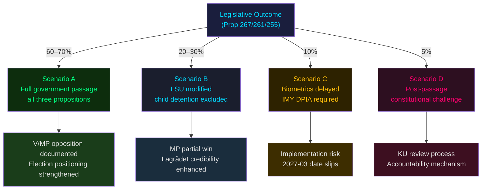

# Scenario Analysis — Opposition Motions 2026-05-25

**Analysis date**: 2026-05-25

## Scenario Framework

WEP confidence language applied per Admiralty Code. Four scenarios for the legislative outcomes of prop. 2025/26:267, 2025/26:261, and 2025/26:255 across T+72h / T+7d / T+30d / T+election horizons.

---

## Scenario A: Government Passage — Status Quo (WEP 60–70%)

**Description**: All three propositions pass with Tidö coalition majority. Opposition motions (HD024188, HD024192, HD024187, HD024191, HD024185) are voted down in committee and chamber. LSU expanded, Skatteverket biometrics implemented on government timeline (2027-03-01), household debt sampling proceeds.

**Leading indicators**:
- No critical Lagrådet yttrande on prop. 2025/26:267
- L group votes with coalition in JuU
- No S defection on child detention yrkande

**Electoral consequence**: Government demonstrates security-mandate delivery ahead of 2026 val. V/MP confirm principled opposition status. S's FiU rejection enhances shadow-government credibility. [B2]

---

## Scenario B: Modified LSU Passage — Child Detention Compromise (WEP 20–30%)

**Description**: JuU committee incorporates MP's yrkande 1 (child detention prohibition) as a partial concession following Lagrådet yttrande and civil society pressure. All other LSU expansions proceed. HD024192 yrkande 1 adopted; yrkanden 2–3 rejected.

**Trigger conditions**:
- Lagrådet issues critical yttrande specifically on child detention (Art. 3 ECHR)
- KD experiences internal pressure on family-policy consistency
- L demands amendment as price of continued coalition support [B3]

**Probability**: 20–30%. The political cost of child detention in election year is not zero. Historical precedent: KD and L have both voted for child-detention limitations in prior legislative cycles. [B3]

---

## Scenario C: Biometric Implementation Delay (WEP 25–35%)

**Description**: Prop. 2025/26:261 passes in principle but SkU committee demands IMY consultation and DPIA before implementation, delaying entry into force. HD024191 (MP's safeguards demand) partially adopted as procedural condition.

**Trigger conditions**:
- IMY submits formal opinion identifying GDPR compliance gaps
- IT integration timeline assessment shows 18+ month delay (Statskontoret estimate)
- L or KD demands safeguards condition as price of support [B3]

---

## Scenario D: Constitutional Challenge Post-Passage (WEP 15–25%)

**Description**: LSU amendments pass but face constitutional challenge via KU (Konstitutionsutskottet) review or ECHR application from detained individuals. Opposition files KU-anmälan on the lowered evidentiary standard. Does not block legislation but generates accountability process.

**Trigger conditions**:
- Lagrådet issues strongly critical yttrande
- A detainee or their legal counsel files ECHR application
- A documented wrongful detention case becomes public [B2]

---

## Mermaid: Scenario Probability Tree

---

## Horizon Indicators

| Horizon | Key Signal | Watch For |
|---------|-----------|-----------|
| T+72h | JuU committee scheduling | Hearing dates on prop. 2025/26:267 |
| T+7d | Lagrådet yttrande on 2025/26:267 | Critical opinion on evidence standard / child detention |
| T+30d | SkU committee DPIA request | IMY formal consultation initiated |
| T+election | 2026 val positioning | V/MP/S using security motions as differentiation signal |
