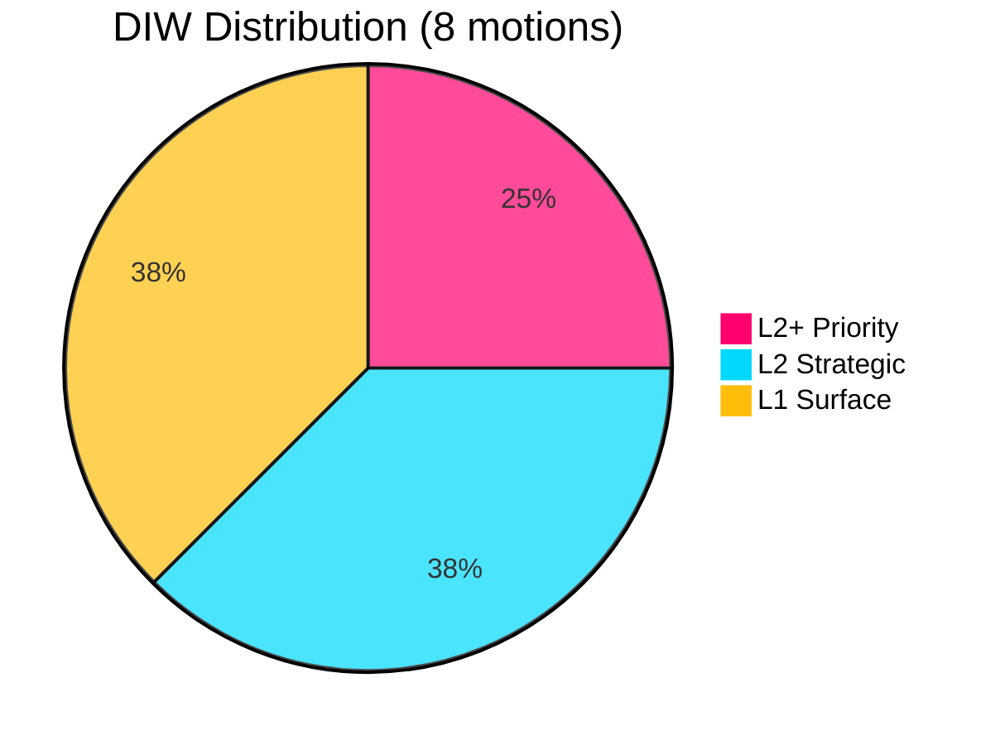
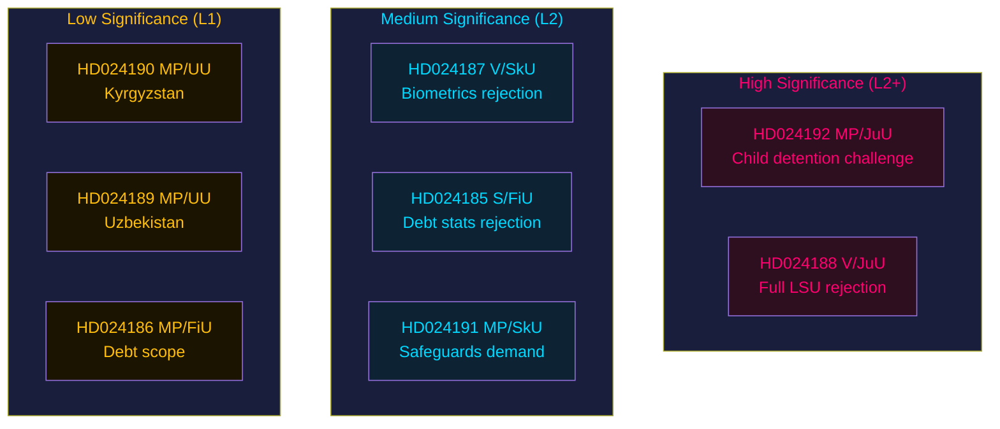

# Significance Scoring — Opposition Motions 2026-05-25

**Analysis date**: 2026-05-25
**Subfolder**: motions

## Ranking by Political-Strategic Weight (DIW tiers)

### L2+ Priority

1. **HD024192** — MP: Stärkt skydd mot utlänningar (JuU) — DIW L2+ Priority
   - Source: `https://data.riksdagen.se/dokument/HD024192.html` [B2]
   - Sponsors: Ulrika Westerlund m.fl. (MP); Committee: JuU (Justice)
   - 3 yrkanden targeting child detention, legal certainty, evaluation demand
   - Policy significance: child-rights dimension of LSU expansion could generate cross-party JuU hearings
   - Electoral relevance: HIGH — child detention is a politically toxic issue ahead of 2026 val

2. **HD024188** — V: Stärkt skydd mot utlänningar (JuU) — DIW L2+ Priority
   - Source: `https://data.riksdagen.se/dokument/HD024188.html` [A1]
   - Sponsors: Gudrun Nordborg m.fl. (V); 1 yrkande (full rejection)
   - Doctrinal consistency with mot. 2021/22:4444; signals V's non-negotiable stance on LSU
   - Policy significance: clarifies V's red line ahead of potential left-bloc coalition talks

### L2 Strategic

3. **HD024187** — V: Skatteverket biometrics (SkU) — DIW L2 Strategic
   - Source: `https://data.riksdagen.se/dokument/HD024187.html` [A1]
   - Sponsors: Ilona Szatmári Waldau m.fl. (V); rejection of fingerprint/face-scan repurposing
   - GDPR Art. 5(1)(b) purpose-limitation argument — legally substantive

4. **HD024185** — S: Household debt statistics (FiU) — DIW L2 Strategic
   - Source: `https://data.riksdagen.se/dokument/HD024185.html` [B3]
   - Sponsors: Mikael Damberg m.fl. (S); full rejection of prop. 2025/26:255
   - S's rare legislative-methodology opposition — election preparation signal

5. **HD024191** — MP: Skatteverket biometrics expansion scope (SkU) — DIW L2 Strategic
   - Source: `https://data.riksdagen.se/dokument/HD024191.html` [B3]
   - Sponsors: Annika Hirvonen m.fl. (MP); supporting but seeking stronger safeguards

### L1 Surface

6. **HD024190** — MP: EU-Kyrgyzstan partnership (UU) — DIW L1 Surface
   - Source: `https://data.riksdagen.se/dokument/HD024190.html` [B3]
   - Jacob Risberg m.fl. (MP); rejects EU partnership; human rights framing

7. **HD024189** — MP: EU-Uzbekistan partnership (UU) — DIW L1 Surface
   - Source: `https://data.riksdagen.se/dokument/HD024189.html` [B3]
   - Jacob Risberg m.fl. (MP); rejects EU partnership; authoritarian governance concern

8. **HD024186** — MP: Household debt expanded scope (FiU) — DIW L1 Surface
   - Source: `https://data.riksdagen.se/dokument/HD024186.html` [B3]
   - Janine Alm Ericson m.fl. (MP); supports data collection but wants broader mandate

## Significance Matrix

| Rank | dok_id | Committee | Sponsor | DIW | Electoral Relevance | Pass Gate |
|------|--------|-----------|---------|-----|-------------------|-----------|
| 1 | HD024192 | JuU | MP | L2+ | HIGH | ✅ |
| 2 | HD024188 | JuU | V | L2+ | HIGH | ✅ |
| 3 | HD024187 | SkU | V | L2 | MEDIUM | ✅ |
| 4 | HD024185 | FiU | S | L2 | MEDIUM | ✅ |
| 5 | HD024191 | SkU | MP | L2 | MEDIUM | ✅ |
| 6 | HD024190 | UU | MP | L1 | LOW | ✅ |
| 7 | HD024189 | UU | MP | L1 | LOW | ✅ |
| 8 | HD024186 | FiU | MP | L1 | LOW | ✅ |

## Mermaid: Significance Distribution

