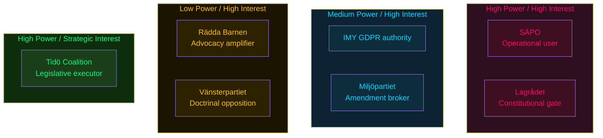

# Stakeholder Perspectives — Opposition Motions 2026-05-25

**Analysis date**: 2026-05-25

## Stakeholder Map

### Parliamentary Actors

#### Vänsterpartiet (V) — Gudrun Nordborg, Ilona Szatmári Waldau
- **Position on LSU**: Blanket rejection (HD024188) — consistent doctrine since 2021. Core argument: security detention without criminal conviction is incompatible with Rättsstat.
- **Position on Skatteverket biometrics**: Blanket rejection (HD024187) — GDPR purpose-limitation doctrine, constitutional right to privacy (RF 2:6). [B1]
- **Strategic interest**: Position V as the party of principled civil liberties in contrast to S's pragmatic path — election differentiation.

#### Miljöpartiet (MP) — Ulrika Westerlund, Annika Hirvonen, Jacob Risberg, Janine Alm Ericson
- **Position on LSU**: Targeted proportionality challenge (HD024192 — 3 yrkanden). Priority: child detention prohibition (yrkande 1). [B2]
- **Position on Skatteverket biometrics**: Conditional support with mandatory data security safeguards (HD024191). [B3]
- **Position on EU partnerships**: Human-rights-conditioned rejection (HD024190, HD024189). [B3]
- **Strategic interest**: Maintain credibility as principled rule-of-law actor while avoiding V's arithmetically irrelevant maximalism.

#### Socialdemokraterna (S) — Mikael Damberg
- **Position on household debt data**: Rejection of sampling methodology (HD024185). [B3]
- **Strategic interest**: Build evidence of shadow government competence in financial regulation ahead of 2026 val.

#### M+KD+L+SD (Tidö Coalition)
- **Position**: Support all three propositions (267, 261, 255). SD and M have publicly advocated expanded security tools. L's position on biometrics is formally supportive but party has historically been cautious on surveillance. [B2]
- **Strategic interest**: Deliver on security mandate, demonstrate governance capacity.

### Regulatory and Institutional Actors

#### Lagrådet (Council on Legislation)
- **Status**: Referral made for prop. 2025/26:267; yttrande pending as of 2026-05-25.
- **Likely concern areas**: Lowered evidentiary standard (Art. 5 ECHR); child detention (Art. 3 ECHR, CRC Art. 37).
- **Strategic interest**: Constitutional legitimacy preservation — Lagrådet yttranden on human rights grounds have historically prompted modifications to similar security bills.

#### IMY (Integritetsskyddsmyndigheten)
- **Interest**: Prop. 2025/26:261 biometric repurposing creates direct GDPR enforcement jurisdiction.
- **Probable response**: Request for DPIA (Data Protection Impact Assessment) prior to implementation; potential post-passage audit.

#### Skatteverket
- **Interest**: Implementation of prop. 2025/26:261 requires IT systems integration with Migrationsverket.
- **Statskontoret 2024 assessment**: Migrationsverket IT modernisation ongoing — integration timeline risk.

#### Civil Society: Rädda Barnen, UNICEF Sverige
- **Position**: Opposed to any child detention in security cases — will amplify HD024192 yrkande 1 in media.
- **Influence**: High on KD parliamentary group (family-values framing); moderate on L. [B2]

---

## Stakeholder Power Matrix

