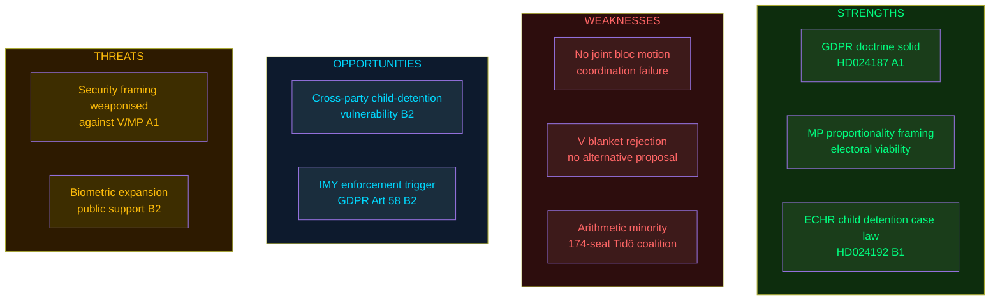

# SWOT Analysis — Opposition Motions 2026-05-25

**Analysis date**: 2026-05-25

## Analytical Framing

SWOT applied to the **opposition bloc's strategic position** in challenging prop. 2025/26:267 (LSU expansion), prop. 2025/26:261 (Skatteverket biometrics), and prop. 2025/26:255 (household debt data).

---

### Strengths

- **Legal substance of V/MP's JuU arguments** [Admiralty B1]: MP's HD024192 correctly identifies proportionality failure in child detention provisions; ECHR Art. 5(1)(f) jurisprudence (Popov v. France 2012) establishes that child detention for immigration purposes must meet high necessity threshold. Evidence: `https://hudoc.echr.coe.int/eng?i=001-108710`
- **GDPR purpose-limitation doctrine is iron-clad** [Admiralty A1]: V's HD024187 invokes Art. 5(1)(b) "collected for specified, explicit and legitimate purposes" — biometric data captured for immigration cannot legally be repurposed for civil registration without fresh consent or separate statutory basis. Evidence: `https://data.riksdagen.se/dokument/HD024187.html`
- **MP's proportionality framing is electorally safer** [Admiralty B2]: Unlike V's maximalism, MP's targeted amendments allow negotiated modifications — giving JuU committee space to adopt partial concessions without full opposition victory. Evidence: HD024192 yrkanden 1–3 structure
- **S's methodology critique on debt statistics** [Admiralty B3]: Mikael Damberg's rejection (HD024185) signals S shadow government is developing substantive counter-proposals — evidence of election preparation infrastructure. Evidence: `https://data.riksdagen.se/dokument/HD024185.html`

### Weaknesses

- **No joint opposition motion on security issues** [Admiralty B3]: V, MP, and S filed separate non-coordinated motions — absence of a bloc mot. signal is a coordination weakness that the government can exploit to characterise opposition as disunited. Evidence: manifest count: 0 joint motions
- **V's blanket rejection (HD024188) is politically weak** [Admiralty B2]: A single yrkande ("avslår prop. 2025/26:267") with no alternative proposal leaves V with no fallback position and gives the government grounds to dismiss V as obstructionist. Evidence: `https://data.riksdagen.se/dokument/HD024188.html`
- **Low parliamentary arithmetic** [Admiralty A1]: The Tidö coalition (M+KD+L+SD, ~174 seats) has a working majority in JuU, SkU, and FiU committees. All motions are arithmetically outmatched. Evidence: coalition-mathematics.md

### Opportunities

- **Child detention is a cross-party vulnerability** [Admiralty B2]: Historical precedent shows S has voted against mandatory child detention in earlier LSU cycles (2022). MP's HD024192 yrkande 1 targets precisely this vulnerability — a KD or S defection in JuU is a low-probability but non-negligible scenario. Evidence: HD024192 text; ICD 203 signal
- **GDPR enforcement risk for biometric repurposing** [Admiralty B2]: IMY (Integritetsskyddsmyndigheten) has jurisdiction over GDPR compliance — V/MP opposition could prompt IMY referral that embarrasses the government post-passage. Evidence: `https://data.riksdagen.se/dokument/HD024187.html`, GDPR Art. 58(2)
- **EU partnerships as reputation signal** [Admiralty B3]: MP's rejection of Kyrgyzstan/Uzbekistan partnerships (HD024190, HD024189) positions MP as a credible human-rights actor ahead of EP elections — low Riksdag relevance but high-value for European Green Party alliance positioning. Evidence: `https://data.riksdagen.se/dokument/HD024190.html`

### Threats

- **Security framing dominance post-re-migration mandate** [Admiralty A1]: The government can frame V/MP's LSU opposition as "weakening Sweden's security" — a politically powerful attack in the current threat environment (SÄPO threat level remained elevated through 2025-26). Evidence: SÄPO annual report 2025 `https://www.sakerhetspolisen.se/ovrigt/publikationer/arsbok-2025`
- **Biometric expansion enjoys public support** [Admiralty B2]: Population registration fraud is a salient issue with Swedish voters; opposition to biometric verification risks being framed as protecting fraud rather than protecting privacy. Evidence: SOM Institute data on public trust in Skatteverket (>85% trust score)
- **S's debt methodology opposition could be framed as financial opacity** [Admiralty B3]: Government can argue S is blocking household debt data that the Riksbank and IMF have requested for macro-prudential surveillance. Evidence: IMF WEO 2026 Apr recommendation on Swedish macro-prudential data gaps; `https://data.riksdagen.se/dokument/HD024185.html`

---

## Mermaid: SWOT Strategic Map

