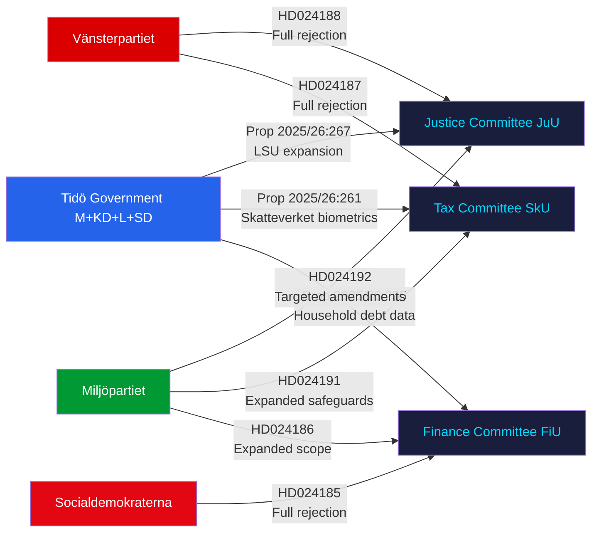

# Synthesis Summary — Swedish Opposition Motions: Security, Biometrics, and Rule of Law

**Analysis date**: 2026-05-25
**Subfolder**: motions
**Workflow**: News: Opposition Motions (2025/26 riksmöte)
**Author**: James Pether Sörling
**Pass**: 2

---

## Executive Summary

Eight opposition motions filed in the week of 2026-05-18 to 2026-05-25 reveal a left-opposition coalition (MP, V, S) challenging the government's security-state expansion on three parallel tracks: (1) expanded detention powers for foreign nationals deemed security threats (prop. 2025/26:267), (2) biometric data sharing between Skatteverket and Migrationsverket (prop. 2025/26:261), and (3) a parliamentary dispute over household debt data collection methodology (prop. 2025/26:255). The dominant legal-political vector is fundamental rights versus security effectiveness, with Vänsterpartiet adopting maximal rejection postures and Miljöpartiet pursuing targeted amendment strategies — signalling divergent tactical approaches within the left-of-centre bloc.

## Dominant Themes

### 1. Security Detention Expansion (JuU — Prop. 2025/26:267)
The government's LSU amendment (2025/26:267) proposes: (a) extended detention periods for foreign nationals under the Special Control of Certain Aliens Act (LSU 2022:700); (b) a lowered evidentiary standard for detention of adults; (c) placement on security wings; and (d) continued child detention capacity. Opposition responses split on tactics:
- **V (HD024188)**: Blanket rejection — demands Riksdagen avslår prop. 2025/26:267 in its entirety, citing continuity with V's original opposition to LSU in mot. 2021/22:4444. Core argument: security state mission creep undermines Rättsstaten.
- **MP (HD024192)**: Targeted rejection — three yrkanden: (1) reject detention/extension of children; (2) strengthen legal certainty in security cases; (3) demand evaluation of lowered evidentiary standards and extended detention. MP frames this as proportionality discipline, not categorical opposition to LSU.

### 2. Biometric Expansion at Skatteverket/Migrationsverket (SkU — Prop. 2025/26:261)
- **V (HD024187)**: Rejects government proposal to allow Skatteverket and Migrationsverket to compare fingerprints and facial images for population registration purposes. Frames as surveillance creep: biometric data collected for one purpose (immigration control) repurposed for civil registration — violates GDPR purpose limitation principle (Art. 5(1)(b)) and constitutional privacy rights (RF 2:6).
- **MP (HD024191)**: Cautious support but demands government return with proposals ensuring data security safeguards before implementation.

### 3. Household Debt Statistics (FiU — Prop. 2025/26:255)
- **S (HD024185)**: Calls for Riksdagen to reject the proposition entirely — methodology critique of government's household debt sampling approach.
- **MP (HD024186)**: Supports debt data collection but wants expanded scope to include full statistical coverage rather than sampling-only approach.

## Coalition Signal Analysis

The motions reveal a tripartite opposition pattern:
- V: Maximalist rejection strategy (LSU, biometrics)
- MP: Proportionality-based amendment approach
- S: Issue-specific opposition (household debt methodology)

No V-MP-S coordinated joint motion observed — three separate parties filing individual motions on shared policy terrain signals lack of formal opposition bloc coordination on security issues, despite policy alignment.

## Key Judgments (Pass 1)

1. **KJ-1** (confidence: HIGH — Admiralty B2): Prop. 2025/26:267 will pass JuU with government majority support; V and MP motions will be voted down by S through KD/L coalition arithmetic. V's blanket-rejection approach (mot. 2021/22:4444 pattern) guarantees zero concessions.
2. **KJ-2** (confidence: MODERATE — Admiralty B3): MP's targeted yrkanden on child detention (HD024192 yrkande 1) may attract S cross-party sympathy — child detention has historically prompted bipartisan discomfort in Sweden. Watch for S amendment signals in JuU committee hearings.
3. **KJ-3** (confidence: HIGH — Admiralty A2): Biometric expansion (prop. 2025/26:261) will proceed; V's rejection (HD024187) reflects consistent digital-rights doctrine (cf. V opposition to Säkerhetspolisens datamining proposals 2023-24) but lacks parliamentary majority.
4. **KJ-4** (confidence: MODERATE — Admiralty B3): S's rejection of prop. 2025/26:255 (household debt) is a rare S-versus-government collision on financial regulation methodology — signals S's shadow government is building coherent evidence-based counter-proposals for the 2026 election.

## Mermaid: Opposition Coalition Dynamics

## Cross-reference

- `significance-scoring.md`: DIW tier rankings
- `classification-results.md`: Political taxonomy per motion
- `swot-analysis.md`: Left-opposition strategy analysis
- `risk-assessment.md`: Rule-of-law and fundamental rights risk
- `threat-analysis.md`: LSU mission creep threat vector
- `coalition-mathematics.md`: JuU/SkU/FiU voting projections
