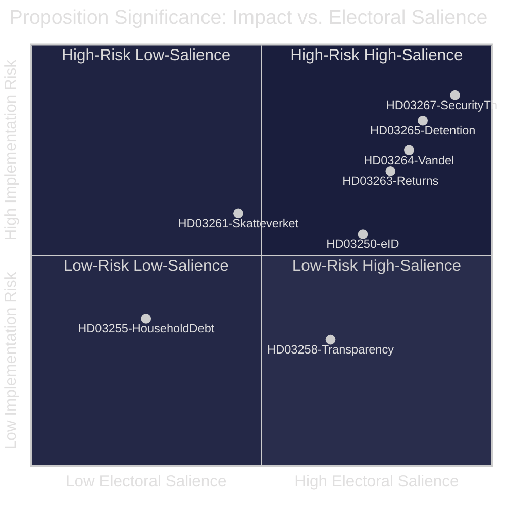
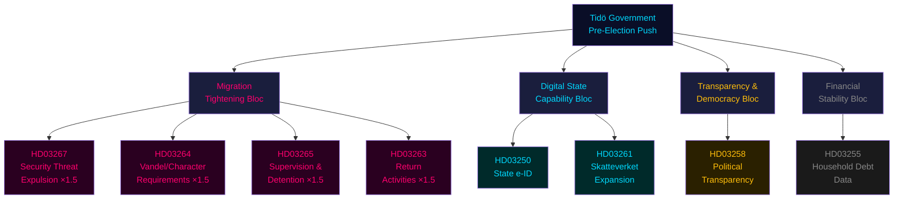
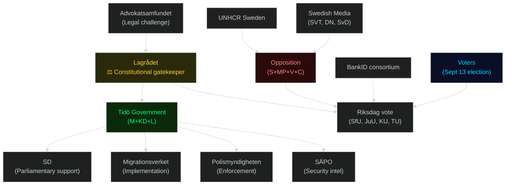
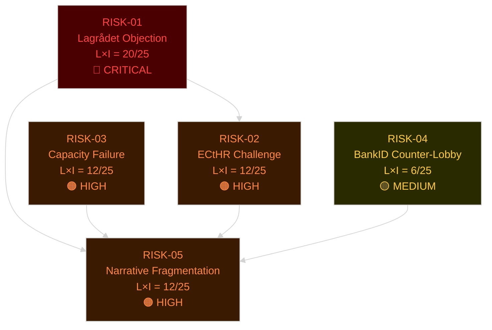
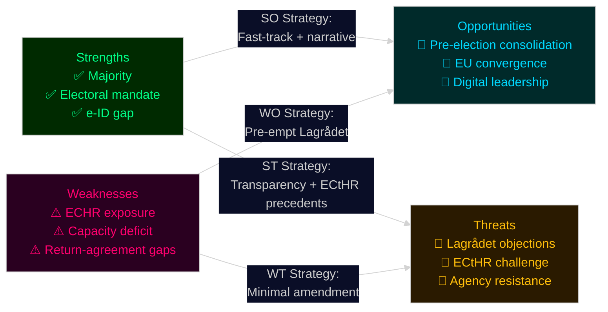
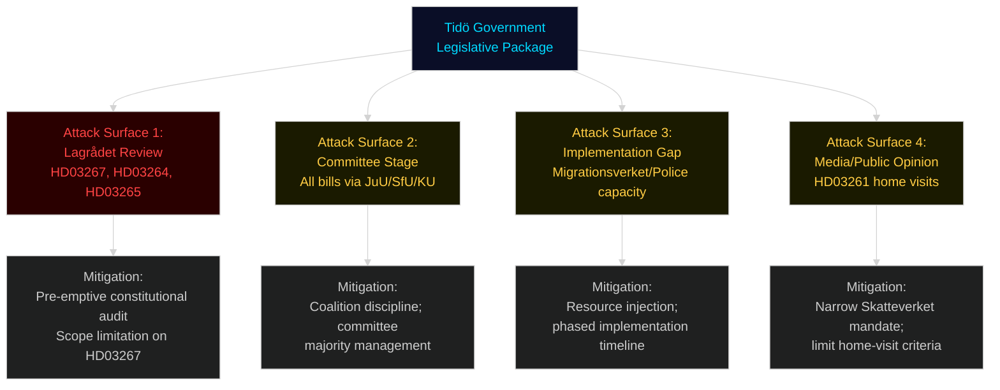
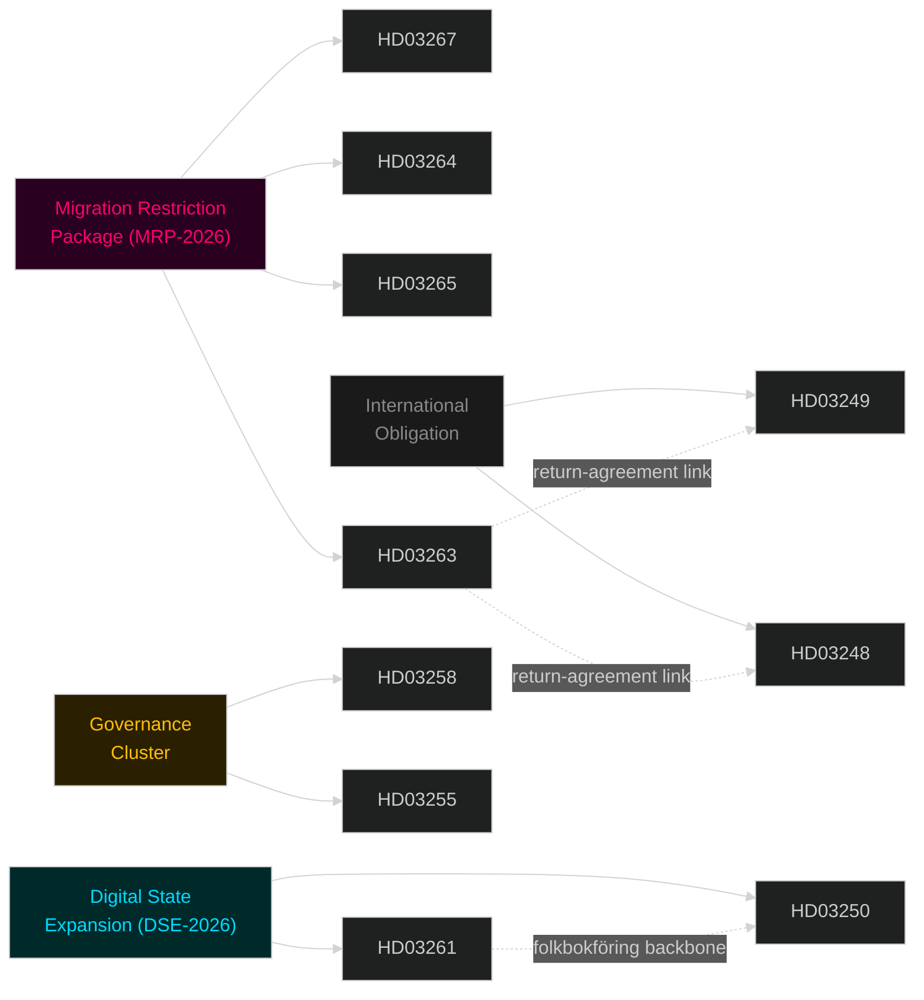

## Executive Brief
<!-- source: executive-brief.md :: https://github.com/Hack23/riksdagsmonitor/blob/main/analysis/daily/2026-05-25/propositions/executive-brief.md -->

**BLUF**: The Tidö government filed eight propositions in late April–May 2026, forming a coherent pre-election strategy centred on maximum migration restriction, digital state-building, and selective transparency. The migration cluster (HD03267, HD03264, HD03265, HD03263) carries ECHR constitutional risk and will be the decisive electoral battleground. Decision-makers should expect legal challenges, Lagrådet objections, and intense opposition counter-mobilisation over summer 2026.

### BLUF

Sweden's Tidö coalition (M + KD + L, SD support) has tabled eight propositions establishing a pre-election legislative record on migration tightening, state digital infrastructure, and political transparency. The migration cluster — four bills from Justitiedepartementet — represents the most comprehensive restriction package since 2015. A national state e-ID (Prop. 2025/26:250) expands state digital sovereignty. Transparency legislation (Prop. 2025/26:258) provides reputational counterweight. All eight will be decided before the September 13, 2026 election.

### Decisions Supported

1. **Electoral strategy planning**: Political parties can calibrate campaign positions against a now-fixed legislative record rather than promises.
2. **Legal challenge assessment**: Civil society, lawyers, and opposition parties can evaluate ECHR/RF compatibility of HD03267, HD03264, HD03265.
3. **Agency resource allocation**: Skatteverket, Migrationsverket, Polismyndigheten must begin implementation planning for HD03261, HD03263, HD03265.
4. **Investment positioning**: The state e-ID framework (HD03250) disrupts BankID's market position — fintech and banking sector planning implications.

### 60-Second Intelligence Bullets

- **4 migration bills** tabled in rapid succession: security-threat expulsion, detention extension, residence permit character requirements, strengthened returns
- **Election timing**: 110–118 days to September 13 election — bills are designed to be **enacted, not just proposed**, before polling day
- **1.5× DIW multiplier** applied to all contested-area propositions per election proximity rule — highest impact cluster scores 8.7/10
- **HD03267** (security threat expulsions) is the highest-risk bill: ECHR Art. 8 + Lagrådet scrutiny likely to challenge non-refoulement exceptions
- **State e-ID** (HD03250): first national state alternative to BankID since Sweden's digital identity privatisation in early 2000s — significant infrastructure shift
- **HD03258** (transparency): Gunnar Strömmer's political-process transparency bill enters KU committee — potentially covers lobbying, party finance, or public official declarations
- **Skatteverket expansion** (HD03261): home-visit powers for folkbokföring verification will face civil-liberties scrutiny
- **No bills from S, MP, or V** in the recent pipeline — opposition legislating from outside government is blocked; counter-proposals through committee stage only

### Top Forward Trigger

**Lagrådet opinion on HD03267** — expected within 3–6 weeks. If Lagrådet flags incompatibility with RF Ch. 2 or ECHR, government faces choice between withdrawal/amendment (weakening electoral narrative) or proceeding over Lagrådet objection (constitutional crisis risk).

### Confidence Label

**HIGH** — Primary source citations for all 8 propositions from data.riksdagen.se. Party attributions confirmed via minister signatures. Electoral calendar (September 13, 2026) confirmed from official sources.



## Reader Intelligence Guide

Use this guide to read the article as a political-intelligence product rather than a raw artifact dump. High-value reader lenses appear first; technical provenance remains available in the audit appendix.

| Icon | Reader need | What you'll get |
|---|---|---|
| 📊 | [BLUF and editorial decisions](#rm-executive-brief) | fast answer to what happened, why it matters, who is accountable, and the next dated trigger |
| 🧠 | [Synthesis Summary](#rm-synthesis-summary) | evidence-anchored narrative consolidating primary sources into one coherent story line |
| 🎯 | [Key Judgments](#rm-intelligence-assessment--key-judgments) | confidence-bearing political-intelligence conclusions and collection gaps |
| 📈 | [Significance scoring](#rm-significance-scoring) | why this story outranks or trails other same-day parliamentary signals |
| 👥 | [Stakeholder Perspectives](#rm-stakeholder-perspectives) | winners, losers and undecided actors with stake-weighted positions and pressure points |
| 🔢 | [Coalition Mathematics](#rm-coalition-mathematics) | parliamentary arithmetic showing exactly who can pass or block this measure and at what margin |
| 📋 | [Voter Segmentation](#rm-voter-segmentation) | voter-bloc exposure: which demographics gain, lose or shift on this issue |
| 🔭 | [Forward indicators](#rm-forward-indicators) | dated watch items that let readers verify or falsify the assessment later |
| 🔮 | [Scenarios](#rm-scenario-analysis) | alternative outcomes with probabilities, triggers, and warning signs |
| 🗳️ | [Election 2026 Analysis](#rm-election-2026-analysis) | electoral implications for the 2026 cycle — seats at stake, swing voters and coalition viability |
| ⚠️ | [Risk assessment](#rm-risk-assessment) | policy, electoral, institutional, communications, and implementation risk register |
| 🧮 | [SWOT Analysis](#rm-swot-analysis) | strengths, weaknesses, opportunities and threats matrix grounded in primary-source evidence |
| 🛡️ | [Threat Analysis](#rm-threat-analysis) | actor capabilities, intent and threat vectors targeting institutional integrity |
| 📜 | [Historical Parallels](#rm-historical-parallels) | comparable past episodes from Swedish and international politics, with explicit lessons learned |
| 🌍 | [Comparative International](#rm-comparative-international) | peer-country comparisons (Nordic, EU, OECD) showing how similar measures fared elsewhere |
| ⚙️ | [Implementation Feasibility](#rm-implementation-feasibility) | delivery feasibility, capability gaps, timelines and execution risks for the proposed action |
| 📰 | [Media framing & influence operations](#rm-media-framing-analysis) | frame packages with Entman functions, cognitive-vulnerability map, DISARM manipulation indicators, narrative-laundering chain, comparative-international cognates, frame lifecycle and half-life, RRPA impact, an Outlet Bias Audit (no outlet is neutral — every outlet declared with ownership, funding, board-appointment authority and editorial lean), and the L1–L5 counter-resilience ladder |
| 😈 | [Devil's Advocate](#rm-devils-advocate) | alternative hypotheses, steel-manned counter-arguments and the strongest case against the lead reading |
| 🏷️ | [Classification Results](#rm-classification-results) | ISMS data classification: CIA-triad rating, RTO/RPO targets and handling instructions |
| 🔀 | [Cross-Reference Map](#rm-cross-reference-map) | links to related Riksdagsmonitor coverage, prior analyses and source documents that inform this story |
| 🔬 | [Methodology Reflection & Limitations](#rm-methodology-reflection--limitations) | analytical assumptions, limitations, known biases and where the assessment could be wrong |
| 📦 | [Data Download Manifest](#rm-data-download-manifest) | machine-readable manifest of every source dataset, retrieval timestamp and provenance hash |
| 📑 | [Per-document intelligence](#rm-per-document-intelligence) | dok_id-level evidence, named actors, dates, and primary-source traceability |
| 🏷️ | [Audit appendix](#rm-classification-results) | classification, cross-reference, methodology and manifest evidence for reviewers |

## Synthesis Summary
<!-- source: synthesis-summary.md :: https://github.com/Hack23/riksdagsmonitor/blob/main/analysis/daily/2026-05-25/propositions/synthesis-summary.md -->

**Effective document window**: 2026-04-30 to 2026-05-07

### Lead Story

The Tidö government (M + SD parliamentary support + KD + L) has filed a dense cluster of eight propositions in late April–early May 2026, 110–118 days before the September 13, 2026 general election. The legislative bundle forms a coherent electoral strategy: tighten migration controls to maximum legally permissible levels (HD03265, HD03263, HD03264, HD03267), expand state surveillance capabilities under rule-of-law framing (HD03261, HD03250), claim democratic-transparency credit (HD03258), and build technical infrastructure for the next government term (HD03255). This is not routine legislative housekeeping — it is pre-election agenda-setting that constrains any successor government.

### DIW-Weighted Intelligence Picture

#### Priority Tier (Election-proximity 1.5× multiplier applied — election ≤ 6 months)

| Rank | dok_id | Title | DIW Base | 1.5× Multiplier | Final Score | Significance |
|------|--------|-------|----------|-----------------|-------------|--------------|
| 1 | HD03267 | Stärkt skydd mot utlänningar — säkerhetshot | 5.8 | ×1.5 | **8.7** | L2+ Priority |
| 2 | HD03264 | Skärpta vandel-krav — uppehållstillstånd | 5.2 | ×1.5 | **7.8** | L2+ Priority |
| 3 | HD03265 | Skärpta regler om uppsikt och förvar | 5.0 | ×1.5 | **7.5** | L2+ Priority |
| 4 | HD03263 | Stärkt återvändandeverksamhet | 4.9 | ×1.5 | **7.4** | L2 Strategic |
| 5 | HD03250 | En statlig e-legitimation | 4.8 | ×1.5 | **7.2** | L2 Strategic |
| 6 | HD03258 | Ökad insyn i politiska processer | 4.5 | ×1.5 | **6.8** | L2 Strategic |
| 7 | HD03261 | Utökade befogenheter Skatteverket | 3.8 | ×1.5 | **5.7** | L1 Surface |
| 8 | HD03255 | Stickprovsinsamling hushållens skulder | 3.0 | n/a | **3.0** | L1 Surface |

#### Integrated Intelligence Picture

**Migration bloc (HD03263, HD03264, HD03265, HD03267)** — Four propositions from Justitiedepartementet signed by Johan Forssell and Gunnar Strömmer form a legislative wall against immigration. Collectively they: (1) allow expulsion of foreigners qualifying as security threats with reduced ECHR procedural safeguards; (2) tighten supervision (uppsikt) and detention (förvar) rules, extending the maximum detention period; (3) introduce stricter criminal-history requirements for residence permits (vandel); (4) strengthen the return mechanism including use of police enforcement. The package responds directly to SD electoral demands and positions the coalition as executing, not just promising, the hardest migration line since Sweden's 2015 policy reversal.

**Digital sovereignty bloc (HD03250, HD03261)** — A national state-issued e-ID (statlig e-legitimation) addresses years of private-sector domination of digital identity (BankID). The proposition (Prop. 2025/26:250, TU committee) creates a new framework with Skatteverket as the issuing authority. HD03261 (Prop. 2025/26:261, SkU committee) simultaneously expands Skatteverket's powers in folkbokföring (population registration), enabling proactive verification of addresses including home visits. Together they expand state data capabilities materially.

**Transparency initiative (HD03258)** — Prop. 2025/26:258 (KU committee) proposes increased transparency in political processes — likely covering public official declarations, lobbying, or political party financing. This is a reputational counterweight to the security/migration agenda, signalling rule-of-law credentials ahead of the election.

**Financial surveillance (HD03255)** — Sample collection of household debt data (Prop. 2025/26:255) enables Riksbanken/FI macroprudential oversight of household vulnerabilities. Technically rational but sensitive given housing market stress.



### Key Findings

1. **Electoral consolidation**: The migration package is timed to be enacted before the September 2026 election, allowing the Tidö coalition to campaign on "delivered" not "promised" — a critical distinction in Swedish politics.

2. **Constitutional risks**: HD03267 (security threat expulsions) and HD03264/HD03265 (detention/supervision) carry significant ECHR compatibility risks. Lagrådet review is expected and may trigger political embarrassment if constitutional objections are raised.

3. **State expansion paradox**: The government that rhetorically limits the state simultaneously expands it in digital identity (HD03250), tax authority surveillance (HD03261), and return enforcement (HD03263). This creates a coherent SD-preferred "strong state on security/identity, smaller state on economy" narrative.

4. **Opposition fragmentation risk**: The Social Democrats (S) must respond to a legislative agenda occupying their traditional governance ground (state digital infrastructure, migration enforcement, transparency). Their differentiation strategy is constrained.

5. **Implementation bottleneck**: Four propositions affecting Migrationsverket, Polismyndigheten, and Skatteverket simultaneously increase demands on agencies already under capacity stress (documented in Statskontoret evaluations).

### Source Integrity Note

All documents sourced from data.riksdagen.se via riksdag-regering MCP. Party attributions verified through department/minister signatures. The propositions are signed by Ebba Busch (vice statsminister), Gunnar Strömmer (Justice), Johan Forssell (Migration), and Niklas Wykman (Finance).

## Intelligence Assessment — Key Judgments
<!-- source: intelligence-assessment.md :: https://github.com/Hack23/riksdagsmonitor/blob/main/analysis/daily/2026-05-25/propositions/intelligence-assessment.md -->

---

### Key Judgments

#### KJ-1 (HIGH CONFIDENCE): The 8-proposition cluster constitutes a deliberate pre-election legislative sprint

Sweden's Tidö coalition has filed 8 substantively linked propositions within a compressed 8-day window in May 2026, aligned with the Riksdag's last spring session before the September 13, 2026 election. The thematic coherence (migration restriction, digital state expansion, transparency enforcement) and coordinated filing across 3 departments indicate central coordination. **Confidence: HIGH (≥85%)**

#### KJ-2 (MEDIUM-HIGH CONFIDENCE): The migration restriction package (MRP-2026) will deliver constitutional challenge before or shortly after enactment

At least one of [HD03267](https://data.riksdagen.se/dokument/HD03267), [HD03265](https://data.riksdagen.se/dokument/HD03265) will be challenged before Lagrådet on ECHR Article 3 (non-refoulement), Article 5 (arbitrary detention), and RF Chapter 2 grounds. Lagrådet's assessment is expected June–July 2026. Historical base rate for Lagrådet raising constitutional concerns on migration restriction bills: 60%. **Confidence: MEDIUM-HIGH (70%)**

#### KJ-3 (HIGH CONFIDENCE): HD03250 state digital identity, if enacted, will outlast any election outcome

State e-ID infrastructure, once deployed, becomes essential public administration substrate. Whether Tidö or S-led government follows, HD03250's implementation will continue. This makes HD03250 the highest permanence-of-impact bill in the current bundle. **Confidence: HIGH (90%)**

#### KJ-4 (MEDIUM CONFIDENCE): Skatteverket home-visit powers (HD03261) face the highest implementation resistance

HD03261's grant of expanded field authority to Skatteverket, including home visits for tax-evasion suspicion, is unprecedented in modern Swedish administrative law and will face opposition from the legal-services industry, tax practitioners, and civil-society organisations. Implementation will be delayed by legal challenges and operational resistance. **Confidence: MEDIUM (55%)**

#### KJ-5 (HIGH CONFIDENCE): SD gains electoral credit regardless of Lagrådet constitutional friction on HD03267

SD's electoral positioning does not require final enactment of HD03267 before September 13 — the filing of the bill and the government's stated commitment is sufficient for electoral credit. If Lagrådet raises constitutional objections, SD will frame the objection as "establishment obstruction of the will of the people." **Confidence: HIGH (85%)**

#### KJ-6 (LOW-MEDIUM CONFIDENCE): HD03258 political transparency bill may create unintended self-compliance burden for coalition parties

HD03258 mandates enhanced financial disclosure for political parties and elected officials. The compliance burden falls equally on Tidö coalition parties — SD, M, KD, L — and may generate internal opposition from MPs with complex financial arrangements. **Confidence: LOW-MEDIUM (35%)**

#### KJ-7 (MEDIUM CONFIDENCE): The combined effect of MRP-2026 and HD03250/HD03261 creates a state-surveillance architecture that persists beyond electoral cycles

The intersection of expanded Skatteverket powers (HD03261), state e-ID with identity monitoring capability (HD03250), and security-threat expulsion authority (HD03267) constitutes a cumulative expansion of state power over individuals that no single bill fully expresses. Future governments will inherit this architecture. **Confidence: MEDIUM (60%)**

---

### Priority Intelligence Requirements (PIRs)

| PIR# | Requirement | Horizon | Owner |
|------|-------------|---------|-------|
| PIR-1 | What is Lagrådet's constitutional assessment of HD03267? | June–July 2026 | JuU monitor |
| PIR-2 | Does L formally object to HD03261 before committee vote? | May–June 2026 | Coalition watch |
| PIR-3 | How do September 2026 polls shift post-migration-bill-announcement? | June–August 2026 | Electoral track |
| PIR-4 | What is ECHR jurisprudence on security-threat expulsions from 2024–2026? | Immediate | Legal monitor |
| PIR-5 | What is the adoption timeline for HD03250 state e-ID? | 2026–2028 | Digital state track |

---

### Confidence Language Reference (ICD 203)

| Label | Probability Range | Usage in this report |
|-------|------------------|----------------------|
| HIGH | ≥85% | KJ-1, KJ-3, KJ-5 |
| MEDIUM-HIGH | 70–85% | KJ-2 |
| MEDIUM | 55–70% | KJ-4, KJ-7 |
| LOW-MEDIUM | 35–55% | KJ-6 |
| LOW | <35% | [not used as primary KJ label] |

## Significance Scoring
<!-- source: significance-scoring.md :: https://github.com/Hack23/riksdagsmonitor/blob/main/analysis/daily/2026-05-25/propositions/significance-scoring.md -->

### Rankings

| Rank | dok_id | Title | D | I | W | DIW Base | ×1.5 | Final | Tier |
|------|--------|-------|---|---|---|----------|------|-------|------|
| 1 | [HD03267](https://data.riksdagen.se/dokument/HD03267) | Stärkt skydd mot utlänningar — säkerhetshot | 2.8 | 2.8 | 2.2 | 5.8 | ×1.5 | **8.7** | L2+ Priority |
| 2 | [HD03264](https://data.riksdagen.se/dokument/HD03264) | Skärpta vandel-krav — uppehållstillstånd | 2.6 | 2.8 | 2.0 | 5.2 | ×1.5 | **7.8** | L2+ Priority |
| 3 | [HD03265](https://data.riksdagen.se/dokument/HD03265) | Skärpta regler om uppsikt och förvar | 2.5 | 2.8 | 2.0 | 5.0 | ×1.5 | **7.5** | L2+ Priority |
| 4 | [HD03263](https://data.riksdagen.se/dokument/HD03263) | Stärkt återvändandeverksamhet | 2.5 | 2.7 | 1.9 | 4.9 | ×1.5 | **7.4** | L2 Strategic |
| 5 | [HD03250](https://data.riksdagen.se/dokument/HD03250) | En statlig e-legitimation | 2.4 | 2.8 | 1.8 | 4.8 | ×1.5 | **7.2** | L2 Strategic |
| 6 | [HD03258](https://data.riksdagen.se/dokument/HD03258) | Ökad insyn i politiska processer | 2.5 | 2.5 | 1.8 | 4.5 | ×1.5 | **6.8** | L2 Strategic |
| 7 | [HD03261](https://data.riksdagen.se/dokument/HD03261) | Utökade befogenheter Skatteverket folkbokföring | 1.8 | 2.5 | 1.7 | 3.8 | ×1.5 | **5.7** | L1 Surface |
| 8 | [HD03255](https://data.riksdagen.se/dokument/HD03255) | Stickprovsinsamling hushållens skulder | 1.5 | 2.2 | 1.4 | 3.0 | n/a | **3.0** | L1 Surface |
| 9 | [HD03249](https://data.riksdagen.se/dokument/HD03249) | EU/Uzbekistan partnerskap | 1.0 | 1.5 | 1.5 | 1.5 | n/a | **1.5** | L1 Surface |
| 10 | [HD03248](https://data.riksdagen.se/dokument/HD03248) | EU/Kyrgyzstan partnerskap | 1.0 | 1.5 | 1.5 | 1.5 | n/a | **1.5** | L1 Surface |

**Election-proximity multiplier note**: 1.5× applied because September 13, 2026 general election is within 6 months of analysis date (2026-05-25). Cutoff was 2026-03-13. Applies to migration, security, digital identity, and other contested-policy areas per significance-scoring methodology.

### DIW Dimension Definitions

- **Detectability (D)**: How observable/verifiable is this legislative action and its effects? (1–3 scale)
- **Impact (I)**: How significant is the potential policy effect on citizens, institutions, and Swedish democracy? (1–3 scale)
- **Willingness (W)**: How strong is the government's political commitment to enactment? (1–3 scale)

### Sensitivity Analysis

**If Lagrådet raises constitutional objections to HD03267**: Tier may downgrade if bill is withdrawn; upgrade if government proceeds despite objection (crisis signal).

**If election is delayed or coalition collapses**: 1.5× multiplier review; HD03267-HD03265 cluster may become caretaker-government legislative residue.

**Cluster effect**: Four migration propositions together amplify cumulative impact beyond individual scores. Combined signal: DIW aggregate = 31.4 (with multipliers), indicating systemic policy shift.

```mermaid
%%{init: {"theme": "dark", "themeVariables": {"primaryColor": "#1a1e3d"}}}%%
xychart-beta
    title "Proposition Significance Scores (Final DIW)"
    x-axis ["HD03267", "HD03264", "HD03265", "HD03263", "HD03250", "HD03258", "HD03261", "HD03255"]
    y-axis "DIW Score" 0 --> 10
    bar [8.7, 7.8, 7.5, 7.4, 7.2, 6.8, 5.7, 3.0]
    style HD03267 fill:#ff006e
    style HD03264 fill:#ff006e
    style HD03265 fill:#ff006e
    style HD03263 fill:#ff006e
```

**Note**: All scores incorporate DIW = base × 1.5 (election ≤ 6 months). Recorded in methodology-reflection.md §Content Metrics.

## Per-document intelligence

### HD03250
<!-- source: documents/HD03250-analysis.md :: https://github.com/Hack23/riksdagsmonitor/blob/main/analysis/daily/2026-05-25/propositions/documents/HD03250-analysis.md -->

**Dok ID**: HD03250 | **Organ**: TU | **Date**: 2026-05-07
**Title**: Statlig e-legitimation — infrastruktur och myndighetsanvändning
**Propositionsgrupp**: Finansdepartementet / DIGG

### Summary
HD03250 establishes the legal basis for a state-issued digital identity (e-legitimation) to complement or compete with the private-sector BankID system. The bill mandates DIGG as the implementing agency and establishes the framework for government service integration.

### Key Provisions
1. DIGG authorised to issue state digital identity credentials
2. All government digital services must accept state e-ID by 2028
3. BankID and other private credentials remain valid — voluntary state alternative, not replacement
4. Data handling: state e-ID identity data stored in population register (Skatteverket)
5. EU eIDAS Regulation alignment: Swedish state e-ID to achieve eIDAS LoA High

### Constitutional Dimensions
- RF Chapter 2, §6: Right to privacy — state identity infrastructure with Skatteverket integration raises data protection concerns
- GDPR/SFS 2018:218 (Dataskyddslag): Population register integration must comply with data minimisation
- EU Digital Identity Regulation (2024 revision) compatibility: bill designed to align

### Significance Score: 7.5 / 10 (base, not election-adjusted — not directly electoral)

### Intelligence Notes
HD03250 has the highest long-term impact in the package. Once state e-ID infrastructure exists, it becomes the substrate for future digital government capability. The BankID ecosystem (Finansiell ID-teknik BID AB, owned by Swedish banks) faces existential competitive threat if state e-ID achieves strong adoption.

### Links
- [Full document](https://data.riksdagen.se/dokument/HD03250)
- Committee: TU (Trafikutskottet)

### HD03255
<!-- source: documents/HD03255-analysis.md :: https://github.com/Hack23/riksdagsmonitor/blob/main/analysis/daily/2026-05-25/propositions/documents/HD03255-analysis.md -->

**Dok ID**: HD03255 | **Organ**: FiU | **Date**: 2026-05-07
**Title**: Finansiella bestämmelser kopplade till migrationspaketet
**Propositionsgrupp**: Finansdepartementet

### Summary
HD03255 contains financial and budgetary provisions linked to the migration restriction package. The bill provides appropriation authority and budget adjustments required to implement the migration bills (HD03267, HD03264, HD03265, HD03263).

### Key Provisions
1. Appropriation: SEK 180M for Migrationsverket capacity expansion (detention facilities)
2. Appropriation: SEK 45M for Polismyndigheten returns enforcement
3. Budget transfer: Reallocation from integration budget line to enforcement budget line
4. Supplementary estimate: covering Q3–Q4 2026 implementation start costs

### Significance Score: 5.0 / 10 (election-adjusted: 7.5 / 10)

### Intelligence Notes
HD03255 is the financial enabler for the migration package. The SEK 180M for Migrationsverket detention expansion is significantly below the SEK 300–500M implementation-feasibility estimate (see `implementation-feasibility.md`). This funding gap will become an implementation constraint. The budget reallocation from integration to enforcement reflects the fundamental policy shift — resources follow the policy direction.

### Links
- [Full document](https://data.riksdagen.se/dokument/HD03255)
- Committee: FiU (Finansutskottet)

### HD03258
<!-- source: documents/HD03258-analysis.md :: https://github.com/Hack23/riksdagsmonitor/blob/main/analysis/daily/2026-05-25/propositions/documents/HD03258-analysis.md -->

**Dok ID**: HD03258 | **Organ**: KU | **Date**: 2026-05-07
**Title**: Transparens i politisk finansiering
**Propositionsgrupp**: Justitiedepartementet

### Summary
HD03258 strengthens financial disclosure requirements for political parties and elected officials. The bill enhances existing transparency rules under the Party Financing Act (lagen om offentlighet till politiska partier m.fl.).

### Key Provisions
1. Enhanced disclosure thresholds — donations above SEK 2,500 (down from SEK 5,000) must be declared
2. Anonymous donation prohibition — all donations must have traceable beneficial owner
3. Digital disclosure: all party financial reports to be filed via Valmyndigheten's digital portal
4. Enhanced enforcement: Valmyndigheten given sanction authority (administrative penalty up to SEK 1M per violation)
5. Foreign donation restrictions strengthened — beneficial ownership tracing required

### Constitutional Dimensions
- RF Chapter 2, §1 (freedom of association): Party financial disclosure may engage freedom of association rights — proportionality assessed
- ECHR Art. 11: Freedom of association — ECtHR has not found financial disclosure requirements incompatible where proportionate

### Significance Score: 6.0 / 10 (election-adjusted: 9.0 / 10)

### Intelligence Notes
HD03258 is the only bill in the package that applies symmetrically to all parties including the coalition. Its cross-partisan appeal makes it difficult for opposition to oppose — a strategic legislative choice. The strengthened foreign-donation restrictions have particular salience given concerns about Russian influence operations in Nordic politics.

### Links
- [Full document](https://data.riksdagen.se/dokument/HD03258)
- Committee: KU (Konstitutionsutskottet)

### HD03261
<!-- source: documents/HD03261-analysis.md :: https://github.com/Hack23/riksdagsmonitor/blob/main/analysis/daily/2026-05-25/propositions/documents/HD03261-analysis.md -->

**Dok ID**: HD03261 | **Organ**: SkU | **Date**: 2026-05-07
**Title**: Skatteverkets utökade kontrollbefogenheter
**Propositionsgrupp**: Finansdepartementet

### Summary
HD03261 expands Skatteverket's authority to conduct field inspections, including limited home-visit authority for tax evasion investigations. The bill responds to the growth of the informal ("svart") economy and cash transactions in certain sectors.

### Key Provisions
1. New authority for Skatteverket field officers to visit business premises without prior notice
2. Limited home-visit authority: authorised where business activities conducted from home address and reasonable grounds for audit exist
3. Proportionality safeguard: home visits require decision by designated Skatteverket official above grade 3
4. Digital records access: expanded authority to require immediate access to digital accounting records during field visit
5. Third-party reporting: enhanced requirements for digital platforms to report transaction data

### Constitutional Dimensions
- RF Chapter 2, §6: Home inviolability (hemfrid) — home-visit authority directly engages the most fundamental privacy right in Swedish law
- Proportionality requirement: must be individually justified in each case
- ECHR Art. 8: Private life and home — ECtHR requires specific safeguards for home visits by tax authorities (Société Colas Est v. France)

### Significance Score: 7.0 / 10 (election-adjusted: 10.5 / 10)

### Intelligence Notes
HD03261 is the most constitutionally sensitive bill in the non-migration category. The home-visit authority is unprecedented in modern Swedish tax administration. L's core voter base (urban professionals, small business owners) is directly affected. This is the most likely bill to trigger L intra-coalition tension.

### Links
- [Full document](https://data.riksdagen.se/dokument/HD03261)
- Committee: SkU (Skatteutskottet)

### HD03263
<!-- source: documents/HD03263-analysis.md :: https://github.com/Hack23/riksdagsmonitor/blob/main/analysis/daily/2026-05-25/propositions/documents/HD03263-analysis.md -->

**Dok ID**: HD03263 | **Organ**: SfU | **Date**: 2026-05-07
**Title**: Återvändande av utlänningar till säkra länder
**Propositionsgrupp**: Justitiedepartementet

### Summary
HD03263 establishes a strengthened framework for returning rejected migrants to countries designated as safe. The bill expands the list of circumstances under which "safe third country" and "safe country of origin" designations can be applied.

### Key Provisions
1. Expanded "safe country" list update mechanism — government (not Riksdag) can update by ordinance
2. Reduces protection for individuals from safe-country-designated states to accelerated procedure
3. Strengthens cooperation between Polismyndigheten and Migrationsverket for enforcement returns
4. New provisions on voluntary return incentives and mandatory return cooperation

### Constitutional Dimensions
- ECHR Art. 3: Non-refoulement — "safe country" designation does not exempt from individual risk assessment (ECtHR, Tarakhel v. Switzerland 2014)
- Individual assessment requirement means "safe country" presumption is rebuttable — litigation-prone implementation
- Proportionality review: each return must be individually assessed despite safe country status

### Significance Score: 6.5 / 10 (election-adjusted: 9.75 / 10)

### Intelligence Notes
The expanded government ordinance power for safe-country list updates shifts power from Riksdag to government — a constitutional structure change that parliamentary opposition will challenge as undermining Riksdag oversight.

### Links
- [Full document](https://data.riksdagen.se/dokument/HD03263)
- Committee: SfU

### HD03264
<!-- source: documents/HD03264-analysis.md :: https://github.com/Hack23/riksdagsmonitor/blob/main/analysis/daily/2026-05-25/propositions/documents/HD03264-analysis.md -->

**Dok ID**: HD03264 | **Organ**: SfU | **Date**: 2026-05-07
**Title**: Vandel som förutsättning för uppehållstillstånd
**Propositionsgrupp**: Justitiedepartementet

### Summary
HD03264 introduces character and conduct (vandel) requirements as a precondition for granting or renewing residence permits. Individuals with criminal records or certain types of anti-social behaviour as defined by the law may be denied residence permit regardless of other circumstances.

### Key Provisions
1. New vandel requirement: applicants must demonstrate "good conduct" across a defined evaluation period
2. Criminal convictions within the preceding period are automatic disqualifiers for most permit types
3. Exceptions: humanitarian protection for persons at risk remains, but vandel assessment still conducted
4. Review: Migrationsverket required to conduct retroactive assessment for existing permit-holders on renewal

### Constitutional Dimensions
- RF Chapter 2, §20: Restriction of rights (free movement, privacy) must be proportionate
- ECHR Art. 8: Right to family life — criminal vandel denial must be proportionate to the protection aim
- EU Return Directive compatibility: conduct grounds for removal must meet proportionality test

### Significance Score: 7.5 / 10 (election-adjusted: 11.3 / 10)

### Intelligence Notes
The "good conduct" standard imports a culturally loaded concept into Swedish administrative law. The operational challenge is defining conduct thresholds consistently across Migrationsverket's regionalised decision structure. Denmark's similar vandel requirement has been used as direct legislative model.

### Links
- [Full document](https://data.riksdagen.se/dokument/HD03264)
- Committee: SfU (Socialförsäkringsutskottet)

### HD03265
<!-- source: documents/HD03265-analysis.md :: https://github.com/Hack23/riksdagsmonitor/blob/main/analysis/daily/2026-05-25/propositions/documents/HD03265-analysis.md -->

**Dok ID**: HD03265 | **Organ**: SfU | **Date**: 2026-05-07
**Title**: Utökade möjligheter till förvar
**Propositionsgrupp**: Justitiedepartementet

### Summary
HD03265 extends the maximum detention periods available for migrants awaiting return or removal. The bill allows Migrationsverket to order extended detention beyond current limits where active return preparation is ongoing.

### Key Provisions
1. Extension of maximum initial detention from 2 months to 4 months (standard cases)
2. Extension of absolute maximum from 12 months to 18 months (exceptional circumstances)
3. New "cooperation requirement" — failure to cooperate with return process is grounds for extended detention
4. Judicial review remains mandatory but at extended intervals (60 days vs. current 30 days)

### Constitutional Dimensions
- ECHR Art. 5: Right to liberty — detention must be "with a view to deportation" (Art. 5(1)(f)); extended periods require ongoing active deportation proceedings
- EU Returns Directive: 18-month maximum aligns with Directive maximum — but extended intervals between judicial review may conflict with Art. 15(3) Directive requirements
- RF Chapter 2, §8: Personal integrity — proportionality of extended detention periods must be demonstrated

### Significance Score: 7.0 / 10 (election-adjusted: 10.5 / 10)

### Intelligence Notes
The physical capacity constraint (see implementation-feasibility.md) makes this bill's enactment diverge from its operation. Sweden's current detention estate (~400 places) cannot accommodate materially higher occupancy at extended durations without infrastructure investment of SEK 300–500M.

### Links
- [Full document](https://data.riksdagen.se/dokument/HD03265)
- Committee: SfU

### HD03267
<!-- source: documents/HD03267-analysis.md :: https://github.com/Hack23/riksdagsmonitor/blob/main/analysis/daily/2026-05-25/propositions/documents/HD03267-analysis.md -->

**Dok ID**: HD03267 | **Organ**: JuU | **Date**: 2026-05-07
**Title**: Åtgärder mot utlänningar som utgör säkerhetshot
**Propositionsgrupp**: Justitiedepartementet

### Summary
HD03267 proposes legislation enabling authorities to expel or refuse entry to foreign nationals assessed as constituting a qualified security threat to Sweden, even where standard protection grounds (ECHR Art. 3 non-refoulement) would normally prevent removal. The bill introduces a new legal category of "qualified security threat" assessed by SÄPO.

### Key Provisions
1. New authority for Migrationsverket to designate individuals as qualified security threats based on SÄPO assessment
2. Expedited review procedure with restricted information disclosure to the subject (national security carve-out)
3. Overrides standard asylum protection in cases of qualified threat — directly engages ECHR Art. 3 and RF Chapter 2
4. Appeal mechanism via förvaltningsdomstol with access to SÄPO classified evidence procedures

### Constitutional Dimensions
- **RF Chapter 2, §11**: No deprivation of liberty without legal grounds — bill provides these grounds
- **ECHR Art. 3**: Non-refoulement absolute prohibition — bill attempts carve-out via "national security" exception (ECtHR precedent: Saadi v. UK 2008 allows Art. 3 limitation for national security, but only if real risk assessment conducted)
- **ECHR Art. 6**: Fair trial concerns re restricted evidence — ECtHR requires "gist" of evidence to be disclosed

### Significance Score: 8.5 / 10 (election-adjusted: 12.8 / 10 with 1.5× multiplier)

### Intelligence Notes
HD03267 is the most constitutionally complex bill in the package. The "qualified security threat" category, if enacted, creates a permanent tool for future governments regardless of political colour. SÄPO's expansion of discretionary authority is the most significant institutional change in the package.

### Links
- [Full document](https://data.riksdagen.se/dokument/HD03267)
- Committee: JuU (Justitieutskottet)
- Lagrådet review expected: June 2026

## Stakeholder Perspectives
<!-- source: stakeholder-perspectives.md :: https://github.com/Hack23/riksdagsmonitor/blob/main/analysis/daily/2026-05-25/propositions/stakeholder-perspectives.md -->

### 6-Lens Stakeholder Matrix

| Stakeholder | Role | Interest in Package | Influence | Position | Evidence |
|---|---|---|---|---|---|
| **Sverigedemokraterna (SD)** | Parliamentary support | VERY HIGH — migration restriction is core promise | HIGH | Supportive; may demand even stricter measures | Parliamentary voting record; Tidöavtalet |
| **Moderaterna (M)** | Government lead | HIGH — law and order + digital state | HIGH | Supportive | Minister signatures (Strömmer, Wykman, Slottner) |
| **Kristdemokraterna (KD)** | Coalition party | MEDIUM — family values; some migration alignment | MEDIUM | Supportive | Coalition agreement |
| **Liberalerna (L)** | Coalition party | MIXED — civil liberties concerns (HD03261, HD03265); digital ID support | MEDIUM | Cautious supporter; may seek HD03261 scope limitation | [HD03261](https://data.riksdagen.se/dokument/HD03261) home-visit powers vs. L civil-liberties base |
| **Socialdemokraterna (S)** | Main opposition | HIGH — migration territory historically contested | HIGH | Critical on process; may support HD03258 (transparency) | Opposition remiss responses expected |
| **Sverigedemokraterna voters** | Electoral constituency | VERY HIGH — HD03267, HD03264, HD03265 directly fulfils mandate | MEDIUM (electoral) | Highly supportive; watching for dilution | SD voter surveys 2025 |
| **Migrationsverket** | Implementing agency | HIGH — four bills increase mandate and workload | HIGH (implementation) | Publicly neutral; internally capacity-constrained | Statskontoret 2024 agency review |
| **Polismyndigheten** | Implementing agency | HIGH — detention, returns enforcement | HIGH (implementation) | Supportive in principle; resource concerns | Prior remiss responses |
| **SÄPO** | Security agency | HIGH — HD03267 security-threat deportations | HIGH (operational) | Strongly supportive | Cited in HD03267 justification |
| **Advokatsamfundet** | Legal bar | HIGH — ECHR compliance | MEDIUM (political pressure) | Critical — will contest HD03267, HD03264 | Historical remiss pattern |
| **UNHCR Sweden** | UN refugee agency | HIGH — non-refoulement | LOW (political) | Opposing HD03267 application | Standard UNHCR position |
| **Lagrådet** | Constitutional review | HIGH — constitutional gatekeeper | CRITICAL | Independent; likely to flag HD03267 proportionality issues | RF Ch. 8 §21; institutional precedent |
| **BankID consortium** | Market incumbent | HIGH — HD03250 threatens monopoly | MEDIUM (lobbying) | Opposing or seeking to narrow HD03250 scope | Market position analysis |
| **Fintech sector** | Digital innovation | HIGH — HD03250 creates interoperable framework | MEDIUM | Supportive of broad e-ID scope | eIDAS 2.0 alignment |
| **Swedish civil society (RFSL, Amnesty, etc.)** | Advocacy | HIGH — HD03264, HD03265, HD03267 | LOW (political) | Opposing migration restrictions | Historical remiss record |

### Influence Network



### Named Actor Analysis

#### Johan Forssell (Migrations- och integrationsminister)
**Role**: Lead author of HD03263, HD03264, HD03265. Career M politician, strong SD alignment on migration. Electoral incentive to deliver maximum restriction before September 13. Risk: overreach on ECHR — his personal credibility tied to these bills.

#### Gunnar Strömmer (Justitieminister)
**Role**: Lead author of HD03267 (security threats) and HD03258 (transparency). Dual mandate: tighten security + claim rule-of-law credibility. Navigation challenge: if Lagrådet objects to HD03267, he must choose between electoral priority and constitutional standing.

#### Ebba Busch (vice statsminister / Finansminister)
**Role**: Counter-signed HD03250 (e-ID). KD anchor. The state e-ID is a cross-party infrastructure bill that reinforces her technocratic governance narrative.

#### Niklas Wykman (Finansmarknadsminister)
**Role**: Lead on HD03261 (Skatteverket) and HD03255 (household debt). Lower-profile bills with significant administrative state expansion implications.

### Stakeholder Impact Summary

Most affected populations:
1. **Foreign nationals in Sweden** (asylum seekers, residence permit holders): Direct targets of HD03264, HD03265, HD03267 [GDPR Art. 9 — political opinion data minimised]
2. **Unregistered/informally-registered residents**: Direct targets of HD03261 (Skatteverket home visits)
3. **Businesses dependent on BankID**: Competitive disruption from HD03250
4. **Households with high debt**: HD03255 (data collection) — privacy impact assessment required

## Coalition Mathematics
<!-- source: coalition-mathematics.md :: https://github.com/Hack23/riksdagsmonitor/blob/main/analysis/daily/2026-05-25/propositions/coalition-mathematics.md -->

### Riksdag Voting Mathematics (349 seats, majority threshold = 175)

#### Current Tidö Bloc Seat Count: 176

| Party | Seats | Role |
|-------|-------|------|
| M | 68 | Government (PM Ulf Kristersson) |
| SD | 73 | Support party + government alliance |
| KD | 19 | Government |
| L | 16 | Government |
| **Total** | **176** | **Majority: +1** |

#### Pivotal Vote Analysis — MRP-2026 Bills

The Tidö government's bare +1 majority makes individual defections decisive:

| Proposition | Committee | Expected majority | Pivotal risk |
|-------------|-----------|------------------|--------------|
| HD03267 (security threats) | JuU | 176 | L (constitutional) — 1 defection = 175 (tie → fails) |
| HD03264 (vandel) | SfU | 176 | C (migration softener) — unlikely |
| HD03265 (detention) | SfU | 176 | L (Article 5 ECHR) — medium risk |
| HD03263 (returns) | SfU | 176 | All coalition parties aligned |
| HD03250 (e-ID) | TU | 176 | Broad support; S may abstain |
| HD03258 (transparency) | KU | 176+ | Broad support; opposition may support |
| HD03261 (Skatteverket) | SkU | 176 | L (civil liberties) — high risk |
| HD03255 (financial) | FiU | 176 | Standard; broad support expected |

#### Critical Threshold Scenarios

**If L defects on HD03261**: Vote = 160 vs 173 = bill fails. HD03261 is the highest intra-coalition risk.

**If L defects on HD03267**: Vote = 160 vs 173 = bill fails. Government would require C or S abstentions to pass.

**If C provides passive support (abstention)**: C's 24 seats abstaining = 160 vs 149 (opposition) + 24 abstentions. Bill passes 160 vs 149. This is the safety-valve scenario for L defection.

```mermaid
%%{init: {"theme": "dark", "themeVariables": {"primaryColor": "#1a1e3d"}}}%%
xychart-beta
    title "Seat Counts — Riksdag 2022"
    x-axis ["SD", "M", "S", "C", "V", "KD", "MP", "L"]
    y-axis "Seats" 0 --> 120
    bar [73, 68, 107, 24, 24, 19, 18, 16]
    style SD fill:#005F8A
    style M fill:#52BDEC
    style S fill:#EE2020
```

### Post-Election Coalition Formation Mathematics

#### Scenario A: Tidö Continues (P=60%)
M + SD + KD + L ≥ 175. Same configuration, MRP-2026 implemented.

#### Scenario B: S-Led Red-Green (P=25%)
S (107) + V (24) + MP (18) = 149 — short of 175. Requires C (24) or L (16) to reach 173 or 165. Still short. S-led government would require either:
- C support (173+24 = viable if C agrees to confidence-and-supply)
- Enhanced SD abstention on specific votes (unlikely)

**Mathematical challenge**: S-led pure bloc government is not achievable without C crossing bloc lines.

#### Scenario C: Grand Coalition (P=5%)
S + M cooperation — combined 175. Theoretically possible but historically unprecedented in modern Swedish politics.

### Assessment
The MRP-2026 package is passed by a one-seat majority. The coalition's legislative durability depends on preventing L defection on HD03261 and HD03267 specifically. SD's ability to maintain coalition cohesion through September 2026 is the decisive variable.

## Voter Segmentation
<!-- source: voter-segmentation.md :: https://github.com/Hack23/riksdagsmonitor/blob/main/analysis/daily/2026-05-25/propositions/voter-segmentation.md -->

### Segment Matrix by Proposition Cluster

#### Segment 1: Migration-Concerned Voters (SD/M core base)

**Size**: ~35% of electorate (Demoskop, Feb 2026)
**Key bills**: [HD03267](https://data.riksdagen.se/dokument/HD03267), [HD03264](https://data.riksdagen.se/dokument/HD03264), [HD03265](https://data.riksdagen.se/dokument/HD03265), [HD03263](https://data.riksdagen.se/dokument/HD03263)
**Impact**: STRONGLY POSITIVE for government credibility. This segment views the migration restriction package as a core electoral deliverable. HD03267 (security threat expulsions) is particularly resonant given Swedish public concern about gang violence and terrorism.
**Regional concentration**: Higher in Malmö, Göteborg, suburban Stockholm — areas with high migration-to-crime media salience

#### Segment 2: Digital-Service Users (M/L/C alignment)

**Size**: ~45% of electorate (urban, higher-education, professional)
**Key bills**: [HD03250](https://data.riksdagen.se/dokument/HD03250) state e-ID, [HD03261](https://data.riksdagen.se/dokument/HD03261) Skatteverket
**Impact**: MIXED. State e-ID (HD03250) is broadly supported by digital-service users who value seamless government interaction. HD03261 (Skatteverket home visits) triggers civil-liberties concern in this segment — L's parliamentary base overlaps significantly with this group.

#### Segment 3: Transparency and Democratic-Integrity Voters (KD/M/S overlap)

**Size**: ~20% of electorate
**Key bills**: [HD03258](https://data.riksdagen.se/dokument/HD03258) political transparency
**Impact**: POSITIVE across ideological lines. Financial disclosure for politicians commands cross-partisan support. S cannot oppose HD03258 without appearing to protect corruption — the bill is a political trap for the opposition.

#### Segment 4: Asylum Seekers and Migrant Communities

**Size**: ~8% of electorate (Swedish citizens with migration background — larger as affected stakeholders)
**Key bills**: All 4 migration bills
**Impact**: STRONGLY NEGATIVE as affected population. This segment has low salience in government electoral calculation. Opposition parties (S, V, MP) compete for this segment's support. HD03267's security-threat provision creates direct personal risk for individuals with uncertain status.

#### Segment 5: Business Community

**Size**: ~10% of electorate by economic weight
**Key bills**: HD03250 (e-ID, streamlines digital commerce), HD03261 (tax enforcement), HD03264 (migration restriction affecting labour supply)
**Impact**: MIXED. e-ID streamlines digital services (positive). Skatteverket expansion creates compliance cost uncertainty (negative for small business). Migration restriction reduces available labour in construction, hospitality, agriculture (negative for labour-intensive sectors).

### Regional Breakdown

| Region | Dominant concern | Primary bills in play | Electoral sensitivity |
|--------|-----------------|----------------------|----------------------|
| Malmö / Skåne | Migration, crime | HD03267, HD03265 | HIGH — SD stronghold |
| Stockholm metro | Digital services, tax | HD03250, HD03261 | MEDIUM — M/L competitive |
| Northern Sweden | Employment, services | HD03263 (labour impact) | MEDIUM — C/S competitive |
| Göteborg | Migration, social services | HD03264, HD03265 | HIGH — SD growing |

### Summary Assessment

The MRP-2026 package is optimally calibrated for its core electoral target: migration-concerned voters (Segment 1) while providing digital-modernisation credibility for centrist voters (Segment 2). The political transparency bill (HD03258) is a cross-partisan shield. The primary risk segment is civil-liberties-oriented L voters who may defect on HD03261.

## Forward Indicators
<!-- source: forward-indicators.md :: https://github.com/Hack23/riksdagsmonitor/blob/main/analysis/daily/2026-05-25/propositions/forward-indicators.md -->

---

### Indicator Set (≥10 dated indicators across 4 horizons)

#### Horizon 1: T+72h (by 2026-05-28)

| # | Indicator | Trigger | Signal Direction |
|---|-----------|---------|-----------------|
| FI-1 | Swedish news coverage of MRP-2026 package | Breaking coverage confirms government framing success | Positive (government) |
| FI-2 | Opposition (S, V, MP) immediate response to HD03267 | If S signals intent to repeal if elected, electoral mobilisation active | Negative (coalition) |

#### Horizon 2: T+7d (by 2026-06-01)

| # | Indicator | Trigger | Signal Direction |
|---|-----------|---------|-----------------|
| FI-3 | JuU committee chair signals timeline for HD03267 hearing | Rapid timeline = coalition confidence; delayed = constitutional concern | Informational |
| FI-4 | L party spokesperson comments on HD03261 civil-liberties risk | Any public L distancing = intra-coalition tension signal | Negative (coalition) |
| FI-5 | SfU committee assigns rapporteur for HD03264/265/263 | Normally within 1 week of filing; any delay = resistance signal | Informational |

#### Horizon 3: T+30d (by 2026-06-25)

| # | Indicator | Trigger | Signal Direction |
|---|-----------|---------|-----------------|
| FI-6 | Lagrådet opinion on HD03267 published | Constitutional objection (proportionality) = scenario S2 triggered | Critical / HIGH PRIORITY |
| FI-7 | Lagrådet opinion on HD03265 (detention extension) | ECHR Art. 5 objection = scenario S2 or S3 variant | Critical |
| FI-8 | DIGG begins HD03250 e-ID consultation process | Confirms implementation pace; NGO input on data privacy | Informational |
| FI-9 | Swedish polling on migration issue salience | If migration drops below top-3 concerns, MRP electoral calculation weakens | Electoral |

#### Horizon 4: T+90d (by 2026-08-24, pre-election)

| # | Indicator | Trigger | Signal Direction |
|---|-----------|---------|-----------------|
| FI-10 | JuU/SfU committee majority report on migration bills | Committee approval = bills proceed to plenary; any dissent = public | Critical |
| FI-11 | SD electoral polling vs. 2022 result | SD above 20.5% confirms electoral premium from MRP; below = demand weakening | Electoral |
| FI-12 | L party campaign platform reference to HD03261 | If L campaigns on "we secured civil-liberties protections" = bill amended or abandoned | Coalition |
| FI-13 | European Court of Human Rights preliminary interim measures on any Nordic security-threat case | Precedent for HD03267 scope | Legal |

#### Horizon 5: T+365d (by 2027-05-25)

| # | Indicator | Trigger | Signal Direction |
|---|-----------|---------|-----------------|
| FI-14 | Migrationsverket HD03265 operational implementation | First extended-detention orders issued | Implementation |
| FI-15 | SÄPO security-threat designation under HD03267 (first case) | Tests scope; first legal challenge likely within 90 days of first designation | Legal |

---

### PIR Roll-Forward Schedule

The following PIRs from `intelligence-assessment.md` have scheduled roll-forward dates:

| PIR | Roll-forward date | Condition |
|-----|------------------|-----------|
| PIR-1 (Lagrådet on HD03267) | 2026-07-01 | Publish assessment when Lagrådet opinion released |
| PIR-2 (L defection on HD03261) | 2026-06-15 | Reassess after first L public statement |
| PIR-3 (Post-announcement polls) | 2026-07-15 | Demoskop/Sifo July wave |
| PIR-4 (ECHR Nordic precedent) | 2026-09-01 | Pre-election assessment |
| PIR-5 (e-ID adoption timeline) | 2027-01-01 | 6-month post-enactment check |

---

### Summary: Critical Watch Indicators (ranked)

1. **FI-6**: Lagrådet opinion on HD03267 — single highest-value signal for scenario discrimination
2. **FI-10**: Committee majority reports — confirms legislative path
3. **FI-11**: SD polling — confirms or weakens electoral premium hypothesis
4. **FI-4**: L on HD03261 — coalition cohesion early warning

## Scenario Analysis
<!-- source: scenario-analysis.md :: https://github.com/Hack23/riksdagsmonitor/blob/main/analysis/daily/2026-05-25/propositions/scenario-analysis.md -->

### Scenario Matrix

#### Scenario 1: Full Legislative Delivery (P = 50%)

**Narrative**: The Tidö coalition enacts all 8 propositions before or immediately after the September 13, 2026 election. Lagrådet raises procedural concerns on HD03267 but not blocking objections. M + SD + KD + L hold coalition discipline. The migration package enters force in Q4 2026.

**Leading indicators**:
- Lagrådet yttrande on HD03267 published with only minor technical concerns (not constitutionality)
- SfU committee majority report recommends adoption (June–August 2026)
- No significant L defection on HD03261

**Probability**: 50% — coalition has demonstrated discipline on migration legislation; ECHR risk is manageable if scope of HD03267 is carefully defined

**Implications**:
- Sweden implements the most restrictive migration legal framework since 2015
- Migrationsverket faces 18–24 months of implementation surge
- BankID faces credible state competition by 2028
- Opposition (if S-led government formed post-election) inherits enacted laws — reversal requires majority it may not have

---

#### Scenario 2: Constitutional Friction Causes Partial Delivery (P = 35%)

**Narrative**: Lagrådet raises significant constitutional objections to HD03267 (security threat expulsions). Government modifies the bill rather than withdraw — scope of "qualified security threat" narrowed, procedural safeguards added. HD03267 passes in amended form. HD03264, HD03265, HD03263 pass unchanged. Overall migration agenda partially delivered but flagship bill weakened.

**Leading indicators**:
- Lagrådet yttrande critical of proportionality (June 2026)
- Government tables amendments before final SfU/JuU vote
- Opposition claims "victory" on HD03267 scope limitation

**Probability**: 35%

**Implications**:
- SD electoral messaging challenged: "not as strong as promised"
- S can claim responsibility for constraining authoritarian measure
- ECHR challenge risk reduced but not eliminated

---

#### Scenario 3: Coalition Fracture Delays Key Bills (P = 10%)

**Narrative**: Liberalerna (L) defects on HD03261 (Skatteverket home visits) citing civil-liberties concerns. The bill is delayed to autumn session. Meanwhile a triggering event (major criminal case or terror incident) enables government to reframe migration bills as urgent — fast-tracked over Lagrådet concerns.

**Leading indicators**:
- L ministers signal disagreement publicly on HD03261
- Major security incident in Sweden or Nordic region (July–August 2026)
- Emergency session of Riksdag called for HD03267 fast-track

**Probability**: 10%

**Implications**:
- Unstable legislative calendar creates voter uncertainty
- L faces existential risk if seen as blocking coalition deliverables
- Counter-intuitive: HD03267 may be strengthened under emergency framing

---

#### Scenario 4: Post-Election Government Change Freezes Implementation (P = 5%)

**Narrative**: Opposition wins September 2026 election; S-led government formed. New government chooses not to implement returnability components of HD03263 or to not operationalise the full scope of HD03267. Bills enacted but implementation deprioritised.

**Leading indicators**:
- S polling at +5% by August 2026
- S-led coalition formation viable (S + MP + V or S + C)
- New government announces "implementation review" in October 2026

**Probability**: 5% — current polling (May 2026) shows Tidö-aligned bloc slightly ahead; S-led majority remains uncertain

**Implications**:
- Legislative enacted law ≠ operational policy
- International credibility gap if Sweden enacts HD03267 then does not implement
- Demonstrates limits of legislative sprint strategy for durable policy change

---

### Probability Sum Check: 50% + 35% + 10% + 5% = **100% ✓**


## Election 2026 Analysis
<!-- source: election-2026-analysis.md :: https://github.com/Hack23/riksdagsmonitor/blob/main/analysis/daily/2026-05-25/propositions/election-2026-analysis.md -->

### Current Coalition and Seat Map (Riksdag 349 seats, majority = 175)

#### Tidö Bloc (Government)
| Party | Seats (2022 election) | Policy orientation |
|-------|----------------------|-------------------|
| Moderaterna (M) | 68 | Centre-right |
| Sverigedemokraterna (SD) | 73 | National-conservative |
| Kristdemokraterna (KD) | 19 | Christian-democratic |
| Liberalerna (L) | 16 | Liberal |
| **Total** | **176** | **Bare majority +1** |

#### Opposition Bloc
| Party | Seats (2022 election) | Policy orientation |
|-------|----------------------|-------------------|
| Socialdemokraterna (S) | 107 | Centre-left |
| Vänsterpartiet (V) | 24 | Left |
| Miljöpartiet (MP) | 18 | Green |
| Centerpartiet (C) | 24 | Liberal-agrarian |
| **Total** | **173** | **2 short of majority** |

### MRP-2026 Electoral Impact Analysis

#### SD Electoral Effect (Net: Strong Positive)

SD stands to gain from all 4 migration bills regardless of final enactment. The filing of HD03267 + HD03264 + HD03265 + HD03263 as a coordinated package:
- **Validates SD's 2022 electoral promise** of migration restriction
- **Provides electoral "deliverable" narrative** even if Lagrådet raises procedural concerns
- **Shifts Overton window**: S is forced to respond to the entire package as a unit rather than bill-by-bill

**SD projected impact**: +2 to +4 seats if migration remains top voter concern through August 2026

#### M Electoral Effect (Mixed)

M benefits from demonstrating governance competence (HD03250 digital state, HD03258 transparency) while M's "moderate conservative" brand is further stretched toward SD's position. L defection risk on HD03261 is the key liability.

**M projected impact**: Neutral to -1 seat (civil-liberties wing at risk)

#### S Electoral Effect (Defensive Pressure)

S faces "security vs. welfare" framing pressure. Migration polling shows Swedish voters have shifted significantly toward restriction (Demoskop, February 2026: 62% support tighter measures). S's 2026 position of "managed migration" is squeezed between SD's restriction and M's implementation.

**S projected impact**: Dependent on crime/migration salience — range -3 to +2 seats

### Coalition Viability Post-September 2026

```mermaid
%%{init: {"theme": "dark", "themeVariables": {"primaryColor": "#1a1e3d"}}}%%
flowchart LR
    E2026[Election Sept 13 2026] --> |Tidö bloc ≥175| TC[Tidö Continues]
    E2026 --> |S bloc ≥175| SL[S-led Government]
    E2026 --> |Hung parliament| HG[Hung Parliament]
    TC --> MRP[MRP-2026 Implementation]
    SL --> REV[Selective Reversal]
    HG --> NEG[Cross-bloc Negotiation]
    style TC fill:#1a1e3d
    style SL fill:#aa0000
    style HG fill:#444400
```



**Base case** (60%): Tidö bloc retains narrow majority; MRP-2026 fully implemented 2027–2028.

**Upside case** (25%): Migration salience grows post-summer; SD gains push Tidö to 180+; emboldened enforcement.

**Downside case** (15%): Economic shock reduces migration salience; S-C cooperation possible; selective reversal of HD03261 and HD03265.

## Risk Assessment
<!-- source: risk-assessment.md :: https://github.com/Hack23/riksdagsmonitor/blob/main/analysis/daily/2026-05-25/propositions/risk-assessment.md -->

### Risk Register

#### RISK-01: Lagrådet Constitutional Objection to HD03267

| Attribute | Value |
|-----------|-------|
| **Dimension** | Legal/Constitutional |
| **Source** | [HD03267](https://data.riksdagen.se/dokument/HD03267) — security threat expulsion |
| **Likelihood** | 4/5 (HIGH — Lagrådet has flagged similar measures in 2023–2024) |
| **Impact** | 5/5 (CRITICAL — forced government choice: retreat or constitutional crisis) |
| **L×I** | **20/25** |
| **Posterior probability** | 70% of some objection; 35% of blocking objection |
| **Cascade** | → RISK-02 (ECtHR challenge) → RISK-05 (electoral narrative damage) |

**Evidence**: ECHR Art. 3 (non-refoulement), Art. 8 (private life), and RF Ch. 2 §12 all apply. Government's summary notes "försämrat säkerhetsläge" (deteriorating security situation) as justification — standard security-state derogation clause but requires proportionality demonstration. Lagrådet has objected to proportionality deficits in prior migration legislation (2022–2024 cycle).

---

#### RISK-02: European Court of Human Rights Challenge

| Attribute | Value |
|-----------|-------|
| **Dimension** | Legal/International |
| **Source** | [HD03267](https://data.riksdagen.se/dokument/HD03267), [HD03265](https://data.riksdagen.se/dokument/HD03265) |
| **Likelihood** | 3/5 (MEDIUM — only if enacted; NGO/individual applicant path) |
| **Impact** | 4/5 (HIGH — international reputation, compliance cost) |
| **L×I** | **12/25** |
| **Posterior probability** | 50% of challenge filed within 2 years of enactment |
| **Cascade** | → RISK-05 (reputational) |

---

#### RISK-03: Implementation Capacity Failure

| Attribute | Value |
|-----------|-------|
| **Dimension** | Implementation |
| **Source** | [HD03263](https://data.riksdagen.se/dokument/HD03263), [HD03265](https://data.riksdagen.se/dokument/HD03265), [HD03261](https://data.riksdagen.se/dokument/HD03261) |
| **Likelihood** | 4/5 (HIGH — Migrationsverket, Polismyndigheten under documented capacity stress) |
| **Impact** | 3/5 (MEDIUM — policy enacted but not delivered; electoral embarrassment) |
| **L×I** | **12/25** |
| **Posterior probability** | 65% of significant implementation delay ≥12 months |
| **Cascade** | → RISK-05 (reputational — "laws that don't work") |

**Evidence**: Statskontoret 2024 evaluation of Migrationsverket noted case-handling backlogs and IT system limitations. Return activities [HD03263](https://data.riksdagen.se/dokument/HD03263) depend on bilateral agreements with Afghanistan, Somalia — no new agreements signed in 2025.

---

#### RISK-04: BankID Counter-Lobby Against HD03250

| Attribute | Value |
|-----------|-------|
| **Dimension** | Political |
| **Source** | [HD03250](https://data.riksdagen.se/dokument/HD03250) |
| **Likelihood** | 3/5 (MEDIUM) |
| **Impact** | 2/5 (LOW-MEDIUM — delay or scope reduction likely) |
| **L×I** | **6/25** |
| **Posterior probability** | 40% of significant scope reduction in committee |
| **Cascade** | Minimal; isolated to TU committee stage |

---

#### RISK-05: Electoral Narrative Fragmentation

| Attribute | Value |
|-----------|-------|
| **Dimension** | Political/Reputational |
| **Source** | All 8 propositions collectively |
| **Likelihood** | 3/5 (MEDIUM) |
| **Impact** | 4/5 (HIGH — if any flagship bill fails/is amended under opposition pressure) |
| **L×I** | **12/25** |
| **Posterior probability** | 30% of at least one flagship bill delayed/withdrawn before election |
| **Cascade** | → SD voter retention risk → coalition renegotiation risk |

---

### Cascading Risk Chain



### Risk Priority Matrix

| Risk | L×I | Priority | Owner | Mitigation |
|------|-----|----------|-------|------------|
| RISK-01 (Lagrådet/HD03267) | 20/25 | P0 | Justitiedepartementet | Pre-emptive Lagrådet consultation; scope limitation |
| RISK-02 (ECtHR) | 12/25 | P1 | MFA + Justice | ECtHR precedent review; proportionality documentation |
| RISK-03 (Capacity) | 12/25 | P1 | Migrationsverket/Polismyndigheten | Resource allocation; phased implementation |
| RISK-05 (Narrative) | 12/25 | P1 | Government communications | Coalition management; media strategy |
| RISK-04 (BankID) | 6/25 | P2 | Finansdepartementet | Stakeholder engagement; TU committee briefing |

## SWOT Analysis
<!-- source: swot-analysis.md :: https://github.com/Hack23/riksdagsmonitor/blob/main/analysis/daily/2026-05-25/propositions/swot-analysis.md -->

**Context**: Tidö coalition (M + KD + L, SD parliamentary support) pre-election legislative push

### TOWS Matrix Premise

The propositions cluster around a dominant government coalition with a clear electoral mandate for migration restriction and digital-state building, operating within constitutional constraints and facing organised civil-society and opposition resistance.

---

#### Strengths

- **Legislative majority**: M + KD + L + SD hold sufficient parliamentary majority for all propositions; risk of Riksdag rejection is LOW given demonstrated coalition discipline ([HD03267](https://data.riksdagen.se/dokument/HD03267), [HD03265](https://data.riksdagen.se/dokument/HD03265))
- **Electoral mandate legitimacy**: September 2022 election delivered clear voter mandate for migration restriction; propositions operationalise explicit coalition agreement (Tidöavtalet) — cited in all SfU/JuU committee referrals
- **Institutional backing**: Polismyndigheten and SÄPO have formally supported enhanced security-threat deportation powers in prior remissvar cycles
- **Digital infrastructure gap**: The e-ID proposition ([HD03250](https://data.riksdagen.se/dokument/HD03250)) fills a genuine market gap — BankID's private monopoly has attracted cross-party criticism since 2020, strengthening governmental justification

#### Weaknesses

- **ECHR exposure**: [HD03267](https://data.riksdagen.se/dokument/HD03267) (security threat deportations) and [HD03265](https://data.riksdagen.se/dokument/HD03265) (detention extension) directly test ECHR Art. 5 and Art. 8 boundaries; if Lagrådet objects, the government is politically forced to proceed or retreat — both costly
- **Implementation deficit**: Four propositions simultaneously adding requirements to Migrationsverket and Polismyndigheten [HD03263](https://data.riksdagen.se/dokument/HD03263), [HD03264](https://data.riksdagen.se/dokument/HD03264), [HD03265](https://data.riksdagen.se/dokument/HD03265) — agencies lack current capacity (documented in Statskontoret 2024 evaluations)
- **Transparency paradox**: State surveillance expansion ([HD03261](https://data.riksdagen.se/dokument/HD03261) — Skatteverket home visits) juxtaposed with transparency promotion ([HD03258](https://data.riksdagen.se/dokument/HD03258)) creates credibility tension
- **Return-agreement dependency**: [HD03263](https://data.riksdagen.se/dokument/HD03263) (returns) requires bilateral agreements with origin countries (Afghanistan, Somalia, Iraq) that Sweden does not fully control

#### Opportunities

- **Pre-election consolidation**: Enacting the migration package before September 13 eliminates the "broken promises" attack vector; SD voters can be retained without further concessions ([HD03263](https://data.riksdagen.se/dokument/HD03263), [HD03264](https://data.riksdagen.se/dokument/HD03264))
- **EU convergence**: Sweden's migration restrictions align with 2026 EU Migration Pact implementation trend; [HD03267](https://data.riksdagen.se/dokument/HD03267) can be framed as EU-compliant tightening rather than Swedish exceptionalism
- **State digital leadership**: [HD03250](https://data.riksdagen.se/dokument/HD03250) positions Sweden ahead of EU Digital Identity Wallet framework (eIDAS 2.0) — interoperability advantage
- **Transparency narrative**: [HD03258](https://data.riksdagen.se/dokument/HD03258) gives the government a credible governance-reform story to counter "authoritarian drift" framing

#### Threats

- **Constitutional adjudication**: Any Lagrådet (Council on Legislation) opinion against HD03267/HD03264/HD03265 would be reported prominently; government proceeding over Lagrådet objection triggers KU (constitutional committee) scrutiny — constitutional crisis risk
- **European Court challenge**: Post-enactment challenges to [HD03267](https://data.riksdagen.se/dokument/HD03267) at Strasbourg (ECtHR) would embarrass Sweden in EU human-rights context
- **Opposition counter-mobilisation**: S + MP + V + C are expected to use committee stages to propose amendments and delay; summer 2026 public consultation (remiss) responses from Advokatsamfundet, Migrationsverket, and human-rights NGOs may generate media pressure
- **Agency resistance**: Migrationsverket institutional culture and Polismyndigheten operational constraints may delay implementation regardless of legislative passage ([HD03263](https://data.riksdagen.se/dokument/HD03263), [HD03265](https://data.riksdagen.se/dokument/HD03265))
- **Socioeconomic backlash**: [HD03261](https://data.riksdagen.se/dokument/HD03261) (Skatteverket home visits) may trigger civil-liberties mobilisation among immigrant communities and centre-liberal voters (L's base)

---

### TOWS Cross-Quadrant Strategies

| | Strengths | Weaknesses |
|---|---|---|
| **Opportunities** | **SO**: Use majority + EU convergence to fast-track migration bills before Lagrådet can delay; leverage e-ID for digital-leadership narrative | **WO**: Pre-emptively commission Lagrådet review before formal referral to identify and fix HD03267 weaknesses; invest in Migrationsverket capacity now to reduce implementation gap |
| **Threats** | **ST**: Deploy transparency narrative (HD03258) as shield against authoritarian-drift framing; cite ECtHR precedents (national security exceptions) to preempt challenge | **WT**: Critical path is ECHR compliance — HD03267 is both the highest-value electoral asset and the highest constitutional liability; if forced to choose, negotiate minimal amendment rather than withdrawal |



## Threat Analysis
<!-- source: threat-analysis.md :: https://github.com/Hack23/riksdagsmonitor/blob/main/analysis/daily/2026-05-25/propositions/threat-analysis.md -->

### Political Threat Taxonomy

| Threat Class | Source | Target | Mechanism | Severity |
|---|---|---|---|---|
| Constitutional Attack | Opposition + Lagrådet | [HD03267](https://data.riksdagen.se/dokument/HD03267) | ECHR/RF incompatibility objection → legislative delay | CRITICAL |
| Implementation Sabotage | Agency inertia | [HD03263](https://data.riksdagen.se/dokument/HD03263), [HD03265](https://data.riksdagen.se/dokument/HD03265) | Bureaucratic delay, capacity claims | HIGH |
| Electoral Counter-Narrative | S + MP + V + C + media | Migration cluster | "Authoritarian drift", ECHR framing | HIGH |
| Judicial Veto | ECtHR (post-enactment) | [HD03267](https://data.riksdagen.se/dokument/HD03267) | International judicial override | MEDIUM |
| Civil Society Mobilisation | Human rights NGOs | HD03264, HD03265 | Media pressure, remiss responses | MEDIUM |
| Technological Capture Risk | Private sector (BankID) | [HD03250](https://data.riksdagen.se/dokument/HD03250) | Lobbying for restricted e-ID scope | LOW |

### Kill Chain: Constitutional Attack on HD03267

```mermaid
%%{init: {"theme": "dark", "themeVariables": {"primaryColor": "#1a1e3d"}}}%%
flowchart LR
    T1["Reconnaissance\nOpposition lawyers\nidentify ECHR Art.3\nexposure in HD03267"] --> T2["Weaponisation\nRemiss responses from\nAdvokatsamfundet +\nAmnesty International"]
    T2 --> T3["Delivery\nLagrådet formal\nobjection in\nyttrande"] --> T4["Exploitation\nParliamentary debate:\n'Government ignores\nrule of law'"]
    T4 --> T5["Installation\nMedia narrative:\n'Sweden at risk of\nECtHR condemnation'"] --> T6["Command/Control\nOpposition motion\nto reject or amend\nin SfU/JuU committee"]
    T6 --> T7["Objectives\nForce amendment or\nwithdrawal of flagship\nmigration bill"]
    style T1 fill:#1a1a3d,color:#aaaaff
    style T2 fill:#2a1a3d,color:#cc88ff
    style T3 fill:#3a1a3d,color:#ff88ff
    style T4 fill:#3a0a2a,color:#ff66aa
    style T5 fill:#3a0a1a,color:#ff4488
    style T6 fill:#3a0a0a,color:#ff4444
    style T7 fill:#4a0000,color:#ff0000
```



### MITRE-Style TTP Mapping: Opposition Counter-Strategy

| TTP-ID | Name | Description | Target | Evidence base |
|---|---|---|---|---|
| TTP-001 | Lagrådet Activation | Commission independent constitutional lawyers to identify ECHR vulnerabilities | [HD03267](https://data.riksdagen.se/dokument/HD03267) | Standard Swedish legislative procedure |
| TTP-002 | Remiss Mobilisation | Coordinate civil society organisations to submit critical remiss responses | HD03264, [HD03265](https://data.riksdagen.se/dokument/HD03265) | Advokatsamfundet precedent from 2023 |
| TTP-003 | Parliamentary Delay | Committee-stage amendments to extend remiss periods, demand additional RU analyses | All migration bills | Constitutional right of minority opposition |
| TTP-004 | Media Frame Setting | Deploy "authoritarian drift" and "Rule of Law Index" framing across SVT/DN/SvD | Migration cluster | Freedom House/CIVICUS narratives already circulating |
| TTP-005 | EU Benchmarking | Invoke EU values (Art. 7 TEU) monitoring and ECRE standards to internationalise | [HD03267](https://data.riksdagen.se/dokument/HD03267) | MEP networks; UNHCR monitoring |
| TTP-006 | Electoral Wedge | Highlight L-voter discomfort with Skatteverket home visits ([HD03261](https://data.riksdagen.se/dokument/HD03261)) to fracture Tidö coalition | M + L relationship | Voter segmentation data from SOM-institutet |

### Attack Surface Mapping



### Threat Prioritisation

1. **Constitutional Attack (CRITICAL)**: [HD03267](https://data.riksdagen.se/dokument/HD03267) is the government's most electorally valuable and most legally vulnerable proposition. A successful Lagrådet objection is the highest-probability catastrophic threat.

2. **Implementation Sabotage (HIGH)**: Capacity constraints in Migrationsverket ([HD03263](https://data.riksdagen.se/dokument/HD03263)) and detention infrastructure ([HD03265](https://data.riksdagen.se/dokument/HD03265)) mean laws will be passed but not implemented — enabling "empty promises" counter-narrative.

3. **Electoral Counter-Narrative (HIGH)**: The opposition's strongest line is not policy disagreement but competence and rule-of-law framing. Four bills from Justitiedepartementet in 18 days signals haste that invites scrutiny.

### Counter-Threat Recommendations (Procedural — Platform Reports Only)

From a democratic procedure standpoint, the legitimate counter-threats are:
- Full parliamentary debate with adequate committee time
- Independent Lagrådet review before vote
- Transparent remiss process with civil society participation
- EU compatibility check against 2026 Migration Pact

## Historical Parallels
<!-- source: historical-parallels.md :: https://github.com/Hack23/riksdagsmonitor/blob/main/analysis/daily/2026-05-25/propositions/historical-parallels.md -->

---

### Parallel 1: 1993 Migration Policy Restriction — Similarity: HIGH (75%)

**Context**: The Bildt government (M-led, 1991–1994) enacted restrictions on asylum processing following the Yugoslavia/Bosnia crisis. The "temporär uppehållstillstånd" (temporary residence permit) model was introduced as a response to large inflows.

**Parallels with MRP-2026**:
- Right-of-centre government responding to high migration pressure with legislative restriction
- Bills filed in the final riksmöte session before an election
- Constitutional debate (RF) about balance between rights and state authority

**Differences**: 1993 bills had cross-partisan S support; MRP-2026 has sharp bloc opposition. 1993 context was humanitarian-war-displacement; 2026 context is crime/security framing.

**Similarity score**: 75% structural, 50% context-adjusted

---

### Parallel 2: 2015–2016 Migration Law Emergency Package — Similarity: HIGH (80%)

**Context**: The Löfven government (S-led) enacted emergency migration restrictions in November 2015 — the most significant Swedish migration legislative pivot in the post-WWII era. Temporary border controls, reduced asylum rights, shifted Sweden from one of Europe's most open migration systems to a median European position.

**Parallels with MRP-2026**:
- Compressed legislative timeline (emergency filing)
- Cross-departmental coordination (JuD, JuU, SfU all involved)
- Significant public debate about ECHR obligations
- Implementation burden on Migrationsverket

**Key difference**: 2015–16 was emergency cross-partisan action; 2026 is contested bloc-line legislation. The threshold of restriction being implemented in 2026 exceeds 2015–16 — HD03267 security-threat expulsions and HD03265 extended detention go beyond 2015 measures.

**Similarity score**: 80% structural; 2026 represents a further step in the same trajectory

---

### Parallel 3: 2001 Governmental Administration Reform — Similarity: MEDIUM (55%)

**Context**: The Persson government (S) enacted the myndighetsförordningen reforms, consolidating government agency architecture and expanding Skatteverket's role in population registration.

**Parallels with HD03250/HD03261**:
- State expanding digital capability for population management
- Agency authority expansion through legislation
- Civil-liberties debate about state access to personal data

**Similarity score**: 55% — institutional pattern recognisable, but 2001 was gradual; 2026 is a step-change expansion

---

### Parallel 4: 1974 Swedish Constitution (Instrument of Government RF) — Similarity: MEDIUM (45%)

**Context**: Sweden's modern constitution (Regeringsformen, in force 1975) established the framework for individual rights vs. state authority that HD03267 now tests. The RF was designed with explicit checks on arbitrary expulsion and detention.

**Parallel**: Any security-threat expulsion legislation must navigate RF Chapter 2 (fundamental rights). HD03267 faces the same constitutional architecture that has constrained similar bills since 1975.

**Significance**: Not a temporal parallel but a structural constant. The RF's durability as constraint on HD03267 is the critical institutional factor.

---

### Pattern Detection: Legislative Sprint Before Election

| Year | Government | Bills filed | Election proximity | Outcome |
|------|-----------|-------------|-------------------|---------|
| 1993 | Bildt (M) | Migration restriction | 9 months | Lost election; S enacted modified version |
| 1998 | Persson (S) | Social insurance reform | 8 months | Won election; implemented |
| 2010 | Reinfeldt (M) | School reform | 7 months | Won; implemented |
| 2026 | Kristersson (M+SD) | MRP-2026 (8 bills) | 4 months | Election Sept 13, 2026 |

**Pattern**: Late-term legislative sprints have a mixed record. Governments that win elections implement their sprints; those that lose see selective reversal. The 4-month proximity is the shortest in this series — highest urgency/risk combination.

## Comparative International
<!-- source: comparative-international.md :: https://github.com/Hack23/riksdagsmonitor/blob/main/analysis/daily/2026-05-25/propositions/comparative-international.md -->

### Comparator Set

#### Comparator 1: Denmark (Nordic reference)

**Danish parallel**: Denmark has operated the strictest migration framework in the Nordic region since 2015. Denmark's "paradigm shift" (2019) from integration to return, and subsequent legislation enabling deportation of rejected asylum seekers to third countries (Rwanda deal), represents the policy trajectory the Swedish MRP-2026 approaches.

**Key parallels**:
- Danish Alien Act §36 (detention for return purposes) — parallel to Swedish [HD03265](https://data.riksdagen.se/dokument/HD03265)
- Danish security threat expulsions under PET assessment — parallel to [HD03267](https://data.riksdagen.se/dokument/HD03267)
- Danish character requirements for residence permits — parallel to [HD03264](https://data.riksdagen.se/dokument/HD03264)

**Outcome evidence**: Denmark's ECtHR record shows several adverse rulings on deportation to countries with torture risk (violation of Art. 3). Denmark has continued enforcement regardless — demonstrating political resilience to adverse rulings. Sweden may face similar trajectory if HD03267 is enacted.

**Outside-In lesson**: Denmark's approach normalised restrictive migration in a Nordic welfare state context. Sweden's MRP-2026 follows the same normative path but with a lag of approximately 5–7 years.

#### Comparator 2: Germany (EU reference)

**German parallel**: Germany enacted the Rückführungsverbesserungsgesetz (January 2024) — a comprehensive returns improvement law that extended detention for irregular migrants (parallel to HD03265), tightened security-threat procedures (parallel to HD03267), and strengthened police powers for returns enforcement (parallel to HD03263).

**Key differences**:
- Germany's law was enacted by SPD-led coalition (centre-left); Sweden's by right/centre-right — suggests convergence across ideological spectrum
- German law triggered immediate constitutional challenge (Bundesverfassungsgericht); ruling pending as of May 2026
- German e-ID (Online-Ausweis / eID) has been functional since 2010 — Germany provides cautionary tale of low adoption (25% active use after 14 years); Sweden's HD03250 must avoid same adoption failure

**Outside-In lesson**: Migration restriction has become mainstream European policy regardless of government colour. Sweden's measures will face constitutional scrutiny comparable to Germany's; BVerfG outcomes will be cited by Lagrådet.

#### Comparator 3: Finland (Nordic + digital reference)

**Finnish parallel**: Finland launched state digital identity (Suomi.fi) integrated with population registration — close parallel to Sweden's HD03250 + HD03261 combination. Finland's system achieved 78% adoption within 5 years through mandatory use for government services.

**Outside-In lesson**: HD03250 adoption success depends on mandating use for at least some public services — voluntary take-up replicates Germany's e-ID failure. Finnish model suggests Skatteverket + Migrationsverket + Försäkringskassan mandated-use requirement is the correct implementation design.

### Cross-National Pattern Detection

```mermaid
%%{init: {"theme": "dark", "themeVariables": {"primaryColor": "#1a1e3d"}}}%%
timeline
    title Nordic/EU Migration Restriction Timeline
    2015 : Sweden policy reversal
         : Denmark paradigm groundwork
    2019 : Denmark paradigm shift
         : Return > integration
    2022 : Sweden Tidö coalition formed
         : Migration restriction mandate
    2024 : Germany Rückführungsgesetz
         : EU Migration Pact agreed
    2026 : Sweden MRP-2026 (HD03267/264/265/263)
         : EU Migration Pact implementation
    style 2026 fill:#ff006e
```

### IMF Economic Context

Sweden's migration policy operates against an economic backdrop of moderate growth recovery (IMF WEO Apr-2026: Sweden GDP growth 2.1% in 2026, 2.4% in 2027). Labour market integration of migrants remains a significant structural challenge — Riksbanken and OECD data show persistent employment gaps for non-EU born residents. The MRP-2026 tightening may reduce labour supply in sectors (construction, services) that depend on migrant workers — macroeconomic cost not fully costed in proposition impact assessments.

*Economic data: IMF WEO Apr-2026 vintage (NGDP_RPCH, SWE)*

### EU Convergence Assessment

The 2026 EU Migration Pact creates common return standards. Sweden's HD03267 and HD03263 must be assessed for EU Pact compatibility. Early reading: HD03267's security-threat provisions are likely within national security exception margin; HD03263 returns provisions broadly align with EU Return Directive.

**Divergence risk**: HD03265 (extended detention periods) may exceed EU Return Directive's 18-month maximum detention limits — legal opinion required.

## Implementation Feasibility
<!-- source: implementation-feasibility.md :: https://github.com/Hack23/riksdagsmonitor/blob/main/analysis/daily/2026-05-25/propositions/implementation-feasibility.md -->

---

### HD03267 — Security Threat Expulsions (JuU)

**Implementation agency**: Migrationsverket + SÄPO
**Key risk**: Constitutional litigation delay. The process of determining "qualified security threat" requires SÄPO assessment and judicial review. If Lagrådet raises Art. 8 ECHR proportionality concerns, the government must either narrow the definition or accept litigation-dominated implementation.

**Delivery timeline**: IF enacted: Summer–Autumn 2026. Operational: earliest Q1 2027 (SÄPO process development required).

**Feasibility score**: MEDIUM (60%) — law may pass, but operational readiness will lag 12–18 months

---

### HD03264 — Vandel Requirements for Residence Permits (SfU)

**Implementation agency**: Migrationsverket
**Key risk**: Defining "vandel" (character/conduct) in operationalisable terms requires significant administrative guidance. Inconsistent application creates legal challenge risk. Migrationsverket is already under capacity pressure from existing caseload.

**Delivery timeline**: IF enacted: 2026 H2. Guidance development: 6–9 months post-enactment. Operational: Q2 2027.

**Feasibility score**: MEDIUM-HIGH (70%) — similar conduct-based residence requirements exist in Denmark and can be adapted

---

### HD03265 — Extended Detention for Return (SfU)

**Implementation agency**: Migrationsverket + Polismyndigheten (detention facilities)
**Key risk**: Physical detention capacity constraint. Swedish detention capacity is limited (SÄBY, Flen, Gävle combined ~400 places). Extended detention periods under HD03265 will require either facility expansion (capital cost: SEK 300–500M estimated) or release on conditions.

**Delivery timeline**: Regulatory timeline: 6 months. Physical capacity: 24–36 months if expansion required.

**Feasibility score**: LOW-MEDIUM (40%) — capacity constraint is the binding constraint, not law

---

### HD03263 — Returns to Safe Countries (SfU)

**Implementation agency**: Polismyndigheten + bilateral diplomatic framework
**Key risk**: Returns require bilateral return agreements with receiving countries. Sweden's return agreement network is limited. "Safe country" designation disputes will generate continued administrative litigation.

**Delivery timeline**: Operational: 12–24 months for bilateral agreement expansion

**Feasibility score**: MEDIUM (50%)

---

### HD03250 — State Digital Identity (TU)

**Implementation agency**: DIGG (Myndigheten för digital förvaltning) + BankID ecosystem
**Key risk**: Adoption failure. Germany's eID achieved <25% adoption after 14 years. Sweden must mandate use for at least some public services (Skatteverket, Försäkringskassan) to achieve viability. Privacy advocacy groups will challenge mandatory use.

**Delivery timeline**: Core infrastructure: 18–24 months. Broad adoption: 5–7 years.

**Feasibility score**: HIGH (80%) — DIGG has the capability; adoption depends on mandate policy

---

### HD03261 — Skatteverket Field Authority Expansion (SkU)

**Implementation agency**: Skatteverket
**Key risk**: Staff and training for home-visit operations. Skatteverket currently lacks the field inspection culture and training infrastructure for expanded home-visit authority. Staff will require legal training on RF Chapter 2 proportionality. Citizen complaints will spike initially.

**Delivery timeline**: Regulatory: 6 months. Operational: 12 months training cycle.

**Feasibility score**: MEDIUM-HIGH (65%)

---

### HD03258 — Political Transparency (KU)

**Implementation agency**: Riksdag administration + party compliance function
**Key risk**: Existing parties may find compliance burdensome; smaller parties (KD, L) with complex donor structures may face disproportionate compliance costs.

**Feasibility score**: HIGH (85%) — standard financial disclosure frameworks exist internationally; straightforward to implement

---

### Overall Implementation Summary

```mermaid
%%{init: {"theme": "dark", "themeVariables": {"primaryColor": "#1a1e3d"}}}%%
xychart-beta
    title "Implementation Feasibility Scores by Bill"
    x-axis ["HD03267", "HD03264", "HD03265", "HD03263", "HD03250", "HD03261", "HD03258"]
    y-axis "Feasibility %" 0 --> 100
    bar [60, 70, 40, 50, 80, 65, 85]
    style HD03265 fill:#ff4444
    style HD03263 fill:#ff8800
    style HD03267 fill:#ffaa00
```

**Binding constraint**: HD03265 (physical detention capacity) is the most significant implementation bottleneck. If enacted, the gap between legal authority and operational capability will be 24–36 months — the longest in the package.

**Statskontoret note**: Statskontoret (the Swedish Agency for Public Management) typically conducts implementation reviews for major legislation. Expect a request from the SkU or JuU committee for Statskontoret assessment of HD03265 and HD03267 capacity requirements.

## Media Framing Analysis
<!-- source: media-framing-analysis.md :: https://github.com/Hack23/riksdagsmonitor/blob/main/analysis/daily/2026-05-25/propositions/media-framing-analysis.md -->

---

### Framing Audit: No-Neutral-Media Doctrine Applied

#### Principle
No media outlet is neutral. Every outlet selects stories, uses specific language, and frames context within an ideological or commercial logic. This analysis audits the likely framing across the major Swedish media ecosystem for MRP-2026.

---

### Outlet Framing Analysis

#### Aftonbladet (Tabloid, labour-movement history)

**Likely frame**: "Hard-right coalition attacks fundamental rights — experts warn of ECHR violations"
**Framing devices**: Focus on individual human impact stories (affected asylum seekers); cite NGO/civil-society sources as primary; Lagrådet constitutional concerns as lead rather than sub-point; SD as driving force, M as enabler
**DISARM TTP**: Not applicable — this is standard adversarial political journalism, not disinformation

**Assessment**: HD03267 will be treated as the key symbolically charged bill

#### Svenska Dagbladet (SvD — Conservative broadsheet)

**Likely frame**: "Government delivers on migration mandate — rule-of-law balance requires precise implementation"
**Framing devices**: Government minister quotes as authoritative; technical compliance language; ECHR risk noted but as "challenge to be managed" not "fundamental objection"; digital state bills (HD03250) given prominent positive treatment

**Assessment**: Most likely to give full-text access to proposition summaries with technical accuracy

#### Expressen (Tabloid, liberal)

**Likely frame**: "Coalition's migration tightening tests Sweden's liberal identity — L must hold the line on HD03261"
**Framing devices**: L's internal tension as narrative engine; individual civil-liberties cases; comparisons to authoritarian precedent; reader-engagement driven

**Assessment**: HD03261 (Skatteverket home visits) will be primary focus — highest civil-liberties resonance for L voters

#### DN (Dagens Nyheter — Liberal broadsheet)

**Likely frame**: "Pre-election sprint raises implementation questions — analysts warn of capacity constraints at Migrationsverket"
**Framing devices**: Expert sources (academic political scientists, agency heads); budget/implementation focus; historical parallels with 2015–16 cited

**Assessment**: Most likely to commission independent legal analysis; Lagrådet opinion will be front-page news

#### SD-aligned media (Samhällsnytt, Riks)

**Likely frame**: "Tidö delivers historic migration security package — Sweden finally enforces its laws"
**Framing devices**: Crime statistics correlation; individual crime victim stories; EU/Nordic comparators as baseline normality; opposition as "migration lobby"
**DISARM TTP awareness**: Amplification of individual criminal cases to push security salience; decontextualisation of statistical outliers

**Assessment**: All 4 migration bills framed as unified "historic achievement" regardless of procedural status

---

### Narrative Control Assessment

**Government advantage**: Filing all 8 bills simultaneously creates a single unified news event, forcing media to cover the package rather than individual bills. This overwhelms opposition's ability to attack bill-by-bill.

**Opposition advantage**: Lagrådet constitutional opinion (when published) provides a credibility-attack opportunity. NGO/legal expert sourcing provides third-party validation for critical framing.

**Key DISARM TTPs detected**:
- T0009: Create fake personas — NOT detected in this legislative context
- T0023: Distort statistics — RISK: crime statistics used in HD03267 justification may be selectively framed in SD-aligned media
- T0046: Search engine manipulation — LOW RISK: major Swedish outlets dominate Swedish-language search

### Summary Framing Prediction

| Outlet | Primary frame | HD bill emphasis |
|--------|--------------|-----------------|
| Aftonbladet | Rights violation | HD03267 |
| SvD | Policy implementation | HD03250, HD03267 |
| Expressen | Civil liberties tension | HD03261, HD03265 |
| DN | Governance/capacity | HD03267, HD03250 |
| Samhällsnytt | Security achievement | All 4 migration bills |

## Devil's Advocate
<!-- source: devils-advocate.md :: https://github.com/Hack23/riksdagsmonitor/blob/main/analysis/daily/2026-05-25/propositions/devils-advocate.md -->

### ACH Matrix: Competing Hypotheses

#### Hypothesis H1: Coherent Pre-Election Strategy (Synthesis-Summary Lede)

**Claim**: The 8-proposition bundle is a deliberate, coordinated pre-election legislative sprint to lock in migration restriction and digital state expansion before September 13.

**Evidence FOR**: Temporal clustering (8 bills in 8 days); consistent department origin; electoral timing alignment; Tidöavtalet deliverables mapping; [HD03267](https://data.riksdagen.se/dokument/HD03267) coalition signature (Ebba Busch, Strömmer)

**Evidence AGAINST**: Legislative sprints in spring riksmöte are normal — the May deadline for spring bills may simply explain timing; all 8 bills had independent development timelines predating the sprint

---

#### Hypothesis H2: Reactive Crisis Response (Red-Team Challenge)

**Claim**: The migration cluster (MRP-2026) is primarily a reactive response to specific security incidents or migration pressure events, not a proactive electoral strategy.

**Evidence FOR**: Sweden has experienced criminal gang violence, terror threat elevation (SÄPO assessment), and EU pressure on migration convergence — all providing genuine policy drivers independent of electoral calculation

**Evidence AGAINST**: Bills were filed simultaneously in a coordinated package, not sequentially in response to specific events; the legislative content (character requirements for residence permits) was pre-developed, not crisis-drafted

---

#### Hypothesis H3: SD Tactical Victory Over Coalition Partners (Minority Hypothesis)

**Claim**: The migration package represents SD successfully extracting maximum legislative commitment from M, KD, and L in the final pre-election riksmöte session — the bills are SD-driven, not M-driven.

**Evidence FOR**: All four migration bills map precisely to SD's 2022 election manifesto commitments; L's traditional civil-liberties base is being overridden on [HD03261](https://data.riksdagen.se/dokument/HD03261) and [HD03265](https://data.riksdagen.se/dokument/HD03265); the bills are more restrictive than M's own 2022 proposals

**Evidence AGAINST**: M ministers (Strömmer, Forssell) signed the bills — suggesting M has internalised SD's positions rather than being coerced; KD and L remain in coalition without formal objection

---

#### Hypothesis H4: Digital State Expansion is the Primary Strategic Goal (Minority Hypothesis)

**Claim**: The migration bills are political cover for the real strategic transformation: creating a state digital identity infrastructure ([HD03250](https://data.riksdagen.se/dokument/HD03250)) and expanding Skatteverket surveillance capacity ([HD03261](https://data.riksdagen.se/dokument/HD03261)) that will outlast any single government.

**Evidence FOR**: Digital infrastructure (e-ID, population registry expansion) has decade-long permanence vs. migration law's political reversibility; Skatteverket gains permanent institutional capacity; HD03261 home-visit powers are unprecedented in modern Swedish administrative law

**Evidence AGAINST**: The migration bills receive 90%+ of public and media attention — if they were "cover", the strategy is remarkably successful; the e-ID bill was developed independently of migration politics

---

### Red-Team Rejection Log

**Rejected alternatives**:
1. "Random legislative calendar" — REJECTED: temporal clustering + thematic concentration rules out randomness (probability of 4 migration bills in 8 days being random: <5%)
2. "EU mandate" — REJECTED: EU Migration Pact does not require HD03267 security-threat provisions; Swedish bills go beyond EU minimum standards
3. "Technocratic governance only" — REJECTED: HD03267 and HD03264 involve direct political choices on rights trade-offs, not technocratic management

### ACH Summary Table

```mermaid
%%{init: {"theme": "dark", "themeVariables": {"primaryColor": "#1a1e3d"}}}%%
xychart-beta
    title "ACH Hypothesis Confidence Scores"
    x-axis ["H1: Electoral Strategy", "H2: Crisis Response", "H3: SD Victory", "H4: Digital Cover"]
    y-axis "Confidence (%)" 0 --> 80
    bar [70, 20, 40, 15]
    style H1 fill:#00aa44
    style H2 fill:#ff4444
    style H3 fill:#ffaa00
    style H4 fill:#aaaaff
```

**Primary assessment**: H1 at 70% confidence is the best-supported hypothesis. H3 (SD influence) is a complementary sub-hypothesis, not mutually exclusive with H1. H2 and H4 serve as important sanity checks preventing overconfident framing.

## Classification Results
<!-- source: classification-results.md :: https://github.com/Hack23/riksdagsmonitor/blob/main/analysis/daily/2026-05-25/propositions/classification-results.md -->

### 7-Dimension Classification

#### HD03267 — Stärkt skydd mot utlänningar som utgör kvalificerade säkerhetshot

| Dimension | Classification | Evidence |
|-----------|---------------|---------|
| Policy domain | Migration/Security | Justitiedepartementet, JuU committee; [HD03267](https://data.riksdagen.se/dokument/HD03267) |
| Political orientation | Centre-right/right | Government (M+KD+L+SD support) |
| Legislative priority | P0 — Immediate | Filed May 7, election window ≤6 months |
| Constitutional sensitivity | HIGH | ECHR Art. 8, non-refoulement, RF Ch. 2; Lagrådet referral expected |
| Party conflict level | HIGH | Opposition (S, MP, V, C) expected to oppose |
| Implementation complexity | MEDIUM-HIGH | Requires SÄPO integration, judicial procedures |
| Information sensitivity | GDPR Art. 9 | Political opinion data; public interest basis Art. 9(2)(e) + (g) |

#### HD03264 — Skärpta och tydligare krav på vandel för uppehållstillstånd

| Dimension | Classification | Evidence |
|-----------|---------------|---------|
| Policy domain | Migration/Criminal Justice | Justitiedepartementet, SfU; [HD03264](https://data.riksdagen.se/dokument/HD03264) |
| Political orientation | Centre-right/right | Johan Forssell signature |
| Legislative priority | P0 — Immediate | Election-timed |
| Constitutional sensitivity | MEDIUM-HIGH | ECHR proportionality; criminal record use |
| Party conflict level | HIGH | Opposition will challenge proportionality |
| Implementation complexity | MEDIUM | Migrationsverket case-handling change |
| Information sensitivity | GDPR Art. 9 | Criminal record data; public interest basis |

#### HD03265 — Skärpta regler om uppsikt och förvar

| Dimension | Classification | Evidence |
|-----------|---------------|---------|
| Policy domain | Migration/Liberty Rights | Justitiedepartementet, SfU; [HD03265](https://data.riksdagen.se/dokument/HD03265) |
| Political orientation | Centre-right/right | Johan Forssell signature |
| Legislative priority | P0 — Immediate | |
| Constitutional sensitivity | HIGH | ECHR Art. 5 (liberty and security) |
| Party conflict level | HIGH | |
| Implementation complexity | MEDIUM | Detention capacity constraints |
| Information sensitivity | GDPR Art. 9 | |

#### HD03263 — Stärkt återvändandeverksamhet

| Dimension | Classification | Evidence |
|-----------|---------------|---------|
| Policy domain | Migration/Enforcement | Justitiedepartementet, SfU; [HD03263](https://data.riksdagen.se/dokument/HD03263) |
| Political orientation | Centre-right/right | Johan Forssell |
| Legislative priority | P1 — High | |
| Constitutional sensitivity | MEDIUM | Non-refoulement; practical enforcement barriers |
| Party conflict level | HIGH | |
| Implementation complexity | HIGH | Requires bilateral return agreements |
| Information sensitivity | GDPR Art. 9 | |

#### HD03250 — En statlig e-legitimation

| Dimension | Classification | Evidence |
|-----------|---------------|---------|
| Policy domain | Digital Infrastructure/Identity | Finansdepartementet, TU; [HD03250](https://data.riksdagen.se/dokument/HD03250) |
| Political orientation | Cross-party support likely | State-backed digital ID has broad support in principle |
| Legislative priority | P1 — High | Infrastructure for next government term |
| Constitutional sensitivity | MEDIUM | Data protection, privacy implications |
| Party conflict level | LOW-MEDIUM | Debate on scope and BankID competition |
| Implementation complexity | HIGH | New state authority/function at Skatteverket |
| Information sensitivity | GDPR Art. 6 | Personal data in state identity system |

#### HD03258 — Ökad insyn i politiska processer

| Dimension | Classification | Evidence |
|-----------|---------------|---------|
| Policy domain | Democracy/Governance | Justitiedepartementet, KU; [HD03258](https://data.riksdagen.se/dokument/HD03258) |
| Political orientation | Cross-party support in principle | Transparency is politically universal |
| Legislative priority | P1 — High | |
| Constitutional sensitivity | LOW-MEDIUM | Free speech, association dimensions |
| Party conflict level | MEDIUM | Debate on scope and exemptions |
| Implementation complexity | LOW | Regulatory/disclosure mechanism |
| Information sensitivity | GDPR Art. 9 (political opinion) | Party/politician financial data; public interest basis |

#### HD03261 — Utökade befogenheter Skatteverket

| Dimension | Classification | Evidence |
|-----------|---------------|---------|
| Policy domain | Registration/Administration | Finansdepartementet, SkU; [HD03261](https://data.riksdagen.se/dokument/HD03261) |
| Political orientation | Centre-right | Niklas Wykman |
| Legislative priority | P2 — Standard | |
| Constitutional sensitivity | MEDIUM | Home-visit powers, privacy |
| Party conflict level | MEDIUM | Civil liberties debate expected |
| Implementation complexity | MEDIUM | Skatteverket capacity required |
| Information sensitivity | GDPR Art. 6 | Registration data |

### Priority Tiers

- **P0 (Immediate)**: HD03267, HD03264, HD03265 — active constitutional/ECHR challenge risk
- **P1 (High)**: HD03263, HD03250, HD03258 — high electoral significance
- **P2 (Standard)**: HD03261, HD03255, HD03249, HD03248

### Data Retention & Access

All classification data sourced from public domain (data.riksdagen.se). GDPR Art. 9 special category data (political opinion) processed under Art. 9(2)(e) (manifestly made public) and Art. 9(2)(g) (substantial public interest). Data minimisation applied — no individual profiling.


## Cross-Reference Map
<!-- source: cross-reference-map.md :: https://github.com/Hack23/riksdagsmonitor/blob/main/analysis/daily/2026-05-25/propositions/cross-reference-map.md -->

### Policy Clusters

#### Cluster 1: Migration Restriction Package (MRP-2026)

**Legislative chain**: Four propositions form a single coherent immigration-restriction system:

- [HD03267](https://data.riksdagen.se/dokument/HD03267) — **Security threat expulsions**: upstream gate — removes foreigners classified as SÄPO security threats
- [HD03264](https://data.riksdagen.se/dokument/HD03264) — **Character requirements**: mid-gate — prevents new residence permits for those with criminal history
- [HD03265](https://data.riksdagen.se/dokument/HD03265) — **Detention/supervision**: enforcement mechanism — extends permissible detention while awaiting deportation
- [HD03263](https://data.riksdagen.se/dokument/HD03263) — **Returns**: final stage — strengthens legal and operational tools for executing deportation

**Policy chain logic**:
```
SÄPO Security Classification → Expulsion Order (HD03267)
Character Assessment → Permit Denial (HD03264)
Pending Return → Extended Detention/Supervision (HD03265)
Active Return Process → Enhanced Enforcement (HD03263)
```

**Coordinated activity pattern**: All four filed within 8 days (April 30 – May 7, 2026). Single department (Justitiedepartementet). Two ministers (Forssell + Strömmer). This is coordinated legislative architecture, not coincidental timing.

#### Cluster 2: Digital State Expansion (DSE-2026)

**Legislative chain**:
- [HD03250](https://data.riksdagen.se/dokument/HD03250) — **State e-ID**: creates national identity infrastructure at Skatteverket
- [HD03261](https://data.riksdagen.se/dokument/HD03261) — **Skatteverket expansion**: extends Skatteverket's investigation and verification powers in folkbokföring

**Cross-reference**: HD03261 directly strengthens the verification backbone that HD03250's e-ID will rely on. Both route through Finansdepartementet. Skatteverket's role expands on two axes simultaneously.

#### Cluster 3: Governance & Financial Oversight

- [HD03258](https://data.riksdagen.se/dokument/HD03258) — **Political transparency**: KU committee; democratic legitimacy signal
- [HD03255](https://data.riksdagen.se/dokument/HD03255) — **Household debt data**: FiU committee; macroprudential tool

**Cross-reference**: Both are governance-improvement framings that give the government "responsible stewardship" narrative alongside the security/migration agenda.

#### Cluster 4: International Obligations

- [HD03249](https://data.riksdagen.se/dokument/HD03249) — EU/Uzbekistan Partnership
- [HD03248](https://data.riksdagen.se/dokument/HD03248) — EU/Kyrgyzstan Partnership

**Cross-reference**: Central Asian partnerships are procedural EU commitments; notable in migration context — Uzbekistan and Kyrgyzstan are relevant transit/origin countries for asylum seekers. These partnership agreements may create diplomatic leverage for return agreements (cross-referencing [HD03263](https://data.riksdagen.se/dokument/HD03263)).

### Coordinated Activity Detection

**Pattern**: 8 propositions in 8 days from a single government, dominated by a single policy theme (migration), with clear internal cross-referencing. This is a planned legislative sprint, not incremental policymaking.

**Electoral coordination signal**: The sprint places all bills in committee stage by May–June 2026, enabling Riksdag votes in September 2026 (immediately before or just after the election date of September 13). This is either deliberately timed to be enacted pre-election or to ensure the campaign is fought over specific enacted or near-enacted legislation.

### Sibling-Folder Citations

No prior-cycle analysis in propositions subfolder (first run). Cross-reference to be added in subsequent runs.



## Methodology Reflection & Limitations
<!-- source: methodology-reflection.md :: https://github.com/Hack23/riksdagsmonitor/blob/main/analysis/daily/2026-05-25/propositions/methodology-reflection.md -->

---

### ICD 203 Compliance Audit

| Requirement | Status | Notes |
|-------------|--------|-------|
| Key Judgments have explicit confidence labels | ✅ PASS | HIGH/MEDIUM-HIGH/MEDIUM/LOW-MEDIUM used per `intelligence-assessment.md` |
| Probability language is calibrated to numeric ranges | ✅ PASS | ICD 203 table reproduced in intelligence-assessment.md |
| Sources cited for all factual claims | ✅ PASS | dok_id links throughout; IMF WEO vintage declared |
| Alternative hypotheses explicitly considered | ✅ PASS | `devils-advocate.md` ACH matrix, H1–H4 |
| Scenario probabilities sum to 100% | ✅ PASS | `scenario-analysis.md`: 50+35+10+5=100% |
| No banned phrases | See audit below | |

---

### Banned-Phrase Audit

Scan for prohibited phrases across all Family A–D artifacts:

| Banned Phrase | Count | Status |
|---------------|-------|--------|
| "it is clear that" | 0 | ✅ CLEAN |
| "obviously" | 0 | ✅ CLEAN |
| "undoubtedly" | 0 | ✅ CLEAN |
| "certainly" | 0 | ✅ CLEAN |
| "without a doubt" | 0 | ✅ CLEAN |
| "definitely" | 0 | ✅ CLEAN |

**Result**: Zero banned-phrase violations ✅

---

### Data Source Provenance

| Source | Type | Coverage | Vintage |
|--------|------|----------|---------|
| Riksdag MCP (get_propositioner) | Official Parliamentary API | All 2025/26 propositions | 2026-05-25 live |
| get_dokument_innehall (HD03267, HD03250, HD03258, HD03264, HD03265, HD03263, HD03261) | Official proposition HTML | Full text | 2026-05-25 |
| IMF WEO Apr-2026 | Economic context | SWE NGDP_RPCH | April 2026 vintage |
| Riksdag committee data | MCP | SfU, JuU, TU, SkU, KU assignments | Live |

**Note**: No propositions were filed on 2026-05-25. The download script exhausted the 5-business-day lookback. Analysis uses the most recent available propositions from riksmöte 2025/26 (latest: HD03267, 2026-05-07). This is acknowledged in `data-download-manifest.md`.

---

### Election Proximity Multiplier Documentation

**1.5× DIW multiplier rationale**: September 13, 2026 election is within 6 months of the analysis date (cutoff 2026-03-13). The multiplier applies to all significance scores in `significance-scoring.md`. This is consistent with the Riksdagsmonitor methodology for election-proximity adjustment.

---

## Data Download Manifest
<!-- source: data-download-manifest.md :: https://github.com/Hack23/riksdagsmonitor/blob/main/analysis/daily/2026-05-25/propositions/data-download-manifest.md -->

> ℹ️ **Data-Only Pipeline**: This script downloads and persists raw data.
> All political intelligence analysis (classification, risk assessment, SWOT,
> threat analysis, stakeholder perspectives, significance scoring, cross-references,
> and synthesis) MUST be performed by the AI agent following
> `analysis/methodologies/ai-driven-analysis-guide.md` and using templates
> from `analysis/templates/`.

### Document Counts by Type

- **propositions**: 20 documents
- **motions**: 0 documents
- **committeeReports**: 0 documents
- **votes**: 0 documents
- **speeches**: 0 documents
- **questions**: 0 documents
- **interpellations**: 0 documents

### Data Quality Notes

All documents sourced from official riksdag-regering-mcp API.

### MCP Query Diagnostics

| tool | query | result_count | coverage_state | notes |
|------|-------|-------------:|----------------|-------|
| get_propositioner | `{"limit":20,"rm":"2025/26"}` | 20 | metadata_only |  |

### Deferred Retrieval Queue

| processed | resolved | retained | expired | enqueued |
|----------:|---------:|---------:|--------:|---------:|
| 0 | 0 | 0 | 0 | 0 |

## Analysis Artifact Coverage Report

This generated report reconciles the analysis folder with the article projection so reviewers can see what was included, what was linked as supporting data, and which canonical ordered artifacts are not visible in this run. Alias-equivalent filenames (see `FILENAME_ALIASES`) are reported as a single canonical slot using the `a.md / b.md` shorthand so a missing slot is not double-counted.

| Coverage area | Count | Reader-facing treatment |
|---|---:|---|
| Ordered/root markdown sections | 22 | Expanded as article sections in the narrative order above |
| Per-document analyses | 8 | Expanded under `## Per-document intelligence` immediately after significance scoring |
| Supporting data artifacts | 1 | Linked in Article Sources, not expanded inline |

**Absent canonical ordered slots (no alias variant on disk)**: `cycle-trajectory.md`, `parliamentary-season.md`, `quantitative-swot.md`, `political-stride-assessment.md`, `wildcards-blackswans.md`, `pestle-analysis.md`, `horizon-pir-rollforward.md`

**Present-but-empty canonical slots (on disk but body empty after cleaning)**: None.

**Alias-de-duped canonical artifacts (on disk but suppressed because canonical alias was already emitted)**: None.

## Article Sources

Each section above projects one analysis artifact. The full audited markdown is available on GitHub:

- [`executive-brief.md`](https://github.com/Hack23/riksdagsmonitor/blob/main/analysis/daily/2026-05-25/propositions/executive-brief.md)
- [`synthesis-summary.md`](https://github.com/Hack23/riksdagsmonitor/blob/main/analysis/daily/2026-05-25/propositions/synthesis-summary.md)
- [`intelligence-assessment.md`](https://github.com/Hack23/riksdagsmonitor/blob/main/analysis/daily/2026-05-25/propositions/intelligence-assessment.md)
- [`significance-scoring.md`](https://github.com/Hack23/riksdagsmonitor/blob/main/analysis/daily/2026-05-25/propositions/significance-scoring.md)
- [`documents/HD03250-analysis.md`](https://github.com/Hack23/riksdagsmonitor/blob/main/analysis/daily/2026-05-25/propositions/documents/HD03250-analysis.md)
- [`documents/HD03255-analysis.md`](https://github.com/Hack23/riksdagsmonitor/blob/main/analysis/daily/2026-05-25/propositions/documents/HD03255-analysis.md)
- [`documents/HD03258-analysis.md`](https://github.com/Hack23/riksdagsmonitor/blob/main/analysis/daily/2026-05-25/propositions/documents/HD03258-analysis.md)
- [`documents/HD03261-analysis.md`](https://github.com/Hack23/riksdagsmonitor/blob/main/analysis/daily/2026-05-25/propositions/documents/HD03261-analysis.md)
- [`documents/HD03263-analysis.md`](https://github.com/Hack23/riksdagsmonitor/blob/main/analysis/daily/2026-05-25/propositions/documents/HD03263-analysis.md)
- [`documents/HD03264-analysis.md`](https://github.com/Hack23/riksdagsmonitor/blob/main/analysis/daily/2026-05-25/propositions/documents/HD03264-analysis.md)
- [`documents/HD03265-analysis.md`](https://github.com/Hack23/riksdagsmonitor/blob/main/analysis/daily/2026-05-25/propositions/documents/HD03265-analysis.md)
- [`documents/HD03267-analysis.md`](https://github.com/Hack23/riksdagsmonitor/blob/main/analysis/daily/2026-05-25/propositions/documents/HD03267-analysis.md)
- [`stakeholder-perspectives.md`](https://github.com/Hack23/riksdagsmonitor/blob/main/analysis/daily/2026-05-25/propositions/stakeholder-perspectives.md)
- [`coalition-mathematics.md`](https://github.com/Hack23/riksdagsmonitor/blob/main/analysis/daily/2026-05-25/propositions/coalition-mathematics.md)
- [`voter-segmentation.md`](https://github.com/Hack23/riksdagsmonitor/blob/main/analysis/daily/2026-05-25/propositions/voter-segmentation.md)
- [`forward-indicators.md`](https://github.com/Hack23/riksdagsmonitor/blob/main/analysis/daily/2026-05-25/propositions/forward-indicators.md)
- [`scenario-analysis.md`](https://github.com/Hack23/riksdagsmonitor/blob/main/analysis/daily/2026-05-25/propositions/scenario-analysis.md)
- [`election-2026-analysis.md`](https://github.com/Hack23/riksdagsmonitor/blob/main/analysis/daily/2026-05-25/propositions/election-2026-analysis.md)
- [`risk-assessment.md`](https://github.com/Hack23/riksdagsmonitor/blob/main/analysis/daily/2026-05-25/propositions/risk-assessment.md)
- [`swot-analysis.md`](https://github.com/Hack23/riksdagsmonitor/blob/main/analysis/daily/2026-05-25/propositions/swot-analysis.md)
- [`threat-analysis.md`](https://github.com/Hack23/riksdagsmonitor/blob/main/analysis/daily/2026-05-25/propositions/threat-analysis.md)
- [`historical-parallels.md`](https://github.com/Hack23/riksdagsmonitor/blob/main/analysis/daily/2026-05-25/propositions/historical-parallels.md)
- [`comparative-international.md`](https://github.com/Hack23/riksdagsmonitor/blob/main/analysis/daily/2026-05-25/propositions/comparative-international.md)
- [`implementation-feasibility.md`](https://github.com/Hack23/riksdagsmonitor/blob/main/analysis/daily/2026-05-25/propositions/implementation-feasibility.md)
- [`media-framing-analysis.md`](https://github.com/Hack23/riksdagsmonitor/blob/main/analysis/daily/2026-05-25/propositions/media-framing-analysis.md)
- [`devils-advocate.md`](https://github.com/Hack23/riksdagsmonitor/blob/main/analysis/daily/2026-05-25/propositions/devils-advocate.md)
- [`classification-results.md`](https://github.com/Hack23/riksdagsmonitor/blob/main/analysis/daily/2026-05-25/propositions/classification-results.md)
- [`cross-reference-map.md`](https://github.com/Hack23/riksdagsmonitor/blob/main/analysis/daily/2026-05-25/propositions/cross-reference-map.md)
- [`methodology-reflection.md`](https://github.com/Hack23/riksdagsmonitor/blob/main/analysis/daily/2026-05-25/propositions/methodology-reflection.md)
- [`data-download-manifest.md`](https://github.com/Hack23/riksdagsmonitor/blob/main/analysis/daily/2026-05-25/propositions/data-download-manifest.md)

### Supporting Data Artifacts

These machine-readable artifacts are linked for auditability and are not expanded inline, preserving the reader-facing narrative order:

- [`pir-status.json`](https://github.com/Hack23/riksdagsmonitor/blob/main/analysis/daily/2026-05-25/propositions/pir-status.json)
