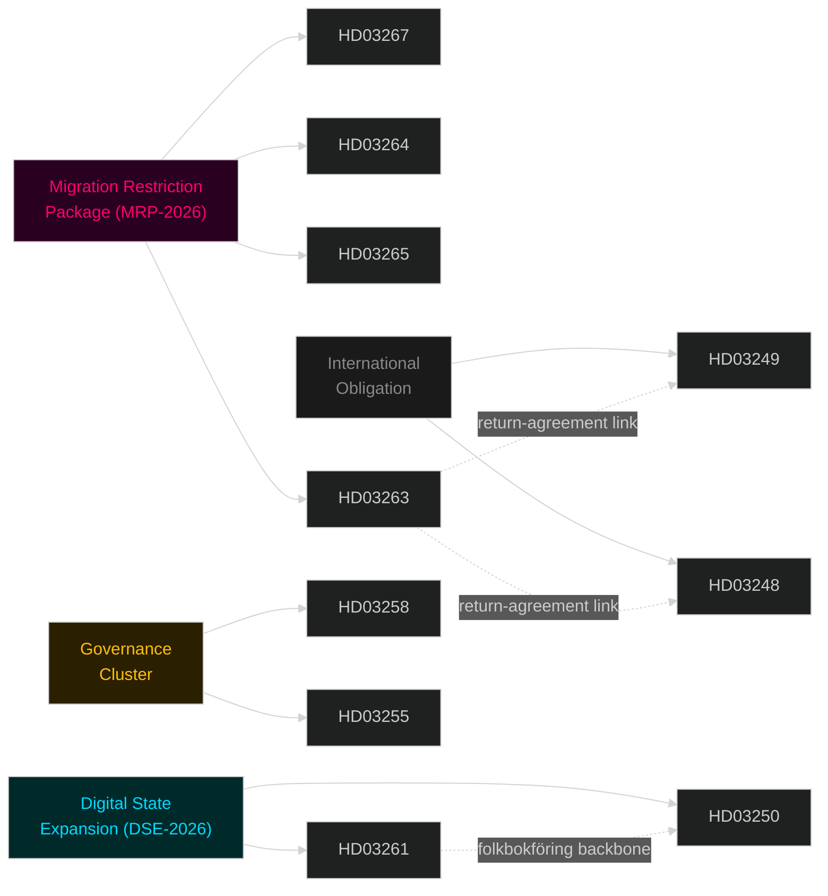

# Cross-Reference Map — Swedish Government Propositions, May 2026

**Date**: 2026-05-25 | **Analyst**: James Pether Sörling

## Policy Clusters

### Cluster 1: Migration Restriction Package (MRP-2026)

**Legislative chain**: Four propositions form a single coherent immigration-restriction system:

- [HD03267](https://data.riksdagen.se/dokument/HD03267) — **Security threat expulsions**: upstream gate — removes foreigners classified as SÄPO security threats
- [HD03264](https://data.riksdagen.se/dokument/HD03264) — **Character requirements**: mid-gate — prevents new residence permits for those with criminal history
- [HD03265](https://data.riksdagen.se/dokument/HD03265) — **Detention/supervision**: enforcement mechanism — extends permissible detention while awaiting deportation
- [HD03263](https://data.riksdagen.se/dokument/HD03263) — **Returns**: final stage — strengthens legal and operational tools for executing deportation

**Policy chain logic**:
```
SÄPO Security Classification → Expulsion Order (HD03267)
Character Assessment → Permit Denial (HD03264)
Pending Return → Extended Detention/Supervision (HD03265)
Active Return Process → Enhanced Enforcement (HD03263)
```

**Coordinated activity pattern**: All four filed within 8 days (April 30 – May 7, 2026). Single department (Justitiedepartementet). Two ministers (Forssell + Strömmer). This is coordinated legislative architecture, not coincidental timing.

### Cluster 2: Digital State Expansion (DSE-2026)

**Legislative chain**:
- [HD03250](https://data.riksdagen.se/dokument/HD03250) — **State e-ID**: creates national identity infrastructure at Skatteverket
- [HD03261](https://data.riksdagen.se/dokument/HD03261) — **Skatteverket expansion**: extends Skatteverket's investigation and verification powers in folkbokföring

**Cross-reference**: HD03261 directly strengthens the verification backbone that HD03250's e-ID will rely on. Both route through Finansdepartementet. Skatteverket's role expands on two axes simultaneously.

### Cluster 3: Governance & Financial Oversight

- [HD03258](https://data.riksdagen.se/dokument/HD03258) — **Political transparency**: KU committee; democratic legitimacy signal
- [HD03255](https://data.riksdagen.se/dokument/HD03255) — **Household debt data**: FiU committee; macroprudential tool

**Cross-reference**: Both are governance-improvement framings that give the government "responsible stewardship" narrative alongside the security/migration agenda.

### Cluster 4: International Obligations

- [HD03249](https://data.riksdagen.se/dokument/HD03249) — EU/Uzbekistan Partnership
- [HD03248](https://data.riksdagen.se/dokument/HD03248) — EU/Kyrgyzstan Partnership

**Cross-reference**: Central Asian partnerships are procedural EU commitments; notable in migration context — Uzbekistan and Kyrgyzstan are relevant transit/origin countries for asylum seekers. These partnership agreements may create diplomatic leverage for return agreements (cross-referencing [HD03263](https://data.riksdagen.se/dokument/HD03263)).

## Coordinated Activity Detection

**Pattern**: 8 propositions in 8 days from a single government, dominated by a single policy theme (migration), with clear internal cross-referencing. This is a planned legislative sprint, not incremental policymaking.

**Electoral coordination signal**: The sprint places all bills in committee stage by May–June 2026, enabling Riksdag votes in September 2026 (immediately before or just after the election date of September 13). This is either deliberately timed to be enacted pre-election or to ensure the campaign is fought over specific enacted or near-enacted legislation.

## Sibling-Folder Citations

No prior-cycle analysis in propositions subfolder (first run). Cross-reference to be added in subsequent runs.


