# Election 2026 Analysis — Swedish Government Propositions Impact

**Date**: 2026-05-25 | **Election**: September 13, 2026 | **Analyst**: James Pether Sörling

## Current Coalition and Seat Map (Riksdag 349 seats, majority = 175)

### Tidö Bloc (Government)
| Party | Seats (2022 election) | Policy orientation |
|-------|----------------------|-------------------|
| Moderaterna (M) | 68 | Centre-right |
| Sverigedemokraterna (SD) | 73 | National-conservative |
| Kristdemokraterna (KD) | 19 | Christian-democratic |
| Liberalerna (L) | 16 | Liberal |
| **Total** | **176** | **Bare majority +1** |

### Opposition Bloc
| Party | Seats (2022 election) | Policy orientation |
|-------|----------------------|-------------------|
| Socialdemokraterna (S) | 107 | Centre-left |
| Vänsterpartiet (V) | 24 | Left |
| Miljöpartiet (MP) | 18 | Green |
| Centerpartiet (C) | 24 | Liberal-agrarian |
| **Total** | **173** | **2 short of majority** |

## MRP-2026 Electoral Impact Analysis

### SD Electoral Effect (Net: Strong Positive)

SD stands to gain from all 4 migration bills regardless of final enactment. The filing of HD03267 + HD03264 + HD03265 + HD03263 as a coordinated package:
- **Validates SD's 2022 electoral promise** of migration restriction
- **Provides electoral "deliverable" narrative** even if Lagrådet raises procedural concerns
- **Shifts Overton window**: S is forced to respond to the entire package as a unit rather than bill-by-bill

**SD projected impact**: +2 to +4 seats if migration remains top voter concern through August 2026

### M Electoral Effect (Mixed)

M benefits from demonstrating governance competence (HD03250 digital state, HD03258 transparency) while M's "moderate conservative" brand is further stretched toward SD's position. L defection risk on HD03261 is the key liability.

**M projected impact**: Neutral to -1 seat (civil-liberties wing at risk)

### S Electoral Effect (Defensive Pressure)

S faces "security vs. welfare" framing pressure. Migration polling shows Swedish voters have shifted significantly toward restriction (Demoskop, February 2026: 62% support tighter measures). S's 2026 position of "managed migration" is squeezed between SD's restriction and M's implementation.

**S projected impact**: Dependent on crime/migration salience — range -3 to +2 seats

## Coalition Viability Post-September 2026

```mermaid
%%{init: {"theme": "dark", "themeVariables": {"primaryColor": "#1a1e3d"}}}%%
flowchart LR
    E2026[Election Sept 13 2026] --> |Tidö bloc ≥175| TC[Tidö Continues]
    E2026 --> |S bloc ≥175| SL[S-led Government]
    E2026 --> |Hung parliament| HG[Hung Parliament]
    TC --> MRP[MRP-2026 Implementation]
    SL --> REV[Selective Reversal]
    HG --> NEG[Cross-bloc Negotiation]
    style TC fill:#1a1e3d
    style SL fill:#aa0000
    style HG fill:#444400
```

**Base case** (60%): Tidö bloc retains narrow majority; MRP-2026 fully implemented 2027–2028.

**Upside case** (25%): Migration salience grows post-summer; SD gains push Tidö to 180+; emboldened enforcement.

**Downside case** (15%): Economic shock reduces migration salience; S-C cooperation possible; selective reversal of HD03261 and HD03265.
