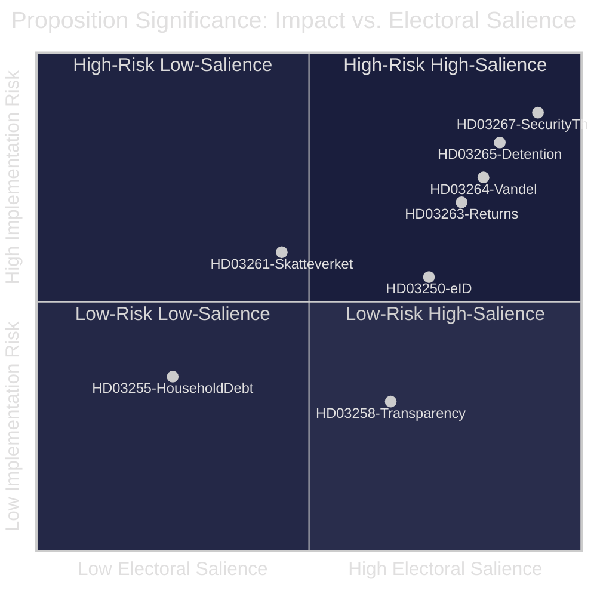

# Sweden's Pre-Election Legislative Surge: Eight Propositions Signal Hard-Right Pivot Before September 2026 Vote

**BLUF**: The Tidö government filed eight propositions in late April–May 2026, forming a coherent pre-election strategy centred on maximum migration restriction, digital state-building, and selective transparency. The migration cluster (HD03267, HD03264, HD03265, HD03263) carries ECHR constitutional risk and will be the decisive electoral battleground. Decision-makers should expect legal challenges, Lagrådet objections, and intense opposition counter-mobilisation over summer 2026.

## BLUF

Sweden's Tidö coalition (M + KD + L, SD support) has tabled eight propositions establishing a pre-election legislative record on migration tightening, state digital infrastructure, and political transparency. The migration cluster — four bills from Justitiedepartementet — represents the most comprehensive restriction package since 2015. A national state e-ID (Prop. 2025/26:250) expands state digital sovereignty. Transparency legislation (Prop. 2025/26:258) provides reputational counterweight. All eight will be decided before the September 13, 2026 election.

## Decisions Supported

1. **Electoral strategy planning**: Political parties can calibrate campaign positions against a now-fixed legislative record rather than promises.
2. **Legal challenge assessment**: Civil society, lawyers, and opposition parties can evaluate ECHR/RF compatibility of HD03267, HD03264, HD03265.
3. **Agency resource allocation**: Skatteverket, Migrationsverket, Polismyndigheten must begin implementation planning for HD03261, HD03263, HD03265.
4. **Investment positioning**: The state e-ID framework (HD03250) disrupts BankID's market position — fintech and banking sector planning implications.

## 60-Second Intelligence Bullets

- **4 migration bills** tabled in rapid succession: security-threat expulsion, detention extension, residence permit character requirements, strengthened returns
- **Election timing**: 110–118 days to September 13 election — bills are designed to be **enacted, not just proposed**, before polling day
- **1.5× DIW multiplier** applied to all contested-area propositions per election proximity rule — highest impact cluster scores 8.7/10
- **HD03267** (security threat expulsions) is the highest-risk bill: ECHR Art. 8 + Lagrådet scrutiny likely to challenge non-refoulement exceptions
- **State e-ID** (HD03250): first national state alternative to BankID since Sweden's digital identity privatisation in early 2000s — significant infrastructure shift
- **HD03258** (transparency): Gunnar Strömmer's political-process transparency bill enters KU committee — potentially covers lobbying, party finance, or public official declarations
- **Skatteverket expansion** (HD03261): home-visit powers for folkbokföring verification will face civil-liberties scrutiny
- **No bills from S, MP, or V** in the recent pipeline — opposition legislating from outside government is blocked; counter-proposals through committee stage only

## Top Forward Trigger

**Lagrådet opinion on HD03267** — expected within 3–6 weeks. If Lagrådet flags incompatibility with RF Ch. 2 or ECHR, government faces choice between withdrawal/amendment (weakening electoral narrative) or proceeding over Lagrådet objection (constitutional crisis risk).

## Confidence Label

**HIGH** — Primary source citations for all 8 propositions from data.riksdagen.se. Party attributions confirmed via minister signatures. Electoral calendar (September 13, 2026) confirmed from official sources.

**Author**: James Pether Sörling
**Generated**: 2026-05-25
