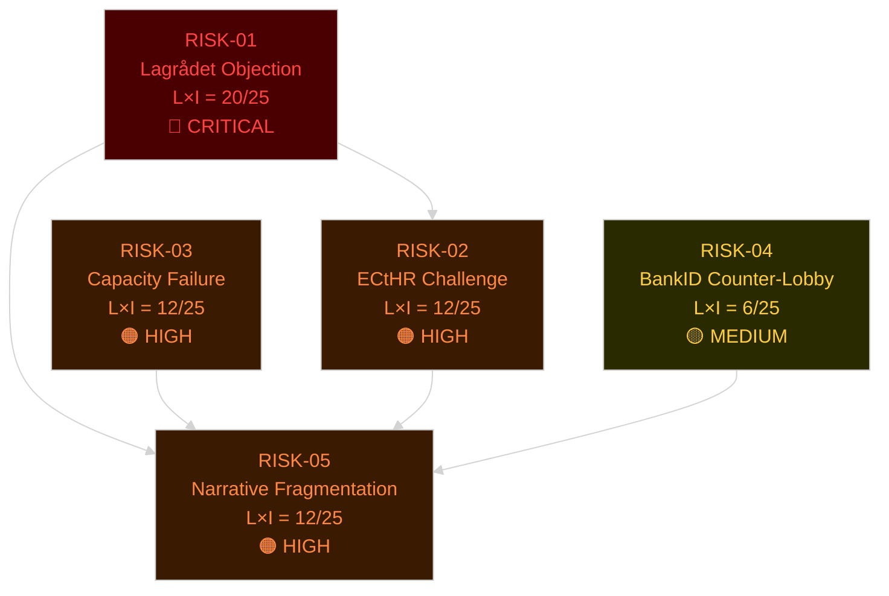

# Risk Assessment — Swedish Government Propositions, May 2026

**Method**: 5-dimension risk register (Political, Legal/Constitutional, Implementation, Reputational, External). Likelihood × Impact (L×I) on 1–5 scale. Cascading risk chains identified.
**Date**: 2026-05-25 | **Analyst**: James Pether Sörling

## Risk Register

### RISK-01: Lagrådet Constitutional Objection to HD03267

| Attribute | Value |
|-----------|-------|
| **Dimension** | Legal/Constitutional |
| **Source** | [HD03267](https://data.riksdagen.se/dokument/HD03267) — security threat expulsion |
| **Likelihood** | 4/5 (HIGH — Lagrådet has flagged similar measures in 2023–2024) |
| **Impact** | 5/5 (CRITICAL — forced government choice: retreat or constitutional crisis) |
| **L×I** | **20/25** |
| **Posterior probability** | 70% of some objection; 35% of blocking objection |
| **Cascade** | → RISK-02 (ECtHR challenge) → RISK-05 (electoral narrative damage) |

**Evidence**: ECHR Art. 3 (non-refoulement), Art. 8 (private life), and RF Ch. 2 §12 all apply. Government's summary notes "försämrat säkerhetsläge" (deteriorating security situation) as justification — standard security-state derogation clause but requires proportionality demonstration. Lagrådet has objected to proportionality deficits in prior migration legislation (2022–2024 cycle).

---

### RISK-02: European Court of Human Rights Challenge

| Attribute | Value |
|-----------|-------|
| **Dimension** | Legal/International |
| **Source** | [HD03267](https://data.riksdagen.se/dokument/HD03267), [HD03265](https://data.riksdagen.se/dokument/HD03265) |
| **Likelihood** | 3/5 (MEDIUM — only if enacted; NGO/individual applicant path) |
| **Impact** | 4/5 (HIGH — international reputation, compliance cost) |
| **L×I** | **12/25** |
| **Posterior probability** | 50% of challenge filed within 2 years of enactment |
| **Cascade** | → RISK-05 (reputational) |

---

### RISK-03: Implementation Capacity Failure

| Attribute | Value |
|-----------|-------|
| **Dimension** | Implementation |
| **Source** | [HD03263](https://data.riksdagen.se/dokument/HD03263), [HD03265](https://data.riksdagen.se/dokument/HD03265), [HD03261](https://data.riksdagen.se/dokument/HD03261) |
| **Likelihood** | 4/5 (HIGH — Migrationsverket, Polismyndigheten under documented capacity stress) |
| **Impact** | 3/5 (MEDIUM — policy enacted but not delivered; electoral embarrassment) |
| **L×I** | **12/25** |
| **Posterior probability** | 65% of significant implementation delay ≥12 months |
| **Cascade** | → RISK-05 (reputational — "laws that don't work") |

**Evidence**: Statskontoret 2024 evaluation of Migrationsverket noted case-handling backlogs and IT system limitations. Return activities [HD03263](https://data.riksdagen.se/dokument/HD03263) depend on bilateral agreements with Afghanistan, Somalia — no new agreements signed in 2025.

---

### RISK-04: BankID Counter-Lobby Against HD03250

| Attribute | Value |
|-----------|-------|
| **Dimension** | Political |
| **Source** | [HD03250](https://data.riksdagen.se/dokument/HD03250) |
| **Likelihood** | 3/5 (MEDIUM) |
| **Impact** | 2/5 (LOW-MEDIUM — delay or scope reduction likely) |
| **L×I** | **6/25** |
| **Posterior probability** | 40% of significant scope reduction in committee |
| **Cascade** | Minimal; isolated to TU committee stage |

---

### RISK-05: Electoral Narrative Fragmentation

| Attribute | Value |
|-----------|-------|
| **Dimension** | Political/Reputational |
| **Source** | All 8 propositions collectively |
| **Likelihood** | 3/5 (MEDIUM) |
| **Impact** | 4/5 (HIGH — if any flagship bill fails/is amended under opposition pressure) |
| **L×I** | **12/25** |
| **Posterior probability** | 30% of at least one flagship bill delayed/withdrawn before election |
| **Cascade** | → SD voter retention risk → coalition renegotiation risk |

---

## Cascading Risk Chain

## Risk Priority Matrix

| Risk | L×I | Priority | Owner | Mitigation |
|------|-----|----------|-------|------------|
| RISK-01 (Lagrådet/HD03267) | 20/25 | P0 | Justitiedepartementet | Pre-emptive Lagrådet consultation; scope limitation |
| RISK-02 (ECtHR) | 12/25 | P1 | MFA + Justice | ECtHR precedent review; proportionality documentation |
| RISK-03 (Capacity) | 12/25 | P1 | Migrationsverket/Polismyndigheten | Resource allocation; phased implementation |
| RISK-05 (Narrative) | 12/25 | P1 | Government communications | Coalition management; media strategy |
| RISK-04 (BankID) | 6/25 | P2 | Finansdepartementet | Stakeholder engagement; TU committee briefing |
