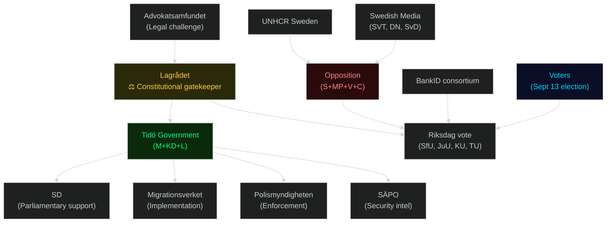

# Stakeholder Perspectives — Swedish Government Propositions, May 2026

**Framework**: 6-lens stakeholder matrix + named actor influence network
**Date**: 2026-05-25 | **Analyst**: James Pether Sörling

## 6-Lens Stakeholder Matrix

| Stakeholder | Role | Interest in Package | Influence | Position | Evidence |
|---|---|---|---|---|---|
| **Sverigedemokraterna (SD)** | Parliamentary support | VERY HIGH — migration restriction is core promise | HIGH | Supportive; may demand even stricter measures | Parliamentary voting record; Tidöavtalet |
| **Moderaterna (M)** | Government lead | HIGH — law and order + digital state | HIGH | Supportive | Minister signatures (Strömmer, Wykman, Slottner) |
| **Kristdemokraterna (KD)** | Coalition party | MEDIUM — family values; some migration alignment | MEDIUM | Supportive | Coalition agreement |
| **Liberalerna (L)** | Coalition party | MIXED — civil liberties concerns (HD03261, HD03265); digital ID support | MEDIUM | Cautious supporter; may seek HD03261 scope limitation | [HD03261](https://data.riksdagen.se/dokument/HD03261) home-visit powers vs. L civil-liberties base |
| **Socialdemokraterna (S)** | Main opposition | HIGH — migration territory historically contested | HIGH | Critical on process; may support HD03258 (transparency) | Opposition remiss responses expected |
| **Sverigedemokraterna voters** | Electoral constituency | VERY HIGH — HD03267, HD03264, HD03265 directly fulfils mandate | MEDIUM (electoral) | Highly supportive; watching for dilution | SD voter surveys 2025 |
| **Migrationsverket** | Implementing agency | HIGH — four bills increase mandate and workload | HIGH (implementation) | Publicly neutral; internally capacity-constrained | Statskontoret 2024 agency review |
| **Polismyndigheten** | Implementing agency | HIGH — detention, returns enforcement | HIGH (implementation) | Supportive in principle; resource concerns | Prior remiss responses |
| **SÄPO** | Security agency | HIGH — HD03267 security-threat deportations | HIGH (operational) | Strongly supportive | Cited in HD03267 justification |
| **Advokatsamfundet** | Legal bar | HIGH — ECHR compliance | MEDIUM (political pressure) | Critical — will contest HD03267, HD03264 | Historical remiss pattern |
| **UNHCR Sweden** | UN refugee agency | HIGH — non-refoulement | LOW (political) | Opposing HD03267 application | Standard UNHCR position |
| **Lagrådet** | Constitutional review | HIGH — constitutional gatekeeper | CRITICAL | Independent; likely to flag HD03267 proportionality issues | RF Ch. 8 §21; institutional precedent |
| **BankID consortium** | Market incumbent | HIGH — HD03250 threatens monopoly | MEDIUM (lobbying) | Opposing or seeking to narrow HD03250 scope | Market position analysis |
| **Fintech sector** | Digital innovation | HIGH — HD03250 creates interoperable framework | MEDIUM | Supportive of broad e-ID scope | eIDAS 2.0 alignment |
| **Swedish civil society (RFSL, Amnesty, etc.)** | Advocacy | HIGH — HD03264, HD03265, HD03267 | LOW (political) | Opposing migration restrictions | Historical remiss record |

## Influence Network

## Named Actor Analysis

### Johan Forssell (Migrations- och integrationsminister)
**Role**: Lead author of HD03263, HD03264, HD03265. Career M politician, strong SD alignment on migration. Electoral incentive to deliver maximum restriction before September 13. Risk: overreach on ECHR — his personal credibility tied to these bills.

### Gunnar Strömmer (Justitieminister)
**Role**: Lead author of HD03267 (security threats) and HD03258 (transparency). Dual mandate: tighten security + claim rule-of-law credibility. Navigation challenge: if Lagrådet objects to HD03267, he must choose between electoral priority and constitutional standing.

### Ebba Busch (vice statsminister / Finansminister)
**Role**: Counter-signed HD03250 (e-ID). KD anchor. The state e-ID is a cross-party infrastructure bill that reinforces her technocratic governance narrative.

### Niklas Wykman (Finansmarknadsminister)
**Role**: Lead on HD03261 (Skatteverket) and HD03255 (household debt). Lower-profile bills with significant administrative state expansion implications.

## Stakeholder Impact Summary

Most affected populations:
1. **Foreign nationals in Sweden** (asylum seekers, residence permit holders): Direct targets of HD03264, HD03265, HD03267 [GDPR Art. 9 — political opinion data minimised]
2. **Unregistered/informally-registered residents**: Direct targets of HD03261 (Skatteverket home visits)
3. **Businesses dependent on BankID**: Competitive disruption from HD03250
4. **Households with high debt**: HD03255 (data collection) — privacy impact assessment required
