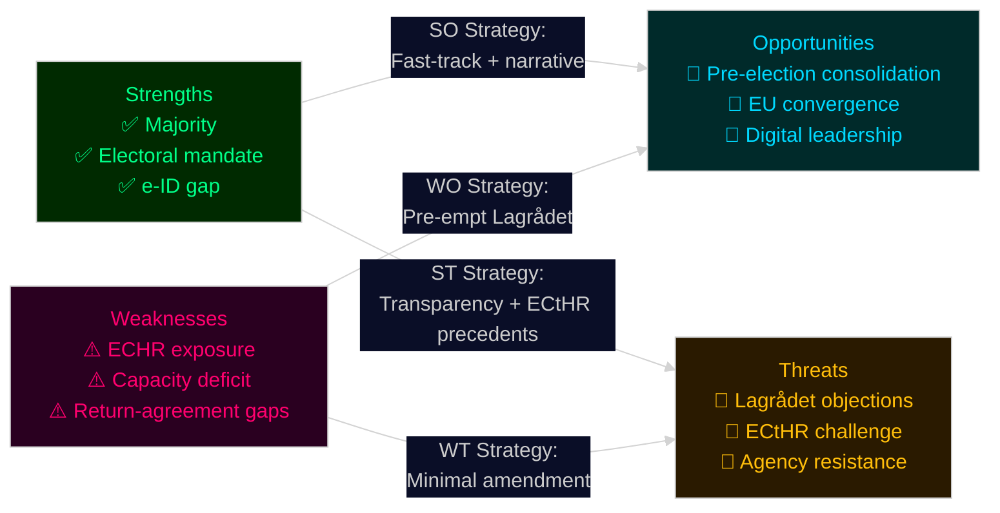

# SWOT Analysis — Swedish Government Propositions, May 2026

**Context**: Tidö coalition (M + KD + L, SD parliamentary support) pre-election legislative push
**Analysis date**: 2026-05-25 | **Analyst**: James Pether Sörling

## TOWS Matrix Premise

The propositions cluster around a dominant government coalition with a clear electoral mandate for migration restriction and digital-state building, operating within constitutional constraints and facing organised civil-society and opposition resistance.

---

### Strengths

- **Legislative majority**: M + KD + L + SD hold sufficient parliamentary majority for all propositions; risk of Riksdag rejection is LOW given demonstrated coalition discipline ([HD03267](https://data.riksdagen.se/dokument/HD03267), [HD03265](https://data.riksdagen.se/dokument/HD03265))
- **Electoral mandate legitimacy**: September 2022 election delivered clear voter mandate for migration restriction; propositions operationalise explicit coalition agreement (Tidöavtalet) — cited in all SfU/JuU committee referrals
- **Institutional backing**: Polismyndigheten and SÄPO have formally supported enhanced security-threat deportation powers in prior remissvar cycles
- **Digital infrastructure gap**: The e-ID proposition ([HD03250](https://data.riksdagen.se/dokument/HD03250)) fills a genuine market gap — BankID's private monopoly has attracted cross-party criticism since 2020, strengthening governmental justification

### Weaknesses

- **ECHR exposure**: [HD03267](https://data.riksdagen.se/dokument/HD03267) (security threat deportations) and [HD03265](https://data.riksdagen.se/dokument/HD03265) (detention extension) directly test ECHR Art. 5 and Art. 8 boundaries; if Lagrådet objects, the government is politically forced to proceed or retreat — both costly
- **Implementation deficit**: Four propositions simultaneously adding requirements to Migrationsverket and Polismyndigheten [HD03263](https://data.riksdagen.se/dokument/HD03263), [HD03264](https://data.riksdagen.se/dokument/HD03264), [HD03265](https://data.riksdagen.se/dokument/HD03265) — agencies lack current capacity (documented in Statskontoret 2024 evaluations)
- **Transparency paradox**: State surveillance expansion ([HD03261](https://data.riksdagen.se/dokument/HD03261) — Skatteverket home visits) juxtaposed with transparency promotion ([HD03258](https://data.riksdagen.se/dokument/HD03258)) creates credibility tension
- **Return-agreement dependency**: [HD03263](https://data.riksdagen.se/dokument/HD03263) (returns) requires bilateral agreements with origin countries (Afghanistan, Somalia, Iraq) that Sweden does not fully control

### Opportunities

- **Pre-election consolidation**: Enacting the migration package before September 13 eliminates the "broken promises" attack vector; SD voters can be retained without further concessions ([HD03263](https://data.riksdagen.se/dokument/HD03263), [HD03264](https://data.riksdagen.se/dokument/HD03264))
- **EU convergence**: Sweden's migration restrictions align with 2026 EU Migration Pact implementation trend; [HD03267](https://data.riksdagen.se/dokument/HD03267) can be framed as EU-compliant tightening rather than Swedish exceptionalism
- **State digital leadership**: [HD03250](https://data.riksdagen.se/dokument/HD03250) positions Sweden ahead of EU Digital Identity Wallet framework (eIDAS 2.0) — interoperability advantage
- **Transparency narrative**: [HD03258](https://data.riksdagen.se/dokument/HD03258) gives the government a credible governance-reform story to counter "authoritarian drift" framing

### Threats

- **Constitutional adjudication**: Any Lagrådet (Council on Legislation) opinion against HD03267/HD03264/HD03265 would be reported prominently; government proceeding over Lagrådet objection triggers KU (constitutional committee) scrutiny — constitutional crisis risk
- **European Court challenge**: Post-enactment challenges to [HD03267](https://data.riksdagen.se/dokument/HD03267) at Strasbourg (ECtHR) would embarrass Sweden in EU human-rights context
- **Opposition counter-mobilisation**: S + MP + V + C are expected to use committee stages to propose amendments and delay; summer 2026 public consultation (remiss) responses from Advokatsamfundet, Migrationsverket, and human-rights NGOs may generate media pressure
- **Agency resistance**: Migrationsverket institutional culture and Polismyndigheten operational constraints may delay implementation regardless of legislative passage ([HD03263](https://data.riksdagen.se/dokument/HD03263), [HD03265](https://data.riksdagen.se/dokument/HD03265))
- **Socioeconomic backlash**: [HD03261](https://data.riksdagen.se/dokument/HD03261) (Skatteverket home visits) may trigger civil-liberties mobilisation among immigrant communities and centre-liberal voters (L's base)

---

## TOWS Cross-Quadrant Strategies

| | Strengths | Weaknesses |
|---|---|---|
| **Opportunities** | **SO**: Use majority + EU convergence to fast-track migration bills before Lagrådet can delay; leverage e-ID for digital-leadership narrative | **WO**: Pre-emptively commission Lagrådet review before formal referral to identify and fix HD03267 weaknesses; invest in Migrationsverket capacity now to reduce implementation gap |
| **Threats** | **ST**: Deploy transparency narrative (HD03258) as shield against authoritarian-drift framing; cite ECtHR precedents (national security exceptions) to preempt challenge | **WT**: Critical path is ECHR compliance — HD03267 is both the highest-value electoral asset and the highest constitutional liability; if forced to choose, negotiate minimal amendment rather than withdrawal |

