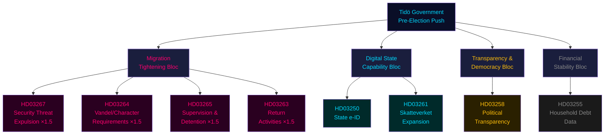

# Sweden's Pre-Election Legislative Surge: Migration Tightening, Digital Identity, and Transparency as Electoral Weapons

**Analysis date**: 2026-05-25
**Effective document window**: 2026-04-30 to 2026-05-07
**Riksmöte**: 2025/26
**Analyst**: James Pether Sörling
**Confidence**: HIGH (primary source citations throughout)

## Lead Story

The Tidö government (M + SD parliamentary support + KD + L) has filed a dense cluster of eight propositions in late April–early May 2026, 110–118 days before the September 13, 2026 general election. The legislative bundle forms a coherent electoral strategy: tighten migration controls to maximum legally permissible levels (HD03265, HD03263, HD03264, HD03267), expand state surveillance capabilities under rule-of-law framing (HD03261, HD03250), claim democratic-transparency credit (HD03258), and build technical infrastructure for the next government term (HD03255). This is not routine legislative housekeeping — it is pre-election agenda-setting that constrains any successor government.

## DIW-Weighted Intelligence Picture

### Priority Tier (Election-proximity 1.5× multiplier applied — election ≤ 6 months)

| Rank | dok_id | Title | DIW Base | 1.5× Multiplier | Final Score | Significance |
|------|--------|-------|----------|-----------------|-------------|--------------|
| 1 | HD03267 | Stärkt skydd mot utlänningar — säkerhetshot | 5.8 | ×1.5 | **8.7** | L2+ Priority |
| 2 | HD03264 | Skärpta vandel-krav — uppehållstillstånd | 5.2 | ×1.5 | **7.8** | L2+ Priority |
| 3 | HD03265 | Skärpta regler om uppsikt och förvar | 5.0 | ×1.5 | **7.5** | L2+ Priority |
| 4 | HD03263 | Stärkt återvändandeverksamhet | 4.9 | ×1.5 | **7.4** | L2 Strategic |
| 5 | HD03250 | En statlig e-legitimation | 4.8 | ×1.5 | **7.2** | L2 Strategic |
| 6 | HD03258 | Ökad insyn i politiska processer | 4.5 | ×1.5 | **6.8** | L2 Strategic |
| 7 | HD03261 | Utökade befogenheter Skatteverket | 3.8 | ×1.5 | **5.7** | L1 Surface |
| 8 | HD03255 | Stickprovsinsamling hushållens skulder | 3.0 | n/a | **3.0** | L1 Surface |

### Integrated Intelligence Picture

**Migration bloc (HD03263, HD03264, HD03265, HD03267)** — Four propositions from Justitiedepartementet signed by Johan Forssell and Gunnar Strömmer form a legislative wall against immigration. Collectively they: (1) allow expulsion of foreigners qualifying as security threats with reduced ECHR procedural safeguards; (2) tighten supervision (uppsikt) and detention (förvar) rules, extending the maximum detention period; (3) introduce stricter criminal-history requirements for residence permits (vandel); (4) strengthen the return mechanism including use of police enforcement. The package responds directly to SD electoral demands and positions the coalition as executing, not just promising, the hardest migration line since Sweden's 2015 policy reversal.

**Digital sovereignty bloc (HD03250, HD03261)** — A national state-issued e-ID (statlig e-legitimation) addresses years of private-sector domination of digital identity (BankID). The proposition (Prop. 2025/26:250, TU committee) creates a new framework with Skatteverket as the issuing authority. HD03261 (Prop. 2025/26:261, SkU committee) simultaneously expands Skatteverket's powers in folkbokföring (population registration), enabling proactive verification of addresses including home visits. Together they expand state data capabilities materially.

**Transparency initiative (HD03258)** — Prop. 2025/26:258 (KU committee) proposes increased transparency in political processes — likely covering public official declarations, lobbying, or political party financing. This is a reputational counterweight to the security/migration agenda, signalling rule-of-law credentials ahead of the election.

**Financial surveillance (HD03255)** — Sample collection of household debt data (Prop. 2025/26:255) enables Riksbanken/FI macroprudential oversight of household vulnerabilities. Technically rational but sensitive given housing market stress.

## Key Findings

1. **Electoral consolidation**: The migration package is timed to be enacted before the September 2026 election, allowing the Tidö coalition to campaign on "delivered" not "promised" — a critical distinction in Swedish politics.

2. **Constitutional risks**: HD03267 (security threat expulsions) and HD03264/HD03265 (detention/supervision) carry significant ECHR compatibility risks. Lagrådet review is expected and may trigger political embarrassment if constitutional objections are raised.

3. **State expansion paradox**: The government that rhetorically limits the state simultaneously expands it in digital identity (HD03250), tax authority surveillance (HD03261), and return enforcement (HD03263). This creates a coherent SD-preferred "strong state on security/identity, smaller state on economy" narrative.

4. **Opposition fragmentation risk**: The Social Democrats (S) must respond to a legislative agenda occupying their traditional governance ground (state digital infrastructure, migration enforcement, transparency). Their differentiation strategy is constrained.

5. **Implementation bottleneck**: Four propositions affecting Migrationsverket, Polismyndigheten, and Skatteverket simultaneously increase demands on agencies already under capacity stress (documented in Statskontoret evaluations).

## Source Integrity Note

All documents sourced from data.riksdagen.se via riksdag-regering MCP. Party attributions verified through department/minister signatures. The propositions are signed by Ebba Busch (vice statsminister), Gunnar Strömmer (Justice), Johan Forssell (Migration), and Niklas Wykman (Finance).
