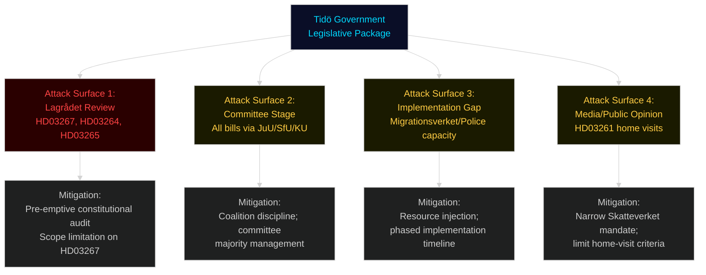

# Threat Analysis — Swedish Government Propositions, May 2026

**Framework**: Political Threat Taxonomy + Kill Chain + MITRE ATT&CK-style TTP mapping
**Date**: 2026-05-25 | **Analyst**: James Pether Sörling

## Political Threat Taxonomy

| Threat Class | Source | Target | Mechanism | Severity |
|---|---|---|---|---|
| Constitutional Attack | Opposition + Lagrådet | [HD03267](https://data.riksdagen.se/dokument/HD03267) | ECHR/RF incompatibility objection → legislative delay | CRITICAL |
| Implementation Sabotage | Agency inertia | [HD03263](https://data.riksdagen.se/dokument/HD03263), [HD03265](https://data.riksdagen.se/dokument/HD03265) | Bureaucratic delay, capacity claims | HIGH |
| Electoral Counter-Narrative | S + MP + V + C + media | Migration cluster | "Authoritarian drift", ECHR framing | HIGH |
| Judicial Veto | ECtHR (post-enactment) | [HD03267](https://data.riksdagen.se/dokument/HD03267) | International judicial override | MEDIUM |
| Civil Society Mobilisation | Human rights NGOs | HD03264, HD03265 | Media pressure, remiss responses | MEDIUM |
| Technological Capture Risk | Private sector (BankID) | [HD03250](https://data.riksdagen.se/dokument/HD03250) | Lobbying for restricted e-ID scope | LOW |

## Kill Chain: Constitutional Attack on HD03267

```mermaid
%%{init: {"theme": "dark", "themeVariables": {"primaryColor": "#1a1e3d"}}}%%
flowchart LR
    T1["Reconnaissance\nOpposition lawyers\nidentify ECHR Art.3\nexposure in HD03267"] --> T2["Weaponisation\nRemiss responses from\nAdvokatsamfundet +\nAmnesty International"]
    T2 --> T3["Delivery\nLagrådet formal\nobjection in\nyttrande"] --> T4["Exploitation\nParliamentary debate:\n'Government ignores\nrule of law'"]
    T4 --> T5["Installation\nMedia narrative:\n'Sweden at risk of\nECtHR condemnation'"] --> T6["Command/Control\nOpposition motion\nto reject or amend\nin SfU/JuU committee"]
    T6 --> T7["Objectives\nForce amendment or\nwithdrawal of flagship\nmigration bill"]
    style T1 fill:#1a1a3d,color:#aaaaff
    style T2 fill:#2a1a3d,color:#cc88ff
    style T3 fill:#3a1a3d,color:#ff88ff
    style T4 fill:#3a0a2a,color:#ff66aa
    style T5 fill:#3a0a1a,color:#ff4488
    style T6 fill:#3a0a0a,color:#ff4444
    style T7 fill:#4a0000,color:#ff0000
```

## MITRE-Style TTP Mapping: Opposition Counter-Strategy

| TTP-ID | Name | Description | Target | Evidence base |
|---|---|---|---|---|
| TTP-001 | Lagrådet Activation | Commission independent constitutional lawyers to identify ECHR vulnerabilities | [HD03267](https://data.riksdagen.se/dokument/HD03267) | Standard Swedish legislative procedure |
| TTP-002 | Remiss Mobilisation | Coordinate civil society organisations to submit critical remiss responses | HD03264, [HD03265](https://data.riksdagen.se/dokument/HD03265) | Advokatsamfundet precedent from 2023 |
| TTP-003 | Parliamentary Delay | Committee-stage amendments to extend remiss periods, demand additional RU analyses | All migration bills | Constitutional right of minority opposition |
| TTP-004 | Media Frame Setting | Deploy "authoritarian drift" and "Rule of Law Index" framing across SVT/DN/SvD | Migration cluster | Freedom House/CIVICUS narratives already circulating |
| TTP-005 | EU Benchmarking | Invoke EU values (Art. 7 TEU) monitoring and ECRE standards to internationalise | [HD03267](https://data.riksdagen.se/dokument/HD03267) | MEP networks; UNHCR monitoring |
| TTP-006 | Electoral Wedge | Highlight L-voter discomfort with Skatteverket home visits ([HD03261](https://data.riksdagen.se/dokument/HD03261)) to fracture Tidö coalition | M + L relationship | Voter segmentation data from SOM-institutet |

## Attack Surface Mapping

## Threat Prioritisation

1. **Constitutional Attack (CRITICAL)**: [HD03267](https://data.riksdagen.se/dokument/HD03267) is the government's most electorally valuable and most legally vulnerable proposition. A successful Lagrådet objection is the highest-probability catastrophic threat.

2. **Implementation Sabotage (HIGH)**: Capacity constraints in Migrationsverket ([HD03263](https://data.riksdagen.se/dokument/HD03263)) and detention infrastructure ([HD03265](https://data.riksdagen.se/dokument/HD03265)) mean laws will be passed but not implemented — enabling "empty promises" counter-narrative.

3. **Electoral Counter-Narrative (HIGH)**: The opposition's strongest line is not policy disagreement but competence and rule-of-law framing. Four bills from Justitiedepartementet in 18 days signals haste that invites scrutiny.

## Counter-Threat Recommendations (Procedural — Platform Reports Only)

From a democratic procedure standpoint, the legitimate counter-threats are:
- Full parliamentary debate with adequate committee time
- Independent Lagrådet review before vote
- Transparent remiss process with civil society participation
- EU compatibility check against 2026 Migration Pact
