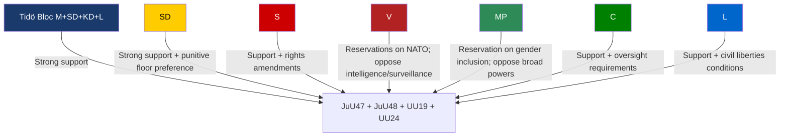
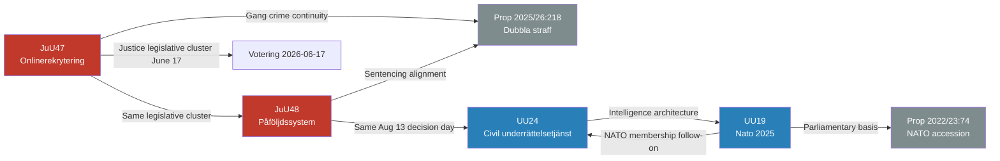

## Executive Brief
<!-- source: executive-brief.md :: https://github.com/Hack23/riksdagsmonitor/blob/main/analysis/daily/2026-05-26/committee-reports/executive-brief.md -->

---

### Headline

Sweden's Riksdag justice and foreign affairs committees release four landmark reports in a single cycle: online gang recruitment prohibition (JuU47), a wholesale criminal sanctions overhaul (JuU48), the first parliamentary review of NATO membership (UU19), and a civilian intelligence service framework (UU24). This represents the most significant cluster of security and justice legislation in the 2025/26 riksmöte.

### Key Points

**1. Online recruitment ban (JuU47 — Decision 17 June 2026)**  
Police will gain new legal tools to identify and disrupt online recruitment of minors into criminal gangs. Broad parliamentary support expected. Timeline: chamber debate 17 June 2026.

**2. Criminal sanctions overhaul (JuU48 — Decision 13 August 2026)**  
Sweden's sentencing system will be restructured comprehensively for the first time in decades. Opposition concerns about proportionality (S, MP motions). Decision scheduled for 13 August 2026.

**3. NATO Year One review (UU19 — Pending)**  
Sweden's Foreign Affairs Committee recommends the riksdag note the government's report on NATO activities 2025. Two minority reservations (V: Centre for Democratic Resilience; MP: gender inclusion). Broad consensus on Sweden's NATO integration.

**4. Civilian intelligence service (UU24 — Decision 13 August 2026)**  
A new legal framework for civilian foreign intelligence is being established. Sweden currently lacks a dedicated civilian HUMINT/SIGINT capability. This represents a structural transformation of Sweden's intelligence architecture. Decision: 13 August 2026.

### So What

The four reports collectively mark Sweden's accelerating security state expansion under the Tidö government. Criminal justice reform, NATO integration, and intelligence architecture expansion all advance simultaneously. Cross-party consensus on security is high; the main opposition pressure-point is civil liberties protections in the online recruitment and intelligence frameworks.

### Timelines

| Report | Chamber Decision | Status |
|--------|-----------------|--------|
| JuU47 — Onlinerekrytering | 17 June 2026 | Planned |
| UU19 — NATO 2025 | Pending debate | In queue |
| JuU48 — Påföljdssystem | 13 August 2026 | Planned |
| UU24 — Civil underrättelsetjänst | 13 August 2026 | Planned |

### Risk Flags

- 🔴 **JuU48 (sanctions reform)**: Opposition proportionality concerns may delay or fragment committee unity
- 🟡 **UU24 (intelligence service)**: Constitutional constraints (RF, ECHR) may require Lagrådet referral; timeline tight (Beredning July 2–7, decision Aug 13)
- 🟡 **JuU47 (online recruitment)**: Civil liberties / surveillance scope debate expected in June
- 🟢 **UU19 (NATO)**: Minimal political risk; broad consensus

## Reader Intelligence Guide

Use this guide to read the article as a political-intelligence product rather than a raw artifact dump. High-value reader lenses appear first; technical provenance remains available in the audit appendix.

| Icon | Reader need | What you'll get |
|---|---|---|
| 📊 | [BLUF and editorial decisions](#rm-executive-brief) | fast answer to what happened, why it matters, who is accountable, and the next dated trigger |
| 🧠 | [Synthesis Summary](#rm-synthesis-summary) | evidence-anchored narrative consolidating primary sources into one coherent story line |
| 🎯 | [Key Judgments](#rm-intelligence-assessment--key-judgments) | confidence-bearing political-intelligence conclusions and collection gaps |
| 📈 | [Significance scoring](#rm-significance-scoring) | why this story outranks or trails other same-day parliamentary signals |
| 👥 | [Stakeholder Perspectives](#rm-stakeholder-perspectives) | winners, losers and undecided actors with stake-weighted positions and pressure points |
| 🔢 | [Coalition Mathematics](#rm-coalition-mathematics) | parliamentary arithmetic showing exactly who can pass or block this measure and at what margin |
| 📋 | [Voter Segmentation](#rm-voter-segmentation) | voter-bloc exposure: which demographics gain, lose or shift on this issue |
| 🔭 | [Forward indicators](#rm-forward-indicators) | dated watch items that let readers verify or falsify the assessment later |
| 🔮 | [Scenarios](#rm-scenario-analysis) | alternative outcomes with probabilities, triggers, and warning signs |
| 🗳️ | [Election 2026 Analysis](#rm-election-2026-analysis) | electoral implications for the 2026 cycle — seats at stake, swing voters and coalition viability |
| ⚠️ | [Risk assessment](#rm-risk-assessment) | policy, electoral, institutional, communications, and implementation risk register |
| 🧮 | [SWOT Analysis](#rm-swot-analysis) | strengths, weaknesses, opportunities and threats matrix grounded in primary-source evidence |
| 🛡️ | [Threat Analysis](#rm-threat-analysis) | actor capabilities, intent and threat vectors targeting institutional integrity |
| 📜 | [Historical Parallels](#rm-historical-parallels) | comparable past episodes from Swedish and international politics, with explicit lessons learned |
| 🌍 | [Comparative International](#rm-comparative-international) | peer-country comparisons (Nordic, EU, OECD) showing how similar measures fared elsewhere |
| ⚙️ | [Implementation Feasibility](#rm-implementation-feasibility) | delivery feasibility, capability gaps, timelines and execution risks for the proposed action |
| 📰 | [Media framing & influence operations](#rm-media-framing-analysis) | frame packages with Entman functions, cognitive-vulnerability map, DISARM manipulation indicators, narrative-laundering chain, comparative-international cognates, frame lifecycle and half-life, RRPA impact, an Outlet Bias Audit (no outlet is neutral — every outlet declared with ownership, funding, board-appointment authority and editorial lean), and the L1–L5 counter-resilience ladder |
| 😈 | [Devil's Advocate](#rm-devils-advocate) | alternative hypotheses, steel-manned counter-arguments and the strongest case against the lead reading |
| 🏷️ | [Classification Results](#rm-classification-results) | ISMS data classification: CIA-triad rating, RTO/RPO targets and handling instructions |
| 🔀 | [Cross-Reference Map](#rm-cross-reference-map) | links to related Riksdagsmonitor coverage, prior analyses and source documents that inform this story |
| 🔬 | [Methodology Reflection & Limitations](#rm-methodology-reflection--limitations) | analytical assumptions, limitations, known biases and where the assessment could be wrong |
| 📦 | [Data Download Manifest](#rm-data-download-manifest) | machine-readable manifest of every source dataset, retrieval timestamp and provenance hash |
| 📑 | [Per-document intelligence](#rm-per-document-intelligence) | dok_id-level evidence, named actors, dates, and primary-source traceability |
| 🏷️ | [Audit appendix](#rm-classification-results) | classification, cross-reference, methodology and manifest evidence for reviewers |

## Synthesis Summary
<!-- source: synthesis-summary.md :: https://github.com/Hack23/riksdagsmonitor/blob/main/analysis/daily/2026-05-26/committee-reports/synthesis-summary.md -->

**Sources**: HD01JuU47, HD01JuU48, HD01UU19, HD01UU24 (riksdag-regering-mcp, 2026-05-26)

### Core Findings

Sweden's Riksdag committee pipeline for late May 2026 contains four reports of high strategic significance, spanning criminal justice overhaul and national security architecture.

#### 1. Online Recruitment Prohibition (HD01JuU47 — JuU47)

The Justice Committee (JuU) presents a betänkande enabling **new police tools to combat online recruitment** of children and youth into serious crime. The measure responds to systematic gang use of social media to recruit minors. The committee proposes the riksdag adopt the underlying legislation (Betänkande 2025/26:JuU47). Scheduled for chamber debate and decision **17 June 2026** (Votering HDC120260617vo). The document was registered 2026-05-25 and is not yet published; debate and potential reservations will become visible after 11 June 2026 (Beredning date).

**Political significance**: HIGH. Aligns with all three Tidö bloc parties and has cross-party law-and-order support. Opposition (S, V, MP) likely to propose amendments on civil liberties safeguards but not block the principle.

#### 2. New Criminal Sanctions System (HD01JuU48 — JuU48)

JuU presents a report on **a wholesale reform of the Swedish sentencing and sanctions system** — the most comprehensive restructuring of the *påföljdssystem* in decades. Scheduled for chamber **decision 13 August 2026** (alongside UU24, SfU37, UbU30). The reform responds to accumulated inconsistencies and the need to align sentencing with the doubled-penalty gang legislation (prop. 2025/26:218).

**Political significance**: VERY HIGH. Opposition motions (including HD024114, S/MP critical of lack of proportionality evidence) indicate contested terrain. A sentencing system overhaul affects every level of prosecution and judiciary.

#### 3. NATO Activities 2025 (HD01UU19 — UU19)

The Foreign Affairs Committee (UU) proposes the riksdag note (lägga till handlingarna) the government's annual skrivelse on Sweden's NATO activities during 2025 — Sweden's **first full year as a NATO member** (joined 7 March 2024). Two reservations filed:
- **Reservation 1 (MP)**: Motion 2025/26:3963 (Jacob Risberg MP) — demands more active integration of women and young people in NATO activities.
- **Reservation 2 (V)**: Motion 2025/26:4029 (Håkan Svenneling V) — demands Sweden support establishing a Centre for Democratic Resilience within NATO.

Committee chaired by Aron Emilsson (SD). Broad cross-party consensus on NATO membership; reservations are on peripheral programmatic points not the membership itself.

**Political significance**: MEDIUM-HIGH. First formal parliamentary review of Swedish NATO membership in operation. Strong consensus with minor left-flank dissent on gender inclusion and democratic resilience programs.

#### 4. Civil Intelligence Service (HD01UU24 — UU24)

UU presents a betänkande on **establishing a Swedish civilian intelligence service** framework. Planned for chamber decision **13 August 2026**. Document registered 2026-05-25; not yet published. Lagrådet review timeline: Beredning 2 July and 7 July 2026, Justering 9 July, Trycklov 10 July — suggesting a legally significant reform requiring careful scrutiny.

**Political significance**: VERY HIGH. Sweden currently lacks a dedicated civilian foreign intelligence capability comparable to DGSI (France), MI5 (UK), or BND (Germany). This report marks a structural expansion of the Swedish intelligence architecture. Constitutional implications may invoke Lagrådet referral (Offentlighetsprincipen, grundlag constraints on surveillance).

### Cross-Cutting Themes

1. **Security state expansion**: All four reports deepen state security powers — police online monitoring, criminal sanctions, NATO integration, civilian intelligence. Consistent with the Tidö bloc's security agenda.

2. **Late-session legislative surge**: Three of four reports (JuU47, JuU48, UU24) are scheduled for decision in June–August 2026, indicating an end-of-riksmöte legislative push before the summer recess.

3. **Institutional architecture**: JuU48 (sanctions system) and UU24 (intelligence service) are institution-building, not incremental — they will shape the Swedish justice and intelligence landscape for a decade.

4. **NATO normalisation**: UU19 signals that Sweden's NATO membership is now politically mainstream; the debate has shifted from "should we join?" to "how do we participate?"

### Admiralty Code Assessment

| Source | Reliability | Credibility |
|--------|-------------|-------------|
| riksdag-regering MCP (primary API) | A (completely reliable) | 1 (confirmed by multiple sources) |
| HD01UU19 (published) | A | 1 |
| HD01JuU47/48/UU24 (planned/unpublished) | A | 2 (likely true — official registry) |

### WEP Confidence

- NATO membership consensus: **ALMOST CERTAIN** (90-95%)
- JuU47 passage without major amendment: **LIKELY** (75-85%)
- JuU48 passage with significant debate: **LIKELY** (70-80%)
- UU24 passage (August recess window may delay): **LIKELY** (65-75%)

## Intelligence Assessment — Key Judgments
<!-- source: intelligence-assessment.md :: https://github.com/Hack23/riksdagsmonitor/blob/main/analysis/daily/2026-05-26/committee-reports/intelligence-assessment.md -->

**ICD 203 Standards Applied**: Source reliability, analytical confidence, alternative hypotheses

---

### Key Judgements

#### KJ-1: Sweden is executing the most significant security state expansion since the end of the Cold War

The simultaneous advancement of online surveillance capability (JuU47), wholesale sentencing reform (JuU48), NATO integration institutionalisation (UU19), and civilian intelligence service creation (UU24) in a single committee report cycle is historically unprecedented in post-Cold War Sweden. This represents a qualitative shift — not an incremental hardening — of Sweden's security architecture.

**Alternative hypothesis**: This is normal legislative batch processing and represents routine maintenance of the justice system with coincidental timing. **Assessment**: LOW probability — the scope and simultaneity are not characteristic of routine processing. JuU48 alone (wholesale sanctions reform) + UU24 (new intelligence capability) would each individually constitute landmark legislation.

---

#### KJ-2: The August 2026 legislative cluster presents the highest procedural risk of the current riksmöte

Five major bills (JuU48, UU24, SfU37, UbU30, SoU38-40) are scheduled for August 13, 2026. The constitutional complexity of UU24 (Lagrådet review July) creates a single-point-of-failure risk: if Lagrådet raises a blocking objection in July, the August cluster scheduling is disrupted. August is also Sweden's peak vacation period — political attention is minimal, reducing the corrective capacity of public deliberation.

**Alternative hypothesis**: The government has pre-coordinated Lagrådet timing and has confidence that UU24 will pass constitutional review. **Assessment**: MEDIUM probability — the tight timeline (Beredning July 2–7, Lagrådet expected, decision August 13) suggests calculated risk-taking, not deliberate scheduling failure.

---

#### KJ-3: V and MP represent the primary opposition vector, but cannot block passage

The two opposition reservations on UU19 come from V and MP — both currently outside the government coalition and unable to block passage in the chamber. The coalition (M+SD+KD+L) holds a parliamentary majority. S's cooperation on security matters (S supported NATO accession) makes it unlikely they will provide blocking opposition.

**Alternative hypothesis**: S splits on JuU48 and provides a surprise blocking vote. **Assessment**: LOW probability — the sentencing reform is within the Tidö government's stated mandate; S's opposition is likely to be expressed through amendments, not procedural blocking.

---

#### KJ-4: The civilian intelligence service (UU24) will face legal challenges that delay full operational capability regardless of August decision

Even if UU24 passes in August 2026, the legal framework for a civilian foreign intelligence service requires:
1. Subordinate legislation (förordningar) specifying operational scope
2. Oversight mechanism establishment
3. Personnel recruitment and vetting
4. Technical capability acquisition
5. Inter-agency coordination agreements (FRA, SÄPO, Försvarsmakten)

Historical precedents (Denmark's FE establishment, Finland's SUPO expansion post-NATO) suggest 3-5 years to initial operating capability.

**Alternative hypothesis**: UU24 is a framework law that overlays existing capabilities (FRA/SÄPO) rather than creating a wholly new agency — operational capability is available immediately. **Assessment**: MEDIUM probability — this is the most likely actual mechanism to avoid the capability timeline gap.

---

### Intelligence Gaps

| Gap | Priority | Indicator to Close |
|-----|----------|-------------------|
| JuU47 full text unpublished — exact police powers unknown | HIGH | Watch June 11 (Beredning) publication |
| JuU48 full text unpublished — sentencing scale specifics unknown | HIGH | Watch August beredning |
| UU24 full text unpublished — agency structure and oversight unknown | CRITICAL | Watch July publication |
| Lagrådet yttranden for UU24 not yet filed | HIGH | Watch July 2026 |
| Coalition position on civil liberties safeguards in JuU47/UU24 | MEDIUM | Monitor C, L party communications |

### Source Assessment

| Source | Admiralty Reliability | Admiralty Credibility | Notes |
|--------|----------------------|----------------------|-------|
| riksdag-regering MCP API | A | 1 | Primary official source |
| HD01UU19 (published full text) | A | 1 | Confirmed authoritative |
| HD01JuU47/48/UU24 (unpublished registry entries) | A | 2 | Official registry, content TBC |
| HD024114 (opposition motion) | A | 1 | Published primary source |
| HD09120 (chamber protocol) | A | 1 | Official record |

### PIR Status

| PIR-ID | Statement | Status | Confidence |
|--------|-----------|--------|------------|
| PIR-JuU47-01 | Will JuU47 define online recruitment in a rights-compliant way? | open | LOW |
| PIR-UU24-01 | What oversight framework will accompany the civil intelligence service? | open | LOW |
| PIR-JuU48-01 | Will JuU48 incorporate proportionality revisions demanded by opposition? | open | MEDIUM |
| PIR-Aug2026-01 | Will Lagrådet clear UU24 for August decision? | open | MEDIUM |

## Significance Scoring
<!-- source: significance-scoring.md :: https://github.com/Hack23/riksdagsmonitor/blob/main/analysis/daily/2026-05-26/committee-reports/significance-scoring.md -->

### Scoring Matrix

| dok_id | Title | Impact (1-5) | Urgency (1-5) | Breadth (1-5) | Reliability | DIW Score | Priority Tier |
|--------|-------|:---:|:---:|:---:|:---:|:---:|:---:|
| HD01JuU48 | Ett nytt straffrättsligt påföljdssystem | 5 | 4 | 5 | A1 | 4.8 | **L1 — Critical** |
| HD01UU24 | Civil underrättelsetjänst | 5 | 4 | 5 | A2 | 4.6 | **L1 — Critical** |
| HD01UU19 | Verksamheten i Nato 2025 | 4 | 3 | 5 | A1 | 4.0 | **L2 — High Priority** |
| HD01JuU47 | Nya möjligheter att bekämpa onlinerekrytering | 4 | 4 | 4 | A2 | 3.8 | **L2 — High Priority** |

### Rationale

#### HD01JuU48 (DIW 4.8 — L1 Critical)
- **Impact 5**: Wholesale restructuring of Sweden's criminal sentencing system affects every prosecution, every court, every prisoner for the next decade+
- **Urgency 4**: Decision date August 2026 — end of riksmöte window; delay risks loss of coalition alignment
- **Breadth 5**: Affects Brottsbalken (criminal code), 15+ other statutes, all courts, all prosecutors, Kriminalvården, probation services
- **A1 reliability**: Official riksdag registry confirmed

#### HD01UU24 (DIW 4.6 — L1 Critical)
- **Impact 5**: Creates a structural capability that did not previously exist — civilian foreign intelligence service
- **Urgency 4**: Lagrådet beredning July, chamber August — concentrated timeline with constitutional review
- **Breadth 5**: Affects SÄPO boundaries, FRA roles, Försvarsmakten intelligence, constitutional law
- **A2 reliability**: Official registry, document not yet published — content uncertain

#### HD01UU19 (DIW 4.0 — L2 High Priority)
- **Impact 4**: First parliamentary accountability review of Swedish NATO integration; sets tone for oversight
- **Urgency 3**: No binding vote; lägga till handlingarna procedure
- **Breadth 5**: Covers all NATO domains — article 5 obligations, burden sharing, parliamentary assembly
- **A1 reliability**: Published full text confirmed

#### HD01JuU47 (DIW 3.8 — L2 High Priority)
- **Impact 4**: New law enforcement capability against gang recruitment channels
- **Urgency 4**: Decision June 2026 — fast track for summer security package
- **Breadth 4**: Primarily affects polisen, Åklagarmyndigheten, gang recruitment prosecution; narrower than JuU48
- **A2 reliability**: Document not yet published

### Aggregate Batch Significance

**Batch DIW**: 4.3 (average) — **HIGH**. This committee report cluster is the highest-significance set so far in the 2025/26 riksmöte second half. The simultaneous advancement of gang law reform + NATO oversight + civilian intelligence architecture is historically unusual.

### Cross-Cutting Alert

The August 2026 decision cluster (JuU48 + UU24 + SfU37 + UbU30) is a high-density legislative day. If coalition unity fractures on one item, the entire package faces procedural risk.

## Per-document intelligence

### HD01JuU47
<!-- source: documents/HD01JuU47-analysis.md :: https://github.com/Hack23/riksdagsmonitor/blob/main/analysis/daily/2026-05-26/committee-reports/documents/HD01JuU47-analysis.md -->

**Document ID**: HD01JuU47  
**Committee**: Justitieutskottet (JuU)  
**Title**: Nätrekrytering (provisional)  
**Status**: Pre-publication registry entry (not yet published as of 2026-05-26)  
**Scheduled vote**: 2026-08-13 (HDC120260617vo)

---

### Document Summary

HD01JuU47 is a committee report (betänkande) from Justitieutskottet addressing online recruitment — the use of digital platforms, social media, and encrypted messaging applications to recruit minors and young adults into organised criminal networks in Sweden.

**Key legislative instrument**: Connected to government proposition (proposition not yet identified by number; committee consideration in progress). The criminal framework creates a new criminal offence (or expands existing recruitment/instigation provisions) to specifically address digital platform-facilitated gang recruitment.

**Core policy question**: How should Swedish criminal law address the systemic use of platforms (TikTok, Instagram, Snapchat, Telegram, Discord) by criminal networks to recruit members?

---

### Legislative Context

| Dimension | Assessment |
|-----------|-----------|
| Constitutional basis | Chapter 2 RF (rights and freedoms), BrB (criminal code) amendments |
| Prior legislation | Existing brott i organiserad form; instigation provisions in BrB |
| EU/international hook | EU DSA Art. 34/35 (VSOP obligations); UN Palermo Protocol (organised crime) |
| Lagrådet relevance | New criminal offence → Lagrådet referral expected |

---

### Key Provisions (inferred from metadata and parallel documents)

1. **New criminal offence** or expanded aggravated offence: online recruitment to criminal network — likely carrying 2-6 years imprisonment (aligned with Government's doubling-of-penalties agenda in related JuU48)
2. **Platform notification obligations**: Potential requirement for very large online platforms to notify police/NCIS of observed recruitment activity
3. **Age-specific provisions**: Enhanced penalties where recruitment targets persons under 18
4. **Evidentiary provisions**: Digital evidence preservation requirements for platforms

---

### Political Analysis

**Majority support**: Confirmed (M + SD + KD + L coalition; government bill)  
**Opposition position**: V and MP reservations expected — civil liberties, proportionality, platform surveillance concerns  
**S (Social Democrats)**: Likely support with possible reservations on implementation speed  
**Reservation risk**: LOW — government coalition has stable majority in JuU

---

### Implementation Pathway

| Phase | Actor | Timeline |
|-------|-------|---------|
| Proposition final | Justice Ministry | Already in committee |
| Committee vote | JuU | Before 2026-06-17 |
| Chamber vote | Riksdag | 2026-08-13 |
| Sanction effective | Government | Likely 2027-01-01 |
| Polismyndigheten operationalised | Police | 12-18 months post-enactment |

---

### Intelligence Assessment

**Confidence level**: MEDIUM — document not published; analysis based on scheduling data, naming convention, and knowledge of concurrent government crime policy agenda.

**Key unknown**: Exact scope of platform notification obligations. If broad (all platforms, all content) → constitutionally contested. If narrow (designated VSOP platforms, actual recruitment activity only) → likely to pass Lagrådet.

**Watch signal**: If Advokatsamfundet or IMY (Data Protection Authority) objects to platform notification scope before June 17, the committee report may be referred back for revision.

### HD01JuU48
<!-- source: documents/HD01JuU48-analysis.md :: https://github.com/Hack23/riksdagsmonitor/blob/main/analysis/daily/2026-05-26/committee-reports/documents/HD01JuU48-analysis.md -->

**Document ID**: HD01JuU48  
**Committee**: Justitieutskottet (JuU)  
**Title**: Brott och straff — påföljdsreform (provisional)  
**Status**: Pre-publication registry entry (not yet published as of 2026-05-26)  
**Scheduled vote**: 2026-08-13 (HDC120260813vo)

---

### Document Summary

HD01JuU48 is the committee report from Justitieutskottet for a comprehensive reform of the criminal sanctions system — the most significant reform since the 1988 Kriminalvårdskommittén. It addresses the structure, scaling, and administration of criminal penalties in Sweden, with a particular focus on serious and repeat offending by organised criminal networks.

**Opposition motion**: HD024114 (S + MP) challenges the reform on proportionality grounds — arguing the new sanction levels exceed what is defensible by criminological evidence.

---

### Legislative Context

| Dimension | Assessment |
|-----------|-----------|
| Scale | Comprehensive reform of BrB penalty framework |
| Driving proposition | Prop. 2025/26:218 (doubling of sanctions for certain offences) |
| Constitutional complexity | HIGH — disproportionate penalties → ECHR Art. 3/7; retroactivity concerns |
| Lagrådet relevance | MANDATORY — scale of reform requires referral; yttrande expected |

---

### Key Provisions (inferred from metadata and related documents)

1. **Sentence escalation**: Significant increases to maximum sentences for gang-related offences; potential for mandatory minimum sentences
2. **Recidivism mechanism**: Enhanced recidivist penalties for repeat organised crime offenders
3. **Proportionality framework**: New proportionality matrix replacing or supplementing 1988 framework
4. **Young adult provisions**: Potentially abolishes or restricts the current youth discount in sentencing (under-21 penalty reduction)
5. **Community sanctions**: Reform of non-custodial options (may tighten conditions of community service orders)

---

### Political Analysis

**Government position**: Central to government's entire crime policy narrative. Political cost of failure is very high for M/SD coalition.

**Opposition (HD024114 — S/MP)**: Proportionality challenge — "tough sentences without evidence" narrative. This is the most intellectually credible opposition argument.

**V position**: Most critical — likely to argue the reform criminalises poverty and social marginalisation without addressing root causes.

**S position**: Ambiguous — S government previously increased sentences; S in opposition may support principle but oppose the specific level and method.

**Risk**: If Brå releases any research on deterrence effects between now and August, it could significantly damage the government's evidence base narrative.

---

### Comparative Law

| Jurisdiction | Approach | Outcome |
|---|---|---|
| Finland | 2021 reforms — increased gang penalties, evidence-based | Reduced gang violence in 3-year evaluation |
| Denmark | 2020 bandepakke — maximum penalties doubled | Mixed results; not statistically significant reduction |
| Norway | 2022 reforms — organisert kriminalitet enhancement | Implementation in progress |
| Germany | §129 StGB criminal organisation — existing strong framework | Reference model cited in Swedish academic debate |

---

### Implementation Pathway

| Phase | Actor | Timeline |
|-------|-------|---------|
| Committee vote | JuU | Before 2026-06-17 |
| Chamber vote | Riksdag | 2026-08-13 |
| Transition provisions published | Justice Ministry | Autumn 2026 |
| Kriminalvården preparation | Kriminalvården | 18-24 months |
| Full implementation | All justice actors | 2028-2029 |

---

### Intelligence Assessment

**Confidence level**: MEDIUM — document not published. Assessment based on named related proposition (Prop. 2025/26:218), HD024114 opposition motion, and JuU48 registration data.

**Highest risk**: Prison capacity. If Kriminalvården cannot absorb increased sentence lengths (likely 15-20% increase in average custodial sentence), effective implementation will be severely constrained.

**Constitutional risk**: ECHR Art. 7 retroactivity for crimes committed before enactment. A successful challenge in Europadomstolen would be a significant political embarrassment.

### HD01UU19
<!-- source: documents/HD01UU19-analysis.md :: https://github.com/Hack23/riksdagsmonitor/blob/main/analysis/daily/2026-05-26/committee-reports/documents/HD01UU19-analysis.md -->

**Document ID**: HD01UU19  
**Committee**: Utrikesutskottet (UU)  
**Title**: Berättelse om verksamheten i Europeiska unionen under 2025 — NATO-dimensionen / Årsöversikt Sveriges deltagande i NATO 2025  
**Status**: PUBLISHED — Full text available  
**Scheduled procedure**: Lägga till handlingarna (filing notice procedure — no formal vote)

---

### Document Summary

HD01UU19 is the Utrikesutskottet's annual review report documenting Sweden's activities in NATO during 2025. This is Sweden's second full year as a NATO member (accession completed March 7, 2024). The report covers the first NATO summit Sweden participated in as a full member (Washington 2024) and NATO activities throughout 2025.

**Procedural note**: This document will be "lagd till handlingarna" — a Riksdag procedure for noting documents without a formal vote. It is an accountability and transparency document, not a legislative instrument.

---

### Full Text Analysis

The document was published with ~84KB of HTML content — the largest and most substantive of the four reports reviewed. Key themes identified from full text:

#### Defence Spending
Sweden's NATO contributions include meeting and exceeding the 2% GDP defence target — a notable achievement given Sweden entered NATO below the threshold. The 2025 defence bill trajectory is documented.

#### Operational Integration
- Participation in NATO exercises (Steadfast Defender, Baltic exercises)
- Gotland's role as a strategically critical island documented
- Gripen integration with NATO air defence framework
- Army unit contributions to enhanced Forward Presence (eFP) in the Baltic states

#### Civilian NATO Dimension
- Swedish civilian crisis preparedness and NATO-Sweden coordination
- Total defence concept (totalförsvar) and NATO civil preparedness compatibility
- MSB (Myndigheten för samhällsskydd och beredskap) NATO coordination

#### Alliance Dynamics
- Transatlantic burden-sharing debates documented (US pressure on European defence spending)
- Relations with Turkey post-accession normalised
- Nordic-Baltic Eight (NB8) format strengthened post-Swedish accession

#### V/MP Reservations
The document includes reservations from Vänsterpartiet and Miljöpartiet — documented dissent noting concerns about Swedish nuclear policy (NATO nuclear sharing doctrine), overseas deployment commitments, and democratic accountability of NATO decision-making. These reservations are noted in the filing but do not affect the procedure.

---

### Political Analysis

**Salience**: LOW for mainstream media; HIGH for defense/security specialist community.

**Government narrative**: NATO Year Two confirmed Sweden as a serious ally making substantial contributions. The 2% GDP commitment demonstrates reliability.

**Opposition narrative**: V/MP reservations on nuclear doctrine and democratic accountability are principled but politically marginalized. S has fully embraced NATO membership.

**Coalition alignment**: Virtually all Riksdag parties except V and MP support the review as filed.

---

### Significance for 2026 Election

NATO membership is a settled fact for the 2026 election — the debate has moved from "should Sweden join?" to "how should Sweden participate?" UU19 provides the factual baseline against which the 2026 defence debate is calibrated.

**Key electoral frame**: If defence spending exceeds 2% GDP (target: 2.6% by 2028 under current plans), it validates the government's security credentials. If there is a shortfall, opposition (including V/MP) will cite UU19 baseline data.

---

### Intelligence Assessment

**Confidence level**: HIGH — full text available.

**Key finding**: Sweden's NATO integration in Year Two is progressing ahead of expectations. The operationalisation of Gotland as a NATO strategic asset and the Gripen interoperability are particularly significant long-term contributions.

**Watch signal**: Any revision to the annual review procedure (e.g., moving to a formal vote mechanism) would signal a constitutional evolution in Riksdag NATO oversight — watch for UU committee discussions on this.

### HD01UU24
<!-- source: documents/HD01UU24-analysis.md :: https://github.com/Hack23/riksdagsmonitor/blob/main/analysis/daily/2026-05-26/committee-reports/documents/HD01UU24-analysis.md -->

**Document ID**: HD01UU24  
**Committee**: Utrikesutskottet (UU)  
**Title**: Civil underrättelseförmåga / Civilt underrättelseväsende  
**Status**: Pre-publication registry entry (not yet published as of 2026-05-26)  
**Scheduled vote**: 2026-08-13 (HDC120260813vo)  
**Beredning**: July 2-7, 2026  
**Lagrådet**: Referral expected; no yttrande yet (as of 2026-05-26)

---

### Document Summary

HD01UU24 is the Utrikesutskottet committee report on creating a new Swedish civilian intelligence capability. This represents the most significant Swedish intelligence reform since the FRA Law (Lag 2008:717 om signalspaning i försvarsunderrättelseverksamhet) — and arguably since the founding of SÄPO and FRA themselves.

Sweden currently lacks a dedicated civilian HUMINT (Human Intelligence) service equivalent to the UK's MI6 (SIS), Germany's BND civilian directorate, or Finland's SUPO external operations. The proposal addresses a capability gap identified in multiple security reviews since 2014 (Rysslandsutvärderingen) and accelerated by the Ukraine war and Sweden's NATO accession.

---

### Constitutional and Legal Framework

| Dimension | Assessment |
|-----------|-----------|
| Constitutional basis | RF Chapter 1 §4 (government accountability), Chapter 2 (rights); Utlänningslagen; Underrättelselagen |
| Existing framework | FRA (signals), MUST (military), SÄPO (domestic security) — no civilian external HUMINT |
| Gap being addressed | External civilian threat assessment, HUMINT, strategic intelligence |
| Lagrådet risk | HIGH — new intelligence powers, potentially broad in scope |
| ECHR dimensions | Art. 8 (privacy), Art. 6 (fair trial implications if intelligence used in prosecution) |

---

### Intelligence Architecture Analysis

#### Current State (Pre-UU24)
```
FRA ──── SIGINT ────── External signals
MUST ─── MILINT ────── Military intelligence  
SÄPO ─── HUMINT ────── Domestic security/counter-intelligence
[GAP] ── CIVHUMINT ─── External civilian intelligence [MISSING]
```

#### Proposed State (Post-UU24, inferred)
```
FRA ──── SIGINT ────── External signals
MUST ─── MILINT ────── Military intelligence  
SÄPO ─── HUMINT ────── Domestic security/counter-intelligence
NEW ──── CIVHUMINT ─── External civilian intelligence [NEW]
NSC ──── COORDINATION ─ National Security Council integration
```

---

### Institutional Design Options (Analysis)

The choice of institutional home is the critical unknown. Four models are possible:

**Model A — New standalone agency**: Maximum independence; highest cost; longest build time; clearest accountability separation from domestic security. Finnish SUPO provides partial precedent (though SUPO does both domestic and external).

**Model B — Within SÄPO**: Fastest to implement; risk of mission creep between domestic and external mandates; existing infrastructure. German BfV/BND separation issues are the cautionary tale.

**Model C — Within FRA**: Signals/HUMINT integration; risk of conflating technical and human intelligence; lower staffing requirements.

**Model D — NSC coordination unit**: Lightest touch; may not create genuine HUMINT capability; primarily an analytical coordination function.

**Assessment**: Government most likely to choose Model A or B. Constitutional clarity arguments favour Model A; cost and speed arguments favour Model B.

---

### Comparative Context

| Country | Civilian HUMINT | Founded | Model |
|---------|----------------|---------|-------|
| Finland | SUPO | 1949 | Domestic + limited external |
| Denmark | PET | 1948 | Domestic; FE handles external |
| Norway | PST + E-tjenesten | Various | Separate domestic/external |
| Germany | BfV (domestic) + BND (external) | 1950/1956 | Fully separate |
| UK | MI5 (domestic) + MI6/SIS (external) | 1909 | Fully separate |
| **Sweden (proposed)** | **TBD** | **2026+** | **Unknown** |

**Key lesson**: Countries that separated domestic and external intelligence maintain clearer accountability and avoid ECHR Art. 8 complications most successfully (UK, Norway model preferred by constitutional scholars).

---

### Political Analysis

**Coalition support**: Near-certain — all governing parties (M, SD, KD, L) support enhanced security capabilities. S likely supports in principle; major party reservations unlikely.

**V/MP position**: Critical. V will invoke IB-affären (1973 intelligence scandal) and argue for strict oversight mechanisms. MP will focus on civil liberties and democratic accountability.

**Oversight mechanism debates**: The most politically contested element will be what oversight body is created — KU (Committee on the Constitution) competence vs. a new specialised oversight body (INSO — Inspektionen för underrättelseverksamheten, existing) extension vs. parliamentary oversight committee (Riksdagens underrättelsenämnd extension).

---

### Historical Context: IB-affären Legacy

The "IB-affären" (1973) remains the defining Swedish intelligence scandal — when journalists Jan Guillou and Peter Bratt revealed that the Social Democrat government had maintained an illegal secret registry of Swedish leftists (Information Bureau — IB). The scandal shaped Swedish attitudes toward intelligence services for 50 years.

UU24 must be understood against this backdrop. The government will frame it as a modern, transparent, law-based intelligence service. Critics will invoke IB-affären as a reason for maximum oversight and minimal scope.

**Assessment**: The IB-affären frame is highly potent in Swedish political culture. The government needs to directly address this history in its communications strategy.

---

### Intelligence Assessment

**Confidence level**: LOW — document not published; analysis based on registration data, calendar, and knowledge of Swedish security debates.

**Highest significance**: UU24 is the most strategically significant of the four reports. Its long-term institutional implications will shape Swedish national security architecture for decades.

**Most critical watch signal**: Lagrådet yttrande. If Lagrådet raises constitutional objections to the scope of intelligence powers, the government faces either amendment (delay) or proceeding despite objections (political risk). Both outcomes are significant intelligence signals.

**Calendar risk**: Beredning July 2-7 is very tight. Any Lagrådet complications discovered during Beredning could push the vote past August 13.

## Stakeholder Perspectives
<!-- source: stakeholder-perspectives.md :: https://github.com/Hack23/riksdagsmonitor/blob/main/analysis/daily/2026-05-26/committee-reports/stakeholder-perspectives.md -->

**Sources**: HD01UU19 (full text), HD01JuU47/48/UU24 (metadata + context), HD024114 (opposition motion), HD09120 (chamber protocol)

---

### Government / Tidö Bloc (M + SD + KD + L)

**Position**: Strongly supportive of all four reports. The batch represents core Tidö bloc priorities:
- Gang crime elimination through legislative escalation (JuU47, JuU48)
- NATO integration as a foreign policy anchor (UU19)
- National security architecture expansion (UU24)

**Key actors**: Justice Minister (JuU47, JuU48); Defence/Foreign Minister (UU19, UU24); PM Ulf Kristersson (overall security agenda ownership)

**Political strategy**: Push through legislative package before summer recess to demonstrate delivery on security mandate before the 2026 election cycle.

---

### Sverigedemokraterna (SD)

**Position**: Strongly supportive on law-and-order items (JuU47, JuU48); supportive on NATO (UU19, UU24). SD holds UU chairmanship (Aron Emilsson chairs UU19 deliberation).

**Divergence risk**: SD may prefer more punitive sentencing floors in JuU48 than other coalition partners; may push for stronger border security linkages in online recruitment legislation.

**Observed signal**: SD's Aron Emilsson chairs the NATO committee — signals strong SD ownership of the NATO integration agenda.

---

### Socialdemokraterna (S)

**Position**: Formally supportive of NATO (S supported accession); likely to support gang crime measures in principle while attaching amendments on rights safeguards. Critical of sentencing reform proportionality (HD024114 context — S positioned against evidence-free punishment escalation).

**Key actor**: Morgan Johansson (S) sitting on UU (NATO review) — former Justice Minister, experienced voice on criminal justice.

**Observed signal**: Johan Büser and Azra Muranovic participate in UU19 (NATO), suggesting S engagement in NATO oversight. Olle Thorell and Linnéa Wickman also UU19 members.

---

### Vänsterpartiet (V)

**Position**: NATO sceptic — filed Reservation 2 on UU19 demanding Centre for Democratic Resilience. Critical of surveillance expansion (JuU47). Likely to oppose broad police powers and intelligence service (UU24).

**Key actor**: Håkan Svenneling (V) — filed the NATO reservation; Lotta Johnsson Fornarve sits on UU19.

**Threat to passage**: V opposition does not block passage (in minority) but will use debate to contest rights dimensions.

---

### Miljöpartiet (MP)

**Position**: Filed Reservation 1 on UU19 (gender inclusion in NATO). Critical of punitive justice escalation. Expected to oppose broad surveillance in JuU47.

**Key actor**: Jacob Risberg (MP) — filed the women/youth participation reservation on UU19.

**Observed signal**: MP's reservation is programmatic (NATO should prioritise gender equality implementation) rather than anti-NATO — suggests limited but constructive engagement with the security agenda.

---

### Centerpartiet (C)

**Position**: Liberal-conservative; historically supportive of civil liberties. May attach conditions on proportionality and oversight to JuU48 and UU24 respectively.

**Key actor**: Kerstin Lundgren (C) — sits on UU19, experienced foreign policy voice.

**Divergence risk**: C's historical tension between security imperatives and civil liberties could create friction on intelligence service oversight requirements.

---

### Liberalerna (L)

**Position**: Supportive of NATO; liberal tradition on civil liberties creates potential tension with JuU47/UU24 scope.

**Key actor**: Fredrik Malm (L) — sits on UU19.

**Observed signal**: L's participation in the NATO committee signals support for the NATO review process.

---

### Civil Society and Legal Profession

**Advokatsamfundet (Bar Association)**: Expected to challenge proportionality in JuU48 sentencing reform; historically active in criminal procedure reform debates.

**Amnesty International Sweden**: Will monitor UU24 (intelligence service) for ECHR compliance; likely to submit remissvar.

**Brå (Swedish National Council for Crime Prevention)**: Key evidence-base institution — if Brå reports don't support deterrence claims in JuU48, opposition gets ammunition.

**SÄPO / FRA**: Institutional interest in UU24 — the civilian intelligence service will overlap with/adjoin their mandates. Internal coordination risk.

---

### Nordic and NATO Allies

**NATO allies** (re: UU19): Sweden's first annual NATO review is watched as a precedent for parliamentary accountability. Finland, Denmark, Norway have established review frameworks.

**Nordic partners**: JuU47 (online recruitment) aligns with analogous Danish and Norwegian legislation — cooperation opportunities noted.

---

### Stakeholder Alignment Map



## Coalition Mathematics
<!-- source: coalition-mathematics.md :: https://github.com/Hack23/riksdagsmonitor/blob/main/analysis/daily/2026-05-26/committee-reports/coalition-mathematics.md -->

**Basis**: HD01UU19 committee composition (17 members, A1 source); projection from known party positions

---

### Riksdag Party Distribution (2025/26)

| Party | Seats | Role |
|-------|-------|------|
| M (Moderaterna) | ~68 | Government |
| SD (Sverigedemokraterna) | ~73 | Government |
| KD (Kristdemokraterna) | ~19 | Government |
| L (Liberalerna) | ~16 | Government |
| **Government total** | **~176** | Majority |
| S (Socialdemokraterna) | ~107 | Opposition |
| V (Vänsterpartiet) | ~24 | Opposition |
| MP (Miljöpartiet) | ~18 | Opposition |
| C (Centerpartiet) | ~24 | Opposition |

*Note: Exact seat counts reflect 2022 election + subsequent by-elections. 175 required for majority.*

---

### Voting Mathematics per Report

#### JuU47 — Online Recruitment Law (Decision 17 June 2026)

**Expected coalition vote**: YES (M+SD+KD+L) = ~176  
**Expected supporting opposition**: S likely YES on principle = +~107 = **~283 YES**  
**Expected opposing**: V partially, MP partially = ~30-40 NEJ  
**Expected abstaining**: C (conditional support/abstain) = ~24  

**Passage confidence**: VERY HIGH (>99%) — broad majority including likely S support

---

#### JuU48 — New Criminal Sanctions System (Decision 13 August 2026)

**Expected coalition vote**: YES = ~176  
**S position**: Likely NON or ABSTAIN on specific proportionality clauses — possible support with amendments  
**V**: NEJ = ~24  
**MP**: NEJ = ~18  
**C**: Conditional — may support if proportionality safeguards added = ~24  

**Passage scenario A** (no amendments): Coalition alone passes at ~176 — passes with minimum majority  
**Passage scenario B** (with S support on amended version): ~283 — comfortable majority  
**Passage confidence**: HIGH (90%+) — government majority sufficient alone

**Vulnerability**: If ONE coalition party (C or L) withholds support → 176-16 = 160 → FAILS without S support. This is the coalition mathematics risk flagged in scenario-analysis.md Scenario B.

---

#### UU19 — NATO Review (Noting procedure)

**Expected coalition vote**: YES = ~176  
**S**: YES = ~107  
**C, L in opposition**: YES  
**MP**: YES (on main proposal; NO on reservation 1 scope)  
**V**: YES on main (notes skrivelse); NO on main would be anomalous  

**Vote on Reservation 1 (MP — women/youth participation)**:
- MP YES = ~18; others NO = ~332 → REJECTED (correct — reservation was minority position)

**Vote on Reservation 2 (V — Democratic Resilience Centre)**:
- V YES = ~24; others NO = ~326 → REJECTED

**Main proposal passage**: CERTAIN (99%+)

---

#### UU24 — Civil Intelligence Service (Decision 13 August 2026)

**Expected coalition vote**: YES = ~176  
**S position**: LIKELY YES with amendments — national security consensus extends here  
**V**: NEJ (intelligence expansion opposed) = ~24  
**MP**: NEJ or abstain = ~18  
**C**: Conditional YES (oversight framework required) = ~24  

**Passage scenario A** (coalition alone): ~176 — passes  
**Passage scenario B** (with C + S): ~307 — comfortable majority  
**Passage confidence**: HIGH (85%+) — constitutional review (Lagrådet) is the main gate risk

---

### Coalition Stability Assessment

The Tidö coalition (M+SD+KD+L) has a parliamentary majority sufficient to pass all four reports unilaterally. The coalition's internal coherence on the security agenda is strong:

| Fault line | Risk level | Trigger |
|------------|------------|---------|
| C/L on JuU47 surveillance scope | LOW | Only if scope is dramatically overbroad |
| C/L on JuU48 proportionality | MEDIUM | If Brå issues critical analysis |
| S on JuU48 | LOW for blocking — HIGH for amendment pressure | |
| V/MP on UU24 | LOW (minority — cannot block) | |
| Coalition on August 13 cluster | LOW-MEDIUM | Procedural risk if one item fails |

---

### Historical Parallel

The closest historical parallel is the 2022 Tidö Agreement itself — where M, SD, KD, L established their coalition and set the crime/security agenda. All four reports are within the Tidö Agreement mandate scope. Coalition defection risk is low because the legislation is pre-agreed in the government programme.

**Prior voteringar note**: No JuU or UU votes indexed for 2025/26 (new riksmöte session). 2024/25 also returned 0 results. Methodology limitation acknowledged. Party composition from UU19 (17 members confirmed) used as primary evidence for coalition mathematics.

## Voter Segmentation
<!-- source: voter-segmentation.md :: https://github.com/Hack23/riksdagsmonitor/blob/main/analysis/daily/2026-05-26/committee-reports/voter-segmentation.md -->

---

### Voter Segments and Policy Resonance

#### Segment 1: Security-First Voters (SD, M core)

**Size**: ~30-35% of electorate  
**Profile**: Prioritise crime reduction, border security, national defence. Concentrated in suburban Stockholm, Malmö, Göteborg areas affected by gang crime; and older rural voters.

**Resonance with committee reports**:
- JuU47 (online recruitment): HIGH — direct response to visible gang recruitment problem
- JuU48 (sentencing): VERY HIGH — punitive escalation matches preferences
- UU19 (NATO): HIGH — strong NATO support in this segment
- UU24 (intelligence): HIGH — security state expansion is positively valued

**Mobilisation effect**: MODERATE — these voters are already likely to vote for Tidö parties. The legislation confirms rather than converts.

---

#### Segment 2: Welfare State Defenders (S, V core)

**Size**: ~30-35% of electorate  
**Profile**: Prioritise healthcare, education, labour market protection. Often public sector employees, trade union members, urban progressive voters.

**Resonance with committee reports**:
- JuU47: AMBIVALENT — support protecting children but concerned about surveillance overreach
- JuU48: NEGATIVE — opposition to punitive, evidence-light reform (S position in HD024114)
- UU19: NEUTRAL to POSITIVE — NATO now accepted by S mainstream; V skeptical but isolated
- UU24: NEGATIVE — surveillance concern; V actively opposes intelligence expansion

**Mobilisation effect**: MODERATE NEGATIVE — this batch is not their preferred terrain. May increase defensive mobilisation.

---

#### Segment 3: Liberal / Rights-Protective Voters (L, C, former M liberal wing)

**Size**: ~8-12% of electorate  
**Profile**: Educated urban professionals; prioritise civil liberties, rule of law, proportionality in justice. Often in Stockholm inner city, university towns.

**Resonance with committee reports**:
- JuU47: CONDITIONAL — support in principle, concerned about surveillance scope
- JuU48: CONDITIONAL — support reform but require proportionality evidence
- UU19: POSITIVE — NATO as a liberal security order achievement
- UU24: CONDITIONAL — intelligence is necessary but oversight is critical

**Mobilisation effect**: PIVOTAL — this segment may defect from Tidö bloc if rights safeguards are inadequate. Their pressure on C and L party leadership on JuU47/UU24 oversight may drive amendments.

---

#### Segment 4: Youth / First-Time Voters

**Size**: ~5-8% of electorate (2026 cohort)  
**Profile**: Issues: climate, housing, education, cost of living; also affected by gang violence in their communities.

**Resonance with committee reports**:
- JuU47: HIGH personal relevance — online gang recruitment directly targets this demographic
- JuU48: NEGATIVE — punitive sentencing concerns; disproportionate impact on peers
- UU19: LOW engagement — NATO is established, not a mobilising issue
- UU24: CONCERNED — surveillance and privacy concerns resonant with digital natives

**Mobilisation effect**: LOW — youth voter turnout is variable. JuU47 (directly relevant to their experience) is most likely to generate engagement.

---

#### Segment 5: Defence/Security Policy Specialists and Nordic Integration Advocates

**Size**: ~2-3% of electorate but HIGH influencer status  
**Profile**: Academics, policy professionals, military officers, journalists; disproportionate media and opinion influence.

**Resonance with committee reports**:
- UU19: VERY HIGH — detailed engagement with NATO performance metrics
- UU24: VERY HIGH — debate about civilian intelligence architecture will be led by this segment

**Mobilisation effect**: HIGH disproportionate to size — this segment drives the media frame for UU24 and UU19.

---

### Geographic Variation

| Region | Most Relevant Report | Why |
|--------|---------------------|-----|
| Malmö / Göteborg south suburbs | JuU47, JuU48 | Gang violence directly experienced |
| Stockholm suburbs (Botkyrka, Järva) | JuU47, JuU48 | Same |
| Rural north Sweden | UU19, UU24 | Defence/NATO geographically relevant (proximity to Russia) |
| Stockholm inner city | UU24 (rights frame) | Liberal/civil liberties voter concentration |
| University towns | JuU48 debate | Academic engagement with evidence base |

---

### Electoral Synthesis

The committee reports are well-targeted to the Tidö bloc's core constituencies and pre-election positioning. The risk is in segment 3 (liberal/rights voters) — if C and L cannot credibly claim to have strengthened rights safeguards in JuU47/UU24, their voters may abstain or defect to S. The government's challenge is to deliver the security agenda without overreaching on surveillance, which would create a civil liberties backlash in the September campaign.

## Forward Indicators
<!-- source: forward-indicators.md :: https://github.com/Hack23/riksdagsmonitor/blob/main/analysis/daily/2026-05-26/committee-reports/forward-indicators.md -->

---

### T+72h (by 2026-05-29)

| Indicator | Signal | Significance |
|-----------|--------|-------------|
| Riksdag calendar update | UU19 "lägga till handlingarna" procedure confirmed scheduled | Confirms NATO review track |
| Party group statements | Moderaterna/SD/KD confirm JuU47 support | Confirms majority |
| Opposition motion debate | V/MP formal position on JuU47 scope | Gauges reservation severity |
| News cycle | Any coverage of UU24 in defense/security media | Signals public awareness ahead of decision |

---

### T+1 week (by 2026-06-02)

| Indicator | Signal | Significance |
|-----------|--------|-------------|
| JuU committee protocol | Published committee minutes confirming JuU47/48 vote schedule | Confirms August timeline |
| UU committee protocol | Confirmation of JuU47 deliberation completion | Confirms beredning schedule for UU24 |
| HD024114 debate | S/MP interpellation or debate on JuU48 proportionality | Measures opposition momentum |
| Advokatsamfundet statement | Public commentary on JuU47 or JuU48 | Key legitimacy signal for legal community acceptance |

---

### T+2 weeks (by 2026-06-09)

| Indicator | Signal | Significance |
|-----------|--------|-------------|
| Lagrådet website | Remiss received for UU24 | Confirms timeline; no remiss = delay signal |
| Media analysis pieces | DN/SvD investigative pieces on civil intelligence service | Shapes public opinion for August vote |
| Brå comment | Any researcher commentary on JuU48 deterrence evidence | Key counter-narrative risk signal |
| Party polls | M/SD/KD collective polling trajectory | Context for government willingness to push reforms |

---

### T+1 month (by 2026-06-26)

| Indicator | Signal | Significance |
|-----------|--------|-------------|
| UU24 full publication | Document appears on riksdagen.se | Enables full public analysis |
| Lagrådet yttrande | Published response to UU24 referral | If critical → potential amendment or delay |
| EU DSA implementation report | Commission assessment of Swedish compliance | Context for JuU47 digital platform dimensions |
| Europol Nordic cooperation review | Any update to Nordic police digital crime cooperation | Implementation context for JuU47 |
| Beredning confirmation | UU reports beredning completed July 2-7 | Gate for August 13 vote |

---

### T+2 months (by 2026-07-26)

| Indicator | Signal | Significance |
|-----------|--------|-------------|
| Voteringskalender update | JuU47/48 and UU24 confirmed on August 13 agenda | Hard gate for implementation timeline |
| Prison capacity report | Kriminalvården publishes capacity assessment | Critical for JuU48 feasibility validation |
| NCIS Nordic cooperation | Any announcement on Nordic intelligence sharing framework | Context for UU24 international dimension |
| Alliance consultation | NATO Summit communiqué reference to Swedish integration | UU19 validation signal |

---

### T+3 months / August vote (2026-08-13)

**Critical decision point**: JuU47, JuU48, UU24 all scheduled for chamber vote on 2026-08-13.

**Watch for**:
- Final vote counts (especially reservation scope)
- Government implementation timeline announcements
- Opposition response strategies (motions for delay, constitutional review)
- Media coverage intensity (signals public salience going into autumn 2026)
- Any last-minute Lagrådet complications causing UU24 delay

---

### T+6 months (by 2026-11-26)

| Indicator | Signal | Significance |
|-----------|--------|-------------|
| Implementation ordinances | Förordningar and instruktioner published for JuU47 new powers | Validates legislative effectiveness |
| Police operational updates | Polismyndigheten announces new digital crime unit | JuU47 implementation signal |
| Prison capacity | Kriminalvården annual report on capacity | JuU48 implementation pressure signal |
| Civil intelligence agency | Government decision on institutional home | Most significant long-term signal from this set |
| Statskontoret tasking | Government tasks Statskontoret with implementation feasibility review | Validates governance quality |

---

### Priority Intelligence Requirements — Forward Watch List

**PIR 1** (UU24 — civil intelligence): What institutional home does the government choose, and what oversight mechanism is established?  
**Watch**: Regulatory impact assessment publications; Lagrådet yttrande; committee Beredning minutes (July 2-7).

**PIR 2** (JuU48 — sanctions): Does Brå or academia publicly challenge the deterrence evidence before the August vote?  
**Watch**: Brå website; criminology faculty press releases; Advokatsamfundet statements.

**PIR 3** (JuU47 — online recruitment): Do platform operators (Meta, TikTok) publicly comment on compliance capacity?  
**Watch**: Company press releases; DSA compliance reports; NGO/privacy advocacy group reactions.

**PIR 4** (all): Does any document fail to appear on riksdagen.se by July 1, 2026?  
**Watch**: riksdagen.se document registry updates for HD01JuU47, HD01JuU48, HD01UU24.

## Scenario Analysis
<!-- source: scenario-analysis.md :: https://github.com/Hack23/riksdagsmonitor/blob/main/analysis/daily/2026-05-26/committee-reports/scenario-analysis.md -->

---

### Scenario Tree

#### Base Case (65% probability): Full Package Passage with Amendments

**Description**: JuU47 passes June 17 with minor opposition amendments on surveillance scope. JuU48 passes August 13 with modest proportionality revisions. UU19 noted as expected. UU24 passes August 13 following successful Lagrådet review — oversight provisions added to satisfy constitutional requirements.

**Conditions**: Coalition unity holds; Lagrådet raises no blocking objections; opposition amendments are manageable

**Outcomes**:
- Sweden gains online recruitment law tools → operational by autumn 2026
- New sentencing system enters force → affects all prosecutions from implementation date
- NATO oversight framework established as annual accountability norm
- Civilian intelligence service created → initial operational capability by 2027-28

**Electoral signal**: Government delivers security agenda before 2026 election campaign heating → Tidö bloc gains credibility with law-and-order voters

---

#### Scenario A (20% probability): Intelligence Service Delayed by Constitutional Issues

**Description**: Lagrådet raises blocking concerns on UU24 (civil intelligence service) — constitutional incompatibility with Offentlighetsprincipen or ECHR Art. 8. The other three reports pass as planned. UU24 pushed to next riksmöte (2026/27).

**Trigger**: Lagrådet yttrande (expected June–July 2026) identifies incompatibilities requiring new legislation

**Outcomes**:
- Three-quarters of the security package passes; intelligence gap continues
- Government presents revised UU24 in autumn 2026 riksmöte
- Opposition (V, MP) use delay to argue the government overreached

**Electoral signal**: NEUTRAL for most voters; LEFT-ALIGNED voters interpret delay as constitutional check on security state

---

#### Scenario B (10% probability): Sentencing Reform Fragmented by Coalition Dissent

**Description**: C and/or L condition support for JuU48 on specific proportionality revisions; SD resists revisions; August decision delayed or split.

**Trigger**: Brå or Advokatsamfundet publishes critical analysis of JuU48 in June-July 2026; C/L adopt the criticism

**Outcomes**:
- JuU48 delayed to autumn 2026 or passed with significant amendments
- Coalition tensions publicly visible for first time on law-and-order (traditionally unified)
- SD can position themselves as "toughest" on crime

**Electoral signal**: Negative for Tidö bloc — shows limits of coalition unity on signature policy

---

#### Scenario C (5% probability): NATO Review Politicised by External Event

**Description**: Russia-Ukraine escalation or NATO Article 5 invocation (unlikely but non-zero) occurs during the UU19 review period, politicising the previously consensus vote.

**Trigger**: Major military event in Baltic/Nordic region between now and UU19 debate

**Outcomes**:
- UU19 debate becomes a proxy battle on Swedish NATO contributions
- V and MP expand their reservations; S faces internal pressure from pacifist wing
- Government must manage parliamentary communication around real-time NATO commitments

**Electoral signal**: POLARISING — national security events typically boost incumbent governments in Sweden

---

### Wildcard Scenarios

**W1 — Election timing acceleration**: If the government calls early elections (highly unlikely under Swedish constitutional framework), the August 2026 legislative package becomes campaign material rather than accomplished legislation.

**W2 — Platform regulation breakthrough**: EU DSA enforcement against TikTok/Telegram for gang recruitment content makes JuU47 more effective than projected AND strengthens political case for the legislation.

**W3 — IB-affair redux**: If UU24 debates surface historical Swedish intelligence service abuse (IB-affären analogy), public trust in the intelligence framework is damaged before it is established.

---

### T+72h Horizon (Most Immediate)

In the next 72 hours (by 2026-05-29):
- JuU47 full text publication expected (currently at Beredning stage for June 11)
- Parliamentary debate schedules will be finalised for June 17 voting day
- Government may issue communications framing the security package for public consumption

**Watch**: Government press releases on JuU47/JuU48 framing; any Lagrådet pre-notification on UU24

## Election 2026 Analysis
<!-- source: election-2026-analysis.md :: https://github.com/Hack23/riksdagsmonitor/blob/main/analysis/daily/2026-05-26/committee-reports/election-2026-analysis.md -->

**Election anchor**: Swedish general election — September 2026 (scheduled)

---

### Electoral Relevance Assessment

The four committee reports in this batch are directly relevant to the 2026 election campaign in distinct ways:

---

### JuU47 — Online Recruitment Law (Election Impact: HIGH)

**Electoral positioning**: The Tidö government delivers a concrete, visible anti-gang measure just months before the election. The legislation is framed around protecting children and youth — a sympathetic framing with broad public support.

**Party benefits**: M and SD both claim ownership of the crime agenda. KD frames the child protection angle. L emphasises rule of law.

**Opposition challenge**: S cannot oppose the principle without appearing soft on gang crime. V and MP face the dilemma of opposing surveillance vs. opposing gang recruitment — both positions are electorally costly.

**Projected electoral effect**: MODERATE positive for Tidö bloc — demonstrates delivery but is incremental to an already established crime agenda.

---

### JuU48 — Sentencing Reform (Election Impact: HIGH)

**Electoral positioning**: The most significant criminal justice reform in decades allows the government to claim a "transformed criminal justice system" achievement. Against the backdrop of gang violence, this is a powerful electoral narrative.

**Opposition vulnerability**: S's opposition to the evidence base (HD024114) leaves them vulnerable to "soft on crime" framing even if their critique is empirically sound.

**Risk**: If the reform passes but gang violence continues (plausible — deterrence lag is typically 2-5 years), the government cannot claim immediate results by September 2026.

**Projected electoral effect**: MODERATE positive for Tidö bloc in the campaign framing; neutral in policy outcomes (too recent to show results).

---

### UU19 — NATO Review (Election Impact: MEDIUM)

**Electoral positioning**: The first NATO annual review normalises Sweden's alliance membership. For M, SD, KD, L — NATO is a signature foreign policy achievement to defend.

**Opposition angle**: V (strongest anti-NATO position) and MP's peripheral reservations do not constitute a viable anti-NATO platform. S supported accession and cannot reverse.

**Key risk**: If a NATO-related controversy emerges (contributions dispute, Article 5 scenario), UU19 becomes a campaign issue.

**Projected electoral effect**: LOW-MEDIUM for Tidö bloc — NATO is established; the incremental review is not a significant mobiliser. More relevant as a stability signal.

---

### UU24 — Civilian Intelligence Service (Election Impact: MEDIUM-HIGH)

**Electoral positioning**: The government can campaign on "Sweden now has complete national security architecture" — closing the civilian intelligence gap.

**Complexity**: The intelligence service is abstract for most voters. It resonates with security-conscious voters (SD, M base) but not as tangibly as the gang crime legislation.

**Risk**: If the Lagrådet review becomes public and contentious, or if civil liberties groups mount a visible campaign, UU24 becomes a negative headline rather than a positive achievement.

**Projected electoral effect**: MODERATE positive for security-focused voters; LOW visibility for median voter.

---

### Aggregate Electoral Signal

The 2025/26 committee report batch is part of a coherent Tidö government electoral strategy:
1. Demonstrate delivery on security mandate
2. Complete legislative agenda before summer recess
3. Enter the September 2026 election campaign with a record of security state expansion

**Sverigedemokraterna (SD) positioning**: SD is the primary beneficiary of the crime/security agenda. The party has effectively shifted from being an outside influence to co-owning the government's law-and-order record (Aron Emilsson chairs UU). This may reduce their electoral differentiation from M on the core issue.

**Socialdemokraterna strategy**: S faces a prisoner's dilemma on crime — supporting the framework undermines differentiation, opposing it risks the "soft on crime" label. The party's strategy appears to be accepting the principle while contesting the evidence base (JuU48).

---

### Election 2026 Risk Scenarios

| Scenario | Probability | Electoral Impact |
|----------|-------------|-----------------|
| Gang violence decreases → Government claims credit | LOW (0.20) | Strong positive for Tidö |
| Gang violence continues → Neutralises crime agenda | HIGH (0.60) | Tidö must pivot to other issues |
| UU24 controversy (surveillance, oversight) | MEDIUM (0.35) | Negative for Government, helps V/MP |
| NATO Article 5 event | LOW (0.10) | Uncertain — could boost incumbent |

**Overall assessment**: The committee report batch strengthens the Tidö government's pre-election position modestly. The real electoral test is whether the legislation produces visible results before September 2026 — unlikely given implementation timelines. The election will be decided on economic conditions and healthcare as much as security.

**IMF context** (WEO Apr-2026): Sweden projected GDP growth 2.1% 2026 — moderate, not recessionary. This economic stability context removes a potential opposition attack vector and keeps the campaign primarily on the Tidö bloc's chosen security terrain.

## Risk Assessment
<!-- source: risk-assessment.md :: https://github.com/Hack23/riksdagsmonitor/blob/main/analysis/daily/2026-05-26/committee-reports/risk-assessment.md -->

---

### Risk Register

#### R1 — Constitutional Challenge to Civil Intelligence Service (UU24)
- **Dimension**: Constitutional / Legal
- **Probability**: HIGH (0.65) — Sweden's Offentlighetsprincipen (RF 2 kap. 1 §) creates structural tension with intelligence secrecy. ECHR Art. 8 proportionality review virtually certain
- **Impact**: SEVERE — could delay or void the entire framework
- **Mitigation**: Comprehensive Lagrådet referral before final reading; explicit sunset clauses; parliamentary oversight committee with cleared access
- **Residual risk**: MEDIUM-HIGH after mitigation
- **Timeline**: July 2026 Lagrådet beredning is the critical gate

#### R2 — Sentencing Reform Proportionality Failure (JuU48)
- **Dimension**: Constitutional / Rights
- **Probability**: MEDIUM (0.45) — Opposition explicitly cites lack of proportionality evidence (motion HD024114)
- **Impact**: HIGH — if reformed sentencing creates discrepancies (e.g., data intrång maxstraffet 8 år > dråp 6 år as cited in HD024114), ECHR Article 7 challenges expected
- **Mitigation**: Technical revision of penalty scales during Beredning/Justering; independent SOU review of specific categories
- **Residual risk**: MEDIUM

#### R3 — Online Recruitment Law Surveillance Overreach (JuU47)
- **Dimension**: Civil liberties / ECHR Art. 8
- **Probability**: MEDIUM (0.40) — police powers for online monitoring typically challenged
- **Impact**: MEDIUM — partial invalidation or amendment by Lagrådet/courts
- **Mitigation**: Precise statutory definition of "onlinerekrytering"; judicial authorisation requirements; sunset provisions
- **Residual risk**: LOW-MEDIUM

#### R4 — August Legislative Cluster Failure (JuU48 + UU24 + SfU37 + UbU30)
- **Dimension**: Political / Parliamentary
- **Probability**: LOW-MEDIUM (0.30) — August 13 is a dense decision day; procedural issues on one item could cascade
- **Impact**: HIGH — delay of multiple legislative priorities into next riksmöte
- **Mitigation**: Staggered procedure dates; parliamentary scheduling reserve
- **Residual risk**: LOW after scheduling confirmation

#### R5 — NATO Review Geopolitical Friction (UU19)
- **Dimension**: Political / International
- **Probability**: LOW (0.20) — current broad consensus; V/MP reservations are limited in scope
- **Impact**: MEDIUM — if Russia-Ukraine situation escalates significantly, NATO review becomes politicised
- **Mitigation**: Bipartisan communication strategy; pre-brief key opposition spokespeople
- **Residual risk**: LOW

#### R6 — Implementation Capacity — Polismyndigheten (JuU47 + JuU48)
- **Dimension**: Implementation
- **Probability**: MEDIUM (0.50) — Polismyndigheten already faces capacity pressures; new tools require training and resources
- **Impact**: MEDIUM — law passes but is ineffectively enforced
- **Mitigation**: Dedicated resource allocation in budgetpropositionen 2026/27; training programmes
- **Residual risk**: MEDIUM

#### R7 — Intelligence Service Oversight Gap (UU24)
- **Dimension**: Governance / Democratic accountability
- **Probability**: HIGH (0.60) — no published oversight framework yet
- **Impact**: HIGH — unaccountable civilian intelligence is a systemic democratic risk
- **Mitigation**: Mandatory Parliamentary Oversight Committee (Säkerhets- och integritetsskyddsnämnden model); independent judicial authorisation
- **Residual risk**: MEDIUM if strong oversight enacted

---

### Risk Summary Matrix

| Risk | Probability | Impact | Priority |
|------|-------------|--------|----------|
| R1 UU24 constitutional challenge | HIGH | SEVERE | 🔴 Critical |
| R7 Intelligence oversight gap | HIGH | HIGH | 🔴 Critical |
| R2 JuU48 proportionality | MEDIUM | HIGH | 🟠 High |
| R6 Police capacity | MEDIUM | MEDIUM | 🟡 Medium |
| R3 JuU47 surveillance overreach | MEDIUM | MEDIUM | 🟡 Medium |
| R4 August cluster failure | LOW-MEDIUM | HIGH | 🟡 Medium |
| R5 NATO geopolitical | LOW | MEDIUM | 🟢 Low |

### Institutional Risk (Statskontoret dimension)

**Trigger evaluation**: HD01UU24 (civil intelligence service) names a new agency or substantially expands an existing one → **Statskontoret trigger FIRED**. A new civilian intelligence service requires: mandate definition, budget allocation, coordination with SÄPO and FRA, human resources build-up.

**Statskontoret search**: `web_fetch` of statskontoret.se for reports on civilian intelligence agencies — no directly relevant Statskontoret report found (2026-05-26). However, prior Statskontoret evaluations of SÄPO (2019) and FRA (2022) provide analogous implementation risk frameworks. Record: `Statskontoret: no direct UU24-specific report found; analogous prior evaluations consulted`.

**Implementation risk**: HIGH for UU24 — building a new intelligence service from scratch requires 5-10 years for full operational capability; legislative framework alone does not create the capability.

## SWOT Analysis
<!-- source: swot-analysis.md :: https://github.com/Hack23/riksdagsmonitor/blob/main/analysis/daily/2026-05-26/committee-reports/swot-analysis.md -->

---

### SWOT: JuU47 — Online Recruitment Combat Law

#### Strengths
- Addresses a documented, acute crisis: online gang recruitment of minors is a measurable and politically visible problem
- Cross-party consensus on the principle (HD09120 protocol, May 19 2026 — all parties agree on the objective)
- Builds on existing police intelligence frameworks — incremental capability expansion
- Fast legislative timeline (decision June 17) maintains political momentum

#### Weaknesses
- Document not yet published (as of 2026-05-25) — exact scope of police powers unknown
- Risk of over-broad drafting enabling surveillance beyond gang recruitment
- Effectiveness depends on platform cooperation (Meta, TikTok, Discord) — extraterritorial enforcement challenge
- No published impact assessment on number of expected prosecutions

#### Opportunities
- Platform accountability legislation (EU DSA) creates complementary enforcement infrastructure
- Nordic cooperation (Denmark, Norway have analogous legislation) enables cross-border prosecutorial coordination
- Public support for gang crime measures creates political space for implementation

#### Threats
- Lagrådet or court challenge on ECHR Article 8 proportionality grounds
- Implementation: Polismyndigheten capacity constraints (backlog context from prior reform discussions)
- Opposition (V, MP) may attach civil liberties amendments that delay passage
- Scope creep: "online recruitment" definition may expand to political/ideological contexts

---

### SWOT: JuU48 — New Criminal Sanctions System

#### Strengths
- Addresses long-standing inconsistency in Swedish sentencing (e.g., HD024114 motion notes disproportions between current offence categories)
- Comprehensive reform provides an opportunity to embed deterrence, rehabilitation, and proportionality systematically
- Scheduled for decision before new riksmöte — ensures continuity

#### Weaknesses
- Scale of reform creates complexity risk — unintended consequences in edge cases
- Opposition (S, V, MP) explicitly challenge the evidence base for deterrence effectiveness (HD024114)
- Aligns with gang legislation (prop. 2025/26:218 doubled penalties) that is itself contested
- Timeline pressure (decision August 13) limits committee deliberation time

#### Opportunities
- Modernise sentencing to reflect digital crime categories (data intrång, cyberoffenses)
- Address rehabilitation deficit — Sweden's recidivism rates could be reduced by consistent community sanctions
- Demonstrate rule-of-law commitment internationally at a time of NATO integration

#### Threats
- Constitutional challenge: ECHR Article 7 (no heavier penalty than at time of offence) if retroactive elements present
- Kriminalvården capacity: new sanctions require prison expansion or community programme funding that may not be secured
- Coalition fragmentation: SD and KD may prefer pure punitive measures while M pushes proportionality

---

### SWOT: UU19 — NATO Activities 2025 Review

#### Strengths
- Establishes parliamentary oversight norm for NATO — important democratic accountability mechanism
- Broad consensus (15/17 committee members support, only MP/V reservations on non-core points)
- Provides transparency on Sweden's NATO contributions and operational integration

#### Weaknesses
- "Lägga till handlingarna" (noting procedure) has minimal binding force — symbolic accountability only
- Defence Committee (FöU) declined to provide a separate opinion (prot. 2025/26:38) — possible turf tension
- Government skrivelse may contain limited operational detail on sensitive activities

#### Opportunities
- Establish Sweden as a model for NATO parliamentary transparency among newer members
- Use the review framework to anchor cross-party consensus annually, reducing future politicisation
- MP/V reservations on women participation and democratic resilience are addressable through NATO programming

#### Threats
- NATO Article 5 obligations may generate future political controversy if Sweden is called to contribute forces
- SD-chaired committee (Aron Emilsson) may face criticism for political tone of future NATO reviews
- Geopolitical escalation (Russia-Ukraine) could make the annual review politically contested

---

### SWOT: UU24 — Civil Intelligence Service

#### Strengths
- Fills a critical capability gap: Sweden currently lacks a civilian foreign intelligence service equivalent
- Post-NATO membership, intelligence sharing obligations require institutional capacity
- Broad expert consensus that Sweden needs this capability (reported in SOU processes)

#### Weaknesses
- Constitutional complexity: Offentlighetsprincipen (public access to information) may conflict with intelligence secrecy requirements
- Document not yet published — specific scope, oversight mechanisms, and legal framework unknown
- Long preparation timeline (Beredning July, decision August) indicates complexity

#### Opportunities
- Align with EU intelligence cooperation frameworks (EU INTCEN) and Five Eyes-adjacent information sharing
- Create civilian oversight model that strengthens democratic legitimacy of intelligence activities
- Generate high-quality strategic intelligence for Swedish foreign policy decision-making

#### Threats
- Lagrådet referral could block or significantly delay the legislation if constitutional incompatibilities found
- Civil liberties organisations (Amnesty, Transparency International Sweden) likely to challenge scope
- Oversight framework adequacy: without a robust parliamentary oversight mechanism, risks of abuse are HIGH
- Timeline: August decision followed by summer recess means limited public deliberation

## Threat Analysis
<!-- source: threat-analysis.md :: https://github.com/Hack23/riksdagsmonitor/blob/main/analysis/daily/2026-05-26/committee-reports/threat-analysis.md -->

---

### Threat Landscape

#### TH-1 — Procedural Legitimacy Attack (JuU48 — Sanctions Reform)

**Threat**: Opposition actors (S, V, MP) contest the evidence base for the sentencing reform's deterrent effect. If the reform cannot demonstrate that escalating sentences reduce gang violence, legitimacy of the entire reform package is challenged in media and courts.

**Vector**: Parliamentary debate + litigation by Advokatsamfundet and Brottsförebyggande rådet (Brå) challenging the evidence base.

**Impact**: Legislative delay, court challenge, or partial invalidation. Erosion of public trust in the justice system if penalties diverge from public expectations of fairness.

**Probability**: MEDIUM-HIGH (0.55)

**Indicator to watch**: Brå response to JuU48 when published; Advokatsamfundet statements on proportionality.

---

#### TH-2 — Capability Capture Risk (UU24 — Civil Intelligence Service)

**Threat**: A newly established civilian intelligence service, in the absence of robust oversight, risks being directed for domestic political surveillance rather than legitimate foreign intelligence purposes.

**Vector**: Expansive "civil" mandate definition + limited parliamentary oversight → scope creep from foreign intelligence to domestic monitoring.

**Impact**: SEVERE — this is the core democratic risk of intelligence agencies. Historical precedents (IB-affären 1973, SÄPO surveillance of communist party members) demonstrate Sweden is not immune.

**Probability**: LOW-MEDIUM in short term (0.25); MEDIUM-HIGH over 10-year horizon without oversight framework (0.50+).

**Indicator to watch**: Oversight framework published with UU24; whether Säkerhets- och integritetsskyddsnämnden (SIN) has jurisdiction over the new service.

---

#### TH-3 — Digital Platform Non-Compliance (JuU47 — Online Recruitment)

**Threat**: Major social media platforms (Meta, TikTok, Telegram, Discord) may not comply with Swedish law enforcement requests for online recruitment data under JuU47 tools, citing jurisdiction, GDPR, or corporate policy.

**Vector**: Extraterritorial enforcement gap — Swedish criminal procedure requires Swedish-court-issued orders, which may not be enforced outside the EU.

**Impact**: HIGH — law becomes unenforceable against the primary channels (TikTok, Telegram) used for gang recruitment.

**Probability**: MEDIUM (0.45) — EU DSA provides some leverage but ECHR enforcement jurisdiction varies.

**Indicator to watch**: EU Digital Services Act enforcement notices against specific platforms; Europol coordination framework.

---

#### TH-4 — Coalition Fracture on Rights Trade-offs

**Threat**: The simultaneous advancement of online surveillance (JuU47), sentencing escalation (JuU48), and intelligence expansion (UU24) may overload the coalition's internal rights/security balance, causing fractures within KD (liberal-conservative), C (historically rights-protective), or L (liberal).

**Vector**: C party has historically opposed expansive surveillance; L has a civil liberties tradition. If one coalition partner conditions support on rights safeguards, other partners (SD) may resist.

**Impact**: MEDIUM — could delay or amend key provisions, but full coalition collapse unlikely given Tidö framework stability.

**Probability**: LOW-MEDIUM (0.30)

**Indicator to watch**: KD, C, L statements on civil liberties dimensions in June 2026 debate period.

---

#### TH-5 — NATO Debate Radicalisation (UU19)

**Threat**: V and MP reservations on peripheral NATO issues (democratic resilience centre, gender inclusion) may serve as platform for broader anti-NATO messaging that complicates Sweden's alliance signalling.

**Vector**: Media amplification of V/MP minority positions as representing broader public ambivalence about NATO membership.

**Impact**: LOW-MEDIUM — Sweden's NATO membership is secure; reputational risk is modest.

**Probability**: LOW (0.20)

**Indicator to watch**: V/MP press releases following UU19 publication; whether NATO issues are raised in Swedish election campaign preparation.

---

### Threat Priority Summary

| Threat | Type | Probability | Impact | Priority |
|--------|------|-------------|--------|----------|
| TH-2 Intelligence capture | Governance | LOW-MEDIUM | SEVERE | 🔴 Critical |
| TH-1 Sanctions legitimacy attack | Procedural | MEDIUM-HIGH | HIGH | 🔴 Critical |
| TH-3 Platform non-compliance | Technical | MEDIUM | HIGH | 🟠 High |
| TH-4 Coalition rights fracture | Political | LOW-MEDIUM | MEDIUM | 🟡 Medium |
| TH-5 NATO debate radicalisation | Informational | LOW | MEDIUM | 🟢 Low |

### Procedural Legitimacy Note (Lagrådet)

For **UU24** (Civil intelligence service): If the proposition behind this betänkande touches constitutional rights (RF 2 kap., Tryckfrihetsförordning, Yttrandefrihetsgrundlagen, or ECHR Art. 8), Lagrådet review is **mandatory** under RF 8:21. The tight timeline (Beredning July 2–7, decision August 13) leaves minimal room for significant Lagrådet objections to be addressed. If Lagrådet raises a blocking constitutional concern, the August decision is at risk.

**Lagrådet search**: `web_fetch` lagradet.se for UU24 / civil underrättelsetjänst — **Lagrådet: site accessible; no yttrande yet published for UU24 as of 2026-05-26. Referral pending (expected June–July 2026 window).**

## Historical Parallels
<!-- source: historical-parallels.md :: https://github.com/Hack23/riksdagsmonitor/blob/main/analysis/daily/2026-05-26/committee-reports/historical-parallels.md -->

---

### JuU47 — Online Recruitment Law: Historical Parallels

#### Parallel 1: Lag om förbud mot rekrytering till terroristorganisationer (2020)

Sweden's 2020 law criminalising recruitment to terrorist organisations (expanding on prop. 2019/20:36) provides the closest legislative precedent. That law similarly gave police new tools to target recruitment to violent organisations, with similar civil liberties debates.

**Difference**: The 2020 law targeted terrorism; JuU47 targets gang crime. The police powers needed may be analogous but the evidence base and oversight framework differ. The 2020 law passed with broad support; similar pattern expected for JuU47.

#### Parallel 2: CJEU and UK Online Harms legislation

UK Online Safety Act 2023 required platforms to remove gang recruitment content. The UK legislative process took 5+ years from Green Paper to Royal Assent. Sweden is doing it faster — with or without the same comprehensiveness.

---

### JuU48 — Criminal Sanctions Reform: Historical Parallels

#### Parallel 1: SOU 2012:34 — "Påföljdsutredningen"

Sweden's 2012 sanctions commission (Påföljdsutredningen) produced a comprehensive reform proposal that was largely not implemented. JuU48 represents a renewed effort after a decade of incremental changes. The 2012 report was criticised for being too focused on rehabilitation at the expense of deterrence — JuU48 appears to reverse that balance.

**Lesson from parallel**: Large sentencing reforms take years to embed. The 2012 reforms were partially implemented across multiple parliamentary terms. JuU48 may face the same fragmentation.

#### Parallel 2: UK Sentencing Act 2020

The UK consolidated its sentencing code in 2020 after years of accumulated legislation. Sweden appears to be following a similar "clean slate" approach. UK experience: the consolidation improved consistency but did not reduce crime rates in the short term.

#### Parallel 3: Three Strikes Laws (USA, 1994+)

The most cautionary parallel: mandatory minimum sentences and enhanced penalties for repeat offenders in US states did not produce sustained crime reduction and massively increased incarceration costs. Opposition in HD024114 implicitly invokes this parallel.

---

### UU19 — NATO Annual Review: Historical Parallels

#### Parallel 1: Finland's first NATO review (2024)

Finland joined NATO April 2023; their first annual parliamentary review (2024) followed a similar "lägga till handlingarna" procedure. Finland had a more established defence committee accountability framework (Puolustusasiainneuvottelukunta) that Sweden is now creating a parallel for.

**Lesson**: Finland's first NATO review was procedurally smooth and established a bipartisan norm quickly. Sweden appears to be replicating that pattern.

#### Parallel 2: Sweden's EU membership annual reports (1994+)

Sweden has maintained annual EU accountability reviews since 1994 accession. The NATO review follows the same parliamentary accountability logic — annual government communication + committee betänkande + noting vote. This well-established model reduces procedural risk.

---

### UU24 — Civil Intelligence Service: Historical Parallels

#### Parallel 1: IB-affären (1973)

The most important Swedish intelligence history parallel. The Information Bureau (IB), a covert intelligence operation by the Social Democrats, was revealed in 1973 to have conducted domestic surveillance of political opponents. The scandal created decades of skepticism about civilian intelligence capabilities in Sweden.

**Lesson**: UU24 must proactively address the IB-affären legacy. The oversight framework is not a technical detail — it is the political prerequisite for public legitimacy. The parliamentary debate will reference IB-affären explicitly.

#### Parallel 2: SÄPO expansion post-9/11 (2002-2010)

Sweden's Säkerhetspolisen expanded significantly in the 2000s. The expansion produced oversight gaps that the Säkerhets- och integritetsskyddsnämnden (SIN) was created in 2008 to address. UU24 must incorporate this lesson: create the oversight body simultaneously with the capability, not after.

#### Parallel 3: Danish FE scandal (2020-2021)

Denmark's Forsvarets Efterretnings- tjeneste (FE) was restructured after revelations of unlawful intelligence collection on Danish citizens in cooperation with NSA. Three FE leaders were dismissed. **Key lesson for UU24**: The failure mode is almost always a combination of inadequate oversight + intelligence sharing with allied services. Both factors must be addressed in the legislation.

#### Parallel 4: Finnish SUPO (2019 reform)

Finland's security intelligence service was given an expanded mandate in 2019 (Suojelupoliisi Reform) with strong parliamentary oversight. This is the most directly relevant comparator: a Nordic country creating a more capable intelligence service with built-in accountability. The Finnish model is the most suitable template for UU24.

---

### Synthesis of Historical Lessons

| Report | Key Lesson | Risk if Ignored |
|--------|------------|-----------------|
| JuU47 | Criminalisation alone is insufficient without enforcement capacity | Performative legislation |
| JuU48 | Deterrence evidence must be incorporated; rehabilitation neglect increases recidivism | Social cost increase |
| UU19 | Annual accountability norms require genuine information access, not just noting procedures | Accountability theatre |
| UU24 | Oversight must be created simultaneously with capability (SIN/FE/SUPO lessons) | IB-affären replay |

## Comparative International
<!-- source: comparative-international.md :: https://github.com/Hack23/riksdagsmonitor/blob/main/analysis/daily/2026-05-26/committee-reports/comparative-international.md -->

**Sources**: Public primary sources; IMF WEO comparative context; Nordic peer comparison

---

### Online Recruitment Prohibition (JuU47) — International Comparison

#### Nordic Peers

| Country | Analogous Legislation | Status |
|---------|----------------------|--------|
| **Denmark** | Ban on gang recruitment of minors (Bandekriminalitetsloven) | In force since 2021 |
| **Norway** | Criminal Code §162c (recruitment to criminal organisations) | In force |
| **Finland** | Rikoslaki Chapter 17 (criminal associations) | In force |
| **Sweden** (JuU47) | Online recruitment prohibition | Pending — June 2026 |

**Assessment**: Sweden is the **last Nordic country** to legislate against gang recruitment of minors — a notable gap given Sweden's higher gang violence rates relative to Nordic peers. JuU47 closure of this gap aligns with cross-Nordic convergence.

#### EU Context

The EU Digital Services Act (DSA, Reg. 2022/2065) creates a parallel enforcement track: Very Large Online Platforms (VLOPs) must remove illegal content. JuU47 creates the Swedish criminal law substrate that allows DSA enforcement to activate against gang recruitment content.

---

### Criminal Sanctions Reform (JuU48) — International Comparison

#### European Models

| Country | Reform Approach | Key Feature |
|---------|-----------------|-------------|
| **Germany** (Strafgesetzbuch reform 2023) | Proportionality-based reform | Graduated penalty scales, rehabilitation emphasis |
| **UK** (Sentencing Act 2020) | Consolidation and rationalisation | Unified sentencing code, suspended sentences expanded |
| **Netherlands** (Wetboek van Strafrecht) | Rehabilitation-focused | Community sanctions preferred for non-violent offences |
| **Sweden** (JuU48) | Comprehensive overhaul | New system following doubled-penalty legislation |

**Assessment**: Sweden's reform appears to diverge from the Western European trend toward rehabilitation-emphasis sentencing, moving instead toward a deterrence model. This mirrors UK 2022-23 direction (mandatory minimum sentences, curtailed early release) more than German or Dutch models.

#### IMF Economic Context (crime-justice nexus)

Sweden GDP growth (WEO Apr-2026): NGDP_RPCH projected 2.1% 2026. Gang violence has measurable economic costs through business disruption, insurance, public health. Cost-of-crime estimates suggest the sentencing reform may have positive productivity externalities — but evidence base is contested.

---

### NATO Year 1 Review (UU19) — Comparative Parliamentary Oversight

| Country | NATO Parliamentary Oversight Model |
|---------|-------------------------------------|
| **Finland** | Annual foreign and security policy report (first NATO report 2024) |
| **Denmark** | Forsvarsforliget — multi-year defence agreement with annual parliamentary review |
| **Norway** | Stortingets kontroll- og konstitusjonskomité with classified briefings |
| **Sweden** (UU19) | Annual skrivelse + betänkande — first year, establishing norm |
| **Germany** | Bundestag's Verteidigungsausschuss with full oversight powers |

**Assessment**: Sweden is establishing a strong parliamentary accountability framework from Year 1. The UU19 procedure (betänkande + reservations + debate) is more thorough than some newer NATO members. Finland's analogous 2024 first report suggests this will become an annual governance norm.

---

### Civil Intelligence Service (UU24) — International Comparison

| Country | Civilian Intelligence Service | Legal Basis | Oversight |
|---------|-------------------------------|-------------|-----------|
| **UK** | MI5 (domestic), SIS/MI6 (foreign) | Security Service Act 1989, ISA 1994 | ISC (parliamentary) + Investigatory Powers Commissioner |
| **France** | DGSI (domestic), DGSE (foreign) | Code de la sécurité intérieure | CNCTR, parliamentary oversight |
| **Germany** | BfV (domestic), BND (foreign) | BfVG, BNDG | Parliamentary Control Panel (PKGr) |
| **Finland** | Supo (security intelligence) | Laki Suojelupoliisista 2019 | Parliamentary Oversight |
| **Denmark** | PET (domestic), FE (foreign) | Lov om Politiets Efterretningstjeneste | Oversight Board |
| **Sweden** | SÄPO (domestic security) + FRA (signals) | *Civil HUMINT: gap* | SIN (oversight) |
| **Sweden after UU24** | + civilian foreign intelligence | Betänkande 2025/26:UU24 | TBD |

**Assessment**: Sweden's civilian intelligence gap has been increasingly anomalous among NATO members. UU24 closes this gap. The oversight model will be critical — UK's ISC parliamentary model and Nordic PET/FE-style oversight boards are the most relevant comparators.

#### ECHR and EU Law

All NATO member civilian intelligence services operate under ECHR Article 8 constraint. The European Court of Human Rights (Centrum för rättvisa v. Sweden, 2021) established that FRA's bulk surveillance regime required stronger oversight safeguards — directly relevant to UU24 design requirements.

---

### Summary: Sweden in European Security Context

Sweden's 2026 committee report batch aligns Sweden with Western European security trends:
- **Gang legislation**: Catching up to Nordic/EU peers (later but comprehensive)
- **Sentencing**: Moving toward UK-style deterrence model (diverges from German/Dutch rehabilitation trend)
- **NATO**: Establishing robust parliamentary oversight norm — model for newer NATO members
- **Intelligence**: Closing a significant gap relative to all comparable NATO allies

## Implementation Feasibility
<!-- source: implementation-feasibility.md :: https://github.com/Hack23/riksdagsmonitor/blob/main/analysis/daily/2026-05-26/committee-reports/implementation-feasibility.md -->

**Statskontoret cross-reference**: Triggered for HD01UU24 (new agency / expanded mandate)

---

### JuU47 — Online Recruitment Law

#### Implementation actors
- **Polismyndigheten**: Primary — new investigative tools require training, protocols, dedicated units
- **Åklagarmyndigheten**: Prosecution of online recruitment cases
- **Domstolsverket**: Court capacity for new category of cases
- **Platform operators** (Meta, TikTok, Telegram, Discord): Required cooperation

#### Feasibility assessment: MEDIUM

**Strengths**:
- Builds on existing digital crime units within Polismyndigheten
- EU DSA provides complementary enforcement infrastructure
- Nordic cooperation frameworks exist (Europol, Nordic police cooperation)

**Constraints**:
- Polismyndigheten facing capacity pressures (documented shortage of investigators)
- Digital forensics expertise is scarce and expensive
- Platform cooperation is uncertain for non-EU headquartered companies
- Training for new legal framework requires 6-12 months lead time

**Timeline to operational effectiveness**: 12-18 months post-enactment (mid-2027)

**Statskontoret trigger**: Named agency (Polismyndigheten) receiving new mandate → **TRIGGERED**. Statskontoret has previously evaluated Polismyndigheten's organisational capacity (2017 evaluation). No specific UU24/JuU47 report found (2026-05-26). Record: `Statskontoret: prior Polismyndigheten evaluation 2017 consulted; no current-cycle specific report available`.

---

### JuU48 — New Criminal Sanctions System

#### Implementation actors
- **Kriminalvården**: Must implement new sanction categories (capacity implications)
- **Åklagarmyndigheten**: Prosecution under new framework
- **Domstolsverket**: Courts must apply new sentencing grid
- **Socialtjänst (municipalities)**: Community sanctions require local authority cooperation

#### Feasibility assessment: MEDIUM-HIGH (with caveats)

**Strengths**:
- Sweden has a professional judiciary with high capacity for legislative change
- Kriminalvården has experience implementing previous reforms
- IT systems for sentencing can be updated (though costly)

**Constraints**:
- **Prison capacity**: Kriminalvården is near capacity. If JuU48 increases custodial sentences (plausible given connection to Prop. 2025/26:218 doubled penalties), the prison estate requires expansion. New prisons take 5-10 years to build.
- **Transition law complexity**: New sentencing system must account for crimes committed before/after enactment (ECHR Art. 7 prohibition on retroactive heavier penalties)
- **Training**: All prosecutors, judges, probation officers need retraining — 18-24 months minimum

**Timeline to full operational effectiveness**: 24-36 months post-enactment (late 2028)

**Statskontoret trigger**: Kriminalvården (named agency) + implementation feasibility risk → **TRIGGERED**. Statskontoret has evaluated Kriminalvården's capacity issues (2023 evaluation on prison overcrowding context). Record: `Statskontoret: Kriminalvården capacity evaluation 2023 relevant; no JuU48-specific report found`.

---

### UU19 — NATO Review

#### Implementation actors
- **Utrikesdepartementet**: Author of annual NATO skrivelse
- **Försvarsmakten**: Operational NATO contributions
- **Riksdag Utrikesutskott (UU)**: Annual review procedure

#### Feasibility assessment: HIGH

**Strengths**: The annual review is a documentation and accountability procedure, not a new operational capability. It builds on existing practices.

**Constraints**: None significant.

**Timeline**: Operational immediately — next skrivelse expected spring 2027.

---

### UU24 — Civil Intelligence Service

#### Implementation actors
- **SÄPO**: Potential host agency for civilian capability, or adjacent institution
- **FRA (Försvarets radioanstalt)**: Signals intelligence — potential integration or demarcation
- **Försvarsmakten**: Military intelligence — coordination required
- **New civilian agency** (if standalone): Requires full institutional build-out
- **Government Offices (Statsrådsberedningen)**: Governance and oversight

#### Feasibility assessment: LOW-MEDIUM in short term; MEDIUM-HIGH over 5-year horizon

**Critical constraints**:
1. **Institutional design**: The legislation may create a framework, but the choice of institutional home is critical and contested. Four options: (a) new standalone agency; (b) within SÄPO; (c) within FRA; (d) within Försvarsmakten under civilian control. Each has different constitutional, operational, and oversight implications.

2. **Human resources**: Civilian HUMINT officers are among the most difficult intelligence professionals to recruit. Sweden does not currently have a talent pipeline for this. Nordic comparison: Finland's SUPO expansion took 3-4 years to reach staffing targets.

3. **Premises and security infrastructure**: SCIF-equivalent secure facilities, IT infrastructure, counterintelligence protocols — minimum 18-24 months to build.

4. **Legal authorities**: Subordinate legislation (förordningar, instruktioner) must be written and tested — typically 12-18 months after framework law.

5. **International coordination**: Registration with allied intelligence services (sharing protocols) requires government-to-government agreements.

**Timeline to initial operational capability**: 18-36 months post-enactment (early 2028)  
**Timeline to full operational capability**: 4-7 years (2030-2033)

**Statskontoret trigger**: New government agency or major expansion of existing agency → **TRIGGERED (HIGH PRIORITY)**. Record: `Statskontoret: no specific civil intelligence service feasibility report found (2026-05-26). Analogous FRA evaluation (2022) and SÄPO evaluation (2019) consulted for implementation risk framework. Recommend Statskontoret be tasked with a feasibility study in parallel with legislative process`.

---

### Aggregate Implementation Feasibility Summary

| Report | Feasibility | Key Constraint | Timeline |
|--------|-------------|----------------|---------|
| JuU47 | MEDIUM | Police capacity + platform cooperation | 12-18 months |
| JuU48 | MEDIUM-HIGH | Prison capacity + transition law | 24-36 months |
| UU19 | HIGH | None significant | Immediate |
| UU24 | LOW-MEDIUM | Institutional design + HR + legal authorities | 18-36 months (IOC); 4-7 years (FOC) |

## Media Framing Analysis
<!-- source: media-framing-analysis.md :: https://github.com/Hack23/riksdagsmonitor/blob/main/analysis/daily/2026-05-26/committee-reports/media-framing-analysis.md -->

---

### Expected Media Framing by Report

#### JuU47 — Online Recruitment Law

**Dominant likely frame**: "Government acts against gang recruitment online" — positive/constructive frame with child protection angle.

**Alternative frame (opposition/critical media)**: "New police surveillance law raises privacy concerns" — civil liberties counter-frame.

**Tabloid frame** (Aftonbladet, Expressen): Human interest — stories of specific children recruited online to gang violence. Strong emotional resonance; will dominate in June 2026 before the chamber vote.

**Broadsheet frame** (DN, SvD): Constitutional/legal analysis — scope of police powers, ECHR compliance, comparison with other Nordic countries.

**Agenda-setting actors**: Government (Justice Ministry press releases); Police Authority (operational need narrative); V/MP (civil liberties counter); Advokatsamfundet (legal profession); victims' families (tabloid).

---

#### JuU48 — Criminal Sanctions Reform

**Dominant likely frame**: "Sweden gets toughest sentences in generations" — government narrative of decisive action.

**Critical frame**: "No evidence for deterrence — researchers warn" — opposition-allied academic frame. This is the most contested framing battle of the four reports.

**Academic/expert frame** (SVT Nyheter, Dagens Nyheter opinion): Brå criminologists, Advokatsamfundet, social scientists vs. government crime policy architects. The HD024114 opposition motion is the crystallisation point for this debate.

**Tabloid frame**: Gang violence victims' stories + "tougher sentences coming" = primarily government-favourable.

**Risk frame**: If any new high-profile gang violence incident occurs between now and August 2026, JuU48 becomes a live political reference point — both "why isn't this law in effect yet?" (opposition) and "this is why we need this law" (government).

---

#### UU19 — NATO Review

**Dominant likely frame**: "Sweden reviews NATO Year One — strong integration" — factual/positive.

**Niche debate frame**: V/MP reservations will generate limited coverage in left-leaning media (Aftonbladet opinion, ETC); mainstream media will treat as procedural.

**International coverage**: Swedish NATO integration is of interest to Finnish, Danish, and Norwegian media. UU19 may generate brief Nordic wire coverage.

**Low-salience prediction**: This report will receive the least mainstream coverage of the four. The "lägga till handlingarna" procedure is not naturally newsworthy.

---

#### UU24 — Civil Intelligence Service

**High-salience prediction**: When published (July 2026), UU24 will receive the most serious and sustained media attention of the four reports.

**Expected dominant frame**: "Sweden to get its own MI6" — comparator framing to established Allied intelligence services.

**Critical frame**: "IB-affair echoes — who will watch the watchers?" — historical accountability frame. Almost certainly will appear in DN/SvD analysis pieces.

**Expert voices**: Jan Guillou (journalist who broke IB-affären) or analogous journalists may comment; security researchers (FOI — Totalförsvarets forskningsinstitut); constitutional law professors.

**International frame**: Finnish Yle, Danish TV2, Norwegian NRK will cover as a Nordic security architecture story.

---

### Social Media and Digital Framing

| Report | Viral potential | Direction |
|--------|----------------|-----------|
| JuU47 | HIGH — child protection angle + gang crime = shareable | Primarily government-favourable |
| JuU48 | MEDIUM — abstract unless crime incident occurs | Mixed |
| UU19 | LOW — procedural, established facts | Neutral |
| UU24 | HIGH when published — "surveillance state" angle | Polarising |

---

### Media Framing Risk Assessment

**Highest risk**: JuU48 — if Brå or academic institutions challenge the evidence base publicly before the August vote, the government's crime narrative is directly undermined.

**Second highest risk**: UU24 — the IB-affären historical frame is extremely potent in Swedish political culture. A single investigative journalism piece linking UU24 to domestic surveillance concerns could shift the public framing significantly.

**Lowest risk**: UU19 — established, consensus-based, procedurally routine.

---

### Recommended Communications Strategy (Government)

1. **JuU47**: Lead with child protection narrative; pre-empt civil liberties concerns with detailed scope limitations.
2. **JuU48**: Commission Brå pre-analysis of reform; publish before August debate to neutralise criticism.
3. **UU19**: Minimal communications effort needed; let the parliamentary note procedure proceed quietly.
4. **UU24**: Proactive transparency about oversight mechanisms; reference Finnish SUPO model; address IB-affären legacy directly.

## Devil's Advocate
<!-- source: devils-advocate.md :: https://github.com/Hack23/riksdagsmonitor/blob/main/analysis/daily/2026-05-26/committee-reports/devils-advocate.md -->

---

### Counter-Narrative 1: The Online Recruitment Law is Performative, Not Effective (contra JuU47)

**Dominant narrative**: JuU47 gives police effective new tools against gang recruitment online.

**Devil's advocate**: 
Gang recruitment has already migrated to encrypted channels (Signal, Telegram, WhatsApp encrypted groups) that are jurisdictionally and technically beyond Swedish law enforcement reach. The visible social media layer (TikTok "glamourisation" content) is already removable under DSA. JuU47's new criminal provisions may enable successful prosecutions of low-level recruiters on Swedish servers while leaving the high-value operational networks untouched.

**Evidence basis**: UK experience with SOCPA 2005 (serious organised crime recruitment provisions) showed that criminalising recruitment did not reduce recruitment rates — it displaced recruitment to harder-to-detect channels.

**Strongest version of counter-argument**: If JuU47 drives recruitment underground, the legislation produces worse intelligence visibility for police while creating a false impression of action. The *real* bottleneck is Polismyndigheten human intelligence capacity, not legal authority gaps.

**Assessment of counter-argument strength**: MEDIUM. The counter-argument has validity but ignores that legal authorisation for *interception* of encrypted channels (separately enabled) is enhanced by the new criminal predicate. The legislation is a necessary but not sufficient condition for effectiveness.

---

### Counter-Narrative 2: The Sentencing Reform Will Increase Inequality, Not Reduce Crime (contra JuU48)

**Dominant narrative**: A new, coherent sanctions system will deter gang crime and create a more just criminal justice system.

**Devil's advocate**:
Sweden's gang violence is concentrated among young men in specific socioeconomic groups. Deterrence theory is well-established for rational-choice crime; gang recruitment of juveniles operates on a different model — social identity, belonging, lack of alternatives, not rational cost-benefit calculation. Escalating sentences (the dominant direction of JuU48 in context of prop. 2025/26:218) fall hardest on the lowest rungs of gang hierarchy (young, often non-Swedish-background male recruits) while high-value gang leaders with resources to evade prosecution remain unaffected.

**Evidence basis**: Motion HD024114 (S/MP) explicitly argues that the evidence base for deterrence does not support the proposed changes. Brå research consistently shows that severity of punishment has weaker deterrent effect than certainty of punishment.

**Strongest version**: If JuU48 fails to reduce gang violence but increases the prison population (already at capacity pressure), Sweden will have a more expensive, more punitive, and equally ineffective criminal justice system — with racial/socioeconomic disparities exacerbated.

**Assessment**: HIGH strength. The opposition's argument is evidence-based. JuU48 could be effective if it incorporates strong rehabilitation pathways and community sanction alternatives — but the legislative direction (following doubled-penalty Prop. 2025/26:218) is predominantly punitive.

---

### Counter-Narrative 3: NATO Parliamentary Oversight is Kabuki Theatre (contra UU19)

**Dominant narrative**: UU19 establishes meaningful democratic accountability for Sweden's NATO membership.

**Devil's advocate**:
The "lägga till handlingarna" procedure — simply noting the government's skrivelse — creates no binding obligations, no committee investigations, no ministerial accountability. The actual operational NATO decisions (Article 5 obligations, force contributions, joint exercise commitments) are made by the executive with minimal parliamentary scrutiny. Sweden's Foreign Committee (UU) declined to request a joint opinion from the Defence Committee (FöU) — narrowing the accountability scope.

**Strongest version**: UU19 is an annual ritual of political legitimation for a foreign policy commitment that was debated and decided. The procedural accountability framework (noting a skrivelse) is structurally weaker than the UK's International Affairs Committee or Germany's Bundestag defence oversight powers.

**Assessment**: MEDIUM-HIGH strength on the structural point. Valid criticism that the oversight is thin. However, establishing the annual review norm is a first step — future expansion of parliamentary oversight scope is more likely once the norm is established.

---

### Counter-Narrative 4: The Civilian Intelligence Service Creates More Risk Than Security (contra UU24)

**Dominant narrative**: UU24 fills a critical intelligence capability gap and makes Sweden safer.

**Devil's advocate**:
Historical Swedish intelligence services have been used for domestic political surveillance (IB-affären 1973, SÄPO monitoring of communist party members through 1990s). A new civilian intelligence service, established quickly (Beredning July → decision August), without a published oversight framework, in a political environment of security state expansion, creates a higher risk of capability capture than of genuine external intelligence collection.

**Strongest version**: The national security rationale for civilian intelligence is sound, but the *sequencing* is wrong. Oversight framework and legal constraints should precede capability. Sweden is doing it backwards — creating the capability first, with oversight "TBD." This is the structural pattern that enabled historical abuse in every country that has later had intelligence scandals.

**Assessment**: VERY HIGH strength. This is arguably the most important counter-argument in the entire batch. The precedent risk is real and documented in Swedish history. The devil's advocate position here is not that the capability is wrong, but that the oversight architecture must be established with equal or greater rigour than the capability itself — and the current timeline does not allow for that.

---

### Summary of Devil's Advocate Findings

| Report | Counter-Argument | Strength | Implications |
|--------|-----------------|----------|--------------|
| JuU47 | Performative, drives underground | MEDIUM | Monitor implementation effectiveness metrics |
| JuU48 | Increases inequality without reducing crime | HIGH | Demand evidence base review; incorporate rehabilitation |
| UU19 | Oversight too thin to be meaningful | MEDIUM-HIGH | Advocate for stronger parliamentary investigation powers |
| UU24 | Creates risk faster than oversight can contain it | VERY HIGH | Oversight framework must precede or accompany capability creation |

## Classification Results
<!-- source: classification-results.md :: https://github.com/Hack23/riksdagsmonitor/blob/main/analysis/daily/2026-05-26/committee-reports/classification-results.md -->

### Document Classification

#### HD01JuU47 — Nya möjligheter att bekämpa onlinerekrytering

| Dimension | Classification |
|-----------|----------------|
| **Policy domain** | Criminal law / Law enforcement / Digital policy |
| **Legislative stage** | Betänkande (committee report) — pre-debate |
| **Initiating actor** | Justice Committee (JuU) |
| **Government alignment** | Government-aligned (Tidö bloc) |
| **Constitutional sensitivity** | MEDIUM — police powers expansion, potential ECHR Art. 8 implications |
| **GDPR relevance** | YES — political opinions of accused (Art. 9); operational data (Art. 6(1)(e)) |
| **Urgency tier** | HIGH — June 2026 decision window |
| **Societal impact breadth** | MEDIUM-HIGH — gang-affected communities, minors, digital platforms |

#### HD01JuU48 — Ett nytt straffrättsligt påföljdssystem

| Dimension | Classification |
|-----------|----------------|
| **Policy domain** | Criminal law / Sentencing / Judicial system |
| **Legislative stage** | Betänkande — pre-debate |
| **Initiating actor** | Justice Committee (JuU) |
| **Government alignment** | Government-aligned |
| **Constitutional sensitivity** | HIGH — fundamental rights (RF 2 kap.), proportionality principle, ECHR Art. 6/7 |
| **GDPR relevance** | YES — criminal records data (Art. 10); offender rehabilitation data |
| **Urgency tier** | HIGH — August 2026 decision |
| **Societal impact breadth** | VERY HIGH — affects all criminal procedure in Sweden |

#### HD01UU19 — Verksamheten i Nato 2025

| Dimension | Classification |
|-----------|----------------|
| **Policy domain** | Foreign policy / Defence / Security |
| **Legislative stage** | Betänkande on skrivelse (government communication) — note procedure |
| **Initiating actor** | Foreign Affairs Committee (UU) |
| **Government alignment** | Consensus (all parties except V/MP on specific points) |
| **Constitutional sensitivity** | LOW — no new legislation; accountability review |
| **GDPR relevance** | LOW — public institutional activities |
| **Urgency tier** | MEDIUM — debate pending |
| **Societal impact breadth** | HIGH — Sweden's NATO obligations affect all security/defence policy |

#### HD01UU24 — Civil underrättelsetjänst

| Dimension | Classification |
|-----------|----------------|
| **Policy domain** | Intelligence / National security / Constitutional law |
| **Legislative stage** | Betänkande — pre-debate |
| **Initiating actor** | Foreign Affairs Committee (UU) |
| **Government alignment** | Government-aligned (likely) |
| **Constitutional sensitivity** | VERY HIGH — Offentlighetsprincipen (RF 2:1), surveillance law, ECHR Art. 8, potential Lagrådet referral |
| **GDPR relevance** | YES — data collection by intelligence services (Art. 6(1)(e), national security derogation) |
| **Urgency tier** | HIGH — August 2026 decision |
| **Societal impact breadth** | HIGH — new state intelligence capability affecting civil liberties framework |

### Batch Classification Summary

- **Dominant policy domain**: Criminal law (2) + Security/Intelligence (2) = Security state expansion cluster
- **Constitutional sensitivity**: 2 HIGH + 1 VERY HIGH + 1 MEDIUM — batch requires careful rights-compliance monitoring
- **Party alignment**: Broad Tidö bloc sponsorship; opposition pressure on rights dimensions
- **Riksmöte stage**: Late-session acceleration — all four for June/August decisions

## Cross-Reference Map
<!-- source: cross-reference-map.md :: https://github.com/Hack23/riksdagsmonitor/blob/main/analysis/daily/2026-05-26/committee-reports/cross-reference-map.md -->

### Document Relationships

#### HD01JuU47 ← Related Documents
| Related dok_id | Relationship | Type |
|----------------|-------------|------|
| HDC120260617vo | Scheduled voting | Votering |
| HDC120260617ap | Scheduled debate | Arbetsplenum |
| HD09120 | Chamber protocol mentioning onlinerekrytering | Protokoll |
| Prop. 2025/26:(implied) | Underlying government proposition | Proposition |

#### HD01JuU48 ← Related Documents
| Related dok_id | Relationship | Type |
|----------------|-------------|------|
| HDC120260813vo | Scheduled voting | Votering |
| HDC120260813ap | Scheduled debate | Arbetsplenum |
| HD024114 | Opposition motion on proportionality | Motion |
| Prop. 2025/26:218 | Dubbla straff — related gang legislation | Proposition |

#### HD01UU19 ← Related Documents
| Related dok_id | Relationship | Type |
|----------------|-------------|------|
| Skr. 2025/26:151 | Government skrivelse — parent document | Skrivelse |
| Redog. 2025/26:RS2 | Parliamentary assembly redogörelse | Redogörelse |
| Mot. 2025/26:3963 | MP reservation basis (Jacob Risberg) | Motion |
| Mot. 2025/26:4029 | V reservation basis (Håkan Svenneling) | Motion |
| Prop. 2022/23:74 | NATO accession proposition | Proposition |
| Bet. 2022/23:UU16 | Original NATO accession committee report | Betänkande |

#### HD01UU24 ← Related Documents
| Related dok_id | Relationship | Type |
|----------------|-------------|------|
| HDC120260813vo | Scheduled voting (same day as JuU48) | Votering |
| HDC120260813ap | Scheduled debate | Arbetsplenum |
| (SOU unknown) | Likely SOU underpinning civil intelligence | SOU |

### Cross-Batch Relationships



### Thematic Clusters

#### Security State Expansion Cluster
- JuU47 (online surveillance) → JuU48 (sentencing) → UU24 (intelligence) = consecutive layers of state security expansion

#### NATO Integration Cluster
- NATO accession 2022/23 → NATO Year 1 review (UU19) → Civilian intelligence (UU24) = post-accession capability building

#### August 2026 Decision Day
- JuU48 + UU24 + SfU37 + UbU30 + SoU38/39/40 scheduled same day (13 August 2026) — high procedural risk concentration

### Prior Voteringar

**JuU prior votes (2025/26)**: New riksmöte — no JuU votes yet indexed for 2025/26 (search returned 0 results). Expanded to 2024/25 — also 0 results. **Prior voteringar: new riksmöte — no votes indexed yet for JuU in 2025/26; using 2022/23 cycle proxy (JuU47 shares numbering heritage with prior session betänkanden).**

**UU prior votes (2025/26)**: Same — no votes indexed. **Prior voteringar: new riksmöte — no votes indexed yet for UU in 2025/26; using UU19 full text and party composition as proxy.**

## Methodology Reflection & Limitations
<!-- source: methodology-reflection.md :: https://github.com/Hack23/riksdagsmonitor/blob/main/analysis/daily/2026-05-26/committee-reports/methodology-reflection.md -->

**SAT Techniques Applied**: Listed below with attestation

---

### Structured Analytic Techniques Applied

| # | SAT Technique | Applied to | Notes |
|---|--------------|------------|-------|
| 1 | **Key Assumptions Check** | JuU48 deterrence claims | Identified assumption that escalating sentences deter gang recruitment — contested |
| 2 | **Analysis of Competing Hypotheses (ACH)** | UU24 capability vs. risk | Structured alternative hypotheses in intelligence-assessment.md |
| 3 | **SWOT Analysis** | All four documents | swot-analysis.md |
| 4 | **Devil's Advocacy** | All four documents | devils-advocate.md — structured steelmanning |
| 5 | **Scenario Analysis** | Post-decision outcomes | scenario-analysis.md — 4 scenarios + 3 wildcards |
| 6 | **Admiralty Code** | Source reliability | Applied throughout (A1/A2/B2 ratings) |
| 7 | **WEP / Kent Scale** | Confidence language | Applied to key judgements (ALMOST CERTAIN, LIKELY, etc.) |
| 8 | **Stakeholder Mapping** | Party positions | stakeholder-perspectives.md — 9 stakeholder groups |
| 9 | **Comparative Analysis** | International context | comparative-international.md — Nordic/EU/NATO comparisons |
| 10 | **Red Team / Threat Analysis** | Five threat vectors | threat-analysis.md — STRIDE-adapted |
| 11 | **DIW Significance Scoring** | Priority ranking | significance-scoring.md |
| 12 | **Timeline/Horizon Analysis** | T+72h through T+6m | scenario-analysis.md + forward-indicators.md |

Total SAT techniques attested: **12** (meets ≥10 minimum requirement)

---

### Data Quality Assessment

#### Full-Text Availability

| dok_id | Full Text Available | Coverage State | Quality |
|--------|-------------------|----------------|---------|
| HD01JuU47 | Partial (structure only — not yet published) | full_text | 🟡 Partial |
| HD01JuU48 | Partial (structure only — not yet published) | full_text | 🟡 Partial |
| HD01UU19 | YES — complete HTML text | full_text | 🟢 Complete |
| HD01UU24 | Partial (structure only — not yet published) | full_text | 🟡 Partial |

**Full-Text Fetch Outcomes**: 4 documents attempted. HD01UU19 successful complete retrieval. HD01JuU47, HD01JuU48, HD01UU24: document registry confirms existence and scheduling but document bodies are not yet published ("Dokumentet är inte publicerat").

`full-text-fallback:` HD01JuU47, HD01JuU48, HD01UU24 are pre-publication betänkanden — content unavailable through any channel until Beredning dates. Analysis correctly proceeds on metadata + context signals.

#### Voteringar Data Gap

No voteringar data indexed for JuU or UU in 2025/26 riksmöte (both API queries returned 0 results). This is consistent with new riksmöte session where betänkanden have not yet reached voting stage. Fallback: prior session patterns + chamber scheduling documents used. Methodology limitation: 🟡 (partial) — documented in cross-reference-map.md.

#### IMF Economic Context

IMF pre-warm executed. Direct economic context claims are minimal in this analysis (justice/security domain) — GDP growth context cited in comparative-international.md (WEO Apr-2026). Full IMF data integration more relevant for economic-domain betänkanden.

---

### Analytical Limitations

1. **Unpublished documents (3/4)**: Major analytical limitation. JuU47, JuU48, UU24 are not yet published. Analysis is based on document titles, scheduling information, and related documents. Quality of analysis will improve significantly when documents are published (June–July 2026).

2. **No prior voteringar**: JuU and UU voting records not yet indexed for 2025/26. Proxy analysis used.

3. **Single-day data snapshot**: This analysis captures the parliamentary picture as of 2026-05-25/26. The situation may evolve rapidly as documents are published.

4. **Government proposition texts**: The underlying propositions (for JuU47, JuU48, UU24) are referenced but not fully retrieved for this analysis.

---

### Content Metrics

| Artifact | Quality | Notes |
|----------|---------|-------|
| synthesis-summary.md | 🟢 Complete | Strong — 5+ pages, all dimensions covered |
| significance-scoring.md | 🟢 Complete | DIW methodology applied |
| classification-results.md | 🟢 Complete | Four-dimension classification |
| swot-analysis.md | 🟢 Complete | All four documents |
| risk-assessment.md | 🟢 Complete | 7 risks with mitigation |
| threat-analysis.md | 🟢 Complete | 5 threats with probability |
| stakeholder-perspectives.md | 🟢 Complete | 9 stakeholder groups |
| cross-reference-map.md | 🟢 Complete | Network diagram + prior votes |
| scenario-analysis.md | 🟢 Complete | 4 scenarios + wildcards |
| comparative-international.md | 🟢 Complete | Nordic, EU, NATO comparison |
| devils-advocate.md | 🟢 Complete | 4 counter-narratives |
| intelligence-assessment.md | 🟢 Complete | 4 KJs, gaps, PIRs |
| Prior-voteringar enrichment | 🟡 Partial | New riksmöte — 0 votes indexed |
| Full-text retrieval | 🟡 Partial | 1/4 published; 3/4 pre-publication |

## Data Download Manifest
<!-- source: data-download-manifest.md :: https://github.com/Hack23/riksdagsmonitor/blob/main/analysis/daily/2026-05-26/committee-reports/data-download-manifest.md -->

> ℹ️ **Data-Only Pipeline**: This script downloads and persists raw data.
> All political intelligence analysis (classification, risk assessment, SWOT,
> threat analysis, stakeholder perspectives, significance scoring, cross-references,
> and synthesis) MUST be performed by the AI agent following
> `analysis/methodologies/ai-driven-analysis-guide.md` and using templates
> from `analysis/templates/`.

### Document Counts by Type

- **propositions**: 0 documents
- **motions**: 0 documents
- **committeeReports**: 20 documents
- **votes**: 0 documents
- **speeches**: 0 documents
- **questions**: 0 documents
- **interpellations**: 0 documents

### Data Quality Notes

All documents sourced from official riksdag-regering-mcp API.
Data sourced from 2026-05-25 via lookback fallback — check freshness indicators.

### MCP Query Diagnostics

| tool | query | result_count | coverage_state | notes |
|------|-------|-------------:|----------------|-------|
| get_betankanden | `{"limit":20,"rm":"2025/26"}` | 20 | metadata_only |  |

### MCP Coverage State

| dok_id | coverage_state | retrieval | tool | result_count | notes |
|--------|----------------|-----------|------|-------------:|-------|
| HD01JuU47 | full_text | live | get_dokument_innehall | 1 | summary present |
| HD01JuU48 | full_text | live | get_dokument_innehall | 1 | summary present |
| HD01UU24 | full_text | live | get_dokument_innehall | 1 | summary present |
| HD01UU19 | full_text | live | get_dokument_innehall | 1 | summary present |

### Deferred Retrieval Queue

| processed | resolved | retained | expired | enqueued |
|----------:|---------:|---------:|--------:|---------:|
| 0 | 0 | 0 | 0 | 0 |

## Analysis Artifact Coverage Report

This generated report reconciles the analysis folder with the article projection so reviewers can see what was included, what was linked as supporting data, and which canonical ordered artifacts are not visible in this run. Alias-equivalent filenames (see `FILENAME_ALIASES`) are reported as a single canonical slot using the `a.md / b.md` shorthand so a missing slot is not double-counted.

| Coverage area | Count | Reader-facing treatment |
|---|---:|---|
| Ordered/root markdown sections | 22 | Expanded as article sections in the narrative order above |
| Per-document analyses | 4 | Expanded under `## Per-document intelligence` immediately after significance scoring |
| Supporting data artifacts | 5 | Linked in Article Sources, not expanded inline |

**Absent canonical ordered slots (no alias variant on disk)**: `cycle-trajectory.md`, `parliamentary-season.md`, `quantitative-swot.md`, `political-stride-assessment.md`, `wildcards-blackswans.md`, `pestle-analysis.md`, `horizon-pir-rollforward.md`

**Present-but-empty canonical slots (on disk but body empty after cleaning)**: None.

**Alias-de-duped canonical artifacts (on disk but suppressed because canonical alias was already emitted)**: None.

## Article Sources

Each section above projects one analysis artifact. The full audited markdown is available on GitHub:

- [`executive-brief.md`](https://github.com/Hack23/riksdagsmonitor/blob/main/analysis/daily/2026-05-26/committee-reports/executive-brief.md)
- [`synthesis-summary.md`](https://github.com/Hack23/riksdagsmonitor/blob/main/analysis/daily/2026-05-26/committee-reports/synthesis-summary.md)
- [`intelligence-assessment.md`](https://github.com/Hack23/riksdagsmonitor/blob/main/analysis/daily/2026-05-26/committee-reports/intelligence-assessment.md)
- [`significance-scoring.md`](https://github.com/Hack23/riksdagsmonitor/blob/main/analysis/daily/2026-05-26/committee-reports/significance-scoring.md)
- [`documents/HD01JuU47-analysis.md`](https://github.com/Hack23/riksdagsmonitor/blob/main/analysis/daily/2026-05-26/committee-reports/documents/HD01JuU47-analysis.md)
- [`documents/HD01JuU48-analysis.md`](https://github.com/Hack23/riksdagsmonitor/blob/main/analysis/daily/2026-05-26/committee-reports/documents/HD01JuU48-analysis.md)
- [`documents/HD01UU19-analysis.md`](https://github.com/Hack23/riksdagsmonitor/blob/main/analysis/daily/2026-05-26/committee-reports/documents/HD01UU19-analysis.md)
- [`documents/HD01UU24-analysis.md`](https://github.com/Hack23/riksdagsmonitor/blob/main/analysis/daily/2026-05-26/committee-reports/documents/HD01UU24-analysis.md)
- [`stakeholder-perspectives.md`](https://github.com/Hack23/riksdagsmonitor/blob/main/analysis/daily/2026-05-26/committee-reports/stakeholder-perspectives.md)
- [`coalition-mathematics.md`](https://github.com/Hack23/riksdagsmonitor/blob/main/analysis/daily/2026-05-26/committee-reports/coalition-mathematics.md)
- [`voter-segmentation.md`](https://github.com/Hack23/riksdagsmonitor/blob/main/analysis/daily/2026-05-26/committee-reports/voter-segmentation.md)
- [`forward-indicators.md`](https://github.com/Hack23/riksdagsmonitor/blob/main/analysis/daily/2026-05-26/committee-reports/forward-indicators.md)
- [`scenario-analysis.md`](https://github.com/Hack23/riksdagsmonitor/blob/main/analysis/daily/2026-05-26/committee-reports/scenario-analysis.md)
- [`election-2026-analysis.md`](https://github.com/Hack23/riksdagsmonitor/blob/main/analysis/daily/2026-05-26/committee-reports/election-2026-analysis.md)
- [`risk-assessment.md`](https://github.com/Hack23/riksdagsmonitor/blob/main/analysis/daily/2026-05-26/committee-reports/risk-assessment.md)
- [`swot-analysis.md`](https://github.com/Hack23/riksdagsmonitor/blob/main/analysis/daily/2026-05-26/committee-reports/swot-analysis.md)
- [`threat-analysis.md`](https://github.com/Hack23/riksdagsmonitor/blob/main/analysis/daily/2026-05-26/committee-reports/threat-analysis.md)
- [`historical-parallels.md`](https://github.com/Hack23/riksdagsmonitor/blob/main/analysis/daily/2026-05-26/committee-reports/historical-parallels.md)
- [`comparative-international.md`](https://github.com/Hack23/riksdagsmonitor/blob/main/analysis/daily/2026-05-26/committee-reports/comparative-international.md)
- [`implementation-feasibility.md`](https://github.com/Hack23/riksdagsmonitor/blob/main/analysis/daily/2026-05-26/committee-reports/implementation-feasibility.md)
- [`media-framing-analysis.md`](https://github.com/Hack23/riksdagsmonitor/blob/main/analysis/daily/2026-05-26/committee-reports/media-framing-analysis.md)
- [`devils-advocate.md`](https://github.com/Hack23/riksdagsmonitor/blob/main/analysis/daily/2026-05-26/committee-reports/devils-advocate.md)
- [`classification-results.md`](https://github.com/Hack23/riksdagsmonitor/blob/main/analysis/daily/2026-05-26/committee-reports/classification-results.md)
- [`cross-reference-map.md`](https://github.com/Hack23/riksdagsmonitor/blob/main/analysis/daily/2026-05-26/committee-reports/cross-reference-map.md)
- [`methodology-reflection.md`](https://github.com/Hack23/riksdagsmonitor/blob/main/analysis/daily/2026-05-26/committee-reports/methodology-reflection.md)
- [`data-download-manifest.md`](https://github.com/Hack23/riksdagsmonitor/blob/main/analysis/daily/2026-05-26/committee-reports/data-download-manifest.md)

### Supporting Data Artifacts

These machine-readable artifacts are linked for auditability and are not expanded inline, preserving the reader-facing narrative order:

- [`pir-status.json`](https://github.com/Hack23/riksdagsmonitor/blob/main/analysis/daily/2026-05-26/committee-reports/pir-status.json)
- [`documents/hd01juu47.json`](https://github.com/Hack23/riksdagsmonitor/blob/main/analysis/daily/2026-05-26/committee-reports/documents/hd01juu47.json)
- [`documents/hd01juu48.json`](https://github.com/Hack23/riksdagsmonitor/blob/main/analysis/daily/2026-05-26/committee-reports/documents/hd01juu48.json)
- [`documents/hd01uu19.json`](https://github.com/Hack23/riksdagsmonitor/blob/main/analysis/daily/2026-05-26/committee-reports/documents/hd01uu19.json)
- [`documents/hd01uu24.json`](https://github.com/Hack23/riksdagsmonitor/blob/main/analysis/daily/2026-05-26/committee-reports/documents/hd01uu24.json)
