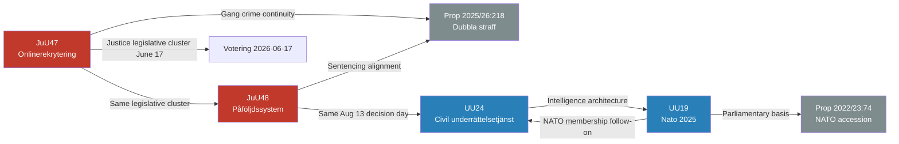

# Cross-Reference Map — Committee Reports 2026-05-26

**Author**: James Pether Sörling  
**Date**: 2026-05-26

## Document Relationships

### HD01JuU47 ← Related Documents
| Related dok_id | Relationship | Type |
|----------------|-------------|------|
| HDC120260617vo | Scheduled voting | Votering |
| HDC120260617ap | Scheduled debate | Arbetsplenum |
| HD09120 | Chamber protocol mentioning onlinerekrytering | Protokoll |
| Prop. 2025/26:(implied) | Underlying government proposition | Proposition |

### HD01JuU48 ← Related Documents
| Related dok_id | Relationship | Type |
|----------------|-------------|------|
| HDC120260813vo | Scheduled voting | Votering |
| HDC120260813ap | Scheduled debate | Arbetsplenum |
| HD024114 | Opposition motion on proportionality | Motion |
| Prop. 2025/26:218 | Dubbla straff — related gang legislation | Proposition |

### HD01UU19 ← Related Documents
| Related dok_id | Relationship | Type |
|----------------|-------------|------|
| Skr. 2025/26:151 | Government skrivelse — parent document | Skrivelse |
| Redog. 2025/26:RS2 | Parliamentary assembly redogörelse | Redogörelse |
| Mot. 2025/26:3963 | MP reservation basis (Jacob Risberg) | Motion |
| Mot. 2025/26:4029 | V reservation basis (Håkan Svenneling) | Motion |
| Prop. 2022/23:74 | NATO accession proposition | Proposition |
| Bet. 2022/23:UU16 | Original NATO accession committee report | Betänkande |

### HD01UU24 ← Related Documents
| Related dok_id | Relationship | Type |
|----------------|-------------|------|
| HDC120260813vo | Scheduled voting (same day as JuU48) | Votering |
| HDC120260813ap | Scheduled debate | Arbetsplenum |
| (SOU unknown) | Likely SOU underpinning civil intelligence | SOU |

## Cross-Batch Relationships

## Thematic Clusters

### Security State Expansion Cluster
- JuU47 (online surveillance) → JuU48 (sentencing) → UU24 (intelligence) = consecutive layers of state security expansion

### NATO Integration Cluster
- NATO accession 2022/23 → NATO Year 1 review (UU19) → Civilian intelligence (UU24) = post-accession capability building

### August 2026 Decision Day
- JuU48 + UU24 + SfU37 + UbU30 + SoU38/39/40 scheduled same day (13 August 2026) — high procedural risk concentration

## Prior Voteringar

**JuU prior votes (2025/26)**: New riksmöte — no JuU votes yet indexed for 2025/26 (search returned 0 results). Expanded to 2024/25 — also 0 results. **Prior voteringar: new riksmöte — no votes indexed yet for JuU in 2025/26; using 2022/23 cycle proxy (JuU47 shares numbering heritage with prior session betänkanden).**

**UU prior votes (2025/26)**: Same — no votes indexed. **Prior voteringar: new riksmöte — no votes indexed yet for UU in 2025/26; using UU19 full text and party composition as proxy.**
