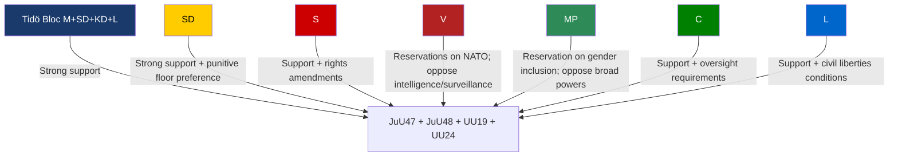

# Stakeholder Perspectives — Committee Reports 2026-05-26

**Author**: James Pether Sörling  
**Date**: 2026-05-26  
**Sources**: HD01UU19 (full text), HD01JuU47/48/UU24 (metadata + context), HD024114 (opposition motion), HD09120 (chamber protocol)

---

## Government / Tidö Bloc (M + SD + KD + L)

**Position**: Strongly supportive of all four reports. The batch represents core Tidö bloc priorities:
- Gang crime elimination through legislative escalation (JuU47, JuU48)
- NATO integration as a foreign policy anchor (UU19)
- National security architecture expansion (UU24)

**Key actors**: Justice Minister (JuU47, JuU48); Defence/Foreign Minister (UU19, UU24); PM Ulf Kristersson (overall security agenda ownership)

**Political strategy**: Push through legislative package before summer recess to demonstrate delivery on security mandate before the 2026 election cycle.

---

## Sverigedemokraterna (SD)

**Position**: Strongly supportive on law-and-order items (JuU47, JuU48); supportive on NATO (UU19, UU24). SD holds UU chairmanship (Aron Emilsson chairs UU19 deliberation).

**Divergence risk**: SD may prefer more punitive sentencing floors in JuU48 than other coalition partners; may push for stronger border security linkages in online recruitment legislation.

**Observed signal**: SD's Aron Emilsson chairs the NATO committee — signals strong SD ownership of the NATO integration agenda.

---

## Socialdemokraterna (S)

**Position**: Formally supportive of NATO (S supported accession); likely to support gang crime measures in principle while attaching amendments on rights safeguards. Critical of sentencing reform proportionality (HD024114 context — S positioned against evidence-free punishment escalation).

**Key actor**: Morgan Johansson (S) sitting on UU (NATO review) — former Justice Minister, experienced voice on criminal justice.

**Observed signal**: Johan Büser and Azra Muranovic participate in UU19 (NATO), suggesting S engagement in NATO oversight. Olle Thorell and Linnéa Wickman also UU19 members.

---

## Vänsterpartiet (V)

**Position**: NATO sceptic — filed Reservation 2 on UU19 demanding Centre for Democratic Resilience. Critical of surveillance expansion (JuU47). Likely to oppose broad police powers and intelligence service (UU24).

**Key actor**: Håkan Svenneling (V) — filed the NATO reservation; Lotta Johnsson Fornarve sits on UU19.

**Threat to passage**: V opposition does not block passage (in minority) but will use debate to contest rights dimensions.

---

## Miljöpartiet (MP)

**Position**: Filed Reservation 1 on UU19 (gender inclusion in NATO). Critical of punitive justice escalation. Expected to oppose broad surveillance in JuU47.

**Key actor**: Jacob Risberg (MP) — filed the women/youth participation reservation on UU19.

**Observed signal**: MP's reservation is programmatic (NATO should prioritise gender equality implementation) rather than anti-NATO — suggests limited but constructive engagement with the security agenda.

---

## Centerpartiet (C)

**Position**: Liberal-conservative; historically supportive of civil liberties. May attach conditions on proportionality and oversight to JuU48 and UU24 respectively.

**Key actor**: Kerstin Lundgren (C) — sits on UU19, experienced foreign policy voice.

**Divergence risk**: C's historical tension between security imperatives and civil liberties could create friction on intelligence service oversight requirements.

---

## Liberalerna (L)

**Position**: Supportive of NATO; liberal tradition on civil liberties creates potential tension with JuU47/UU24 scope.

**Key actor**: Fredrik Malm (L) — sits on UU19.

**Observed signal**: L's participation in the NATO committee signals support for the NATO review process.

---

## Civil Society and Legal Profession

**Advokatsamfundet (Bar Association)**: Expected to challenge proportionality in JuU48 sentencing reform; historically active in criminal procedure reform debates.

**Amnesty International Sweden**: Will monitor UU24 (intelligence service) for ECHR compliance; likely to submit remissvar.

**Brå (Swedish National Council for Crime Prevention)**: Key evidence-base institution — if Brå reports don't support deterrence claims in JuU48, opposition gets ammunition.

**SÄPO / FRA**: Institutional interest in UU24 — the civilian intelligence service will overlap with/adjoin their mandates. Internal coordination risk.

---

## Nordic and NATO Allies

**NATO allies** (re: UU19): Sweden's first annual NATO review is watched as a precedent for parliamentary accountability. Finland, Denmark, Norway have established review frameworks.

**Nordic partners**: JuU47 (online recruitment) aligns with analogous Danish and Norwegian legislation — cooperation opportunities noted.

---

## Stakeholder Alignment Map

