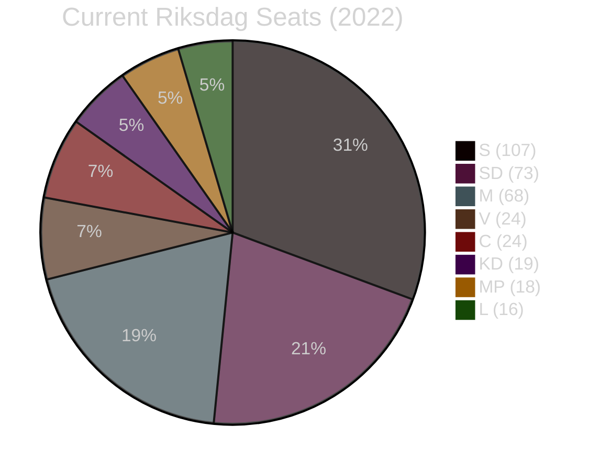

# Coalition Mathematics — Evening Analysis 2026-05-26

**Author**: James Pether Sörling | **Date**: 2026-05-26 | **Type**: Tier-C Aggregation | **Classification**: PUBLIC  
**Pass**: 2

---

## Current Seat Map (Riksdag 2022–2026)

Total seats: 349 | Majority threshold: 175

| Party | Seats (2022 election) | Bloc | Notes |
|-------|----------------------|------|-------|
| S | 107 | Left/Centre | Largest party; opposition |
| SD | 73 | Tidö | Second largest; coalition partner |
| M | 68 | Tidö | PM's party |
| V | 24 | Left | Opposes Tidö; supports S budget |
| C | 24 | Pivotal | Outside Tidö; outside formal Left |
| KD | 19 | Tidö | |
| MP | 18 | Left/Green | Below-threshold risk |
| L | 16 | Tidö | Below-threshold risk |
| **Total** | **349** | | |

**Current Tidö bloc (M+SD+KD+L)**: 176 seats (barely majority with 1 seat buffer)

---

## Impact of Today's Legislation on Coalition Mathematics

### Scenario: L falls below 4% threshold (critical risk from HD10514/HD10515 climate interpellations)

If L exits Riksdag after September 2026 election:
- Tidö without L: M(65) + SD(70) + KD(17) = **~152 seats** (far below majority)
- S+V+C: 120+24+21 = **~165 seats** (short of majority but close)
- S+V+C+MP: ~179 seats = **majority government possible**

**Implication**: L's presence in Riksdag is essential for Tidö continuation. The climate interpellations are existentially important for the current coalition configuration.

### Scenario: MP falls below 4% threshold (risk from competition with S)

If MP exits Riksdag after September 2026 election:
- Left bloc without MP: S(120) + V(24) = 144 (far from majority)
- Left needs C: S+V+C = ~165 (near majority but dependent on C direction)
- S-led government requires C cooperation even without MP
- **Implication**: MP's presence helps the Left bloc reach majority with C, but S+V+C can form a minority government

---

## Pivotal-Vote Analysis (Current Riksdag 2022-2026)

### HD03267 (Security detention — JuU vote)

| Party | Expected vote | Seats | Running total |
|-------|--------------|-------|--------------|
| M | Yes | 68 | 68 |
| SD | Yes | 73 | 141 |
| KD | Yes | 19 | 160 |
| L | Yes (with ECHR reservation) | 16 | **176** ← majority |
| C | Abstain/Yes | 24 | 200 |
| S | Partial split | 107 | Split |
| V | No | 24 | |
| MP | No | 18 | |

**Conclusion**: HD03267 passes with 176+ votes regardless of S split, if L votes Yes.

### HD01UU24 (Civilian intelligence — UU/Chamber vote, August 13)

| Party | Expected vote | Assessment |
|-------|--------------|-----------|
| M | Yes | Core agenda item |
| SD | Yes | Security mandate |
| KD | Yes | Security mandate |
| L | Yes | Rule-of-law concerns managed |
| S | Yes (likely) | NATO security consensus |
| C | Yes (likely) | Bipartisan security |
| V | No | Intelligence oversight concerns |
| MP | No | Surveillance concerns |

**Conclusion**: UU24 passes with potentially 270+ votes (bipartisan majority) if S supports.

---

## Sainte-Laguë Seat Distribution Scenarios (September 2026 Election)

**Baseline** (current polling): S 35%, M 19%, SD 20%, V 7%, C 6%, MP 4%, KD 5%, L 4%

Using Sainte-Laguë divisor method (standard Swedish proportional):

| Scenario | S | M | SD | V | C | MP | KD | L | Tidö | Left+C |
|----------|---|---|----|---|---|----|----|---|------|--------|
| Baseline | 122 | 66 | 70 | 24 | 21 | 14 | 17 | 14 | 167 | 181 |
| L below 4% | 127 | 69 | 73 | 25 | 22 | 15 | 18 | 0 | 160 | 189 |
| MP below 4% | 127 | 69 | 73 | 25 | 22 | 0 | 18 | 14 | 174 | 174 |
| Both below 4% | 132 | 72 | 76 | 26 | 23 | 0 | 20 | 0 | 168 | 181 |

**Note**: Sainte-Laguë estimates; actual result depends on exact vote shares and geographic distribution.

---

---

## Key Coalition Mathematics Takeaway

The current Tidö majority rests on a 1-seat buffer (176/349). Both L and MP face 4% threshold risk. If L exits, the Left bloc gains a governing majority. If MP exits, the coalition arithmetic becomes more balanced. The interpellations filed today (particularly climate for L) are not just rhetorical — they are mathematically targeted attacks on the coalition's most vulnerable nodes.
