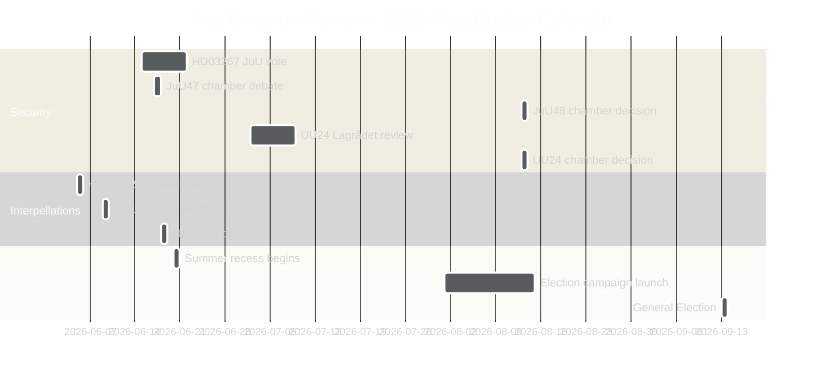

# Cross-Reference Map — Evening Analysis 2026-05-26

**Author**: James Pether Sörling | **Date**: 2026-05-26 | **Type**: Tier-C Aggregation | **Classification**: PUBLIC  
**Pass**: 2

---

## Tier-C Sibling-Folder Citations

This evening analysis aggregates the following sibling folders for 2026-05-26:

| Sibling folder | Path | Analysis date | Artifacts present |
|---------------|------|--------------|------------------|
| Propositions | analysis/daily/2026-05-26/propositions/ | 2026-05-26 | 29+ files |
| Motions | analysis/daily/2026-05-26/motions/ | 2026-05-26 | 29+ files |
| Committee Reports | analysis/daily/2026-05-26/committee-reports/ | 2026-05-26 | 35+ files |
| Interpellations | analysis/daily/2026-05-26/interpellations/ | 2026-05-26 | 28 files |

**Cross-reference files in siblings used in this aggregation**:
- `propositions/synthesis-summary.md` — 5 proposition clusters; ACH analysis of electoral vs operational drivers
- `propositions/intelligence-assessment.md` — 6 KIJs on passage probability, ECHR challenge, S splitting
- `motions/synthesis-summary.md` — MP constitutional challenge via committee motions
- `committee-reports/synthesis-summary.md` — 4 security architecture reports; Cold War comparison
- `committee-reports/intelligence-assessment.md` — 4 KJs: security state expansion, August risk cluster, opposition vectors, civilian intel delay
- `interpellations/executive-brief.md` — S+MP coordinated 7-interpellation campaign; climate target accountability

---

## Policy Clusters

### Cluster A — Security State Expansion (L3/L2+ documents)

**Documents**: HD03267, HD03265, HD01JuU47, HD01JuU48, HD01UU24, HD024192 (opposition)

**Legislative chain**:
```
HD03267 (security detention) → JuU committee → Chamber vote [June 2026]
                              ↑ HD024192 (MP opposition motion — filed same day)
HD01JuU47 (online recruitment policing) → JuU committee → Chamber debate June 17
HD01JuU48 (sentencing reform) → JuU committee → Chamber decision August 13
HD01UU24 (civilian intelligence) → UU committee → Lagrådet July → Chamber August 13
```

**Coordinated-activity pattern**: The four JuU/UU committee reports (JuU47, JuU48, UU19, UU24) were all registered 2026-05-24 to 2026-05-25, indicating a coordinated committee schedule designed to compress deliberation time before summer recess.

**Cross-type connection**: HD024192 (motion opposing HD03267 children's detention) creates a parliamentary record that the government was warned of ECHR risk before passage — this will be cited in any post-implementation ECHR challenge.

---

### Cluster B — Digital State Infrastructure

**Documents**: HD03250 (e-ID), HD03261 (Skatteverket folkbokföring), HD024191 (MP motion on GDPR safeguards)

**Legislative chain**:
```
HD03261 (Skatteverket expanded powers) → SkU committee → Chamber vote
         ↑ HD024191 (MP motion demanding GDPR safeguards — filed same day)
HD03250 (e-ID framework) → TU/JuU committee → Chamber vote
         [Linked to eIDAS 2.0 EU regulation deadline]
```

**Cross-type connection**: HD024191 (motion) creates the same GDPR pre-warning record for HD03261 that HD024192 creates for HD03267. Pattern: MP uses committee motions to establish constitutional challenge standing while lacking parliamentary numbers to amend.

---

### Cluster C — Opposition Accountability Campaign

**Documents**: HD10514, HD10515, HD10510, HD10509 (climate), HD10512 (shelters), HD10513 (sjukersättning), HD10511 (inequality)

**Coordinated-activity pattern**: All 7 interpellations filed 2026-05-26 (same day). Answer deadlines clustered June 5-18, creating a continuous accountability news cycle for the final pre-recess period.

**Cross-type connection**: Climate interpellations (HD10514/HD10515) connect to proposition cluster B — the government's folkbokföring reforms show digital investment appetite, but climate instruments (Styrmedelsutredningen) are delayed. Opposition uses this contrast.

---

### Cluster D — NATO/EU International Alignment

**Documents**: HD03254 (NATO defence integration), HD01UU19 (NATO activities review), HD03248, HD03249 (EU partnerships)

**Legislative chain**:
```
HD03254 (NATO defence integration) → Försvarsutskott → Chamber vote
HD01UU19 (NATO activities 2025 review) → UU committee → Parliamentary note (lägger till handlingarna)
HD03248+HD03249 (EU ratifications) → UU committee → Chamber vote
```

**Cross-type connection**: UU19 (committee report reviewing NATO activities) contextualises HD03254 (proposition deepening NATO integration). The report provides the parliamentary evaluation framework that the proposition builds on.

---

## Legislative Timeline Convergence Map



---

## Coordinated-Activity Patterns Summary

| Pattern | Evidence | Significance |
|---------|----------|-------------|
| Coordinated committee registration (JuU47/48, UU19/24 all May 24-25) | Document registration dates | Deliberate schedule compression before summer |
| Same-day opposition motions (HD024192/HD024191) filed to counter HD03267/HD03261 | Filing dates 2026-05-22 | MP pre-positioning for ECHR/GDPR challenge standing |
| 7 same-day interpellations from S+MP | Filing date 2026-05-26 | Coordinated pre-recess accountability campaign |
| August 13 chamber cluster (JuU48+UU24+SfU37+UbU30) | Scheduling data | Deliberate low-scrutiny scheduling of most controversial legislation |
