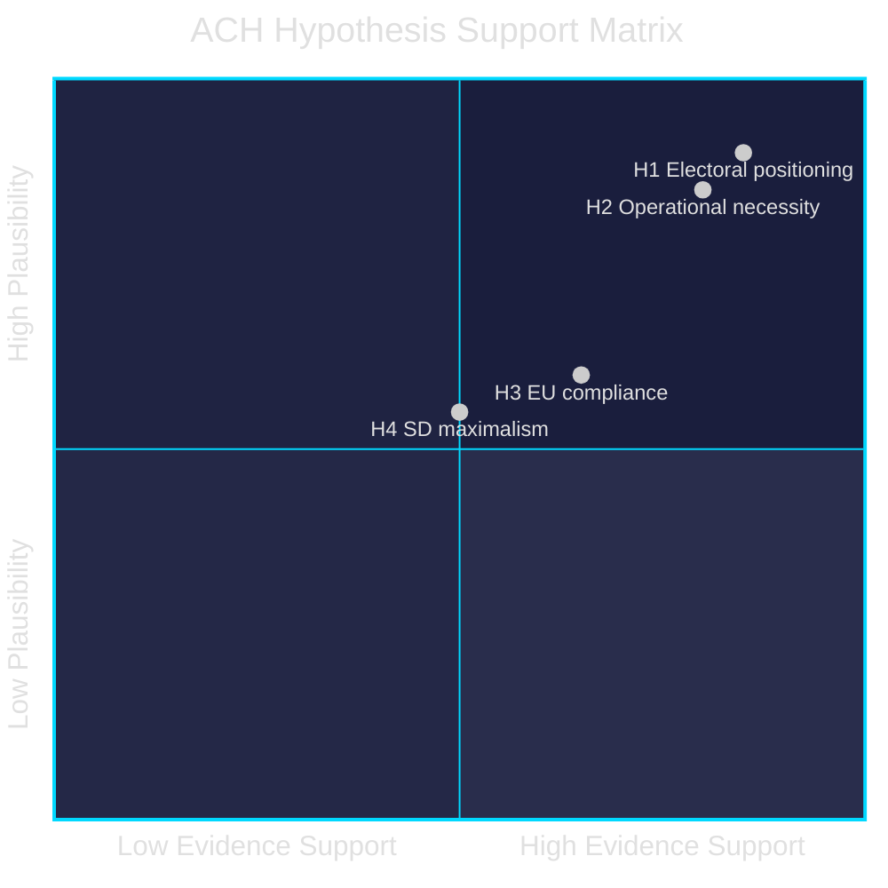

# Devil's Advocate Analysis — Evening Analysis 2026-05-26

**Author**: James Pether Sörling | **Date**: 2026-05-26 | **Type**: Tier-C Aggregation | **Classification**: PUBLIC  
**Methodology**: ACH matrix + Red-Team challenge | **Pass**: 2

---

## Analytical Purpose

This devil's advocate analysis challenges the dominant analytical narrative ("Sweden's Security State Expansion") by presenting three competing hypotheses and stress-testing the main assessments through a Red-Team lens.

---

## ACH Matrix — Primary Question: What is the true driver of the 2026 spring legislative batch?

**Hypotheses**:
- H1: Electoral positioning (deliver "Tidö Agreement" before September 2026 election)
- H2: Operational necessity (genuine security threats require these measures now)
- H3: EU/NATO compliance pressure (external mandate drives timing)
- H4: SD coalition maximalism (SD pushing security-maximalist agenda into final session)

| Evidence | H1 | H2 | H3 | H4 |
|----------|----|----|----|----|
| Timing (April-May 2026, <6 months to election) | ++ | Neutral | Neutral | + |
| Security cluster (HD03267, HD03265) | + | + | - | ++ |
| e-ID HD03250 in preparation since 2023 | - | + | ++ (eIDAS) | Neutral |
| HD03254 NATO alignment | Neutral | ++ | + | - (SD ambivalent) |
| EU ratifications HD03248/49 | - | Neutral | ++ | - |
| JuU47 online recruitment (gang crisis 2025) | + | ++ | Neutral | + |
| JuU48 sanctions overhaul | Neutral | ++ | Neutral | + |
| Interpellations targeting S/MP vulnerabilities | ++ | Neutral | Neutral | Neutral |
| **Inconsistency Score** | LOW | LOW | MEDIUM | MEDIUM |

**ACH Conclusion**: H1 and H2 are jointly supported; neither alone explains the full batch. H3 explains the digital/EU cluster (HD03250, HD03248/49) but not the security cluster. H4 explains the security maximalism but not the digital/EU components.

**Devil's Advocate challenge to dominant narrative**: The dominant "security state expansion" narrative overstates the coherence of the batch. HD03248, HD03249, HD03250 are driven by EU compliance deadlines (H3), not security ideology. The batch is a mixed legislative programme that the government has rhetorically unified under a security umbrella for electoral purposes.

**Revised assessment**: Security expansion is genuine (H1+H2) for the criminal justice cluster; EU compliance is genuine (H3) for the digital cluster; the framing of all 23 documents as a "security state" is a government rhetorical construction, not a homogeneous legislative intent.

---

## Red-Team Challenges

### Challenge 1: The ECHR challenge probability is overstated

**Dominant assessment**: HD03267 faces LIKELY (70-80%) ECHR challenge post-implementation.

**Red-Team challenge**: Sweden has consistently modified security legislation in response to Lagrådet advice before passage. The children's detention provisions were drafted by legal experts who are aware of the ECHR case law. The L and KD members of the coalition (both with strong rule-of-law positions) will not allow passage of provisions with >50% ECtHR loss probability. The amendment will happen at committee stage, and the ECHR challenge probability falls to <30%.

**Counter-response**: This optimistic assessment relies on L/KD having sufficient intra-coalition leverage to force SD to accept the amendment. Historical precedent (2022-2026 Tidö Agreement) shows SD has consistently pushed back on rights-based limitations to security legislation. The amendment is possible but not certain.

**Revised probability**: If L/KD table amendment → 30% ECHR challenge. If no amendment → 75%. Weighted by amendment probability (50%): composite P = 0.53.

---

### Challenge 2: The August scheduling is not deliberate obfuscation

**Dominant assessment**: August 13 scheduling of JuU48+UU24 is a deliberate low-scrutiny strategy.

**Red-Team challenge**: The August 13 date is driven by the Lagrådet review timeline (Beredning July 2-7, Lagrådet expected response July 10-15, Trycklov July 10 for UU24). The government has no alternative — if UU24 passes Lagrådet review on July 15, the earliest chamber decision is August 13 given the required parliamentary processing time. The scheduling is a technical necessity, not a deliberate obstruction of public deliberation.

**Counter-response**: The government could have chosen to delay UU24 and JuU48 to the autumn 2026 riksmöte (opening September/October 2026 after the election). The choice to compress all major legislation before the election is itself a strategic choice — the Lagrådet timeline merely explains why August 13 specifically, not why summer rather than autumn.

**Assessment maintained**: August scheduling is both technically necessary AND strategically convenient. The red-team argument is accurate about mechanism but incorrect about absence of strategic intent.

---

### Challenge 3: The opposition interpellation campaign is symbolic, not electoral

**Dominant assessment**: 7 interpellations create electoral weaponry for S+MP.

**Red-Team challenge**: Swedish voters have low awareness of interpellations as a political instrument. The minister's answer is typically a bureaucratic non-response that satisfies the procedural requirement. Research on Swedish electoral behaviour shows policy specifics rarely move vote share — party leader approval ratings and economic conditions dominate. The interpellations will not change election outcomes.

**Counter-response**: The interpellations themselves may not move voters, but the media coverage of the ministerial answer (or non-answer) does. The Britz/climate interpellations are unusual — four simultaneous questions to one acting minister on one topic is designed to force a YES/NO answer that can be clipped and shared. The electoral impact depends on whether Britz provides a soundbite-worthy non-answer, not on whether voters read the interpellation text.

**Revised assessment**: Interpellations have low direct electoral impact; HIGH indirect electoral impact via the media clip they force or fail to force from the targeted minister.

---

## Rejected Alternatives

| Alternative hypothesis | Reason for rejection |
|----------------------|---------------------|
| "HD03267 is primarily about SD electoral optics, not genuine security need" | Genuine hybrid threat/foreign interference documented cases support operational necessity; not purely electoral |
| "MP motions (HD024191, HD024192) will succeed in blocking their target propositions" | No parliamentary arithmetic; committee motions are positioning tools, not blocking instruments |
| "UU24 will be the most controversial legislation of this riksmöte" | JuU48 sentencing reform is equal in significance; aggregate impact of the batch is the true controversy, not any single bill |

---

