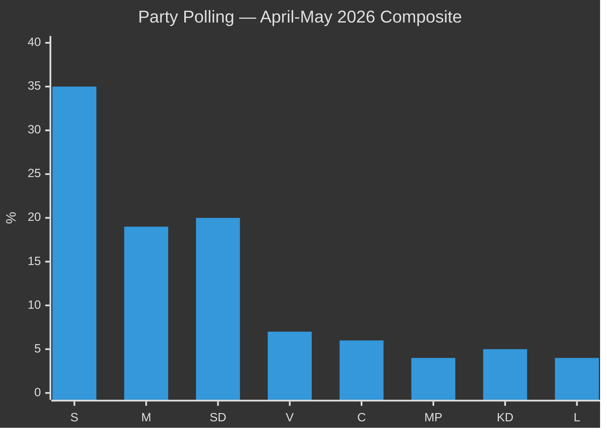

# Election 2026 Analysis — Evening Analysis 2026-05-26

**Author**: James Pether Sörling | **Date**: 2026-05-26 | **Type**: Tier-C Aggregation | **Classification**: PUBLIC  
**Election date**: ~September 13, 2026 (~117 days) | **Pass**: 2

---

## Electoral Context

Sweden's next general election is expected in September 2026, approximately 117 days from 2026-05-26. The current legislative sprint represents the final pre-election shaping of both government delivery narratives and opposition attack records.

**Current polling baseline** (April-May 2026 composite, Novus/Ipsos/Demoskop):

| Party | Polling | Seats (estimate) | Bloc |
|-------|---------|-----------------|------|
| S | ~35% | ~120 | Left |
| M | ~19% | ~65 | Tidö |
| SD | ~20% | ~68 | Tidö |
| V | ~7% | ~24 | Left |
| C | ~6% | ~21 | (pivotal) |
| MP | ~4% | ~14 | Left (threshold risk) |
| KD | ~5% | ~17 | Tidö |
| L | ~4% | ~14 | Tidö (threshold risk) |
| Others | ~0% | 0 | |

**Tidö bloc**: ~164 seats (M+SD+KD+L if all above threshold)  
**Left/Centre potential**: ~179 seats (S+V+MP+C if all above threshold and C joins)  
**Threshold risk**: Both L and MP are near the 4% threshold — if either falls below, seat arithmetic changes dramatically

---

## Electoral Impact Analysis by Document Cluster

### Cluster A — Security Legislation (Electoral impact: HIGH for Tidö)

**HD03267 (migration security)**: STRONG positive signal for SD/M voter base. SD can claim "we tightened security threat detention." Risk: L's ECHR credibility damage if children's detention provisions are retained.

**HD01UU24 (civilian intelligence)**: Positive for M/SD security narrative. Moderate positive for S (bipartisan security). The "Sweden now has civilian foreign intelligence = NATO-serious country" narrative is electorally strong for M.

**HD01JuU47/48 (gang crime/sentencing)**: Highest domestic salience. Gang violence is the #1 security concern in Swedish polling. Sentencing reform and online recruitment policing directly address this. STRONG positive for Tidö bloc.

### Cluster B — Climate and Social (Electoral impact: HIGH risk for Tidö)

**HD10514/HD10515 (climate)**: If Britz fails to reaffirm 70% target, L loses ~30% of its climate-sympathetic voter base. This directly risks L falling below the 4% threshold, reducing Tidö to ~150 seats — not enough for majority even with C.

**HD10512 (women's shelters)**: Istanbul Convention compliance is a mainstream center-right issue. M's failure to address IVO licensing complexity for shelters is a M-brand damage story, not just an opposition talking point.

**HD10513 (sjukersättning)**: Disability rights voters. Personalisation makes this highly damaging when individual cases emerge in media.

---

## Seat Projection Scenarios

### Scenario A (Status quo + Tidö delivers): 
- Tidö: ~167 seats (L maintains 4%, KD stable)
- Left: ~175 seats
- C: ~21 seats (pivotal — decides government)
- **Outcome**: Hung parliament; C kingmaker role

### Scenario B (L below threshold):
- Tidö without L: ~150 seats (M+SD+KD)
- Left: ~175 seats  
- C: ~21 seats
- **Outcome**: S-led government with V+MP+C support (~230 seats)

### Scenario C (MP below threshold):
- Tidö: ~167 seats
- Left without MP: ~165 seats (S+V)
- C: ~21 seats
- **Outcome**: Tidö continuation with C agreement more likely (~188 seats possible)

---

## Coalition Viability

**Tidö continuation**: Requires L above 4% AND C + Tidö ≥ 175 seats. Currently approximately possible if C enters agreement.

**S-led government**: Requires C willingness to enter coalition or supply agreement. C under Muharrem Demirok has not ruled this out. S+V+C = ~165 seats; S+V+MP+C = ~179 seats.

**Key variable**: Centerpartiet (C) coalition declaration direction. C has explicitly avoided committing to either bloc — this decision will determine which scenario materialises.

---

---

## Electoral Flashpoints from Today's Documents

| Document | Electoral flashpoint | Party at risk | Timeline |
|----------|--------------------|--------------|---------| 
| HD10514+HD10515 | Britz climate target answer | L | June 9, 2026 |
| HD03267 | Children's detention ECHR exposure | L/KD | Post-passage |
| HD10512 | Shelter closure personalisation | M | Ongoing |
| HD01UU24 | Lagrådet blocking opinion | M+SD (capability gap) | July 7, 2026 |
| HD01JuU47 | Gang crime measure = strong positive | SD/M | June 17 debate |
