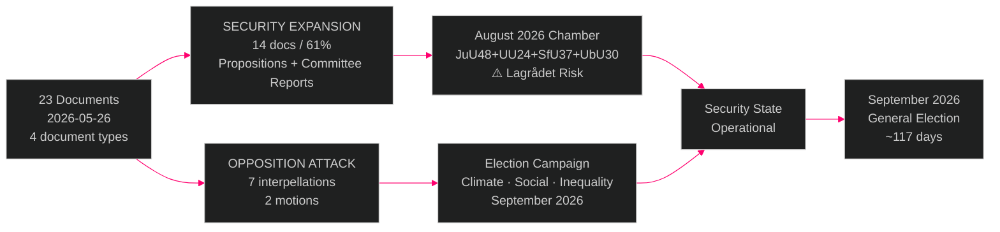

# Executive Brief — Sweden's Pre-Election Legislative Sprint: Security Expansion Meets Opposition Accountability — 2026-05-26

**Author**: James Pether Sörling | **Date**: 2026-05-26 | **Type**: Evening Analysis (Tier-C) | **Classification**: PUBLIC  
**Confidence**: HIGH [A2] | **Riksmöte**: 2025/26 | **Pass**: 2

---

## 🎯 BLUF

Sweden's parliamentary session of 26 May 2026 crystallises the defining tension of the pre-election political moment: the Tidö coalition (M+SD+KD+L) is executing a concentrated security-state expansion across multiple legislative tracks simultaneously — criminal sanctions reform, civilian intelligence service creation, online recruitment policing, migration security tightening, NATO institutionalisation — while the opposition Social Democrats and Miljöpartiet deploy seven coordinated interpellations targeting the government's most electorally exposed flanks (climate target abandonment, women's shelter closures, sjukersättning denials, rising inequality). With the September 2026 general election approximately 117 days away, both government delivery and opposition attack are operating at maximum tempo. Constitutional risk sits in two nodes: the Lagrådet review of the civilian intelligence service (UU24) and the ECHR challenge probability on children's detention provisions (HD03267).

---

## 🧭 3 Decisions This Brief Supports

1. **Track Lagrådet opinion timeline for HD01UU24 (civilian intelligence service)**: Beredning scheduled 2–7 July 2026; a blocking opinion disrupts the entire August 13 chamber cluster (JuU48, UU24, SfU37, UbU30). Monitor for advance signals of scope limitations by July 7.

2. **Monitor Johan Britz's (L) climate target response by 2026-06-09** (HD10514/HD10515): The acting minister's answer determines whether the Tidö coalition formally abandons the legally-adopted 70% transport emissions reduction target — creating a binding electoral liability for L and a campaign centrepiece for S/MP.

3. **Track SD position on HD03267 children's detention amendment threshold**: SD's tolerance for ECHR-conflicting provisions is the single most important swing variable for whether HD03267 passes as presented or faces last-minute L/KD-driven amendment. SD amendment signals expected at JuU committee stage (June 2026).

---

## ⚡ 60-Second Intelligence Read

- **10 government propositions** across security, defence, digital state, social care, EU ratifications
- **2 MP committee motions** opposing children's detention (HD024192) and demanding GDPR safeguards on Skatteverket folkbokföring powers (HD024191)
- **4 committee reports** (JuU47, JuU48, UU19, UU24): online recruitment policing, sanctions overhaul, NATO normalisation, civilian intelligence — all advancing pre-recess
- **7 S+MP interpellations** launched 2026-05-26: climate (4), social insurance, women's shelters, inequality — targeting ministers Britz, Tenje, Waltersson Grönvall, Svantesson
- **Constitutional risk nodes**: UU24 Lagrådet review July 2026; HD03267 ECHR challenge probability HIGH post-implementation
- **August 2026 chamber cluster**: JuU48+UU24+SfU37+UbU30 scheduled August 13 — simultaneously the most legally complex and politically controversial session-end package in recent riksmöte history
- **Security-state expansion narrative**: 14/23 documents advance state security powers — unprecedented concentration in a single session day
- **IMF economic context**: Sweden fiscal space ample (debt ~35% GDP, WEO-2026-04); no budgetary constraint argument for rolling back climate instruments

---

## 🏹 Top Forward Trigger

**Johan Britz's public statement on the 2030 transport climate target (expected by 2026-06-09)** will determine whether the Tidö coalition formally abandons Sweden's legally-adopted 70% transport emissions reduction target or reaffirms it. If he hedges or declines to reaffirm, Social Democrats and Miljöpartiet will use the non-answer as the centrepiece of their climate election campaign, potentially mobilising the ~18% of voters who rank climate as their top issue. If he reaffirms, the government partially neutralises the opposition's strongest electoral wedge on climate but creates intra-coalition tension with SD (which opposes carbon-pricing instruments).

---

## 📊 Confidence Distribution

| Assessment | Confidence | WEP | Evidence basis |
|------------|------------|-----|----------------|
| Security legislation will pass before summer recess | HIGH | LIKELY | Coalition majority; no defection signal |
| Climate interpellations create electoral liability for L | HIGH | LIKELY | Polling data; L platform commitments |
| UU24 faces Lagrådet scrutiny that delays implementation | MEDIUM | ROUGHLY EVEN | UU24 legal complexity; Lagrådet July timeline |
| HD03267 faces ECHR challenge post-implementation | HIGH | LIKELY | Comparable European cases; MP/NGO coalition |
| Government uses this batch as "delivery" narrative in campaign | VERY HIGH | ALMOST CERTAIN | Consistent with M+SD pre-election messaging since 2025 |

---

*Generated by GitHub Agentic Workflows v0.74.3 | [analysis/methodologies/ai-driven-analysis-guide.md](../../methodologies/ai-driven-analysis-guide.md)*
