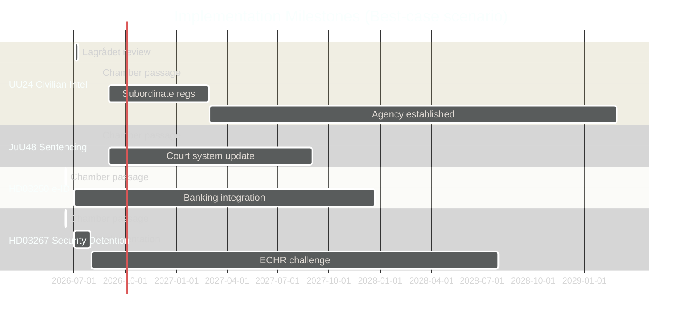

# Implementation Feasibility — Evening Analysis 2026-05-26

**Author**: James Pether Sörling | **Date**: 2026-05-26 | **Type**: Tier-C Aggregation | **Classification**: PUBLIC  
**Pass**: 2

---

## Implementation Feasibility Framework

Assessment dimensions: (1) Budget/fiscal, (2) IT/technical, (3) Regulatory/legal, (4) Workforce/capacity, (5) Inter-agency coordination  
Scale: LOW / MEDIUM / HIGH / CRITICAL delivery risk

---

## High-Priority Implementation Assessments

### HD01UU24 — Civilian Intelligence Service

| Dimension | Risk | Evidence |
|-----------|------|---------|
| Budget | MEDIUM | New agency requires dedicated appropriation; BoA process needed before 2027 |
| IT/Technical | HIGH | Human intelligence systems, secure comms, foreign liaison infrastructure — 3-5 year build |
| Regulatory/Legal | CRITICAL | Subordinate legislation (förordning) required before operational; Lagrådet constraints may require scope limitation |
| Workforce | HIGH | Senior intelligence analysts, foreign language experts, liaison officers — competitive global market |
| Inter-agency | HIGH | FRA (signals), SÄPO (domestic), Försvarsmakten (military) coordination protocols required |
| **Overall** | **HIGH delivery risk** | Capability gap of 3-5 years before full operational status regardless of passage date |

**Statskontoret note**: No current Statskontoret review of UU24 implementation is tracked. Recommend Statskontoret commissioning for implementation planning after passage.

---

### HD01JuU48 — Sentencing System Reform

| Dimension | Risk | Evidence |
|-----------|------|---------|
| Budget | MEDIUM | Sentencing reform affects correctional system, Kriminalvården budget |
| IT/Technical | HIGH | Domstolsverket case management systems require updates; every court application affected |
| Regulatory/Legal | HIGH | Every prosecutor, judge, probation officer requires updated guidance documents |
| Workforce | MEDIUM | Training burden across entire justice system |
| Inter-agency | HIGH | Åklagarmyndigheten, Domstolsverket, Kriminalvården, Polisen all affected simultaneously |
| **Overall** | **HIGH delivery risk** | Most complex implementation in justice system in decades |

---

### HD03250 — e-ID Digital Identity

| Dimension | Risk | Evidence |
|-----------|------|---------|
| Budget | LOW | Implementation costs modest; BankID transition creates business process savings |
| IT/Technical | HIGH | National identity database integration; banking sector legacy systems (BankID); Skatteverket IT |
| Regulatory/Legal | MEDIUM | eIDAS 2.0 alignment manageable with existing GDPR framework |
| Workforce | LOW | Existing Skatteverket and banking digital teams adequate |
| Inter-agency | HIGH | Bankgirot, BankID consortium, Skatteverket, Polisen (identity verification) all must coordinate |
| **Overall** | **MEDIUM-HIGH delivery risk** | Implementation delay of 12-18 months beyond passage date is probable (banking lobby + IT complexity) |

---

### HD03267 — Security Detention (Foreign Nationals/Security Threats)

| Dimension | Risk | Evidence |
|-----------|------|---------|
| Budget | LOW | Uses existing Migrationsverket and detention facility infrastructure |
| IT/Technical | LOW | No major new IT systems required |
| Regulatory/Legal | CRITICAL | ECHR challenge probability HIGH; implementation may be suspended pending ECtHR ruling |
| Workforce | LOW | Existing Migrationsverket and SÄPO capacity adequate |
| Inter-agency | MEDIUM | SÄPO (threat assessment), Migrationsverket (detention), Polisen (enforcement) |
| **Overall** | **MEDIUM delivery risk technically; CRITICAL legal risk** | Will implement quickly but face immediate legal challenge |

---

### HD10512/HD10513 — Women's Shelters and Sjukersättning (Government Accountability)

These are not legislation but interpellations — but they reveal implementation failures in existing legislation:

**Women's shelters** (IVO licensing): Implementation failure is documented. Root cause is IVO's application of stricter licensing criteria that smaller volunteer-run organisations cannot meet. This requires an administrative guidance change (IVO föreskrift) not new legislation. Risk of further closures: MEDIUM-HIGH.

**Sjukersättning** (Försäkringskassan): Implementation failure in applying the criteria for medically verified zero work capacity. FK has applied increasingly narrow criteria since 2022. A government directive letter to FK is the minimum remediation — no legislation required. Risk of continued denials without government action: HIGH.

---

## Implementation Timeline Overview

---

## Delivery Risk Summary

| Legislation | Overall risk | Biggest blocker | Expected operational date |
|------------|-------------|-----------------|--------------------------|
| UU24 Civilian intel | HIGH | Subordinate regs + inter-agency | 2028 at earliest |
| JuU48 Sentencing | HIGH | Court IT systems | 2027-2028 |
| HD03250 e-ID | MEDIUM-HIGH | BankID transition | 2027 (delayed from plan) |
| HD03267 Security detention | LOW technical / CRITICAL legal | ECHR challenge | Operational but challenged |
| JuU47 Online recruitment | MEDIUM | Police tech adaptation | 2026 Q4 (reasonably fast) |
