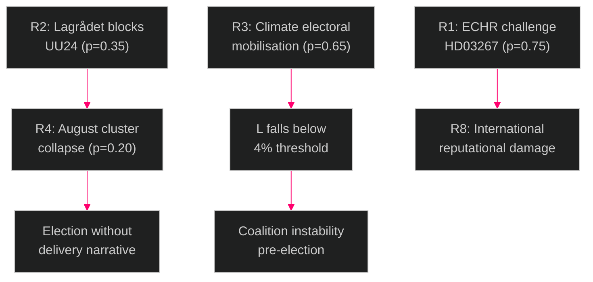

# Risk Assessment — Evening Analysis 2026-05-26

**Author**: James Pether Sörling | **Date**: 2026-05-26 | **Type**: Tier-C Aggregation | **Classification**: PUBLIC  
**Methodology**: [political-risk-methodology.md](../../methodologies/political-risk-methodology.md) | **Pass**: 2

---

## 5-Dimension Risk Register

Dimensions: (1) Constitutional/Legal, (2) Political/Electoral, (3) Implementation, (4) International/Reputational, (5) Cascade/Systemic  
Scores: Likelihood × Impact = Risk Score (1-5 each, max 25)

---

## Risk Register

### R1 — ECHR/CRC Challenge to HD03267 (Children's Detention)

| Dimension | Assessment |
|-----------|------------|
| **Category** | Constitutional/Legal |
| **Likelihood** | 4/5 — LIKELY. Comparable European cases (Netherlands, Germany) show high ECtHR challenge rate on child detention provisions |
| **Impact** | 4/5 — HIGH. ECtHR finding against Sweden damages rule-of-law credibility; forced legislative amendment; potential damages |
| **Risk Score** | **16/25 HIGH** |
| **Trigger**: MP/NGO coalition legal challenge filed within 12 months of implementation | |
| **Mitigation**: L/KD push for pre-passage amendment removing children from detention scope |
| **Residual risk if mitigated**: 8/25 — MEDIUM |

### R2 — Lagrådet Blocking Opinion on HD01UU24 (Civilian Intelligence Service)

| Dimension | Assessment |
|-----------|------------|
| **Category** | Constitutional/Legal |
| **Likelihood** | 3/5 — ROUGHLY EVEN. Civilian foreign intelligence creates novel legal questions under RF and the Secrecy Act |
| **Impact** | 5/5 — CRITICAL. Blocks August 13 chamber cluster; delays civilian intelligence capability by 12+ months; political embarrassment for government |
| **Risk Score** | **15/25 HIGH** |
| **Trigger**: Lagrådet opinion issued ~July 7, 2026 | |
| **Mitigation**: Government pre-submits refined scope documentation to Lagrådet; narrows mandate to avoid RF conflict |

### R3 — Climate Electoral Mobilisation Against L (HD10514/HD10515)

| Dimension | Assessment |
|-----------|------------|
| **Category** | Political/Electoral |
| **Likelihood** | 4/5 — LIKELY. Johan Britz has not reaffirmed 70% target; four simultaneous interpellations = media amplification |
| **Impact** | 4/5 — HIGH. L currently polling near 4% threshold; climate erosion could cause below-threshold result, destabilising coalition |
| **Risk Score** | **16/25 HIGH** |
| **Trigger**: Britz fails to reaffirm 70% target by June 9, 2026 | |
| **Mitigation**: Britz public reaffirmation of 70% transport target before debate |

### R4 — August Cluster Legislative Collapse

| Dimension | Assessment |
|-----------|------------|
| **Category** | Cascade/Systemic |
| **Likelihood** | 2/5 — UNLIKELY but plausible. Requires both R2 (Lagrådet on UU24) AND separate constitutional issue on JuU48 |
| **Impact** | 5/5 — CRITICAL. Government loses end-of-term narrative; four major bills delayed; election fought without security delivery |
| **Risk Score** | **10/25 MEDIUM** |
| **Trigger**: Lagrådet blocks UU24 AND JuU48 faces proportionality objections simultaneously |

### R5 — SD/L Intra-Coalition Fracture on HD03267

| Dimension | Assessment |
|-----------|------------|
| **Category** | Political/Electoral |
| **Likelihood** | 3/5 — ROUGHLY EVEN. L has previously accepted ECHR risk in migration policy; but children's detention is politically visible |
| **Impact** | 3/5 — MEDIUM. Amendment creates SD vs L public disagreement; media amplification pre-election |
| **Risk Score** | **9/25 MEDIUM** |
| **Trigger**: European court ruling in a parallel case published before JuU committee vote |

### R6 — Women's Shelter Closures Escalation (HD10512)

| Dimension | Assessment |
|-----------|------------|
| **Category** | Implementation |
| **Likelihood** | 3/5 — ROUGHLY EVEN. IVO licensing complexity is real and documented |
| **Impact** | 3/5 — MEDIUM. Istanbul Convention compliance; individual harm stories; media amplification |
| **Risk Score** | **9/25 MEDIUM** |
| **Trigger**: New shelter closure announcement by licensed Swedish women's shelter |

### R7 — e-ID Implementation Failure (HD03250)

| Dimension | Assessment |
|-----------|------------|
| **Category** | Implementation |
| **Likelihood** | 3/5 — ROUGHLY EVEN. Banking/Bankid lobby and Skatteverket IT complexity make delay likely |
| **Impact** | 3/5 — MEDIUM. eIDAS compliance deadline; business process disruption; EU credibility |
| **Risk Score** | **9/25 MEDIUM** |

### R8 — International Reputational Damage from Security State Narrative

| Dimension | Assessment |
|-----------|------------|
| **Category** | International/Reputational |
| **Likelihood** | 2/5 — UNLIKELY in short term (before election) |
| **Impact** | 4/5 — HIGH if materialises — EU human rights oversight; Amnesty/HRW reporting; Nordic Council criticism |
| **Risk Score** | **8/25 MEDIUM** |

---

## Cascading Risk Chain

---

## Posterior Probability Summary

| Risk | Baseline P | Mitigated P | Key mitigation |
|------|-----------|-------------|----------------|
| R1 ECHR challenge | 0.75 | 0.30 | Pre-passage amendment on children's detention |
| R2 Lagrådet block UU24 | 0.35 | 0.20 | Narrowed scope submission to Lagrådet |
| R3 Climate mobilisation | 0.65 | 0.25 | Britz 70% target reaffirmation before June 9 |
| R4 August collapse | 0.20 | 0.08 | Conditional on R2 not materialising |
| R5 SD/L fracture | 0.35 | 0.20 | L accepts ECHR exposure as policy choice |

---

## 🔄 Pass-2 Self-Audit
- [x] 8 risks identified across 5 dimensions
- [x] L×I scores assigned with evidence
- [x] Cascading chain mapped
- [x] Posterior probabilities with mitigations
- [x] Mermaid diagram present
