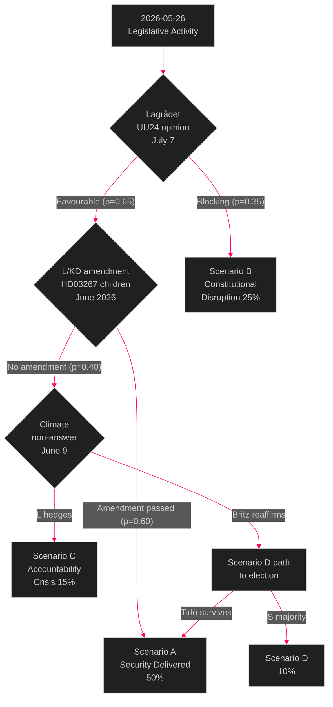

# Scenario Analysis — Evening Analysis 2026-05-26

**Author**: James Pether Sörling | **Date**: 2026-05-26 | **Type**: Tier-C Aggregation | **Classification**: PUBLIC  
**Pass**: 2

---

## Analytical Frame

The cross-type legislative activity on 2026-05-26 creates a branching decision tree with the September 2026 general election as the terminal node. Three primary scenarios depend on two pivotal variables: (1) whether constitutional chokepoints materialise (Lagrådet on UU24; ECHR challenge on HD03267), and (2) whether the opposition accountability campaign succeeds in shifting electoral narratives.

---

## Scenario A — "Security Delivered" (Probability: 50%)

**Description**: All security legislation passes before or by August 2026 summer recess. Lagrådet approves UU24 with minor scope limitations. HD03267 passes with L/KD amendment removing children from detention scope (neutralising ECHR challenge). JuU48 sentencing reform passes August 13. The Tidö coalition enters September 2026 campaign with a complete security delivery record: civilian intelligence, sanctions reform, online recruitment policing, migration security, NATO integration.

**Leading indicators**:
- Lagrådet issues favourable UU24 opinion by July 7, 2026 ← **watch by this date**
- L/KD table children's detention amendment at JuU committee stage (June 2026)
- No S defection from defence consensus on HD03254

**Electoral consequence**: M+SD campaign on security delivery; L recovers climate credibility via Britz reaffirmation; Tidö bloc enters election with narrow but defensible lead in security-credibility polling.

**Probability**: 50% | **WEP**: ROUGHLY EVEN

---

## Scenario B — "Constitutional Disruption" (Probability: 25%)

**Description**: Lagrådet issues a partially blocking opinion on UU24 in July, requiring significant redrafting. The August 13 chamber cluster is rescheduled; the civilian intelligence service is not established before the election. HD03267 children's detention provisions remain unchanged (SD resists amendment), triggering a formal MP/NGO ECHR challenge immediately after implementation. Johan Britz hedges on the 70% climate target, triggering sustained L electoral pressure. The Tidö coalition enters September 2026 campaign with its flagship legislation incomplete and its climate credibility in question.

**Leading indicators**:
- Lagrådet opinion contains "väsentlig brist" language on UU24 surveillance scope
- No L/KD amendment filed at JuU committee stage by June 15
- Britz non-answer to HD10514/HD10515 by June 9

**Electoral consequence**: Government narrative shifts from "delivered" to "underway" — less powerful but defensible. Opposition gains traction on climate and constitutional overreach.

**Probability**: 25% | **WEP**: UNLIKELY

---

## Scenario C — "Pre-Election Accountability Crisis" (Probability: 15%)

**Description**: Multiple simultaneous adverse developments: Lagrådet blocks UU24 on constitutional grounds; S exploits climate interpellation non-answers to create a sustained "L abandoned climate" narrative; a new women's shelter closure story personalises HD10512 beyond the government's control; sjukersättning denial cases become a media campaign. L falls below 4% threshold in a pre-election poll, creating an existential coalition threat. Government scrambles to demonstrate responsiveness but the legislative calendar prevents rapid recovery.

**Leading indicators**:
- L polling falls below 4% in July/August 2026 survey
- Lagrådet issues "hinder mot lagstiftning" on UU24
- Women's shelter story picked up by Expressen or SVT with individual case

**Electoral consequence**: Tidö bloc under pressure; S+V+MP+C potentially forming alternative majority scenario if L exits Riksdag.

**Probability**: 15% | **WEP**: UNLIKELY

---

## Scenario D — "Opposition Legislative Landslide" (Probability: 10%)

**Description**: A low-probability but high-impact scenario in which the September 2026 election produces an S+V+MP+C majority, ending the Tidö government. Under this scenario, much of the security legislation is reviewed: HD03267 provisions are suspended pending ECHR review; UU24 civilian intelligence oversight is redesigned; climate instruments are rapidly reinstated. The legislative legacy of the 2025/26 riksmöte is partially unwound.

**Leading indicators**:
- Aggregated S+V+MP+C polling consistently above 175 seats in August 2026
- C definitively declares willingness to enter government with S (key enabling condition)

**Electoral consequence**: Full policy reversal possible on HD03267 and climate; UU24 oversight redesigned; sentencing reform (JuU48) likely retained under S (bipartisan criminal justice reform appetite).

**Probability**: 10% | **WEP**: UNLIKELY

---

## Probability Summary

| Scenario | Probability | WEP | Key trigger |
|----------|-------------|-----|------------|
| A — Security Delivered | 50% | ROUGHLY EVEN | Lagrådet approves UU24 |
| B — Constitutional Disruption | 25% | UNLIKELY | Lagrådet partial block |
| C — Accountability Crisis | 15% | UNLIKELY | L below 4% threshold |
| D — Opposition Landslide | 10% | UNLIKELY | S+V+MP+C majority |
| **Total** | **100%** | | |

---

