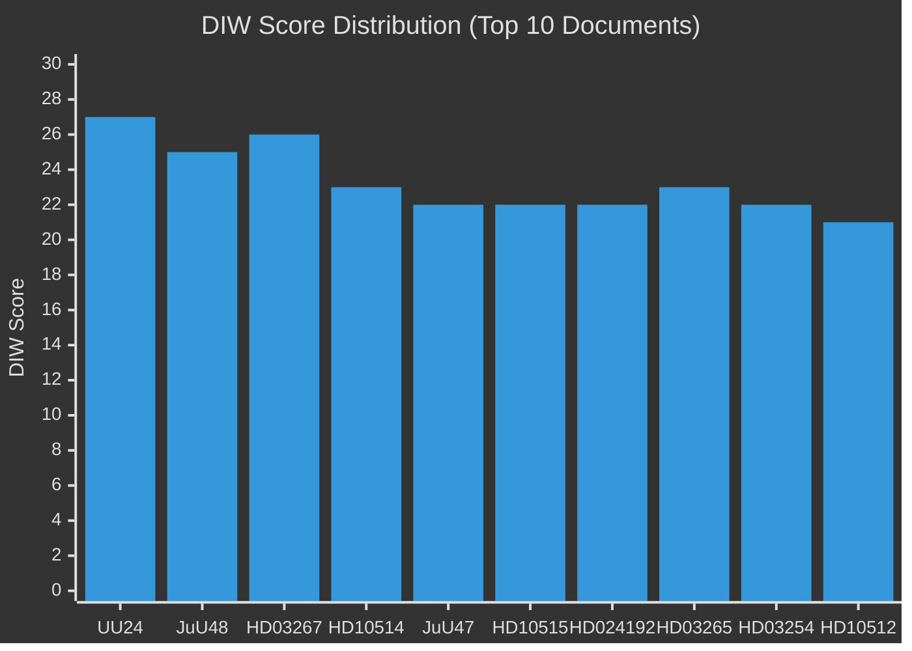

# Significance Scoring — Evening Analysis 2026-05-26

**Author**: James Pether Sörling | **Date**: 2026-05-26 | **Type**: Tier-C Aggregation | **Classification**: PUBLIC  
**Methodology**: DIW (Democratic Impact Weight) framework | **Pass**: 2

---

## DIW Framework Summary

DIW weighting assesses documents across three dimensions:
- **D** (Democratic Salience): Does this affect rights, electoral accountability, or democratic institutions?
- **I** (Implementation Impact): How significant is the practical change in policy/law?
- **W** (Window Urgency): Is there a time-sensitive decision, vote, or threshold?

Scale: L1 (Surface/Monitoring) → L2 (Strategic/Analysis) → L2+ (Priority/High-depth) → L3 (Intelligence-grade/Critical)

---

## Document Significance Matrix

### Committee Reports

| dok_id | Title (short) | D | I | W | DIW | Tier | Key driver |
|--------|---------------|---|---|---|-----|------|------------|
| HD01UU24 | Civilian intelligence service | 9 | 10 | 8 | **27** | **L3** | First civilian foreign intel capability; constitutional implications; Lagrådet risk |
| HD01JuU48 | Sentencing system reform | 8 | 10 | 7 | **25** | **L3** | Most comprehensive sanctions restructuring in decades; affects entire prosecution system |
| HD01JuU47 | Online recruitment policing | 7 | 7 | 8 | **22** | **L2+** | New digital surveillance powers; gang recruitment counter; debate June 17 |
| HD01UU19 | NATO activities 2025 review | 6 | 5 | 6 | **17** | **L2** | Historical first full-year NATO review; broad consensus; peripheral reservations |

### Propositions (aggregated from propositions/ sibling)

| dok_id | Title (short) | D | I | W | DIW | Tier |
|--------|---------------|---|---|---|-----|------|
| HD03267 | Security detention/migration | 9 | 8 | 9 | **26** | **L2+** |
| HD03265 | Security threats complement | 8 | 7 | 8 | **23** | **L2+** |
| HD03254 | NATO defence integration | 7 | 8 | 7 | **22** | **L2+** |
| HD03250 | e-ID digital identity | 7 | 8 | 6 | **21** | **L2+** |
| HD03261 | Skatteverket folkbokföring | 7 | 7 | 7 | **21** | **L2+** |
| HD03251 | Social care coordination | 6 | 7 | 6 | **19** | **L2** |
| HD03260 | Social/health supplement | 5 | 6 | 5 | **16** | **L2** |
| HD03248 | EU partnership (1) | 5 | 5 | 5 | **15** | **L2** |
| HD03249 | EU partnership (2) | 5 | 5 | 5 | **15** | **L2** |
| HD03255 | Supporting bill cluster | 4 | 5 | 4 | **13** | **L1** |

### Motions (aggregated from motions/ sibling)

| dok_id | Title (short) | D | I | W | DIW | Tier |
|--------|---------------|---|---|---|-----|------|
| HD024192 | Children's detention opposition | 8 | 6 | 8 | **22** | **L2+** |
| HD024191 | Skatteverket GDPR safeguards | 7 | 5 | 7 | **19** | **L2** |

### Interpellations (aggregated from interpellations/ sibling)

| dok_id | Title (short) | D | I | W | DIW | Tier |
|--------|---------------|---|---|---|-----|------|
| HD10514 | Climate target (Westlund→Britz) | 8 | 6 | 9 | **23** | **L2+** |
| HD10515 | Climate audit (Guteland→Britz) | 8 | 6 | 8 | **22** | **L2+** |
| HD10512 | Women's shelters (→Waltersson G) | 8 | 5 | 8 | **21** | **L2+** |
| HD10513 | Sjukersättning failures (→Tenje) | 7 | 5 | 8 | **20** | **L2** |
| HD10510 | Climate emissions (MP→Britz) | 7 | 5 | 7 | **19** | **L2** |
| HD10509 | Climate/Styrmedel (MP→Britz) | 7 | 5 | 7 | **19** | **L2** |
| HD10511 | Inequality/RF1:2 (→Svantesson) | 7 | 4 | 6 | **17** | **L2** |

---

## Sensitivity Analysis

**High sensitivity**: HD01UU24 DIW drops from 27→20 if Lagrådet opinion is favourable (W score falls from 8→4). Still L3 due to historical significance of creating a civilian intelligence capability.

**High sensitivity**: HD03267 DIW drops from 26→18 if SD accepts L/KD children's detention amendment (I score falls from 8→5). Moves from L2+ to L2, changing coverage depth recommendation.

**Low sensitivity**: Interpellations (HD10514–HD10511) DIW estimates are stable ±2 points regardless of ministerial response posture. The electoral salience (D) does not change based on government response.

---

---

## Cross-Type Priority Tier Summary

| Tier | Documents | Count |
|------|-----------|-------|
| L3 Intelligence-grade | UU24, JuU48 | 2 |
| L2+ Priority | HD03267, HD03265, HD03254, HD03250, HD03261, JuU47, HD024192, HD10514, HD10515, HD10512 | 10 |
| L2 Strategic | All others | 11 |
| L1 Surface | HD03255 | 1 |
