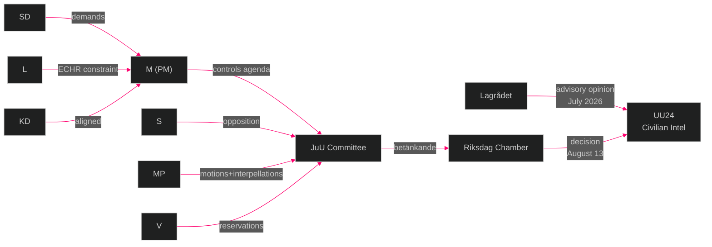

# Stakeholder Perspectives — Evening Analysis 2026-05-26

**Author**: James Pether Sörling | **Date**: 2026-05-26 | **Type**: Tier-C Aggregation | **Classification**: PUBLIC  
**Pass**: 2

---

## 6-Lens Stakeholder Matrix

Lenses: (1) Position/Stated, (2) Interests/Actual, (3) Capacity/Power, (4) Relationships/Alliances, (5) Vulnerabilities, (6) Likely Actions

---

## Primary Stakeholders

### Tidö Coalition — Moderaterna (M)

| Lens | Assessment |
|------|------------|
| Position | Prime ministerial party; sponsor of security agenda; HD03267+HD03254+HD03250 reflect core M priorities |
| Interests | Electoral delivery narrative: "We fixed Sweden's security" for September 2026 campaign |
| Capacity | Largest coalition party; controls PMO and most ministries; JuU majority member |
| Relationships | SD: dependency; L: ECHR constraint; KD: aligned on security; S: defence consensus |
| Vulnerabilities | SD can make demands on HD03267 extremity; L can stall on ECHR grounds; policy failure stories (sjukersättning, shelters) stick to M ministers |
| Likely Actions | Push all 10 propositions through before summer recess; use August scheduling to minimise JuU48+UU24 scrutiny |

### Tidö Coalition — Sverigedemokraterna (SD)

| Lens | Assessment |
|------|------------|
| Position | HD03267 migration security = core SD demand; NATO ambivalence on collective defence; supports gang crime legislation |
| Interests | Maximise migration restriction; demonstrate SD legislative impact; attract security-prioritising voters |
| Capacity | Pivotal coalition partner with 73 seats; can demand amendments or threaten non-cooperation |
| Relationships | M: coalition management; L/KD: ECHR tension on HD03267; V: adversarial |
| Vulnerabilities | NATO integration (HD03254) creates tension with SD's historically Eurosceptic/NATO-sceptic elements; SD risks being seen as "too extreme" on children's detention |
| Likely Actions | Accept NATO proposition HD03254 reluctantly; push for maximum scope in HD03267; potentially accept children's detention amendment if M/KD demand it |

### Tidö Coalition — Liberalerna (L)

| Lens | Assessment |
|------|------------|
| Position | Supports security framework in principle; constitutional accountability mandate makes children's detention (HD03267) a liability |
| Interests | Survive September 2026 election above 4% threshold; maintain EU/ECHR credibility; climate position is core L voter identity |
| Capacity | 16 seats; below 4% polling creates existential vulnerability; Johan Britz (acting climate minister) controls HD10514/HD10515 interpellation response |
| Relationships | M: coalition dependency; SD: ECHR tension; KD: constitutional alignment; climate voters: critical constituency |
| Vulnerabilities | Climate interpellations (HD10514+HD10515) are existential liability; 4% threshold polling; HD03267 children's detention ECHR risk |
| Likely Actions | Britz reaffirms 70% climate target before June 9 (self-interest); L demands amendment on children's detention; votes for security package broadly |

### Social Democrats (S)

| Lens | Assessment |
|------|------------|
| Position | Defence consensus (NATO, HD03254); critical of migration maximalism (HD03267); welfare attack via interpellations (HD10512/HD10513/HD10511) |
| Interests | Win September 2026 election; rebuild as governing party; document Tidö failure on social care, climate, inequality |
| Capacity | Largest party (~35% polling); leads opposition; controls interpellation strategy |
| Relationships | V: left bloc alignment (fragile); MP: electoral competition in same space; S+V+MP need C+L votes for majority |
| Vulnerabilities | S must avoid "soft on security" perception while opposing HD03267 excesses; S's interpellations are effective positioning but lack legislative power |
| Likely Actions | Continue coordinated interpellation campaign; vote for HD03254 (NATO); oppose or abstain on HD03267 children's detention; use HD10512/HD10513 stories in campaign |

### Miljöpartiet (MP)

| Lens | Assessment |
|------|------------|
| Position | Filed HD024191+HD024192 motions AND HD10509+HD10510 climate interpellations; most active opposition actor on rights and climate |
| Interests | Re-enter Riksdag (currently outside); activate climate and rights voters; differentiate from S |
| Capacity | Currently outside Riksdag (4% threshold challenge); committee motions are positioning tools |
| Relationships | S: partial alliance; V: separate but parallel; Tidö: adversarial across all fronts |
| Vulnerabilities | Below 4% threshold risk; policy positions (rights + climate) are authentic but may not convert to votes without S polarisation |
| Likely Actions | Pursue ECHR/CRC challenge to HD03267 post-passage via NGO network; use climate interpellations as campaign material |

### Vänsterpartiet (V)

| Lens | Assessment |
|------|------------|
| Position | UU19 reservation (democratic resilience in NATO); supports Lagrådet review on all security measures; social care critic |
| Interests | Protect welfare state; oppose surveillance expansion; mobilise left-wing base |
| Capacity | ~7% polling; committee presence; can file reservations; cannot block |
| Relationships | S: parliamentary support role; MP: issue alignment on rights/climate; Tidö: full adversarial |
| Likely Actions | File reservations on JuU47, JuU48, UU24; KU referral request on HD03267; support sjukersättning interpellations |

### Lagrådet (Constitutional Review Body)

| Lens | Assessment |
|------|------------|
| Position | Independent constitutional scrutiny body; Beredning July 2-7, 2026 for UU24; review pending for HD03267 |
| Interests | Uphold constitutional integrity; maintain institutional authority |
| Capacity | Advisory only — but politically costly to override; blocking opinion on UU24 would force government retreat |
| Likely Actions | Issue detailed opinion on UU24 scope vs RF constraints; flag HD03267 ECHR concerns if submitted |

---

## Influence Network

