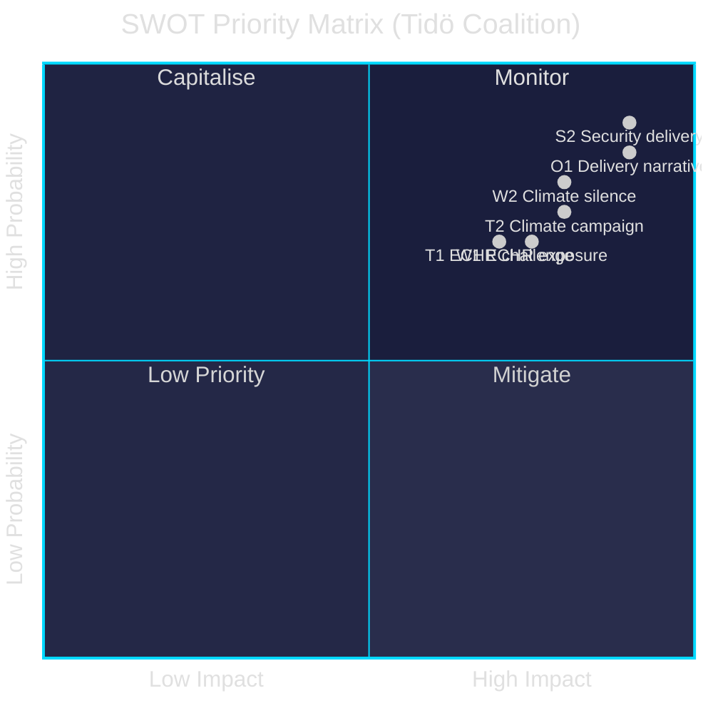

# SWOT Analysis — Evening Analysis 2026-05-26

**Author**: James Pether Sörling | **Date**: 2026-05-26 | **Type**: Tier-C Aggregation | **Classification**: PUBLIC  
**Methodology**: [political-swot-framework.md](../../methodologies/political-swot-framework.md) | **Pass**: 2

---

## SWOT Matrix — Tidö Coalition (Government) Position

### Strengths

| Strength | Evidence (dok_id) | Confidence |
|----------|-------------------|------------|
| **S1 — Legislative delivery volume**: 10 propositions + 4 committee reports advancing simultaneously demonstrates coalition discipline and agenda control | HD03248–HD03267, HD01JuU47/48, HD01UU19/24 | HIGH |
| **S2 — Security mandate fulfilment**: Security expansion aligns precisely with 2022 Tidö Agreement commitments — government can claim mandate delivery | HD03267, HD03254, HD01UU24, HD01JuU47/48 | VERY HIGH |
| **S3 — NATO normalisation**: NATO review (UU19) passes with broad consensus; NATO membership is no longer contested terrain — a resolved issue for M+SD+L+KD | HD01UU19 | HIGH |
| **S4 — Digital state infrastructure**: e-ID (HD03250) and Skatteverket reform (HD03261) lay long-term digital governance foundations that will outlast the current parliament | HD03250, HD03261 | MEDIUM |
| **S5 — August scheduling strategy**: Complex legislation (JuU48, UU24) scheduled for August when public deliberative pressure is minimised — tactically advantageous | HD01JuU48, HD01UU24 | HIGH |

### Weaknesses

| Weakness | Evidence (dok_id) | Confidence |
|----------|-------------------|------------|
| **W1 — ECHR constitutional exposure**: HD03267's children's detention provisions create a near-certain post-implementation ECHR challenge. Loss before ECtHR damages Swedish legal credibility | HD024192 (MP), ECHR Art.5+8 | HIGH |
| **W2 — Climate target abandonment signal**: Acting minister Britz has not reaffirmed the 70% transport target. Silence = electoral liability for L (climate-oriented voters) | HD10514, HD10515 | HIGH |
| **W3 — Women's shelter closures**: IVO licensing complexity causing shelter closures is an implementation failure the government cannot easily explain away — human rights optics (Istanbul Convention) | HD10512 | MEDIUM |
| **W4 — Sjukersättning access failures**: Medical cases denied disability benefits = highly sympathetic electoral failure stories; personalisation makes it resistant to statistical rebuttal | HD10513 | MEDIUM |
| **W5 — Lagrådet risk on UU24**: Civilian intelligence service faces July Lagrådet review — if blocking opinion issued, August chamber cluster disrupted and security narrative damaged | HD01UU24 | MEDIUM |

### Opportunities

| Opportunity | Evidence (dok_id) | Confidence |
|-------------|-------------------|------------|
| **O1 — "Delivery" electoral narrative**: 14 security-focused documents across 4 types provides a rich campaign evidence base for "we delivered on security" | All security documents | VERY HIGH |
| **O2 — S cooperation on defence**: S has historically backed NATO defence initiatives; HD03254 NATO defence integration may attract S support, broadening the coalition's legitimacy claim | HD03254 | HIGH |
| **O3 — EU ratification consensus**: HD03248+HD03249 EU partnership ratifications attract cross-party support including MP — demonstrates Sweden's EU commitment | HD03248, HD03249 | HIGH |
| **O4 — Gang crime public salience**: JuU47 online recruitment measure addresses the most viscerally felt public safety issue in Swedish politics (gang violence) — high electoral reward if passed quickly | HD01JuU47 | HIGH |
| **O5 — Pre-empt climate liability**: Britz can neutralise the four climate interpellations with a single clear reaffirmation of the 70% transport target before June 9 | HD10514, HD10515 | MEDIUM |

### Threats

| Threat | Evidence (dok_id) | Confidence |
|--------|-------------------|------------|
| **T1 — ECtHR ruling damages legal credibility**: Post-election, if Sweden is found to have implemented ECHR-incompatible children's detention, the legal legacy cost outweighs electoral benefit | HD03267, HD024192 | HIGH |
| **T2 — Climate campaign mobilisation**: S/MP have created a documented record of four simultaneous climate accountability questions — if Britz hedges, this becomes a campaign advertisement | HD10514, HD10515, HD10510, HD10509 | HIGH |
| **T3 — August scheduling vulnerability**: If UU24 Lagrådet opinion is negative AND JuU48 has constitutional objections, the August cluster collapses and the government loses its end-of-session narrative | HD01UU24, HD01JuU48 | MEDIUM |
| **T4 — SD/L intra-coalition tension**: SD pushes for maximum security powers; L has ECHR credibility concerns on HD03267 children's detention — if L demands amendment, SD may resist | HD03267 | MEDIUM |
| **T5 — Opposition "rights vs security" frame**: V+MP are constructing a "the government criminalises children and abandons climate" election narrative that activates left-liberal voters | HD024192, HD10514 | HIGH |

---

## TOWS Matrix (Strategic Responses)

| | **Strengths** | **Weaknesses** |
|---|---|---|
| **Opportunities** | **SO — Leverage**: Use O1+S2 to drive campaign messaging: "Tidö Agreement delivered — 14 security bills, civilian intelligence, NATO integration, criminal justice reform." | **WO — Convert**: Use O5 to convert W2 (climate silence) — Britz reaffirmation of 70% target neutralises four interpellations at once. |
| **Threats** | **ST — Defend**: Use S3 (NATO consensus) to signal S+M+L+KD security competence, minimising T2 (climate narrative) by pivoting to areas of consensus. | **WT — Mitigate**: W1+T1 (ECHR exposure) is the highest combined risk. Amendment on children's detention provisions by L/KD is the minimum mitigation — pre-emptive amendment better than ECtHR loss. |

---

## Cross-SWOT (Opposition S+MP perspective)

**Opposition Strengths**: Interpellation coordination creates multi-issue accountability record. MP's rights-based motions (HD024192) create durable constitutional challenge capacity.

**Opposition Weaknesses**: No parliamentary arithmetic to block security legislation. Must win the campaign narrative rather than the legislative vote.

**Opposition Opportunities**: T2+W2+W3+W4 are all documented electoral weapons ready for campaign phase.

**Opposition Threats**: S's defence consensus position prevents full-spectrum opposition to security legislation — must pick its battles carefully to avoid appearing soft on security.

---

