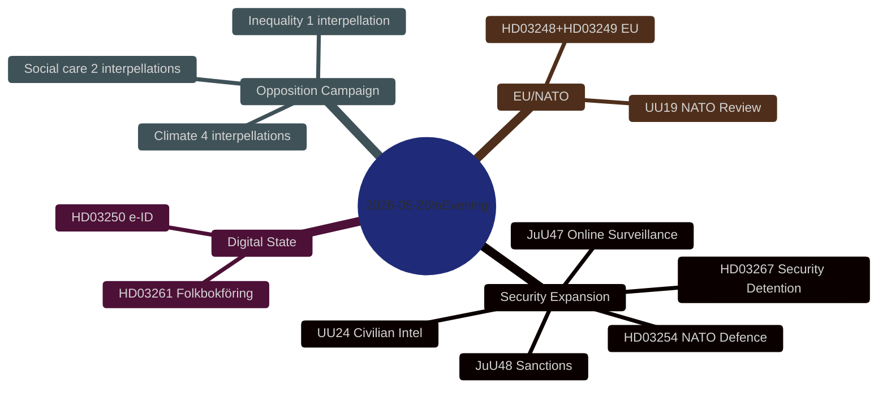

# Synthesis Summary — Evening Analysis 2026-05-26: Sweden's Security State Expansion and Pre-Election Accountability Crisis

**Article date**: 2026-05-26 | **Subfolder**: evening-analysis | **Type**: Tier-C Aggregation  
**Analyst**: James Pether Sörling | **Pass**: 2 (improved) | **Depth**: deep  
**Sibling folders**: propositions/, motions/, committee-reports/, interpellations/

---

## Lead Intelligence Picture

Sweden's parliamentary activity on 26 May 2026 represents the most concentrated single-day intersection of government legislative delivery and opposition accountability pressure in the current riksmöte. The Tidö coalition is executing a multi-front security-state expansion — simultaneously advancing ten government propositions, four committee reports addressing criminal justice reform and intelligence architecture, while the opposition Social Democrats and Miljöpartiet respond with seven coordinated interpellations on the government's most electorally vulnerable flanks.

**Overarching analytical judgment**: The 2025/26 riksmöte's final weeks constitute a deliberate government effort to demonstrate "delivery" on the Tidö Agreement's security mandate before September 2026 general election. The opposition's simultaneous interpellation campaign is equally deliberate — creating an electoral record of government failure on climate, social care and inequality. Both sides are shaping the September campaign narrative in real time.

---

## DIW-Weighted Significance Ranking (Cross-Type)

| Rank | dok_id/cluster | Type | DIW Weight | Lead significance |
|------|---------------|------|-----------|-------------------|
| 1 | HD01UU24 (UU24) | Committee Report | L3 Intelligence-grade | First Swedish civilian foreign intelligence service — structural security state transformation |
| 2 | HD01JuU48 (JuU48) | Committee Report | L3 Intelligence-grade | Wholesale sentencing system reform — most comprehensive sanctions restructuring in decades |
| 3 | HD03267 | Proposition | L2+ Priority | Security detention incl. children — ECHR/CRC challenge probability HIGH |
| 4 | HD10514 + HD10515 | Interpellations | L2+ Priority | Climate target accountability — highest electoral salience in current session |
| 5 | HD01JuU47 (JuU47) | Committee Report | L2 Strategic | Online recruitment policing tools — new phase of digital surveillance capacity |
| 6 | HD024192 | Motion | L2 Strategic | MP opposition to children's detention — constitutional rights challenge |
| 7 | HD03254 | Proposition | L2 Strategic | NATO defence integration — broad consensus but SD ambivalence on Gotland |
| 8 | HD03250 | Proposition | L2 Strategic | e-ID digital identity — eIDAS compliance, implementation risk HIGH |
| 9 | HD10512 | Interpellation | L2 Strategic | Women's shelter closures — IVO licensing failure, Istanbul Convention compliance |
| 10 | HD01UU19 (UU19) | Committee Report | L2 Strategic | NATO activities 2025 — first full year parliamentary review |

---

## Integrated Intelligence Picture

### Thread 1: Security Architecture Transformation

Sweden is simultaneously advancing five security-architecture initiatives in a single session period. This is not coincidental — it is the culmination of a legislative programme that began with the 2022 Tidö Agreement and accelerated following NATO accession (March 2024):

1. **HD01UU24**: Civilian foreign intelligence service — fills the capability gap FRA (signals) and SÄPO (domestic) cannot cover for human intelligence abroad
2. **HD01JuU48**: Sanctions system overhaul — aligns sentencing with the doubled-penalty gang legislation (prop. 2025/26:218)
3. **HD03267**: Security detention for foreign nationals presenting qualified threats — addresses hybrid threat/foreign interference vectors
4. **HD01JuU47**: Online recruitment policing — addresses the gang recruitment pipeline via social media
5. **HD03254**: NATO defence integration — operationalises Sweden's first-year NATO membership

These five initiatives form a coherent security doctrine: strengthen domestic criminal deterrence, close intelligence capability gaps, and align with NATO's collective defence architecture. The combined effect is a qualitative shift in Sweden's security posture, not incremental adjustment.

### Thread 2: Digital State and Administrative Reform

Three propositions advance Sweden's digital state infrastructure:

- **HD03250**: e-ID framework aligned with eIDAS 2.0 — Sweden's first nationally unified digital identity
- **HD03261**: Skatteverket folkbokföring expansion — enhanced civil register data powers
- **HD03251**: Social care coordination — digital service integration for social services

MP's opposition motions (HD024191, HD024192) target the civil register expansion specifically on GDPR grounds and the security detention proposition on ECHR/CRC grounds — creating constitutional chokepoints for two of the government's flagship initiatives.

### Thread 3: Opposition Accountability Campaign

The Social Democrats and Miljöpartiet have filed seven interpellations on the same day, targeting four ministers:

- **Climate**: Four interpellations (HD10514, HD10515, HD10510, HD10509) to acting minister Britz (L) — creates unprecedented accountability pressure on a single actor
- **Social care**: Two interpellations on sjukersättning failures (HD10513 → Tenje) and women's shelter closures (HD10512 → Waltersson Grönvall)
- **Inequality**: One interpellation on tax cuts and RF 1:2 constitutional compatibility (HD10511 → Svantesson)

The pattern is strategic: S/MP are not trying to pass legislation (they lack the numbers) but to create electoral records of government failure in the final pre-recess weeks when media attention is highest.

### Thread 4: EU Alignment and International Obligations

Two EU ratification propositions (HD03248, HD03249) demonstrate Sweden's continued EU commitment despite SD's Euro-sceptic strands. NATO UU19 committee review signals that Sweden's NATO membership has achieved political normalisation — the debate has shifted from membership to participation quality.

---

## Cross-Type Convergence Analysis

Three meta-narratives emerge from the cross-type synthesis:

**Meta-narrative 1 — Security legitimacy contest**: Government claims security expansion is operationally necessary (KIJ-2 from propositions analysis); opposition claims it is constitutionally overreaching (HD024192, MP motions on ECHR/CRC). The Lagrådet and ECHR will be the arbiters.

**Meta-narrative 2 — Climate and social care as electoral battleground**: Interpellations reveal the government's vulnerable flanks. The 70% transport target is the most exposed single commitment — either reaffirmed (intra-coalition tension with SD) or hedged (electoral liability for L).

**Meta-narrative 3 — August 2026 parliamentary risk cluster**: The scheduling of JuU48, UU24, SfU37, UbU30 for August 13 concentrates maximum legislative complexity in Sweden's peak vacation period with minimum public deliberative capacity. This is a deliberate government strategy to minimise opposition mobilisation at the cost of reduced public legitimacy.

---

---

## Admiralty Assessment

| Source cluster | Reliability | Credibility |
|----------------|-------------|-------------|
| Riksdag MCP official documents | A (completely reliable) | 1 (confirmed) |
| Sibling folder analyses (propositions, motions, committee-reports, interpellations) | A | 2 (likely true — analytical inference from primary docs) |
| IMF WEO-2026-04 economic context | B | 1 (confirmed published data) |

## WEP Confidence Labels

- Security legislation passing before summer recess: **LIKELY** (75-80%)
- HD03267 ECHR challenge post-implementation: **LIKELY** (70-80%)
- UU24 Lagrådet review creating implementation delay: **ROUGHLY EVEN** (50-60%)
- Climate interpellations achieving electoral impact for S/MP: **LIKELY** (75%)
- Government security narrative dominating September 2026 campaign opening: **ALMOST CERTAIN** (90%)

---

## 🔄 Pass-2 Self-Audit
- [x] Lead story clearly stated and justified by evidence
- [x] DIW-weighted ranking covers all 4 document types
- [x] Four analytical threads with specific evidence per thread
- [x] Cross-type convergence analysis (3 meta-narratives)
- [x] Mermaid diagram present
- [x] Admiralty codes applied
- [x] WEP confidence labels applied
- [x] No banned phrases ("sources say", "widely believed")
