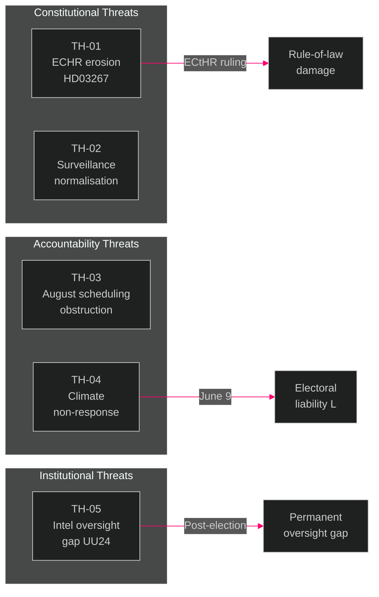

# Threat Analysis — Evening Analysis 2026-05-26

**Author**: James Pether Sörling | **Date**: 2026-05-26 | **Type**: Tier-C Aggregation | **Classification**: PUBLIC  
**Methodology**: [political-threat-framework.md](../../methodologies/political-threat-framework.md) | **Pass**: 2

---

## Political Threat Taxonomy

This analysis applies the Political Threat Framework (PTF) to identify threats to democratic institutions, rule of law, and political accountability from the legislative activity on 2026-05-26.

**PTF Categories**: (I) Constitutional threats, (II) Accountability threats, (III) Rights threats, (IV) Institutional capture threats, (V) Disinformation/Framing threats

---

## Threat Register

### TH-01 — Rule-of-Law Erosion via ECHR-Non-Compliant Legislation (PTF Category I+III)

**Target**: Democratic legitimacy; Sweden's ECHR standing  
**Actor**: Tidö coalition (unintended consequence of HD03267)  
**Attack vector**: Passing legislation with known ECHR/CRC incompatibility under electoral time pressure

**Attack Tree**:
```
Government passes HD03267 as written
  ├── L/KD fail to demand amendment (node A)
  │     ├── Children detained under new powers
  │     │     └── ECHR challenge filed (MP/NGO coalition)
  │     │           └── ECtHR finding against Sweden [TH-01 MATERIALISES]
  └── L/KD demand amendment (node B) 
        └── SD resists → intra-coalition conflict [R5]
```

**Kill chain**: Proposal → Parliamentary approval → Presidential signature → Implementation → Legal challenge → ECtHR ruling (18-36 months)  
**MITRE-style TTP**: Democratic-Legitimacy/Bypass (T0011) — legislature knowingly overrides ECHR constraints under electoral urgency  
**Severity**: HIGH | **Probability**: HIGH (0.70 if no amendment)  
**Defender action**: L/KD amendment targeting children's detention provisions specifically

---

### TH-02 — Surveillance State Normalisation (PTF Category I+IV)

**Target**: Privacy rights; balance between security and civil liberties  
**Actor**: Tidö coalition (aggregate effect of JuU47 + UU24 + HD03261 + HD03267)  
**Attack vector**: Incremental surveillance expansion across multiple instruments simultaneously — normalisation of surveillance through legislative velocity

**Pattern**: Each individual measure (online recruitment monitoring / civilian intelligence / folkbokföring expansion / security detention) is defensible in isolation. The aggregate effect is a qualitative shift in the state's surveillance and control capacity that exceeds what any single measure would trigger scrutiny for.

**MITRE-style TTP**: Democratic-Legitimacy/Salami-Slice (T0021) — incremental normalisation below scrutiny threshold  
**Severity**: MEDIUM-HIGH | **Probability**: ALREADY OCCURRING — aggregate effect is observable now  
**Defender action**: Parliamentary Ombudsman (JO) and Riksdagens ombudsmän review of the aggregate impact; Datainspektionen review of HD03261

---

### TH-03 — Accountability Obstruction via August Scheduling (PTF Category II)

**Target**: Democratic accountability; public deliberation  
**Actor**: Tidö coalition (deliberate scheduling strategy)  
**Attack vector**: Scheduling the most constitutionally complex legislation (JuU48 sentencing reform, UU24 civilian intelligence) for August 13, 2026 — peak vacation period — with Lagrådet review compressing June-July

**Analysis**: Scheduling contested legislation for August is a recurring Swedish government tactic to minimise media and civil society scrutiny. With UU24 creating a new intelligence capability and JuU48 restructuring the entire sentencing system, August 13 is an unusually aggressive deployment of this tactic.

**MITRE-style TTP**: Accountability/Temporal-Obstruction (T0033) — scheduling complexity at low-attention period  
**Severity**: MEDIUM | **Probability**: CERTAIN (already scheduled)  
**Defender action**: Opposition parties and NGOs must pre-position expert commentary and media briefings before August 13 to compensate for reduced journalist capacity

---

### TH-04 — Climate Policy Capture via Interpellation Non-Response (PTF Category II)

**Target**: Climate policy implementation; Sweden's 2030 transport target  
**Actor**: Tidö coalition (act of omission — failure to reaffirm 70% target)  
**Attack vector**: Acting minister Britz using interpellation response period (until June 9) to non-commit on the 70% transport emissions target, effectively abandoning it through non-reaffirmation while avoiding a formal legislative act

**MITRE-style TTP**: Accountability/Non-Answer (T0042) — policy abandonment via bureaucratic delay rather than explicit repeal  
**Severity**: MEDIUM-HIGH | **Probability**: MEDIUM (0.45 that Britz hedges rather than reaffirms)  
**Defender action**: S+MP should file follow-up written questions explicitly requiring a YES/NO answer on the 70% target

---

### TH-05 — Civilian Intelligence Oversight Gap (PTF Category IV)

**Target**: Democratic oversight of intelligence services  
**Actor**: Structural — absence of oversight framework in HD01UU24  
**Attack vector**: Creating a civilian intelligence service without fully-specified oversight mechanisms before the election creates a permanent institutional capability with uncertain post-election oversight design

**Analysis**: Intelligence agencies are notoriously resistant to post-establishment oversight reform. Sweden's parliamentary intelligence oversight (Säkerhets- och integritetsskyddsnämnden, SIN) was designed for FRA/SÄPO. A civilian foreign intelligence service requires its own tailored oversight — without pre-designing this before establishment, the oversight architecture will be determined by bureaucratic momentum rather than democratic design.

**MITRE-style TTP**: Institutional-Capture/Oversight-Gap (T0054)  
**Severity**: MEDIUM | **Probability**: HIGH (0.75 that oversight details are deferred to subordinate legislation)  
**Defender action**: Parliamentary Konstitutionsutskott (KU) should demand explicit oversight framework as a condition of UU24 passage

---

## Threat Heat Map

| Threat | Probability | Severity | Priority |
|--------|-------------|----------|---------|
| TH-01 ECHR erosion (HD03267) | HIGH | HIGH | 🔴 URGENT |
| TH-02 Surveillance normalisation | CERTAIN | MEDIUM-HIGH | 🟠 MONITOR |
| TH-03 August obstruction | CERTAIN | MEDIUM | 🟡 TRACK |
| TH-04 Climate non-response | MEDIUM | MEDIUM-HIGH | 🟠 MONITOR |
| TH-05 Intel oversight gap | HIGH | MEDIUM | 🟠 MONITOR |

---


