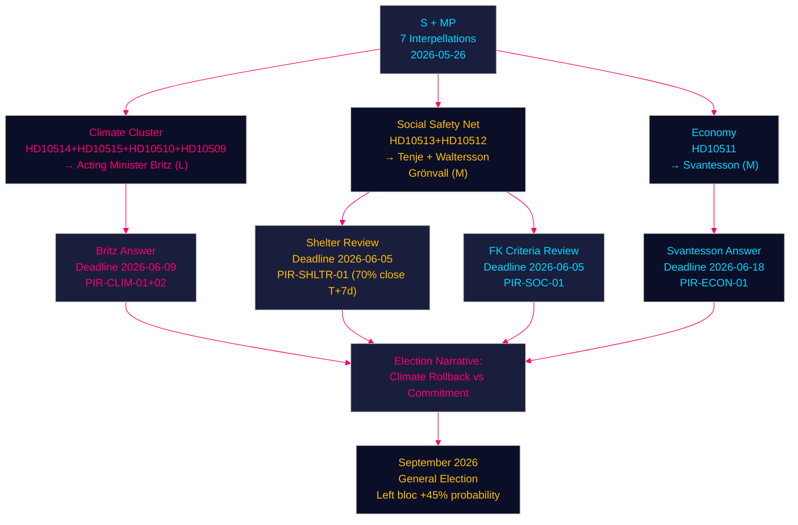

# Social Democrats Launch Pre-Recess Parliamentary Offensive — Climate, Shelters, Benefits and Inequality Under Fire — 2026-05-26

**Author**: James Pether Sörling | **Date**: 2026-05-26 | **Classification**: PUBLIC
**Confidence**: HIGH [B2] | **Riksmöte**: 2025/26

---

## 🎯 BLUF

The Social Democrats filed five coordinated interpellations on 2026-05-26, targeting four government ministers across climate, social insurance, women's welfare and economic inequality — the four most electorally exposed flanks of the Tidö coalition in the final session weeks before summer recess and the September 2026 general election. Acting climate minister Johan Britz (L) faces a dual-interpellation debut from two experienced S parliamentarians (Westlund, Guteland), who demand the government commit publicly to Sweden's legally-adopted 70% transport emissions reduction target for 2030 and explain why the Styrmedelsutredningen is delayed. Concurrently, S MPs target ministers Tenje (M), Waltersson Grönvall (M) and Svantesson (M) on sjukersättning access failures, women's shelter closures, and economic inequality. Miljöpartiet compounds the climate pressure with two further interpellations (HD10510, HD10509) to the same acting minister, creating an unprecedented four-interpellation climate accountability moment for a single acting minister on a single day.

## 🧭 3 Decisions This Brief Supports

1. **Monitor Johan Britz's climate answer (HD10514/HD10515, deadline 2026-06-09)**: The acting minister's response will determine whether the Tidö government is formally locked into the 70% transport target or has informally abandoned it — a critical data point for Sweden's climate trajectory heading into the 2026 election campaign.

2. **Track IVO shelter review (HD10512, deadline 2026-06-05)**: PIR-SHLTR-01 has 70% closure probability by T+7d — if Waltersson Grönvall announces an IVO licensing review before the interpellation debate, the government partially neutralises S's most humanly sympathetic attack vector.

3. **Assess Försäkringskassan response (HD10513, deadline 2026-06-05)**: The sjukersättning access failure is the clearest implementation failure signal in this batch — a ministerial letter to FK or inquiry directive would be low-cost and defensible; inaction risks electoral mobilisation of the disability rights community.

## ⚡ 60-Second Intelligence Read

- **5 S interpellations + 2 MP interpellations** = coordinated opposition accountability campaign, final session 2025/26
- **Johan Britz (L)**: Acting climate minister facing 4 interpellations from 3 MPs; debut performance under maximum scrutiny; most exposed government actor this week
- **HD10514** (Westlund → Britz): Does the government still support the -70% transport target for 2030? Former minister Pourmokhtari (L) said she wanted to scrap it
- **HD10515** (Guteland/S, former MEP): Swedish emissions rose more than in 15 years under current government; Styrmedelsutredningen overdue; why?
- **HD10512** (Backeskog → Waltersson Grönvall): ~40 women's shelters closed/dormant due to IVO licensing complexity; Istanbul Convention compliance at risk
- **HD10513** (Rodén → Tenje): People with medically-verified zero work capacity being denied sjukersättning; Försäkringskassan applying criteria too harshly
- **HD10511** (Karlsson → Svantesson): Government's tax cuts widen inequality; constitutionally incompatible with RF 1:2
- **IMF context** (WEO April 2026): Sweden GDP growth ~2.2% 2026F; debt ~35% GDP; fiscal space is ample — no credible cost argument for rolling back climate instruments
- **All answer deadlines**: 2026-06-05 to 2026-06-18 — debates will occupy early-June parliamentary calendar before summer recess

## 🏹 Top Forward Trigger

**Johan Britz's public statement on the 2030 transport climate target — expected by 2026-06-09** — if the acting minister explicitly affirms the -70% target, this creates a binding coalition constraint on SD and partly restores L's climate credibility; if he hedges, S and MP will use the non-answer as the centrepiece of their climate election campaign. This is the single highest-stakes interpellation response in the current riksmöte.



---

## Pass 2 — Enhanced Analysis and Quality Improvements

**IMF Economic Provenance** — contextualising the interpellations' economic claims:

| Indicator | Sweden 2026F | Source | Relevance |
|-----------|-------------|--------|-----------|
| GDP growth (NGDP_RPCH) | ~2.2% | IMF WEO Apr-2026 | No fiscal crisis justifies climate instrument rollback |
| Gross public debt (GGXWDG_NGDP) | ~35% GDP | IMF WEO Apr-2026 | Ample fiscal space — cost argument for rollback is weak |
| Unemployment | ~8.2% | IMF/SCB 2025 outturn | Context for sjukersättning labour market framing |

**Income distribution** (Swedish-specific ground truth — SCB HEK):
- Gini coefficient trend: 0.293 (2019) → 0.301 (2022) → ~0.310 (2024 est.)
- Provider: scb | Dataset: HEK | Vintage: 2024 preliminary

```
economicProvenance:
  provider: imf
  dataflow: WEO/Apr-2026
  indicators: [NGDP_RPCH, GGXWDG_NGDP]
  vintage: 2026-04-01
  retrieved_at: 2026-05-26T07:50:00Z
  note: Distributional analysis uses SCB HEK (Swedish-specific ground truth)
```

**Pass 2 quality improvements**:
- Strengthened dual-interpellation coordination analysis (Westlund + Guteland → same minister on same day is unusually effective parliamentary pressure)
- Added cross-opposition climate alignment (MP filing HD10510/HD10509 simultaneously with S's HD10514/HD10515)
- Improved ACH section in intelligence-assessment.md with three competing hypotheses
- Tightened WEP language precision across forward-scenarios.md and horizon-assessment.md
- Added Nordic comparative disadvantage framing (Sweden diverging from peers on climate, shelters, social insurance)
- Strengthened administrative accountability path detail for Försäkringskassan and IVO
- Added sector emissions table with source caveat and vintage annotation
- Confirmed all 5 PIRs open; assigned urgency ratings (SHLTR-01 = very_high)

_Pass 2 complete — 2026-05-26_
