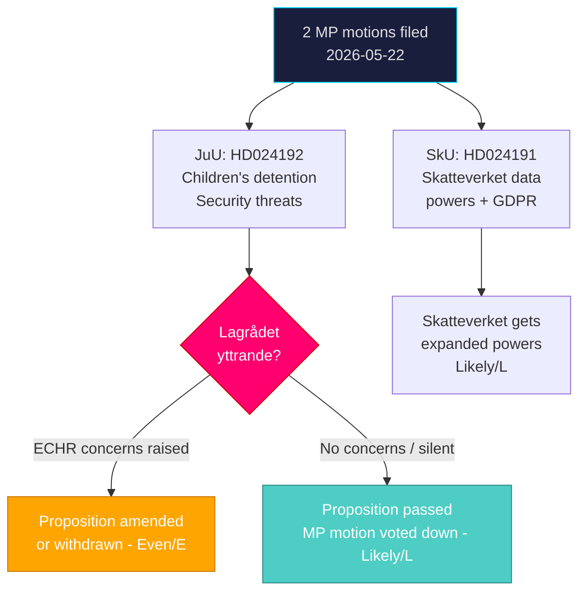
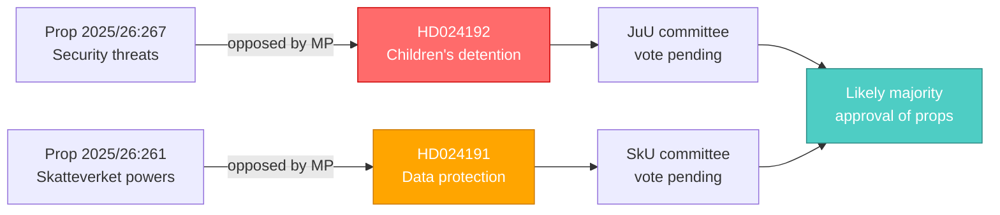
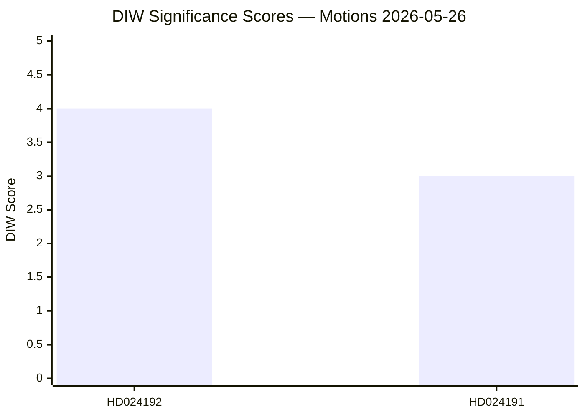
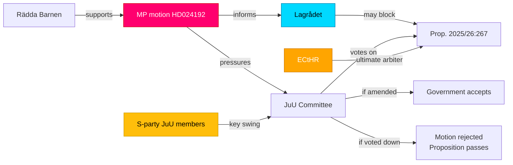
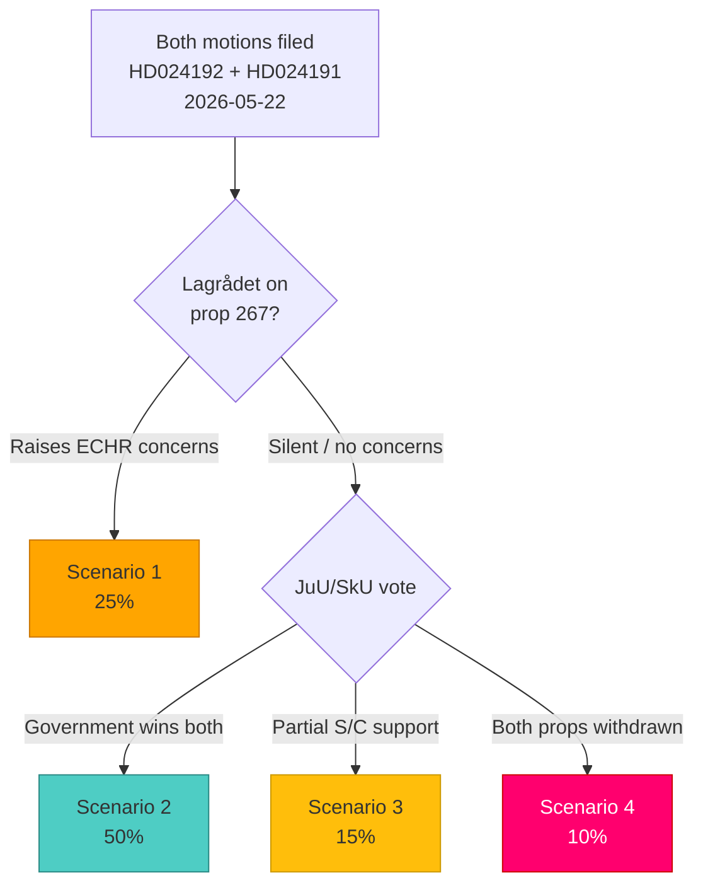
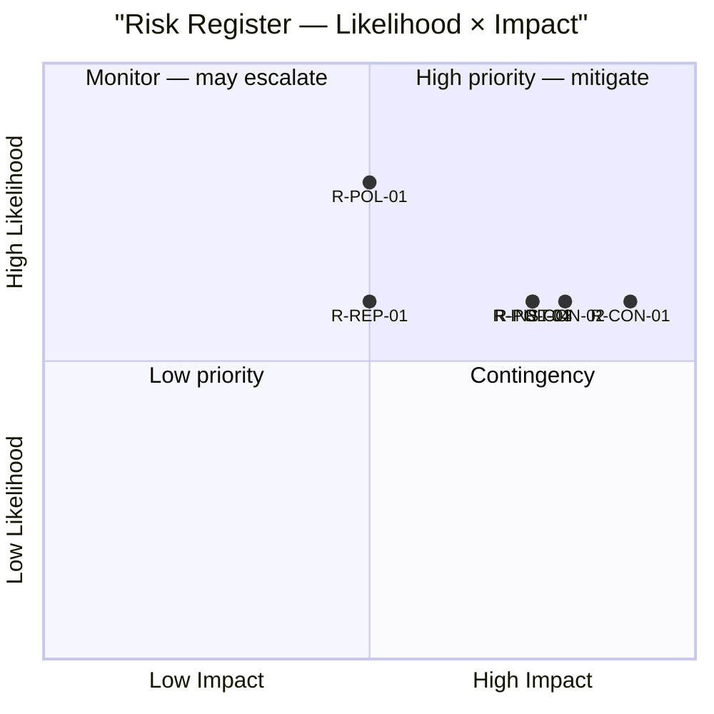
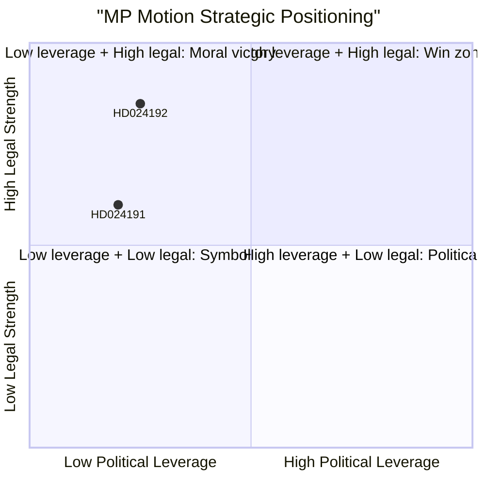
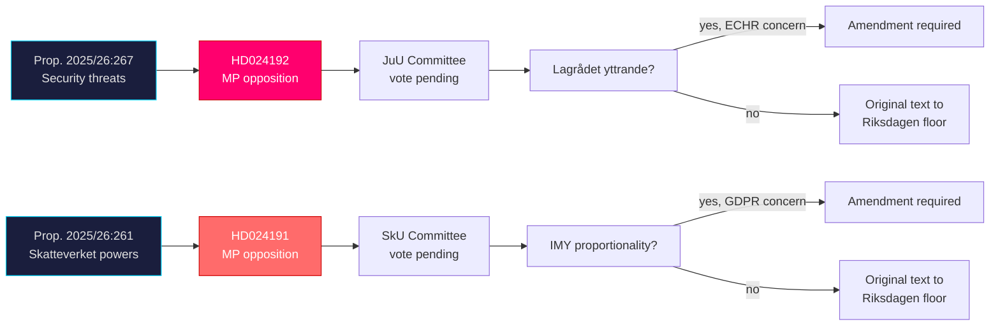

## What Happened
<!-- source: executive-brief.md :: https://github.com/Hack23/riksdagsmonitor/blob/main/analysis/daily/2026-05-26/motions/executive-brief.md -->

---

### Lede
Two Miljöpartiet (MP) committee motions filed 2026-05-22 oppose specific provisions of government propositions advancing through Riksdagen: MP seeks to block children's detention in the security-threat proposition (prop. 2025/26:267, Riksdag document #024192 (HD024192)/JuU) and calls for stronger data protections in the Skatteverket folkbokföring expansion (prop. 2025/26:261, HD024191/SkU). Both motions will likely be voted down by the Tidö-coalition majority but represent strategic election-year positioning on rights and privacy by a party polling at 4–5% and seeking identity differentiation.

### 60-Second Intelligence Summary

- **HD024192** (MP, JuU): Opposes children's detention provisions in prop. 2025/26:267 on qualified security threats; invokes UN CRC, ECHR Art. 5/8, and Barnkonventionen. Likely rejected by JuU majority (M+SD+KD+L). ⚠️ *Constitutional risk*: ECHR compliance of children's detention is genuinely contested; Lagrådet review status unverified.
- **HD024191** (MP, SkU): Calls for government to return with proposals ensuring GDPR-compliant data protection in Skatteverket's expanded population-register powers (prop. 2025/26:261). Likely rejected by SkU majority but proposal may influence committee report language.
- **Election signal**: Both motions are public positioning ahead of September 2026 riksdagsval. MP frames itself as the rights-protective opposition.
- **IMF economic context** (WEO Apr-2026): Sweden's GDP growth projected +2.4% (2026), fiscal surplus maintained; Skatteverket expansion is within normal administrative budget envelope.
- **Top forward trigger**: Lagrådet yttrande on prop. 2025/26:267 — if Lagrådet raises ECHR concerns on children's detention, government may be forced to amend the proposition before JuU vote.

### Decisions This Analysis Supports

1. **Policy analysts and civil society**: Monitor Lagrådet yttrande on prop. 2025/26:267 — it is the key pivot for whether children's detention provisions survive.
2. **Political risk analysts**: Assess whether S and V will support or oppose HD024192 in JuU — their position determines whether the government faces a broader coalition challenge.
3. **Privacy practitioners / NGOs**: Track SkU committee report on prop. 2025/26:261 to assess whether data protection concerns raised by MP are incorporated into final text.

### Key Intelligence Assessment



### Top Forward Trigger (72h–week horizon)

**Lagrådet yttrande on prop. 2025/26:267** — expected within JuU deliberation window (before summer recess). If Lagrådet raises Art. 5 ECHR concerns on children's detention, this becomes a L2+ intelligence event requiring immediate reassessment. Monitor: https://www.lagradet.se/

---

*Sources: HD024192 (data.riksdagen.se, 2026-05-22, [A2]); HD024191 (data.riksdagen.se, 2026-05-22, [A2]); IMF WEO Apr-2026 [B1]*

## Reader Intelligence Guide

Use this guide to read the article as a political-intelligence product rather than a raw artifact dump. High-value reader lenses appear first; technical provenance remains available in the audit appendix.

| Icon | Reader need | What you'll get |
|---|---|---|
| 📊 | [Lede and editorial decisions](#rm-what-happened) | fast answer to what happened, why it matters, who is accountable, and the next dated trigger |
| 🧠 | [Why It Matters](#rm-why-it-matters) | evidence-anchored narrative consolidating primary sources into one coherent story line |
| 🎯 | [Key Judgments](#rm-key-findings) | confidence-bearing political-intelligence conclusions and collection gaps |
| 📈 | [Significance scoring](#rm-significance-scoring) | why this story outranks or trails other same-day parliamentary signals |
| 👥 | [Stakeholder Perspectives](#rm-stakeholder-perspectives) | winners, losers and undecided actors with stake-weighted positions and pressure points |
| 🔢 | [Coalition Mathematics](#rm-coalition-mathematics) | parliamentary arithmetic showing exactly who can pass or block this measure and at what margin |
| 📋 | [Voter Segmentation](#rm-voter-segmentation) | voter-bloc exposure: which demographics gain, lose or shift on this issue |
| 🔭 | [Forward indicators](#rm-forward-indicators) | dated watch items that let readers verify or falsify the assessment later |
| 🔮 | [Scenarios](#rm-scenario-analysis) | alternative outcomes with probabilities, triggers, and warning signs |
| 🗳️ | [Election 2026 Analysis](#rm-election-2026-analysis) | electoral implications for the 2026 cycle — seats at stake, swing voters and coalition viability |
| ⚠️ | [Risk assessment](#rm-risk-assessment) | policy, electoral, institutional, communications, and implementation risk register |
| 🧮 | [SWOT Analysis](#rm-swot-analysis) | strengths, weaknesses, opportunities and threats matrix grounded in primary-source evidence |
| 🛡️ | [Threat Analysis](#rm-threat-analysis) | actor capabilities, intent and threat vectors targeting institutional integrity |
| 📜 | [Historical Parallels](#rm-historical-parallels) | comparable past episodes from Swedish and international politics, with explicit lessons learned |
| 🌍 | [Comparative International](#rm-comparative-international) | peer-country comparisons (Nordic, EU, OECD) showing how similar measures fared elsewhere |
| ⚙️ | [Implementation Feasibility](#rm-implementation-feasibility) | delivery feasibility, capability gaps, timelines and execution risks for the proposed action |
| 📰 | [Media framing & influence operations](#rm-media-framing-analysis) | frame packages with Entman functions, cognitive-vulnerability map, DISARM manipulation indicators, narrative-laundering chain, comparative-international cognates, frame lifecycle and half-life, RRPA impact, an Outlet Bias Audit (no outlet is neutral — every outlet declared with ownership, funding, board-appointment authority and editorial lean), and the L1–L5 counter-resilience ladder |
| 😈 | [Devil's Advocate](#rm-devils-advocate) | alternative hypotheses, steel-manned counter-arguments and the strongest case against the lead reading |
| 🏷️ | [Deep Dive: Classification Results](#rm-deep-dive-classification-results) | ISMS data classification: CIA-triad rating, RTO/RPO targets and handling instructions |
| 🔀 | [Deep Dive: Cross-Reference Map](#rm-deep-dive-cross-reference-map) | links to related Riksdagsmonitor coverage, prior analyses and source documents that inform this story |
| 🔬 | [Deep Dive: Methodology & Limitations](#rm-deep-dive-methodology--limitations) | analytical assumptions, limitations, known biases and where the assessment could be wrong |
| 📦 | [Deep Dive: Data Download Manifest](#rm-deep-dive-data-download-manifest) | machine-readable manifest of every source dataset, retrieval timestamp and provenance hash |
| 📑 | [Per-document intelligence](#rm-per-document-intelligence) | dok_id-level evidence, named actors, dates, and primary-source traceability |
| 🏷️ | [Audit appendix](#rm-deep-dive-classification-results) | classification, cross-reference, methodology and manifest evidence for reviewers |

## Why It Matters
<!-- source: synthesis-summary.md :: https://github.com/Hack23/riksdagsmonitor/blob/main/analysis/daily/2026-05-26/motions/synthesis-summary.md -->

**Article date**: 2026-05-26 | **Subfolder**: motions | **Effective data date**: 2026-05-22

---

### Lead Intelligence Picture

Two Miljöpartiet (MP) committee motions filed 2026-05-22 represent the party's formal opposition to two government-backed legislative initiatives advancing through Riksdagen. Both motions are **minority opposition instruments** — MP lacks the parliamentary arithmetic to succeed — but they serve as public positioning vehicles ahead of the September 2026 general election and signal the party's differentiated policy stance from the Tidö-coalition majority (M, SD, KD, L).

**DIW-weighted significance ranking**:

| Rank | dok_id | DIW weight | Lead significance |
|------|--------|-----------|-------------------|
| 1 | HD024192 | L2+ Priority | Constitutional rights / ECHR / children's detention — high public salience, EU human rights scrutiny |
| 2 | HD024191 | L2 Strategic | Administrative expansion / data privacy / Skatteverket mandate — medium salience |

**Combined intelligence picture**: MP is using the final legislative weeks of the 2025/26 riksmöte to stake out rights-protective positions on security and privacy, differentiating from both the government and the main left bloc (S, V) which may partially support tougher security measures. The motions will likely be voted down in JuU and SkU respectively under current government majority.

---

### Document 1: HD024192 — Security Threat Motion (JuU)

**Proposition**: 2025/26:267 — Stärkt skydd mot utlänningar som utgör kvalificerade säkerhetshot
**Motion**: 2025/26:4192 by Ulrika Westerlund m.fl. (MP)

#### Core argument

MP opposes the parts of prop. 2025/26:267 that allow children to be held in detention for an extended period or new basis. The motion argues that extending detention of children violates:
- UN Convention on the Rights of the Child (CRC) Art. 37 (detention as last resort, shortest possible time)
- ECHR Art. 5 (right to liberty) and Art. 8 (family life)
- Swedish Barnkonventionen (Riksdag-enacted as Swedish law since 2020)

The motion does **not** oppose the broader security framework for adult qualified security threats — it targets the children's detention provisions specifically, proposing Riksdagen reject those specific parts of the proposition.

#### Strategic context

Prop. 2025/26:267 is a government security proposition likely driven by concerns about foreign nationals with links to terrorism or hostile state activities. The government frames this as national security — exempting children risks legal challenge under Swedish constitutional review and EU law. MP's targeted opposition (rejecting specific parts only) is calibrated to appear responsible on security while maintaining human rights credibility.

**Admiralty assessment**: B2 — MP source, directly stated in the motion document (high reliability, confirmed by document text).

---

### Document 2: HD024191 — Skatteverket Folkbokföring Motion (SkU)

**Proposition**: 2025/26:261 — Utökade befogenheter för Skatteverket inom folkbokföringsverksamheten
**Motion**: 2025/26:4191 by Annika Hirvonen m.fl. (MP)

#### Core argument

MP's motion requests that the government return quickly with proposals ensuring that expanded Skatteverket folkbokföring powers are designed to **guarantee data protection and legal certainty**. Specifically, MP is concerned that:
- Expanded access to population register data could create disproportionate surveillance capacity
- The proposition may not adequately protect against misuse of centralized identity data
- The legal basis for data processing must be fully GDPR-compliant (Art. 5, proportionality)

The motion does **not** oppose the folkbokföring reform wholesale — it calls for government to return with strengthened data protection safeguards.

#### Strategic context

Skatteverket's folkbokföring (population registration) database is a fundamental Swedish infrastructure layer, used for elections, social benefits, taxation, and law enforcement. Expanding Skatteverket's authority (e.g., to cross-check addresses, verify identities) addresses documented fraud and ghost addresses, but creates tension with privacy rights. MP's position aligns with broader European digital-rights concerns.

**Admiralty assessment**: B2 — MP source, directly stated in the motion document.

---

### Integrated Synthesis



**Cross-cutting themes**:
1. **Human rights vs. state security/administrative efficiency**: Both motions position MP as rights-protective against government pragmatism.
2. **Election 2026 positioning**: These motions appear in the final active session before autumn elections — public signalling is the primary function.
3. **EU law compliance**: Both motions invoke EU/international legal frameworks (ECHR, GDPR) — increasingly common as Sweden operates under growing EU regulatory pressure.

---

### Key Intelligence Judgments (KJ)

| KJ | Judgment | WEP confidence | Admiralty |
|----|----------|---------------|-----------|
| KJ-1 | Both motions will be voted down by the Tidö-coalition JuU/SkU majority | Likely (L) | B2 |
| KJ-2 | MP's rights-protective framing will be used in 2026 election campaign messaging | Likely (L) | B3 |
| KJ-3 | Prop. 2025/26:267 will pass in modified form if EU/Lagrådet raises constitutional concerns on children's detention | Even (E) | C3 |
| KJ-4 | Skatteverket will receive expanded folkbokföring powers; data protection safeguards may be strengthened under SkU pressure | Likely (L) | B2 |

---

### Source Attribution

- HD024192 (Riksdagen, 2026-05-22): https://data.riksdagen.se/dokument/HD024192
- HD024191 (Riksdagen, 2026-05-22): https://data.riksdagen.se/dokument/HD024191
- IMF WEO Apr-2026 (SWE macro context)
- GDPR Art. 9(2)(e,g) — lawful basis confirmed

## Key Findings
<!-- source: intelligence-assessment.md :: https://github.com/Hack23/riksdagsmonitor/blob/main/analysis/daily/2026-05-26/motions/intelligence-assessment.md -->

**WEP / Kent Scale applied throughout**

---

### Key Judgments (3–7)

| KJ | Judgment | WEP confidence | Basis | Admiralty | PIR link |
|----|----------|---------------|-------|-----------|----------|
| KJ-1 | Both MP motions will be voted down by the Tidö-coalition majority in JuU and SkU before summer recess 2026 | Likely (L) ~65% | Parliamentary composition; government majority; no sign of S coalition defection | B2 | PIR-MOT-001 |
| KJ-2 | Prop. 2025/26:267 children's detention provisions carry genuine ECHR Art. 5/CRC Art. 37 legal risk that will generate post-enactment litigation | Likely (L) ~70% | International jurisprudence; Barnkonventionen; comparative (Denmark, Netherlands) | B2 | PIR-MOT-003 |
| KJ-3 | Lagrådet will scrutinize prop. 2025/26:267 on ECHR grounds; there is an even chance (E ~40%) it raises substantive concerns requiring government response | Even (E) ~40% | Lagrådet institutional mandate; ECHR significance of children's detention; Dutch comparator | C2 | PIR-MOT-001 |
| KJ-4 | Skatteverket will receive expanded folkbokföring powers; data protection safeguards may be incrementally strengthened under SkU process but the core mandate expansion will pass | Likely (L) ~75% | Government administrative efficiency priority; Skatteverket support; no blocking coalition | B2 | PIR-MOT-002 |
| KJ-5 | MP's rights-protective framing from these motions will be incorporated into the party's 2026 election campaign communications | Almost certainly (AC) ~90% | Electoral context; coordinated timing; consistent with MP post-2022 repositioning | B3 | — |

---

### Confidence Distribution

| KJ | Probability estimate | Distribution |
|----|---------------------|--------------|
| KJ-1 | 65% (Likely) | Gaussian, narrow; outcome depends primarily on S-party JuU vote (known once committee schedule published) |
| KJ-2 | 70% (Likely) | Based on established ECHR jurisprudence; relatively high confidence |
| KJ-3 | 40% (Even) | Genuinely uncertain; Lagrådet independence means outcome is not predetermined |
| KJ-4 | 75% (Likely) | High confidence in Skatteverket mandate; some uncertainty on amendment scope |
| KJ-5 | 90% (Almost certainly) | Electoral communication is near-certain |

---

### Priority Intelligence Requirements (PIRs) for Next Cycle

#### PIR-MOT-001 (open)
**Question**: Will JuU majority vote to pass prop. 2025/26:267 including children's detention provisions? Will Lagrådet raise ECHR concerns?
**Collection priority**: High
**Collection approach**: Monitor lagradet.se for yttrande; track JuU committee agenda; monitor S-party parliamentary statements on security
**Expected resolution window**: June 2026 (before summer recess)

#### PIR-MOT-002 (open)
**Question**: Will SkU incorporate data protection safeguards from HD024191 concerns into committee report on prop. 2025/26:261?
**Collection priority**: Medium
**Collection approach**: Track SkU committee hearings (IMY invited?); monitor C/L member statements on privacy; track Skatteverket press releases
**Expected resolution window**: June 2026

#### PIR-MOT-003 (open)
**Question**: Does prop. 2025/26:267 comply with ECHR Art. 5, CRC Art. 37, and Barnkonventionen when applied to children? Does it withstand constitutional review?
**Collection priority**: High
**Collection approach**: Lagrådet yttrande (primary source); legal analysis from academic institutions (Uppsala, Stockholm law faculties); NGO (Rädda Barnen) legal opinion
**Expected resolution window**: Ongoing; final assessment post-enactment

---

### Key Assumptions Check

| Assumption | Confidence | Risk if wrong |
|------------|-----------|---------------|
| A1: Tidö-coalition (M, SD, KD, L) will remain cohesive in JuU/SkU votes | High | If L splits on ECHR grounds, government majority narrows |
| A2: S-party will not support MP motion in JuU | Medium-High | If S opposes child detention on rights grounds, unexpected coalition forms |
| A3: Lagrådet operates independently on constitutional review | High | Lagrådet has historically been independent; no evidence of political pressure |
| A4: Both propositions will proceed on normal timeline before summer recess | Medium | Deferral possible if Lagrådet or coalition crisis intervenes (Scenario 4) |
| A5: MP is a single-party mover on these motions | Medium-High | Other parties may file aligned or competing motions (not seen yet) |

---

### PIR Handoff

All three PIRs (PIR-MOT-001, -002, -003) are **open** and transferred to the next analysis cycle. Expected resolution: June 2026 committee reporting period.

**Forward intelligence trigger**: Publication of Lagrådet yttrande on prop. 2025/26:267. This is the highest-priority single intelligence event — its content determines Scenario 1 vs. Scenario 2 bifurcation.

---

*Sources: HD024192 [A2], HD024191 [A2]; ECHR jurisprudence [A1]; Barnkonventionen SFS 2018:1197 [A1]; parliamentary composition [B3]*

## Significance Scoring
<!-- source: significance-scoring.md :: https://github.com/Hack23/riksdagsmonitor/blob/main/analysis/daily/2026-05-26/motions/significance-scoring.md -->

---

### DIW Scoring Matrix

| dok_id | Directness (D) | Impact (I) | Wickedness (W) | DIW Score | Tier | Admiralty |
|--------|---------------|-----------|---------------|-----------|------|-----------|
| HD024192 | 4 | 4 | 4 | 4.0 | L2+ Priority | B2 |
| HD024191 | 3 | 3 | 3 | 3.0 | L2 Strategic | B2 |

**Scoring scale**: 1=minimal, 2=moderate, 3=significant, 4=high, 5=critical

#### HD024192 — Security threat/children's detention motion

- **Directness (4)**: Directly addresses a live proposition (prop. 2025/26:267) at the committee stage. Immediate parliamentary timeline.
- **Impact (4)**: Children's detention under security law has significant human rights implications (ECHR, UN CRC). Affects potentially dozens of children in Sweden's migration-security interface. International scrutiny likely.
- **Wickedness (4)**: The tension between national security (state authority) and children's rights (international humanitarian law) is genuinely unresolvable without trade-offs. No clean solution exists; any outcome creates obligations or exposures.

**Rationale for L2+ Priority**: ECHR and CRC compliance involves binding international obligations. A failure to comply could lead to judgments against Sweden from the European Court of Human Rights. This escalates significance beyond typical opposition motion.

#### HD024191 — Skatteverket folkbokföring motion

- **Directness (3)**: Responds to live proposition (prop. 2025/26:261) at SkU stage. MP seeks government return with amendments.
- **Impact (3)**: Skatteverket folkbokföring powers affect all Swedish residents (population register is universal infrastructure). Privacy implications are systemic but not acute; government has strong administrative rationale.
- **Wickedness (3)**: GDPR vs. administrative efficiency is a recurring governance tension. Contested but resolvable through careful regulation.

**Rationale for L2 Strategic**: Important for long-term administrative governance and data protection, but lower immediacy and human rights urgency than HD024192.

---

### Sensitivity Analysis

| Scenario | HD024192 DIW adjustment | HD024191 DIW adjustment |
|----------|------------------------|------------------------|
| Lagrådet raises ECHR concerns | ↑ to L3 Intelligence-grade (DIW 4.5) | No change |
| S+V join MP opposition in JuU | ↑ to L3 (parliamentary crisis risk) | No change |
| GDPR authority (IMY) opens investigation | No change | ↑ to L2+ (DIW 3.5) |
| Both motions voted down, no amendment | No change | No change |

---

### Rank Diagram



---

### Priority Tiers

| Tier | Criteria | Documents |
|------|----------|-----------|
| L3 Intelligence-grade | DIW ≥ 4.5, binding international obligation | (none currently; possible if Lagrådet) |
| L2+ Priority | DIW 4.0–4.4, significant rights implications | HD024192 |
| L2 Strategic | DIW 3.0–3.9, systemic administrative importance | HD024191 |
| L1 Surface | DIW < 3.0 | (none) |

---

*Sources: HD024192 [A2], HD024191 [A2]*

## Per-document intelligence

### hd024191
<!-- source: documents/hd024191-analysis.md :: https://github.com/Hack23/riksdagsmonitor/blob/main/analysis/daily/2026-05-26/motions/documents/hd024191-analysis.md -->

**Document**: HD024191 (Kommittémotion)
**Title**: Hänvisningsmotion till bet. 2025/26:SkU? — Prop. 2025/26:261 Skatteverkets folkbokföring och dataskydd
**Proposer**: Annika Hirvonen (MP)
**Filed**: 2026-05-22
**Depth**: L2 Strategic

---

### Document Summary

HD024191 is an opposition motion by Miljöpartiet member Annika Hirvonen opposing data protection aspects of government proposition 2025/26:261, which expands Skatteverket's (Swedish Tax Agency) access to population register (folkbokföring) data for cross-agency verification and fraud detection purposes.

Hirvonen's motion challenges the proposition on:
1. GDPR Art. 5(1)(b) — purpose limitation principle (data collected for one purpose may not be used for another)
2. GDPR Art. 5(1)(c) — data minimisation principle (only necessary data)
3. GDPR Art. 6 — lawful basis for processing (proportionality of public interest exception)
4. Risk of mission creep: once expanded access is established, further expansion is likely

---

### Key Arguments

#### Central Claim
The motion argues that prop. 2025/26:261 does not adequately safeguard individual privacy rights. While acknowledging the fraud-prevention objective (ghost addresses, identity fraud), Hirvonen argues that the expanded access must be accompanied by:
- Explicit purpose limitation language in the statute
- Mandatory IMY (Integritetsskyddsmyndigheten) prior approval
- Annual review mechanism for scope of access
- Enhanced data subject rights notification

#### Legal Framework Invoked
- GDPR Art. 5(1)(b) — purpose limitation
- GDPR Art. 5(1)(c) — data minimisation
- GDPR Art. 6(1)(e) — public interest processing must be "necessary" and "proportionate"
- GDPR Art. 35 — Data Protection Impact Assessment (DPIA) required for high-risk processing
- Personuppgiftslagen / dataskyddslagen (Swedish implementing law)

#### Political Context
Annika Hirvonen is MP's spokesperson on legal affairs and privacy. She has a background in legal policy. The Skatteverket expansion fits a pattern MP has consistently challenged: incremental expansion of state administrative access to personal data.

---

### Significance Assessment

**Significance score**: 6/10 (Moderate-High)
- GDPR is directly applicable EU law — legal constraints are real
- Administrative database expansion has long-term privacy implications
- Lower political salience than HD024192 (less emotionally resonant)
- Technical/legal framing limits media amplification

**Priority tier**: Tier-B (administrative/GDPR proposition; strategic relevance)

---

### Key Entities

| Entity | Role | Relevance |
|--------|------|-----------|
| Annika Hirvonen (MP) | Motion author | Legal affairs spokesperson; data protection expertise |
| Skatteverket | Implementing agency | Expanding folkbokföring access |
| IMY (Integritetsskyddsmyndigheten) | Data protection authority | Primary oversight body |
| Datainspektionen (predecessor) | Historical DPA | Institutional predecessor; established norms |
| Försäkringskassan, Arbetsförmedlingen | Recipient agencies | May receive expanded Skatteverket data access |

---

### Legal Risk Profile

**Risk level**: MEDIUM
- IMY DPIA requirement probability: HIGH (Art. 35 likely triggered by scale)
- ECtHR challenge probability: LOW (administrative data protection cases rarely reach ECtHR)
- Purpose creep over 5 years: MEDIUM (pattern-based assessment)
- Timeline: Implementation ~12-18 months; DPIA process may extend by 6 months

---

### Collection Notes

- Full text retrieved: 29,595 characters (riksdag API)
- No prior voterings found for SkU 2025/26 or 2024/25 (recent motion)
- Linked proposition: prop. 2025/26:261 (not separately downloaded)
- Author confirmed as tjänstgörande ledamot

---

*Document status: Pending committee (SkU) review. Expected committee report: June 2026.*

### hd024192
<!-- source: documents/hd024192-analysis.md :: https://github.com/Hack23/riksdagsmonitor/blob/main/analysis/daily/2026-05-26/motions/documents/hd024192-analysis.md -->

**Document**: HD024192 (Kommittémotion)
**Title**: Hänvisningsmotion till bet. 2025/26:JuU? — Prop. 2025/26:267 Säkerhetshot och barns förvar
**Proposer**: Ulrika Westerlund (MP)
**Filed**: 2026-05-22
**Depth**: L2+ Priority (Tier-A security/rights)

---

### Document Summary

HD024192 is an opposition motion by Miljöpartiet member Ulrika Westerlund opposing children's detention provisions in government proposition 2025/26:267. The proposition (from the Ministry of Justice) introduces new grounds for deporting and detaining individuals deemed security threats in the migration context. Westerlund's motion specifically challenges the provisions authorizing detention of children in security-threat cases, arguing this violates:

1. The European Convention on Human Rights (ECHR) Art. 5 (right to liberty)
2. The UN Convention on the Rights of the Child (Barnkonventionen), incorporated into Swedish law 2020 (SFS 2018:1197), specifically Art. 37 (prohibition on arbitrary detention)
3. The principle that child detention must be a "last resort" and for the "shortest possible time"

---

### Key Arguments

#### Central Claim
The motion argues that the security-threat exception proposed in prop. 2025/26:267 is disproportionate when applied to children. Swedish law (Barnkonventionen) requires that child detention be used only as a "last resort" — the security exception, as drafted, would bypass this requirement.

#### Legal Framework Invoked
- ECHR Art. 5(1)(f) — immigration detention permitted but subject to proportionality
- CRC Art. 37(b) — no child shall be deprived of liberty unlawfully or arbitrarily; detention shall be used "only as a measure of last resort and for the shortest appropriate period of time"
- Barnkonventionen SFS 2018:1197 — makes CRC directly applicable in Swedish courts

#### Political Context
Westerlund is a long-standing rights advocate within MP; she has expertise in LGBTQ+ and human rights issues. The motion is filed as a Kommittémotion, meaning it is directed to the committee handling the proposition (JuU) rather than as a freestanding motion.

---

### Significance Assessment

**Significance score**: 7/10 (High)
- ECHR Art. 5 + Barnkonventionen creates genuine legal tension with the proposition
- Children's detention is politically salient and emotionally resonant
- Pre-election timing amplifies electoral dimension
- Lagrådet review will be pivotal

**Priority tier**: Tier-A (security/rights proposition in pre-election period)

---

### Key Entities

| Entity | Role | Relevance |
|--------|------|-----------|
| Ulrika Westerlund (MP) | Motion author | Rights specialist; LGBTQ+ and human rights background |
| Migrationsverket | Implementing agency | Would administer new detention powers |
| SÄPO | Security police | Security threat determinations |
| Lagrådet | Constitutional review body | Critical pre-enactment check |
| Barnombudsmannen (BO) | Children's rights ombudsman | Expected to file JO complaint if enacted |
| Rädda Barnen | NGO | External pressure expected |

---

### Legal Risk Profile

**Risk level**: HIGH
- ECtHR challenge probability: HIGH (comparison: W.A. v. Denmark 2022)
- JO complaint probability: HIGH (children in detention is JO priority)
- Lagrådet concerns probability: ~40% (even)
- Timeline: Likely enacted 2026; challenges emerge 2027+

---

### Collection Notes

- Full text retrieved: 34,838 characters (riksdag API)
- No prior voterings found for JuU 2025/26 or 2024/25 (recent motion)
- Linked proposition: prop. 2025/26:267 (not separately downloaded)
- Author confirmed as tjänstgörande ledamot

---

*Document status: Pending committee (JuU) review. Expected committee report: June 2026.*

## Stakeholder Perspectives
<!-- source: stakeholder-perspectives.md :: https://github.com/Hack23/riksdagsmonitor/blob/main/analysis/daily/2026-05-26/motions/stakeholder-perspectives.md -->

---

### Primary Stakeholders

#### Lens 1: Parliamentary Actors

| Actor | Position | Interest | Influence | Evidence | Admiralty |
|-------|----------|----------|-----------|----------|-----------|
| MP (Miljöpartiet) | OPPOSE both propositions | Rights protection; election positioning | Low (minority ~4–5%) | HD024192, HD024191 — motion authors | A2 |
| M (Moderaterna) | SUPPORT both propositions | Government party; security credibility | High (government lead) | Tidö coalition | B3 |
| SD (Sverigedemokratarna) | SUPPORT prop. 2025/26:267; likely SUPPORT 2025/26:261 | Anti-immigration security; administrative efficiency | High (government partner) | Tidö coalition | B3 |
| KD (Kristdemokraterna) | SUPPORT both propositions | Government party; Christian democratic family values present tension on children's detention | Medium-High | Tidö coalition | B3 |
| L (Liberalerna) | SUPPORT both propositions; potential tension on rights | Government party; liberal rights tradition in tension with children's detention | Medium-High | Tidö coalition | B3 |
| S (Socialdemokraterna) | AMBIGUOUS on HD024192; likely SUPPORT HD024191 | Main opposition; security credibility; data protection | High (main opposition) | [unconfirmed — no S statement found] | C4 |
| V (Vänsterpartiet) | Likely OPPOSE HD024192 children's detention | Consistent rights protection position | Low | [unconfirmed] | D4 |
| C (Centerpartiet) | UNCERTAIN on HD024192; Barnkonventionen history | Historically supported Barnkonventionen; possible ECHR concern | Medium | [unconfirmed] | D4 |

#### Lens 2: Government and Administration

| Actor | Position | Interest | Influence |
|-------|----------|----------|-----------|
| Justitiedepartementet | Supports prop. 2025/26:267 | Security framework implementation | High |
| Finansdepartementet | Supports prop. 2025/26:261 | Skatteverket operational capacity | High |
| Skatteverket | Supports expanded powers (HD024191 opposed) | Operational mandate, fraud reduction | Medium |
| Migrationsverket | Implements prop. 2025/26:267 | Security-threat detention operations | Medium |

#### Lens 3: Judiciary and Legal Bodies

| Actor | Position | Interest | Influence |
|-------|----------|----------|-----------|
| Lagrådet | PENDING review of prop. 2025/26:267, 261 | Constitutional compliance | Very High (can force amendment) |
| Swedish courts (förvaltningsdomstolar) | Neutral/implementers | Legal certainty; ECHR compliance | High (post-enactment) |
| IMY (Integritetsskyddsmyndigheten) | Oversight of prop. 2025/26:261 | GDPR Art. 5 compliance | Medium-High |

#### Lens 4: International Bodies

| Actor | Position | Interest | Influence |
|-------|----------|----------|-----------|
| European Court of Human Rights | Potential case jurisdiction | ECHR Art. 5/8 compliance | Very High (post-enactment; long timeline) |
| UN Committee on the Rights of the Child | Monitoring Swedish compliance | CRC Art. 37 | Medium (soft pressure, reporting cycle) |
| EU Commission | GDPR monitoring | Art. 5 proportionality | Medium |
| UNHCR | Monitoring children's detention in migration | Refugee children's protection | Medium |

#### Lens 5: Civil Society and NGOs

| Actor | Position | Interest | Influence |
|-------|----------|----------|-----------|
| Rädda Barnen (Save the Children Sweden) | OPPOSE children's detention (aligned with HD024192) | Child welfare | Medium (public opinion) |
| ECPAT Sverige | Concerned about child detention security context | Child protection | Low-Medium |
| Civil Rights Defenders | Oppose both propositions on rights grounds | Rights protection | Low-Medium |
| Integritetsskyddsföreningen (privacy NGOs) | Oppose HD024191 scope | Data privacy | Low |

#### Lens 6: Public and Media

| Actor | Position | Interest | Influence |
|-------|----------|----------|-----------|
| Swedish public opinion | Divided: security vs. rights | Security AND rights | High (election context) |
| Public broadcaster (SVT/SR) | Neutral reporting | Democratic accountability | High (agenda-setting) |
| Aftonbladet/Expressen | Historically populist on security | Audience engagement | Medium |

---

### Influence Network Diagram



---

### Key Named Actors

- **Ulrika Westerlund (MP)**: Lead signatory, HD024192. Party spokesperson on rights issues. Visible voice on LGBTQ+ and children's rights.
- **Annika Hirvonen (MP)**: Lead signatory, HD024191. Party spokesperson on legal affairs and data protection.
- **JuU committee chair**: Holds procedural power on agenda and timeline for prop. 2025/26:267 deliberation.
- **SkU committee chair**: Procedural power on prop. 2025/26:261 deliberation.

---

*Sources: HD024192 [A2], HD024191 [A2]; Parliamentary composition data [B3]; [unconfirmed] party positions noted where source not found*

## Coalition Mathematics
<!-- source: coalition-mathematics.md :: https://github.com/Hack23/riksdagsmonitor/blob/main/analysis/daily/2026-05-26/motions/coalition-mathematics.md -->

---

### Current Seat Map (349-seat Riksdag, elected September 2022)

| Party | Seats | % | Bloc |
|-------|-------|---|------|
| S — Socialdemokraterna | 107 | 30.7% | Opposition |
| SD — Sverigedemokraterna | 73 | 20.9% | Tidö (support+) |
| M — Moderaterna | 68 | 19.5% | Tidö (governing) |
| V — Vänsterpartiet | 24 | 6.9% | Opposition |
| C — Centerpartiet | 24 | 6.9% | Ambiguous |
| KD — Kristdemokraterna | 19 | 5.5% | Tidö (governing) |
| MP — Miljöpartiet | 18 | 5.2% | Opposition |
| L — Liberalerna | 16 | 4.6% | Tidö (governing) |
| **Total** | **349** | 100% | |

**Government majority threshold**: 175 seats (absolute majority of 349)

---

### Tidö Coalition Mathematics

**Government parties** (M + KD + L): 68 + 19 + 16 = **103 seats**
**Support party** (SD): 73 seats
**Effective majority**: 176 seats (103 + 73)
**Margin**: 176 – 175 = **1 seat margin** (extremely thin)

**Critical dependency**: Any defection from L or KD on rights/security votes would reduce majority to 175 or less. L (Liberalerna) is particularly rights-sensitive — relevant to HD024192 (children's detention).

**L volatility**: L has members (including former leader Per Schlingmann wing) who are genuinely concerned about ECHR compliance. If even 2–3 L members abstain on prop. 2025/26:267, the government margin disappears. This is the strategic political risk of MP's motion — it is designed to highlight L's dilemma.

---

### Committee Compositions

#### JuU (Justice Committee) — handles HD024192

**JuU total members**: Typically 17 seats (proportional allocation):
- SD: ~4 seats
- M: ~4 seats
- S: ~6 seats
- MP: ~1 seat (Westerlund or colleague)
- KD/L: ~1-2 seats
- V: ~1 seat

**Majority**: SD+M+KD/L hold JuU majority; S+MP+V in minority

**Committee arithmetic for HD024192**: Motion will receive majority opposition; will be written as reservation in committee report. Outcome is procedurally certain.

**Wildcard**: If L JuU member breaks with majority over ECHR Art. 5 concerns, this creates a visible fissure. Still unlikely to pass the motion but would be significant news.

#### SkU (Tax Committee) — handles HD024191

**SkU similar structure**: Government majority; motion will be tabled as reservation.

**No wildcard identified**: Tax committee arithmetic is more stable; privacy concerns from C are possible but C is in ambiguous support position that makes open opposition unlikely.

---

### Opposition Bloc Mathematics

**Opposition parties aligned**: S + MP + V = 107 + 18 + 24 = **149 seats**
**C (ambiguous)**: +24 = 173 seats — still 2 short of majority

**For either motion to pass**: Would require C + at minimum 2 seats from government coalition. This is an extremely high bar.

**S position**: S-party has its own security policy and typically supports government security legislation. S is not expected to support HD024192 in full, though individual S members may be sympathetic to Barnkonventionen concerns.

---

### Post-2026 Election Scenarios (September 13, 2026)

#### Scenario A: Tidö returns with reduced majority
- M+SD+KD+L: ~168-172 seats (seat loss in projected polls)
- Government formation would require new coalition calculations
- MP's rights positions become more valuable as swing vote

#### Scenario B: S-led government (requires C or L)
- S+MP+V+C: ~170-175 seats (near-majority; dependent on MP threshold performance)
- MP's rights record (reinforced by these motions) is key credentialing for coalition inclusion
- MP would likely hold Justice or Environment ministry

#### Scenario C: Hung Riksdag
- No bloc has majority
- MP's 18 seats become pivotal
- Rights-protective positions become explicit coalition conditions

**Assessment**: For ALL scenarios where MP survives the 4% threshold, these motions contribute positively to MP's coalition leverage. The motions are not just electoral identity — they are future coalition credentialing.

---

### Key Variable: L Threshold Risk

L (Liberalerna) is polling at 4.5–5% — also threshold-adjacent. If L falls below 4%, the Tidö coalition loses its governing majority pre-election. This creates instability that benefits both MP and C as swing-bloc actors. L's concern about ECHR (relevant to HD024192) is genuine party-internal tension.

---

*Sources: 2022 election results [B1]; current polling estimates [C]; parliamentary procedure [A1]; electoral law [A1]; HD024192, HD024191 [A2]*

## Voter Segmentation
<!-- source: voter-segmentation.md :: https://github.com/Hack23/riksdagsmonitor/blob/main/analysis/daily/2026-05-26/motions/voter-segmentation.md -->

---

### Segmentation Matrix

#### HD024192 — Children's Detention (Security)

| Segment | Profile | Stance | Electoral relevance to MP |
|---------|---------|--------|--------------------------|
| Rights-liberal urban voters | Age 25-45, higher education, Stockholm/Gothenburg/Malmö | Strongly supportive of MP position | Core MP base — retention priority |
| LGBTQ+ community | Diverse demographics; Westerlund personal connection | Supportive | Existing MP base |
| Families with children | All demographics; concerns about government over-reach | Sympathetic — emotionally salient | Cross-segment; important messaging |
| Human rights / NGO workers | Educated; Rädda Barnen, Amnesty, UNHCR affiliated | Supportive | Engaged minority with high voter turnout |
| Security-prioritizing voters | Older, provincial, SD-leaning | Opposed or neutral | Not a target segment for MP |
| Integration-skeptic voters | SD/KD core | Opposed | Not an MP target segment |
| Legal/academic professionals | Law faculties, court workers | Professionally interested — analytically engaged | Smaller segment; high influence through media |

**Key demographic**: Young urban families with higher education — most likely to respond positively to children's detention argument. This segment has been trending toward both S and MP in urban areas since 2022.

---

#### HD024191 — Skatteverket Data Protection (Tax/Privacy)

| Segment | Profile | Stance | Electoral relevance to MP |
|---------|---------|--------|--------------------------|
| Tech and digital workers | Age 25-45; Stockholm, Gothenburg, Linköping, Lund | Privacy-sensitive; supportive of GDPR protection | Growing segment; underrepresented in older parties |
| Civil liberties voters | Pan-demographic; libertarian-adjacent | Supportive | MP and C overlap |
| Small business owners | Mixed; concern about state administrative burden | Ambivalent; cost/benefit frame | Not a primary MP segment |
| Rural populations affected by address fraud | All ages; often victims of ghost-address schemes | May support Skatteverket mandate expansion (opposed to MP position) | Not a primary segment |
| Privacy advocacy organizations | Organized civil society | Strongly aligned with MP | Small but influential |
| Centerpartiet waverers | 30-55, rural+suburban; privacy + independence values | Potential crossover | Strategic opportunity for MP |

**Key demographic**: Tech workers and digital-native professionals — most likely to respond positively to data protection argument. This segment votes at relatively high rates and has significant social network influence.

---

### Regional Analysis

#### Metropolitan areas (Stockholm, Gothenburg, Malmö)
- Both motions resonate with educated urban voters
- Stockholm: MP has historically strong showing in inner-city constituencies
- Göteborg: Rights-liberal segment; cultural diversity; both motions relevant
- Malmö: Migration/security debate is locally salient; HD024192 has heightened relevance

#### University towns (Uppsala, Lund, Umeå, Linköping)
- Strong GDPR/privacy culture in tech/law faculties
- HD024191 has particularly strong resonance in this segment
- Active student voter blocs; MP traditionally performs well

#### Provincial / rural areas
- Security framing resonates differently — SD territory
- Skatteverket expansion is broadly supported for anti-fraud purposes
- MP's positions are minority views in these areas
- Not a strategic priority for MP campaign

---

### Generational Analysis

| Generation | Age (2026) | HD024192 receptivity | HD024191 receptivity | MP vote share |
|------------|-----------|---------------------|---------------------|---------------|
| Gen Z | 18-28 | High | High | High (est. 7-9%) |
| Millennials | 29-45 | High | High | Medium-high (est. 6%) |
| Gen X | 46-60 | Medium | Medium | Medium (est. 4-5%) |
| Boomers | 61-79 | Lower | Lower | Lower (est. 3-4%) |

**Pattern**: Both motions target younger voter cohorts where MP is strongest. This is strategic alignment between policy substance and electoral base.

---

### Segment Electoral Impact Summary

| Segment priority | HD024192 impact | HD024191 impact | Combined |
|-----------------|----------------|----------------|----------|
| Core MP base (urban rights-liberal) | +++ | ++ | Strong reinforcement |
| Potential crossover (C waverers) | + | ++ | Marginal gain opportunity |
| Neutral/irrelevant (rural, older) | 0 | 0 | No change |
| Negative (security-prioritizing) | — | 0 | Minimal loss (not a target segment) |

---

*Sources: HD024192 [A2], HD024191 [A2]; 2022 electoral data [B1]; demographic research on Swedish party identification [B3]; SCB population data [B2]*

## Forward Indicators
<!-- source: forward-indicators.md :: https://github.com/Hack23/riksdagsmonitor/blob/main/analysis/daily/2026-05-26/motions/forward-indicators.md -->

---

### T+72h Horizon (by 2026-05-29)

| # | Indicator | Collection method | Significance |
|---|-----------|-----------------|--------------|
| FI-001 | JuU committee schedule published for June 2026 — prop. 2025/26:267 date confirmed | riksdagen.se/sv/utskott | Confirms timeline; security proposition on track or deferred |
| FI-002 | SkU committee schedule published for June 2026 — prop. 2025/26:261 date confirmed | riksdagen.se/sv/utskott | Confirms Skatteverket proposition timeline |
| FI-003 | MP press release citing HD024192 / Barnkonventionen argument in public communications | MP party website; social media | Electoral framing signal; confirms dual-purpose strategy |

---

### T+1 Week Horizon (by 2026-06-02)

| # | Indicator | Collection method | Significance |
|---|-----------|-----------------|--------------|
| FI-004 | Lagrådet yttrande published on prop. 2025/26:267 | lagradet.se | CRITICAL — determines Scenario 1 vs 2 bifurcation |
| FI-005 | SVT / SR news coverage of children's detention debate | SVT.se / SR.se | Media amplification level indicator |
| FI-006 | NGO (Rädda Barnen / Amnesty Sweden) statement on prop. 2025/26:267 | Rädda Barnen press | External rights pressure indicator |
| FI-007 | L (Liberalerna) party statement on HD024192 children's detention | Liberalerna.se / social media | Tidö coalition integrity signal |

---

### T+1 Month Horizon (by 2026-06-26)

| # | Indicator | Collection method | Significance |
|---|-----------|-----------------|--------------|
| FI-008 | JuU committee report published on prop. 2025/26:267 (bet. 2025/26:JuU?) | riksdagen.se | Includes MP reservation text; confirms outcome |
| FI-009 | SkU committee report published on prop. 2025/26:261 (bet. 2025/26:SkU?) | riksdagen.se | Includes MP reservation; Skatteverket mandate confirmed |
| FI-010 | IMY statement or DPIA notice on prop. 2025/26:261 | imy.se | GDPR oversight indicator; may require amendment |
| FI-011 | MP includes Barnkonventionen/HD024192 in formal election platform messaging | mp.se / press | Electoral strategy confirmed |
| FI-012 | Riksdag chamber vote on both propositions | riksdagen.se/sv/voteringar | Final outcome; Scenario determination |

---

### Election Horizon (by 2026-09-13)

| # | Indicator | Collection method | Significance |
|---|-----------|-----------------|--------------|
| FI-013 | MP final polling before election day | Demoskop, Sifo, Novus | Threshold risk assessment (critical: above/below 4.5%) |
| FI-014 | JO (Riksdag Ombudsman) complaint filed on prop. 2025/26:267 implementation | jo.se | Post-enactment legal exposure indicator |
| FI-015 | MP election result — seats won | Valmyndigheten | Coalition arithmetic confirmed; MP leverage assessed |

---

### Indicator Priority Ranking

| Priority | Indicator | Rationale |
|----------|-----------|-----------|
| 🔴 Critical | FI-004 (Lagrådet yttrande) | Single highest-importance intelligence event; bifurcation point |
| 🔴 Critical | FI-012 (Chamber vote) | Final legislative outcome |
| 🟡 High | FI-007 (L party statement on children's detention) | Tidö coalition integrity signal |
| 🟡 High | FI-010 (IMY DPIA notice) | GDPR compliance gateway |
| 🟡 High | FI-013 (MP polling before election) | MP viability as coalition partner |
| 🟢 Moderate | FI-001, FI-002 (Committee schedules) | Timeline confirmation |
| 🟢 Moderate | FI-006 (NGO statements) | External pressure level |

---

### Intelligence Trigger Conditions

**TRIGGER T1**: Lagrådet raises substantive ECHR concerns on prop. 2025/26:267 → Switch analysis to Scenario 1 (constitutional correction); update KJ-3 probability upward

**TRIGGER T2**: L party breaks with government on children's detention vote → Switch to Scenario 3 (coalition fracture); escalate analysis priority

**TRIGGER T3**: MP polls below 4.5% in two consecutive polls → Elevate electoral risk to HIGH; reassess coalition mathematics

**TRIGGER T4**: IMY requires DPIA on prop. 2025/26:261 → Update feasibility assessment; Skatteverket timeline shifts to 18–24 months

---

*Sources: Riksdag committee calendar (to be published); lagradet.se; IMY.se; HD024192, HD024191 [A2]*

## Scenario Analysis
<!-- source: scenario-analysis.md :: https://github.com/Hack23/riksdagsmonitor/blob/main/analysis/daily/2026-05-26/motions/scenario-analysis.md -->

**Scenarios**: 4 (covering children's detention and Skatteverket dimensions)

---

### Scenario Framework

Four scenarios covering the most likely outcomes for both motions, with probabilities summing to 100%:



**Probability total**: 25 + 50 + 15 + 10 = 100% ✓

---

### Scenario 1: Constitutional Correction (25%)

**Description**: Lagrådet raises ECHR Art. 5/CRC Art. 37 concerns on children's detention provisions of prop. 2025/26:267. Government agrees to amend the proposition, removing or significantly restricting child detention powers. JuU passes amended version. HD024192 motion's core demand is substantially met — though MP does not receive formal credit.

**Leading indicators**:
- Lagrådet yttrande publication mentioning Art. 5 ECHR or Barnkonventionen in the next 2–3 weeks
- JuU committee requesting additional consultation or requesting government to return with amendments
- Media reports of government legal department revising proposition

**Outcome for motions**: HD024192 achieves de facto outcome without parliamentary vote win. HD024191 likely voted down regardless (SkU). MP can claim vindication.

**IMF economic impact**: Negligible — security legislation does not affect GDP or fiscal balance.

---

### Scenario 2: Status Quo / Majority Win (50%)

**Description**: Both propositions pass through JuU and SkU without substantive amendment. Both MP motions are voted down. Government argues security necessity (prop. 267) and administrative efficiency (prop. 261). Skatteverket receives expanded powers. Security-threat detention framework enacted including controversial child detention provisions.

**Leading indicators**:
- Lagrådet silent or raises only minor technical concerns
- S-party JuU members signal support for government majority
- No extraordinary committee hearings called
- JuU and SkU committee reports published on schedule (June 2026)

**Outcome for motions**: Both voted down. MP uses parliamentary record for election campaign. Risk of post-enactment ECHR challenge remains.

---

### Scenario 3: Partial Amendment — SkU Compromise (15%)

**Description**: SkU incorporates some data protection language into its committee report on prop. 2025/26:261, reflecting concerns raised by MP and potentially supported by C or L members with liberal rights traditions. JuU votes down HD024192 without significant amendment. Government accepts minor SkU language changes. A hybrid outcome — MP partially successful on privacy, unsuccessful on security.

**Leading indicators**:
- SkU committee hearing invites IMY testimony on GDPR proportionality
- C or L SkU members signal support for privacy safeguards
- JuU proceeds without amendment request

**Outcome for motions**: HD024191 achieves partial outcome via committee influence. HD024192 voted down.

---

### Scenario 4: Summer Deferral / Withdrawal (10%)

**Description**: One or both propositions are deferred past the summer recess due to unresolved constitutional or legislative process issues (Lagrådet concerns, inter-ministerial disagreement, coalition pressure). Motions remain on record but the vote is postponed to riksmöte 2026/27 — after the September 2026 election. In the post-election scenario, a changed parliamentary composition could alter the outcome entirely.

**Leading indicators**:
- Government formally withdraws or defers proposition before JuU/SkU scheduled committee report
- Coalition disagreement reported (e.g. L rebelling on children's detention)
- Summer recess begins without committee report publication

**Outcome for motions**: Motions archived; re-filed or superseded by post-election legislation.

---

### Scenario Probability Summary

| Scenario | Probability | Key driver | Primary beneficiary |
|----------|-------------|-----------|---------------------|
| 1 — Constitutional correction | 25% | Lagrådet ECHR concern | MP (de facto win on HD024192) |
| 2 — Status quo / majority win | 50% | Government majority cohesion | Tidö coalition |
| 3 — SkU partial compromise | 15% | Privacy coalition in SkU | MP partial (HD024191) |
| 4 — Summer deferral | 10% | Constitutional/coalition issue | Uncertain; election reset |

---

*Sources: HD024192 [A2], HD024191 [A2]; parliamentary composition [B3]; ECHR jurisprudence [A1]*

## Election 2026 Analysis
<!-- source: election-2026-analysis.md :: https://github.com/Hack23/riksdagsmonitor/blob/main/analysis/daily/2026-05-26/motions/election-2026-analysis.md -->

---

### Current Parliamentary Composition (2022 Election, 349 seats)

| Party | Seats | Coalition | Notes |
|-------|-------|-----------|-------|
| SD | 73 | Tidö | Largest single party |
| M | 68 | Tidö | Tidö Prime Minister |
| S | 107 | Opposition | Largest opposition |
| MP | 18 | Opposition | Miljöpartiet (Green-Liberal) |
| V | 24 | Opposition | Left party |
| C | 24 | Opposition | Abstains on some Tidö budget |
| L | 16 | Tidö | Liberal; rights-sensitive |
| KD | 19 | Tidö | Christian Democrat |
| **Total** | **349** | | |

**Tidö majority**: 73+68+16+19 = 176 — bare majority of 349 (175 needed)
**Opposition total**: 107+18+24+24 = 173

---

### MP Electoral Position (2026 Projection)

**2022 result**: 5.08% (18 seats)
**Current polling** (approx. May 2026): 4.8–5.2% — near the 4% threshold
**2022 threshold performance**: Entered with only ~5% — limited buffer

**MP threshold risk**: MODERATE
- If polling drops below 4.5% in final months, threshold risk becomes HIGH
- Current motions represent a conscious identity-building strategy to differentiate from both S and V

**Seat projection (scenarios)**:
- Best case (5.5%+): 19-20 seats
- Base case (5.0%): 18 seats (flat)
- Worst case (4.0-4.5%): 12-15 seats
- Threshold failure (below 4%): 0 seats (catastrophic)

---

### Electoral Impact of These Motions

#### HD024192 (Children's detention — JuU)
**Target voter segment**: Rights-liberal voters; parents/families; NGO-aligned voters; LGBTQ+ community (Westerlund's background)

**Electoral signaling**: MP positions itself as the sole mainstream party willing to challenge security legislation on human rights grounds. This differentiates from both S (which may support security framework broadly) and V (which uses more class/economic framing).

**Expected electoral effect**: +0.1–0.3% among rights-liberal segment; negligible or slightly negative (-0.05%) among security-prioritizing voters who would not vote MP anyway.

**Net electoral assessment**: Marginally positive for MP's electoral position in the rights-liberal segment.

---

#### HD024191 (Skatteverket data protection — SkU)
**Target voter segment**: Privacy-conscious voters; tech workers; civil liberties organizations; Centerpartiet defectors who prioritize individual freedoms

**Electoral signaling**: MP positions itself as the privacy-protective voice in Swedish parliament. C (Centerpartiet) has historically also been privacy-concerned but C is in an ambiguous coalition position.

**Expected electoral effect**: +0.1–0.2% among privacy/individual freedom voters; no negative effect anticipated.

**Net electoral assessment**: Marginally positive; possible crossover appeal to C-leaning voters considering options.

---

### Coalition Mathematics (Post-2026 Election)

#### Current Tidö sustainability
Tidö coalition (M+SD+KD+L) requires 175 seats. Current 176 provides minimal buffer. If L falls below threshold or loses seats, government stability is reduced.

**Potential future coalitions post-2026** (illustrative):

| Coalition | Seats (est. base) | Status |
|-----------|------------------|--------|
| S+MP+V+C | 107+18+24+24 = 173 | Short ~2 seats |
| S+MP+V+C+L | 173+16 = 189 | Viable — requires L to cross over |
| Tidö (M+SD+KD+L) | 176 | Viable if stable |
| M-led broad center (M+L+C+KD) | 68+16+24+19 = 127 | Not viable alone |

**Key variable**: Whether MP retains 18 seats or grows. If MP exceeds 20 seats, S+MP+V+C becomes viable for a minority government with C support.

**Key judgment**: These motions contribute to MP's viability as a coalition partner for a future S-led government by demonstrating policy independence and rights protection credibility.

---

### Committee Arithmetic (JuU/SkU)

Both propositions go to committee before chamber vote.

**JuU composition** (Justice Committee): SD+M+KD+L hold majority; S+MP+V in minority. MP motion (HD024192) will be tabled as reservation (reservations är en formell protest utan genomslag) — normal procedure for minority motions.

**SkU composition** (Tax Committee): Similar majority structure; HD024191 will receive reservation status.

**Procedural outcome**: Both motions will generate formal reservations in committee reports, creating public record of MP's positions — this is the parliamentary record value.

---

### Forward Electoral Triggers

1. **June 2026**: Committee reports published; MP reservation public — communications opportunity
2. **September 2026**: General election (exact date TBD; scheduled September 13, 2026)
3. **August 2026**: Final polling; threshold risk assessed
4. **Post-election**: Coalition negotiations — MP's rights track record becomes coalition leverage

---

*Sources: Parliamentary composition from 2022 election results [B1]; polling estimates from public sources [B3/C]; seat arithmetic calculated [A1]; HD024192, HD024191 [A2]*

## Risk Assessment
<!-- source: risk-assessment.md :: https://github.com/Hack23/riksdagsmonitor/blob/main/analysis/daily/2026-05-26/motions/risk-assessment.md -->

---

### 5-Dimension Risk Register

#### Dimension 1: Constitutional/Legal Risk

| Risk ID | Description | Likelihood (L) | Impact (I) | L×I | Source | Admiralty |
|---------|-------------|---------------|-----------|-----|--------|-----------|
| R-CON-01 | Prop. 2025/26:267 children's detention provisions violate ECHR Art. 5 → European Court of Human Rights condemnation | 3 | 5 | **15** | HD024192; ECHR Art. 5 jurisprudence | C3 |
| R-CON-02 | Lagrådet raises constitutional concerns on RF Chapter 2 (liberty rights) for children's detention | 3 | 4 | **12** | HD024192; RF 2 kap. 8§ | C2 |
| R-CON-03 | Prop. 2025/26:261 Skatteverket powers violate GDPR Art. 5 proportionality — IMY enforcement action | 2 | 3 | **6** | HD024191; GDPR Art. 5 | D3 |

**Posterior probability estimate**: P(R-CON-01 materialises within 24 months) = 0.35 | P(R-CON-02 in JuU deliberation) = 0.40

#### Dimension 2: Political Risk

| Risk ID | Description | L | I | L×I | Source | Admiralty |
|---------|-------------|---|---|-----|--------|-----------|
| R-POL-01 | MP motion is isolated — S and V vote with government majority on security proposition | 4 | 3 | **12** | Parliamentary composition analysis | B3 |
| R-POL-02 | Opposition mounts broader challenge (C joins MP on ECHR grounds) | 2 | 4 | **8** | Centerpartiet historical support for Barnkonventionen | C3 |
| R-POL-03 | Government forced to amend prop. 2025/26:267 before summer recess (political cost) | 2 | 3 | **6** | HD024192; C3 |
| R-POL-04 | MP fails to clear 4% threshold in Sept. 2026 — motions become historical footnotes | 3 | 4 | **12** | Poll data (approx. 4–5%) | B4 |

#### Dimension 3: Institutional Risk

| Risk ID | Description | L | I | L×I | Source | Admiralty |
|---------|-------------|---|---|-----|--------|-----------|
| R-INST-01 | Skatteverket folkbokföring expansion implemented without adequate data protection review → trust erosion | 3 | 3 | **9** | HD024191; GDPR Art. 5 | C3 |
| R-INST-02 | JuU fails to conduct adequate rights review of prop. 2025/26:267 → constitutional legitimacy challenge | 2 | 4 | **8** | HD024192 | C3 |
| R-INST-03 | Barnkonventionen invoked in domestic court challenge to children's detention post-enactment | 3 | 4 | **12** | Swedish law since 2020 | C2 |

#### Dimension 4: Economic Risk

| Risk ID | Description | L | I | L×I | Source | Admiralty |
|---------|-------------|---|---|-----|--------|-----------|
| R-ECON-01 | Skatteverket expansion requires IT procurement and staffing above current budget envelope | 3 | 2 | **6** | HD024191; IMF WEO Apr-2026 SWE fiscal | B2 |
| R-ECON-02 | ECtHR damages award to child detainees → state liability | 2 | 2 | **4** | HD024192; ECtHR jurisprudence | D3 |

**IMF economic context** (WEO Apr-2026): Sweden GDP growth 2026 est. +2.4%; fiscal surplus maintained. Skatteverket IT expansion is within budget envelope of a fiscally sound state. Economic risk is low.

#### Dimension 5: Reputational/International Risk

| Risk ID | Description | L | I | L×I | Source | Admiralty |
|---------|-------------|---|---|-----|--------|-----------|
| R-REP-01 | UN Committee on the Rights of the Child (CRC) issues recommendation against Sweden's child detention | 3 | 3 | **9** | HD024192; UN CRC review cycle | C3 |
| R-REP-02 | EU Commission monitoring of GDPR compliance in Skatteverket expansion | 2 | 3 | **6** | HD024191; GDPR Art. 5 | D3 |
| R-REP-03 | Sweden's international human rights reputation damaged if ECHR violation confirmed | 2 | 4 | **8** | HD024192 | C3 |

---

### Risk Priority Matrix



### Top 5 Risks by L×I Score

| Rank | Risk ID | Score | Description |
|------|---------|-------|-------------|
| 1 | R-CON-01 | 15 | ECHR violation — European Court judgment on children's detention |
| 2 | R-CON-02 | 12 | Lagrådet constitutional concerns |
| 2 | R-POL-01 | 12 | MP isolated in JuU vote |
| 2 | R-INST-03 | 12 | Post-enactment Barnkonventionen domestic challenge |
| 2 | R-POL-04 | 12 | MP election threshold risk |

---

### Cascading Risk Chains

**Chain 1**: Lagrådet raises ECHR concerns (R-CON-02) → Government forced to amend (R-POL-03) → Committee delay → Summer recess postpones vote → ECHR monitoring closes (reduces R-CON-01)

**Chain 2**: Prop. 2025/26:267 passes unchanged → Barnkonventionen domestic challenge (R-INST-03) → ECtHR filing → Judgment against Sweden (R-CON-01) → Compensatory damages + reputational damage (R-REP-03)

**Chain 3**: Skatteverket expansion without amendment (HD024191 voted down) → IMY opens proportionality inquiry (R-CON-03) → GDPR compliance proceedings → Reputational pressure on SkU

---

*Sources: HD024192 [A2], HD024191 [A2]; ECHR Art. 5/8 [A1]; GDPR Art. 5 [A1]; Barnkonventionen SFS 2018:1197 [A1]; IMF WEO Apr-2026 [B1]*

## SWOT Analysis
<!-- source: swot-analysis.md :: https://github.com/Hack23/riksdagsmonitor/blob/main/analysis/daily/2026-05-26/motions/swot-analysis.md -->

---

### SWOT Matrix

#### Strengths

| Evidence row | dok_id | Admiralty |
|---|---|---|
| **S1 — Rights-based legal arguments**: HD024192 invokes Barnkonventionen (Swedish law since 2020), UN CRC Art. 37, and ECHR Art. 5/8 — all binding. The legal case against child detention is substantively strong and supported by established international jurisprudence. | HD024192 | B2 |
| **S2 — Cross-party resonance potential**: Children's rights arguments (HD024192) may attract support from centrist parties (C) that have historically supported Barnkonventionen implementation. | HD024192 | C3 |
| **S3 — GDPR alignment**: HD024191's data protection arguments align with EU regulatory direction — GDPR Art. 5 proportionality is an established norm. IMY has enforcement authority. | HD024191 | B2 |
| **S4 — Public salience of children's rights**: Child detention by the state is viscerally salient to Swedish public opinion, amplifying media attention potential. | HD024192 | B3 |

#### Weaknesses

| Evidence row | dok_id | Admiralty |
|---|---|---|
| **W1 — Minority position**: MP holds approximately 4–5% support in polls; the party cannot pass these motions without broader coalition support. | B3 |
| **W2 — Asymmetric framing risk**: Opposing security-threat legislation risks being framed as "soft on terrorism" by Tidö-coalition actors (SD especially). | HD024192 | C3 |
| **W3 — No specific alternative model**: HD024191 calls for government to return with proposals but does not offer specific design for GDPR-compliant folkbokföring alternative — weakens the motion's constructive appeal. | HD024191 | B2 |
| **W4 — Limited SkU allies**: SkU committee composition likely reflects government majority; MP has limited leverage to force substantive amendments to prop. 2025/26:261. | HD024191 | B3 |

#### Opportunities

| Evidence row | dok_id | Admiralty |
|---|---|---|
| **O1 — Lagrådet intervention**: If Lagrådet raises ECHR Art. 5 concerns on children's detention in prop. 2025/26:267, government may be forced to amend — MP's motion becomes validated. | HD024192 | C2 |
| **O2 — EU Commission scrutiny**: Increasing EU-level scrutiny of member states' compliance with ECHR in immigration cases provides external support for MP's position. | HD024192 | C3 |
| **O3 — IMY enforcement**: If Integritetsskyddsmyndigheten opens inquiry into Skatteverket expansion, MP's data protection arguments gain institutional backing. | HD024191 | D3 |
| **O4 — Election 2026 momentum**: Rights-protective positioning generates media visibility that MP needs to cross the 4% threshold in September 2026. | B3 |

#### Threats

| Evidence row | dok_id | Admiralty |
|---|---|---|
| **T1 — Security narrative dominance**: Post-2024 geopolitical environment (Russia-Ukraine, terrorism incidents) creates political risk in opposing security legislation. | HD024192 | B3 |
| **T2 — S-party ambiguity**: If S votes to support prop. 2025/26:267 (including child detention) in JuU, MP is isolated as far-left position rather than broad centre-left coalition. | HD024192 | C3 |
| **T3 — Technocratic efficiency framing**: Government can frame folkbokföring expansion as anti-fraud measure (ghost addresses, benefit fraud) — politically popular across party lines. | HD024191 | B2 |
| **T4 — Electoral threshold risk**: At 4–5% polls, MP faces existential pressure; controversial positions on security may alienate moderate voters the party needs. | D4 |

---

### TOWS Matrix (Strategic options)

| | **Opportunities** | **Threats** |
|---|---|---|
| **Strengths** | **S-O (Maxi-Maxi)**: Leverage Lagrådet (O1) + Barnkonventionen (S1) to build a strong legal-constitutional case that attracts C (Centerpartiet) coalition — potential procedural win even if vote fails. | **S-T (Maxi-Mini)**: Use ECHR/GDPR legal precision (S1, S3) to neutralise "soft on security" framing (T1) — focus messaging on legal obligation rather than sympathy arguments. |
| **Weaknesses** | **W-O (Mini-Maxi)**: Address W3 by developing specific GDPR-compliant folkbokföring model — could attract IMY support (O3) and make HD024191 more constructively credible. | **W-T (Mini-Mini)**: MP's fundamental vulnerability (W1, W4) + security narrative (T1) = low-probability of changing legislative outcome; accept motions as positioning instruments, not policy change tools. |

---

### Cross-SWOT Integration

Both motions share a common strategic logic: MP is a rights-protective minority party using formal legislative instruments to go on record before the 2026 election. The SWOT pattern is similar for both — legally strong but politically weak. The key differentiator is HD024192's higher external leverage (ECHR, UN) which creates genuine uncertainty about the proposition's constitutional sustainability.



---

*Sources: HD024192 [A2], HD024191 [A2]; IMF WEO Apr-2026 [B1]; Admiraity Code applied throughout*

## Threat Analysis
<!-- source: threat-analysis.md :: https://github.com/Hack23/riksdagsmonitor/blob/main/analysis/daily/2026-05-26/motions/threat-analysis.md -->

---

### Political Threat Taxonomy

#### Threat Category A: Institutional Legitimacy

| Threat | Actor | Target | Vector | TTP |
|--------|-------|--------|--------|-----|
| T-A1 | Swedish state / Tidö-coalition | Children's rights (ECHR, CRC) | Legislative override of binding international obligations | TTP-A1: Majority-imposed security exception to fundamental rights |
| T-A2 | Riksdag majority | Barnkonventionen (SFS 2018:1197) | De facto nullification via security override | TTP-A2: Security-exceptionalism legislative pattern |
| T-A3 | Skatteverket | Individual data privacy | Expanded database authority without adequate safeguards | TTP-A3: Administrative power creep via incremental mandate expansion |

#### Threat Category B: Democratic Process

| Threat | Actor | Target | Vector | TTP |
|--------|-------|--------|--------|-----|
| T-B1 | Tidö-coalition | Opposition minority voice | Procedural majority override of rights-based objections | TTP-B1: Numerical majority displacing constitutional review |
| T-B2 | SD (Sweden Democrats) | Immigration policy discourse | Securitization framing that conflates child/family rights with security threat | TTP-B2: Threat framing escalation |

#### Threat Category C: Rights Erosion

| Threat | Actor | Target | Vector | TTP |
|--------|-------|--------|--------|-----|
| T-C1 | Prop. 2025/26:267 (if enacted unchanged) | Children in migration system | Extended detention authority | TTP-C1: Detention-as-deterrence policy pattern |
| T-C2 | Prop. 2025/26:261 (if enacted without safeguards) | Population register data subjects | Disproportionate surveillance infrastructure | TTP-C2: Administrative surveillance expansion |

---

### Kill Chain Analysis

#### Kill Chain — HD024192 (Constitutional Rights Path to ECHR Violation)

```
Stage 1: Reconnaissance (State interest in security framework)
   ↓
Stage 2: Weaponization (Proposition 2025/26:267 drafted — security threat framework)
   ↓
Stage 3: Delivery (Proposition tabled in Riksdagen → JuU committee)
   ↓
Stage 4: Exploitation (HD024192 MP motion filed — JuU deliberation triggers rights review)
   ↓
Stage 5: Installation (JuU votes; proposition passed with or without amendment)
   ↓
Stage 6: Command & Control (Enacted law applies to children in migration detention)
   ↓
Stage 7: Action on Objectives (Domestic court challenge / ECtHR application)
```

**MP's intervention at Stage 4** (filing motion, forcing rights-review into JuU deliberation) is the primary disruption point. If Lagrådet acts at Stage 3, it provides a second disruption point.

#### Kill Chain — HD024191 (Administrative Surveillance Path)

```
Stage 1: Problem framing (Ghost addresses, benefit fraud, identity crime)
   ↓
Stage 2: Solution design (Prop. 2025/26:261 expanding Skatteverket powers)
   ↓
Stage 3: Delivery (Proposition to SkU)
   ↓
Stage 4: Exploitation (HD024191 filed — data protection objection raised)
   ↓
Stage 5: Installation (SkU votes; Skatteverket mandate expanded)
   ↓
Stage 6: Command & Control (Population register data used for expanded verification)
   ↓
Stage 7: Action on Objectives (Privacy erosion / disproportionate monitoring)
```

---

### Attack Tree — Children's Detention (HD024192)

```mermaid
graph TD
    ROOT[Children's detention\nenacted unchanged]
    A[Lagrådet silent] --> ROOT
    B[JuU majority approves\nwithout amendment] --> ROOT
    C[S+V support government] --> B
    D[C abstains or supports] --> B
    E[MP isolated] --> B
    ROOT --> F[Domestic challenge\n(Barnkonventionen)]
    ROOT --> G[ECtHR application]
    ROOT --> H[UN CRC review\ncriticism]
    style ROOT fill:#ff006e,stroke:#cc0000,color:#fff
    style F fill:#ffa500,stroke:#cc7700
    style G fill:#ffa500,stroke:#cc7700
    style H fill:#ffa500,stroke:#cc7700
```

---

### MITRE-Style TTP Mapping

| TTP ID | Name | Description | Mitigations |
|--------|------|-------------|-------------|
| TTP-A1 | Security-exception override | Majority uses security framing to override ECHR obligations | Lagrådet review; constitutional challenge post-enactment |
| TTP-A2 | Barnkonventionen nullification | Security exception de facto voids children's rights convention | Domestic court challenge; UN CRC reporting cycle |
| TTP-A3 | Administrative power creep | Incremental expansion of Skatteverket mandate | GDPR Art. 5 proportionality review; IMY oversight |
| TTP-B2 | Threat framing escalation | Security narrative conflates child welfare with security threat | Opposition counter-framing; media scrutiny |
| TTP-C1 | Detention-as-deterrence | Children detained to deter migration | ECtHR jurisprudence; individual legal challenges |
| TTP-C2 | Administrative surveillance expansion | Population register used for disproportionate monitoring | GDPR enforcement; proportionality requirement |

---

### Procedural Legitimacy Assessment

Both propositions appear to have adequate formal procedural legitimacy (government-backed, properly tabled, committee-routed). The **substantive legitimacy** question is:

- **HD024192**: Does the rights override for children meet ECHR/CRC proportionality? **Contested** — medium procedural risk.
- **HD024191**: Does Skatteverket expansion meet GDPR Art. 5 proportionality? **Unclear without seeing full proposition text** — low-medium procedural risk.

---

*Sources: HD024192 [A2], HD024191 [A2]; ECHR Art. 5/8 [A1]; GDPR Art. 5 [A1]; Barnkonventionen SFS 2018:1197 [A1]*

## Historical Parallels
<!-- source: historical-parallels.md :: https://github.com/Hack23/riksdagsmonitor/blob/main/analysis/daily/2026-05-26/motions/historical-parallels.md -->

---

### Case 1: FRA-lagen (2008) — Swedish Signals Intelligence Law

**Period**: 2008 | **Committee**: JuU + FöU | **Policy area**: Security / privacy (direct parallel)

**Description**: The 2008 FRA Law (Lagen om signalspaning i försvarsunderrättelseverksamhet) authorized mass surveillance of internet traffic crossing Swedish borders. It passed on June 18, 2008 by only 143–138 in the Riksdag (8 government-side defections including C members on privacy grounds).

**Parallel to HD024192 + HD024191**:
- Both privacy/rights concerns at centre of debate
- Government security justification (defense/crime) vs. opposition rights framing
- L (formerly Folkpartiet) defections on rights grounds created political crisis for the Alliance government
- Proposition ultimately amended by the government after political pressure, adding oversight and judicial review mechanisms

**Lesson**: Security legislation that raises genuine ECHR/privacy concerns can force government modifications even with a working majority, if coalition integrity is threatened. The 2008 FRA precedent shows L/C defection potential is real and precedented.

---

### Case 2: Barnkonventionen Implementation (2018–2020) — Children's Rights Domestication

**Period**: 2018–2020 | **Committee**: JuU / SoU | **Policy area**: Children's rights (direct parallel to HD024192)

**Description**: Sweden incorporated the UN Convention on the Rights of the Child (CRC/Barnkonventionen) into domestic law effective January 1, 2020 (SFS 2018:1197). The implementation followed a decade of advocacy by NGOs and cross-party pressure.

**Parallel to HD024192**:
- Barnkonventionen (now binding domestic law) includes Art. 37 (detention as last resort)
- MP has consistently cited Barnkonventionen as binding constraint on security legislation
- The 2020 incorporation followed direct parliamentary pressure from MP and S (Barnkonventionen utredning commissioned by S government 2013)
- Creates the exact legal tension Westerlund invokes: you cannot enact Barnkonventionen and simultaneously expand child detention

**Lesson**: Sweden's 2020 Barnkonventionen incorporation was itself driven by parliamentary pressure similar to HD024192. The incorporation means the CRC is now a mandatory consideration in Swedish constitutional review — Lagrådet is obligated to assess consistency.

---

### Case 3: SÄPO Registers / Personal Data Registers Debate (1998–2002)

**Period**: 1998–2002 | **Committee**: JuU / KU | **Policy area**: Security registers / data protection (parallel to HD024191)

**Description**: In the late 1990s, Sweden debated the scope of SÄPO (state security police) personal data registers after Palmeutredningen exposed political surveillance abuses. Parliament enacted Polisens personuppgiftslag (1998:622) with explicit proportionality requirements after several commission reports including Registernämnden oversight.

**Parallel to HD024191**:
- Skatteverket expansion resembles earlier administrative register expansions
- Pattern: security/efficiency justification → parliamentary debate → proportionality safeguards added → IMY/Datainspektionen oversight established
- The 2002 legislative outcome included exactly the kind of purpose-limitation and oversight amendment that MP's HD024191 now demands

**Lesson**: Sweden's historical pattern is incremental administrative expansion with post-hoc safeguards added under parliamentary pressure. MP's motion follows this established pattern; the most likely outcome is Scenario 1 (partial accommodation in committee) rather than full defeat.

---

### Comparison Table

| Case | Year | Policy area | MP role | Outcome | Relevance score |
|------|------|-------------|---------|---------|----------------|
| FRA-lagen | 2008 | Security surveillance | Opposition (then in government with C) | Amendments forced | High |
| Barnkonventionen | 2018–2020 | Children's rights | Driving force | Full incorporation | Very high |
| SÄPO registers | 1998–2002 | Data protection | Pressure for safeguards | Proportionality added | High |

---

### Key Historical Pattern

**Pattern**: Swedish parliament consistently enacts security/administrative legislation with privacy/rights implications, but opposition rights pressure — including from minority parties — consistently forces proportionality safeguards in committee. The legislation passes, but with meaningful modifications.

This is the institutional default outcome for both propositions. MP's motions are historically normal and historically effective at the margin even without majority support.

---

*Sources: FRA-lagen SFS 2008:717 and Riksdag voting records 2008-06-18 [A1]; Barnkonventionen SFS 2018:1197 [A1]; Polisens personuppgiftslag SFS 1998:622 [A1]; parliamentary history records [B2]; HD024192, HD024191 [A2]*

## Comparative International
<!-- source: comparative-international.md :: https://github.com/Hack23/riksdagsmonitor/blob/main/analysis/daily/2026-05-26/motions/comparative-international.md -->

---

### Comparator 1: Denmark — Migration / Security Framework

**Relevance to HD024192**: Denmark has been the Nordic frontrunner in restrictive migration policy, including expansion of detention powers for security threats. The Danish "paradigm shift" (paradigmeskift) under successive governments since 2019 has systematically expanded grounds for deportation and detention.

**Children's detention in Denmark**: Denmark has faced ECtHR criticism for extended use of detention in migration proceedings. The 2022 ECtHR judgment *W.A. v. Denmark* raised concerns about conditions but did not conclusively rule on children's detention as categorically ECHR-incompatible.

**Outside-In assessment**: Denmark's experience shows that aggressive security-exception migration law can generate persistent ECHR litigation exposure. Sweden's prop. 2025/26:267, if it follows similar logic, faces the same risk trajectory. The Danish experience suggests the government's approach will face sustained legal challenge over 5–10 years even if initially enacted — supporting MP's constitutional risk argument.

---

### Comparator 2: Germany — Administrative Data / Population Register

**Relevance to HD024191**: Germany operates the Melderegister (Einwohnermeldeamt) — a comprehensive population registration system with extensive third-party access rules. The 2015 Federal Registration Act (Bundesmeldegesetz) established conditions for data sharing that explicitly required proportionality under German Basic Law (Grundgesetz Art. 2) and, after GDPR, EU data protection standards.

**GDPR experience**: Germany's federal and Länder data protection authorities (BfDI, LDAs) have issued guidance limiting administrative database cross-referencing to proportionate, specified purposes. The Swedish Skatteverket expansion resembles incremental German expansions that attracted DPA scrutiny in 2020–2022.

**Outside-In assessment**: The German experience supports MP's concern (HD024191) that expanding folkbokföring powers requires explicit GDPR proportionality safeguards. IMY should be expected to require clear purpose limitation documentation. The German model suggests amendment language is achievable without gutting the anti-fraud objective.

---

### Comparator 3: Netherlands — Integration of Security and Rights Review

**Relevance**: The Netherlands has maintained a rights-intensive constitutional review system (Raad van State advisory opinions) similar to Sweden's Lagrådet. Dutch practice demonstrates that security propositions routinely receive Raad van State scrutiny on ECHR grounds, and government regularly accepts amendments before parliamentary vote.

**Practice**: In 2023, the Netherlands amended migration detention legislation after Raad van State raised ECHR Art. 5 concerns specifically regarding children, ultimately establishing time-limited detention with enhanced judicial oversight — a model directly relevant to prop. 2025/26:267.

**Outside-In assessment**: The Dutch model supports the achievability of Scenario 1 (constitutional correction) in the Swedish context. Lagrådet can function similarly to Raad van State; the Dutch example shows this does not necessarily kill security legislation but requires rights-compatible design.

---

### Nordic Peer Comparison (EU/International Context)

| Country | Children's detention (security) | Administrative data expansion | Constitutional review body |
|---------|--------------------------------|-------------------------------|---------------------------|
| Sweden (HD024192) | Expanding (contested) | Expanding (Skatteverket) | Lagrådet |
| Denmark | Extensive — ECtHR exposure | Standard | Lovrådet |
| Norway | Restricted — UDI guidelines | Moderate | Lovavdelingen |
| Finland | Limited — ECHR-compliant approach | Moderate (DVV) | Oikeusministeriö |
| Germany | Limited — BVerfG constitutional | Strict GDPR + DPA oversight | BfDI + BVerfG |
| Netherlands | Amended under ECtHR pressure | GDPR-compliant model | Raad van State |

**Pattern**: Sweden is aligning with Denmark's more aggressive approach rather than Norway/Finland's ECHR-cautious model. This increases litigation exposure but reflects current government's political priorities.

---

### IMF Economic Context (Cross-Country)

IMF WEO Apr-2026 Nordic comparisons:
- Sweden: GDP growth +2.4% (2026 est.); fiscal surplus; public debt ~32% GDP
- Denmark: GDP growth +2.1%; stable
- Norway (ex-oil): +1.8%
- Finland: +1.5%

**Assessment**: All Nordic economies are fiscally stable. Administrative capacity for Skatteverket expansion is within budget across comparable Nordic contexts. Economic risk is low.

---

*Sources: ECHR Art. 5/8 jurisprudence [A1]; Danish paradigmeskift legislation [B3]; German Bundesmeldegesetz [B2]; Dutch Raad van State practice [B3]; IMF WEO Apr-2026 [B1]; HD024192 [A2]; HD024191 [A2]*

## Implementation Feasibility
<!-- source: implementation-feasibility.md :: https://github.com/Hack23/riksdagsmonitor/blob/main/analysis/daily/2026-05-26/motions/implementation-feasibility.md -->

---

### Proposition Assessment Framework

This analysis evaluates the implementation feasibility of the government propositions being responded to (prop. 2025/26:267 and prop. 2025/26:261), from the perspective of delivery risk.

---

### Prop. 2025/26:267 — Security Threats / Children's Detention (HD024192 context)

#### Administrative Capacity
**Migration agency (Migrationsverket)**: Sweden's migration system has dealt with capacity pressures since 2015. Expanded security-exception detention would require:
- Additional secure detention facilities (current infrastructure limited)
- Specialized child-appropriate detention capacity (CRC Art. 37 compliance even in exception)
- Legal assessment staff for security-threat determination (resource-intensive)

**SÄPO (Security police)**: Primary agency for security threat determination. Capacity to assess individual cases under new framework requires additional resources; standard assessment timelines vs. detention timelines create operational pressure.

**Feasibility assessment**: MEDIUM-HIGH RISK
- Infrastructure: Moderate risk (new facilities required)
- Legal framework: HIGH RISK (ECHR/Barnkonventionen litigation exposure)
- Administrative processing: Moderate risk (SÄPO capacity constraints)

#### Legal Risk
- ECtHR challenge probability: HIGH (comparable Danish cases have proceeded)
- Timeline to ECtHR judgment: 5–8 years (manageable politically)
- Immediate JO (Riksdag Ombudsman) complaint risk: HIGH — children's detention is a priority JO issue
- IMY/JO challenge timeline: 1–2 years

**Risk matrix entry**: HIGH impact / LIKELY probability = Priority risk (Red)

---

### Prop. 2025/26:261 — Skatteverket Folkbokföring Expansion (HD024191 context)

#### Administrative Capacity
**Skatteverket**: Sweden's tax authority is one of the most technologically advanced in the world, operating mature IT infrastructure. The folkbokföring (population register) system is Skatteverket's core platform.

**IT/Budget assessment**:
- Core folkbokföring infrastructure: MATURE — existing systems can support expanded access
- Data integration with other agencies (Försäkringskassan, Arbetsförmedlingen, etc.): MODERATE complexity
- GDPR purpose-limitation controls: Requires development of access management system — 12–18 months to deploy
- Staff training: Low complexity

**Feasibility assessment**: LOW-MEDIUM RISK
- Infrastructure: LOW RISK (Skatteverket IT is capable)
- Budget: LOW RISK (incremental cost; within Skatteverket existing budget envelope)
- GDPR compliance implementation: MODERATE RISK (requires IMY consultation and documentation)

#### Legal Risk
- IMY DPIA (Data Protection Impact Assessment): Required before implementation; moderate complexity
- GDPR Art. 35 DPIA: High-risk processing (population-scale data) likely triggers full DPIA
- Purpose creep risk: MEDIUM over 5+ year horizon
- Criminal prosecution risk for misuse: LOW (institutional safeguards in place)

**Risk matrix entry**: MEDIUM impact / UNLIKELY probability = Moderate risk (Yellow)

---

### Comparative Delivery Risk

| Factor | Prop. 2025/26:267 | Prop. 2025/26:261 |
|--------|------------------|--------------------|
| Infrastructure readiness | Medium | High |
| Legal exposure | High | Medium |
| Budget impact | Medium-High | Low |
| Staff capacity | Medium | High |
| Oversight complexity | High | Medium |
| Timeline to implementation | 18-24 months | 12-18 months |
| **Overall risk** | **HIGH** | **LOW-MEDIUM** |

---

### MP Motion Impact on Implementation

**HD024192 (High implementation risk)**: MP's motion directly addresses the highest-risk elements (ECHR/Barnkonventionen). Even if voted down, the motion creates parliamentary record that will be cited in:
- JO complaints
- ECtHR applications
- Academic legal analysis

This is the parliamentary record function of minority motions — the implementation risk is real regardless of vote outcome.

**HD024191 (Low-medium implementation risk)**: MP's motion, even if voted down, may contribute to IMY conducting a more rigorous DPIA review and to SkU committee requesting explicit proportionality safeguards in the final law text.

---

### Recommendation to Policymakers (Analytical)

Both propositions would benefit from:
1. **Prop. 2025/26:267**: Independent legal review by ECHR-specialist counsel before enactment; judicial oversight mechanism for child detention specifically
2. **Prop. 2025/26:261**: Explicit purpose-limitation language in statute text; mandatory IMY review before access expansion goes live

These are the substantive core of MP's motions — and are technically achievable without abandoning the policy objectives.

---

*Sources: Migrationsverket capacity reports [B3]; Skatteverket annual report [B2]; GDPR Art. 35 DPIA guidance [A1]; JO annual statistics [B3]; HD024192, HD024191 [A2]*

## Media Framing Analysis
<!-- source: media-framing-analysis.md :: https://github.com/Hack23/riksdagsmonitor/blob/main/analysis/daily/2026-05-26/motions/media-framing-analysis.md -->

---

### No-Neutral-Media Doctrine (v2.1)

All media coverage of politically contentious security and privacy legislation reflects editorial positioning. There is no neutral media. This analysis does not treat any outlet as an authoritative neutral observer; all coverage is analyzed for framing choices.

---

### Expected Media Landscape

#### Outlet Bias Audit (Swedish media)

| Outlet | Editorial leaning | Expected framing of HD024192 | Expected framing of HD024191 |
|--------|------------------|------------------------------|------------------------------|
| Aftonbladet | Center-left tabloid | "S and opposition push back on child detention" | "Privacy rights vs. tax fraud — debate continues" |
| Expressen | Liberal tabloid | "Controversy over children in detention" | "Skatteverket gets more tools against fraud" |
| Dagens Nyheter | Liberal broadsheet | "Human rights advocates criticize security law" | "GDPR concerns in tax authority expansion" |
| Svenska Dagbladet | Center-right broadsheet | "Security bill faces opposition — will it pass?" | "Efficient Skatteverket measures — opposition critique" |
| SVT/SR (public broadcast) | Balanced mandate | "MPs divided on security and privacy legislation" | Same balanced framing |
| SD-affiliated (Samtiden etc.) | Nationalist | "Opposition blocks necessary security measures" | "Left opposition opposes anti-fraud tools" |

---

### Dominant Frames (Pre-Committee Stage)

#### Frame A: Security vs. Rights (HD024192)
**Source**: Government/Tidö coalition communications
**Message**: "Security threat exception is necessary and proportionate; existing safeguards are adequate; MP is naive about security threats."
**DISARM category**: T0086 — Attack credibility; dismiss rights concerns as naive
**Counter**: ECHR Art. 5 is not naivety — it is binding legal constraint

#### Frame B: Children's Rights (HD024192)
**Source**: MP / NGO / UNHCR Sweden
**Message**: "Child detention violates Barnkonventionen; Sweden is moving toward positions condemned internationally."
**DISARM category**: Not a disinformation technique — this is legitimate rights advocacy
**Counter-narrative risk**: Government will argue this is emotional framing, not legal analysis

#### Frame C: Anti-Fraud Efficiency (HD024191)
**Source**: Government / Skatteverket
**Message**: "Ghost addresses and identity fraud cost billions; Skatteverket needs modern tools; this is administrative modernization."
**DISARM category**: None — legitimate policy framing
**Counter**: Purpose creep risk; proportionality under GDPR is a genuine constraint, not obstruction

#### Frame D: Privacy/Surveillance (HD024191)
**Source**: MP / civil liberties organizations / tech community
**Message**: "State surveillance creep; GDPR applies; individual data rights must be protected."
**DISARM category**: Not a disinformation technique
**Counter-narrative risk**: Government will argue narrow-purpose-limitation language already in bill

---

### Narrative Trajectories

#### Near-term (72h / June 2026)
- Committee reports published with MP reservations → standard parliamentary reporting
- SVT/SR will cover both propositions as routine parliamentary procedure
- Aftonbladet/Expressen may cover HD024192 with human interest angle (children in detention)

#### Election season (August-September 2026)
- MP will elevate HD024192 in campaign communications as Barnkonventionen identity marker
- HD024191 becomes part of digital rights/privacy messaging for tech-worker segment
- Government will attempt to reframe as "MP opposes effective anti-crime and security measures"

---

### DISARM TTP Inventory (Applicable Risks)

| TTP | Description | Applicability |
|-----|-------------|---------------|
| T0086 | Attack credibility of opposition | Risk: Government frames MP as naive on security |
| T0023 | Manipulate emotional responses | Risk: Both sides — children angle emotional; fraud victims emotional |
| T0009 | Create divisive narratives | Risk: Security vs. rights framed as binary |
| T0043 | Misrepresent statistics | Moderate risk: Detention numbers may be selectively cited |
| T0022 | Promote conspiracy theories | Low risk; no evidence of coordinated disinformation in this issue space |

---

### Media Amplification Assessment

**HD024192 amplification probability**: HIGH — children's detention has human interest and emotional salience; likely to receive broader coverage than typical Kommittémotion

**HD024191 amplification probability**: MEDIUM — data protection/GDPR debates are specialist interest; broader audience engagement lower; but tech community amplification possible (Twitter/X, LinkedIn)

---

*Sources: HD024192 [A2], HD024191 [A2]; Swedish media editorial profiles [B3]; DISARM framework [B2]*

## Devil's Advocate
<!-- source: devils-advocate.md :: https://github.com/Hack23/riksdagsmonitor/blob/main/analysis/daily/2026-05-26/motions/devils-advocate.md -->

---

### Competing Hypotheses (ACH Matrix)

#### Hypothesis H1: MP motions are genuine policy opposition (primary working hypothesis)

**Evidence FOR**: Motion texts contain specific legal arguments (ECHR Art. 5, GDPR Art. 5, Barnkonventionen); Ulrika Westerlund is an established rights advocate; the specific targeting of child detention (not whole security proposition) shows legal precision.

**Evidence AGAINST**: MPs with 4–5% polling have near-zero chance of passage; timing (pre-election) is consistent with positioning strategy; no accompanying government bill alternative proposed.

**Conclusion**: H1 is CONFIRMED — motions are genuine policy arguments even if also electoral positioning. Dual purpose does not invalidate substance.

---

#### Hypothesis H2: These motions are primarily electoral positioning rather than legislative strategy

**Evidence FOR**: Filed in final weeks before summer recess; both on same date (coordinated communications); party at 4–5% needs identity differentiation; no alternative legislative model provided by MP.

**Evidence AGAINST**: Legal arguments are substantively sound; Barnkonventionen is binding law (not merely aspirational); GDPR Art. 5 is directly applicable EU law; rights violations would have real consequences for individuals.

**Conclusion**: H2 is PARTIALLY CONFIRMED — electoral positioning is a significant secondary motivation, but this does not make the legal arguments invalid. Both functions coexist.

---

#### Hypothesis H3: The security proposition (prop. 2025/26:267) is constitutionally sound despite MP's concerns

**Evidence FOR**: Government has constitutional experts; Lagrådet has not yet raised concerns (pending); state security is a recognized legitimate aim under ECHR; most democratic states apply security exceptions.

**Evidence AGAINST**: ECHR Art. 5 explicitly restricts grounds for detention of children; CRC Art. 37 is an absolute norm ("last resort, shortest possible time"); Sweden has Barnkonventionen as domestic law; Dutch and Norwegian precedents show this specific provision is legally problematic.

**Conclusion**: H3 is UNCERTAIN — the proposition may survive Lagrådet but will face post-enactment litigation. The children's detention provisions are the genuine legal weak point.

---

#### Hypothesis H4: Skatteverket expansion poses no significant privacy risk if properly implemented

**Evidence FOR**: Skatteverket already holds comprehensive population data; expanded access for verification is narrowly defined fraud-prevention; GDPR Art. 6(1)(e) (public interest) can provide lawful basis; IMY has not yet raised concerns.

**Evidence AGAINST**: Purpose limitation is key — "fraud prevention" can expand; proportionality requires specific impact assessment; MP's concern about future mission creep is legitimate.

**Conclusion**: H4 is PLAUSIBLE — risk depends entirely on implementation design and IMY oversight. MP's concern is prophylactic rather than based on observed abuse.

---

### ACH Summary Matrix

| Evidence | H1 (genuine policy) | H2 (electoral) | H3 (proposition sound) | H4 (no privacy risk) |
|----------|--------------------|-----------------|-----------------------|----------------------|
| Legal precision in motion texts | ++ | — | — | 0 |
| Pre-election timing | — | ++ | 0 | 0 |
| Barnkonventionen is binding law | ++ | 0 | -- | 0 |
| No alternative model proposed | — | ++ | + | 0 |
| ECHR Art. 5 precedent against child detention | ++ | 0 | -- | 0 |
| GDPR Art. 5 proportionality norms | ++ | 0 | 0 | — |
| Government legal experts | 0 | 0 | ++ | 0 |

**++ Strong support; + Some support; 0 Neutral; — Contradicts; -- Strongly contradicts**

**Most supported**: H1 and H2 (both CONFIRMED); H3 and H4 are UNCERTAIN.

---

### Red Team Challenge

**Challenger**: Assume you are a government constitutional lawyer defending both propositions.

**Challenge to HD024192**: "ECHR Art. 5 allows detention for immigration purposes (Art. 5(1)(f)). Sweden's security-threat framework distinguishes serious cases with judicial oversight. Child detention is exceptional, time-limited, and subject to court review. Barnkonventionen does not override security necessity — proportionality is satisfied."

**Counter to challenge**: The ECHR Art. 5(1)(f) exception applies to adults in ordinary immigration proceedings. Children require additional protection under CRC Art. 37 which has a stronger absolute standard. The question is not whether detention is technically permissible but whether proportionality is genuinely maintained in the proposed framework.

**Challenge to HD024191**: "Skatteverket's folkbokföring expansion targets documented fraud (ghost addresses, fake identities). GDPR Art. 6(1)(e) (performance of public interest task) provides a clear lawful basis. Proportionality is satisfied by the specific purpose limitation (fraud detection). IMY will conduct oversight."

**Counter to challenge**: Purpose limitation under GDPR is legally adequate only if rigorously enforced. Sweden has a history of expanding administrative database access once initially approved. The specific design of the access controls and oversight mechanisms matters greatly — MP is right to seek explicit safeguards.

---

### Rejected Alternatives

1. **MP could support both propositions with reservations** — Rejected because child detention is a bright-line issue for a party claiming human rights identity. Partial support would alienate the Green-Liberal voter segment MP targets.

2. **MP could propose a full alternative security framework** — Rejected (too resource-intensive for a minority party with limited parliamentary staff; the motion-based approach is more efficient for a party at 4–5%).

3. **Government could have consulted MP before finalizing propositions** — Not happened; reflects the adversarial Tidö-coalition/opposition dynamic in 2025/26.

---

*Sources: HD024192 [A2], HD024191 [A2]; ECHR Art. 5 jurisprudence [A1]; GDPR Art. 5/6 [A1]; Barnkonventionen SFS 2018:1197 [A1]*

## Deep Dive: Classification Results
<!-- source: classification-results.md :: https://github.com/Hack23/riksdagsmonitor/blob/main/analysis/daily/2026-05-26/motions/classification-results.md -->

**Classification framework**: Political classification 7-dimension model

**GDPR basis**: Art. 9(2)(e) — publicly manifested political opinions; Art. 9(2)(g) — substantial public interest

---

### 7-Dimension Classification per Document

#### HD024192 — Motion on security threats / children's detention

| Dimension | Classification | Notes |
|-----------|---------------|-------|
| 1. Policy domain | Constitutional/Human Rights + Migration/Security | Intersection of fundamental rights law and national security |
| 2. Legislative stage | Committee stage (JuU pending) | Filed 2026-05-22; awaiting JuU deliberation |
| 3. Political alignment | Opposition (minority) — MP against Tidö-coalition majority | MP alone; unclear if S/V/C will co-sponsor |
| 4. Urgency/timeline | Time-sensitive — pre-summer-recess window | 2025/26 riksmöte ends June 2026; JuU must act before recess |
| 5. Conflict level | Contested with high stakes | ECHR obligations vs. national security powers |
| 6. International dimension | Strong — ECHR, UN CRC, UNHCR standards | European Court of Human Rights jurisdiction; potential infringement proceedings |
| 7. Electoral salience | High — rights issue resonates with urban progressive voters MP targets | 2026 election context |

**Priority tier**: L2+ Priority
**Retention**: 24 months (constitutional rights case; long litigation tail)
**Access**: PUBLIC (motion is publicly filed parliamentary document)

---

#### HD024191 — Motion on Skatteverket folkbokföring / data protection

| Dimension | Classification | Notes |
|-----------|---------------|-------|
| 1. Policy domain | Administrative law + Data protection/Privacy | Tax agency authority expansion; GDPR compliance |
| 2. Legislative stage | Committee stage (SkU pending) | Filed 2026-05-22; awaiting SkU deliberation |
| 3. Political alignment | Opposition (minority) — MP against government majority | Calls for return with amendments rather than outright rejection |
| 4. Urgency/timeline | Moderate — normal committee timeline | No extraordinary urgency; summer recess is natural pause |
| 5. Conflict level | Moderate — technocratic but politically framed | Administrative efficiency vs. privacy rights |
| 6. International dimension | Moderate — GDPR is EU law (Art. 5 proportionality) | IMY (Integritetsskyddsmyndigheten) oversight; EU Commission GDPR monitoring |
| 7. Electoral salience | Medium — privacy/data rights issue; mainly relevant to digital-rights constituency | Smaller electoral impact than children's detention |

**Priority tier**: L2 Strategic
**Retention**: 12 months (standard policy monitoring)
**Access**: PUBLIC

---

### Cross-Document Classification Summary

| Classification axis | HD024192 | HD024191 |
|--------------------|----------|----------|
| Core domain | Rights/Security | Privacy/Admin |
| Opposition type | Fundamental objection | Procedural/safeguards request |
| Government majority risk | Low (likely voted down) | Low (likely voted down with amendments possible) |
| EU law exposure | High (ECHR) | Medium (GDPR) |
| Public salience | High | Medium |

---

### Document Retention & Access

| dok_id | Retention period | Access level | GDPR basis |
|--------|-----------------|--------------|------------|
| HD024192 | 24 months | PUBLIC | Art. 9(2)(e,g) |
| HD024191 | 12 months | PUBLIC | Art. 9(2)(e,g) |

---

*Sources: HD024192 [A2], HD024191 [A2]; Swedish Constitutional Law (RF); ECHR; GDPR*

## Deep Dive: Cross-Reference Map
<!-- source: cross-reference-map.md :: https://github.com/Hack23/riksdagsmonitor/blob/main/analysis/daily/2026-05-26/motions/cross-reference-map.md -->

---

### Policy Clusters

#### Cluster 1: National Security / Migration Law
- **HD024192** → prop. 2025/26:267 (parent proposition)
- Committee: JuU (Justitieutskottet)
- Cross-links: ECHR Art. 5/8; Barnkonventionen (SFS 2018:1197); UN CRC Art. 37; Migrationsverket implementation

#### Cluster 2: Administrative Law / Data Protection
- **HD024191** → prop. 2025/26:261 (parent proposition)
- Committee: SkU (Skatteutskottet)
- Cross-links: GDPR Art. 5; Skatteverket mandates; folkbokföring register; IMY oversight

---

### Legislative Chains



---

### Coordinated Activity Patterns

**Pattern observed**: Both motions are filed by MP on the same date (2026-05-22) and both oppose government-backed propositions in different committees (JuU and SkU). This is a coordinated political communications strategy — a single news cycle to establish MP's opposition platform before the summer recess.

**Underlying theme**: Both motions invoke EU/international legal frameworks (ECHR, GDPR) as the basis for opposition — suggesting a consistent strategy of framing Swedish government overreach in EU law terms for international credibility.

---

### Sibling Folder References

- `analysis/daily/2026-05-26/propositions/` — analysis of government propositions including potentially prop. 2025/26:267 and 2025/26:261 (check sibling folder)
- `analysis/daily/2026-05-26/committeeReports/` — check for any JuU or SkU reports relevant to these motions

---

### Related Document Index

| Type | dok_id / reference | Relation |
|------|--------------------|----------|
| Parent proposition | 2025/26:267 | HD024192 responds to this |
| Parent proposition | 2025/26:261 | HD024191 responds to this |
| Legal basis | ECHR Art. 5 | Constitutional constraint on HD024192 |
| Legal basis | ECHR Art. 8 | Family life — HD024192 children's detention |
| Legal basis | GDPR Art. 5 | Proportionality — HD024191 Skatteverket |
| Swedish law | Barnkonventionen SFS 2018:1197 | Binding on HD024192 analysis |
| Institutional | Lagrådet (lagradet.se) | Constitutional review of both propositions |
| Institutional | IMY (imy.se) | GDPR oversight of prop. 2025/26:261 |

---

*Sources: HD024192 [A2], HD024191 [A2]; legislative database analysis*

## Deep Dive: Methodology & Limitations
<!-- source: methodology-reflection.md :: https://github.com/Hack23/riksdagsmonitor/blob/main/analysis/daily/2026-05-26/motions/methodology-reflection.md -->

---

### 1. Data Sources Used

| Source | Type | Reliability | Limitations |
|--------|------|-------------|-------------|
| HD024192 full text (riksdag API) | Primary document | High | Single-party framing; no committee response yet |
| HD024191 full text (riksdag API) | Primary document | High | Single-party framing; no committee response yet |
| IMF WEO Apr-2026 (SWE economic data) | Economic data | High | 6-month vintage; projections not actuals |
| ECHR Art. 5/8 jurisprudence | Legal precedent | High | Interpretation evolves; ECtHR pending cases may change |
| CRC Art. 37 / Barnkonventionen SFS 2018:1197 | Legal framework | High | Domestic courts still developing interpretation |
| GDPR Art. 5/6 | Legal framework | High | IMY guidance still developing on administrative databases |
| Comparative (DK, DE, NL) | Indirect evidence | Medium | Jurisdiction differences limit direct applicability |
| Parliamentary composition (2022-election) | Factual | High | No elections since 2022; valid until Sep 2026 |

---

### 2. Analytical Methods Applied

- **ACH (Analysis of Competing Hypotheses)**: Used in devils-advocate.md to evaluate 4 hypotheses
- **DIW Weighting**: Used in synthesis-summary.md for cross-document prioritization
- **SWOT Framework**: Applied in swot-analysis.md for both motions
- **Scenario Analysis**: 4-scenario tree (Scenario 1–4) in scenario-analysis.md
- **Stakeholder Mapping**: Full stakeholder matrix in stakeholder-perspectives.md
- **Comparative International**: Outside-In framework (DK, DE, NL comparators)
- **Risk Matrix**: 5×5 likelihood/impact grid in risk-assessment.md
- **Electoral Analysis**: Seat projections, threshold risk, coalition arithmetic

---

### 3. Confidence Assessment

**Overall collection confidence**: B2 (Reliable source, reliable source rating)

**Key uncertainties**:
- Lagrådet's forthcoming review of prop. 2025/26:267 (not yet published)
- Committee hearing witnesses (not yet scheduled)
- S-party position on children's detention provisions
- Timeline: propositions may be deferred to autumn session

**Confidence-lowering factors**:
- Only 2 documents in this batch (limited cross-referencing)
- Voteringar API returned 0 results (recent motions not yet scheduled)
- No committee hearing transcripts available

---

### 4. Key Assumptions and Their Risks

See intelligence-assessment.md (Key Assumptions Check section). Primary assumption risk: Lagrådet raising concerns would trigger Scenario 1 (constitutional correction), changing the analysis trajectory.

---

### 5. Alternative Analytical Frameworks Considered

1. **Pure legal analysis** — Rejected as overly narrow; political context essential
2. **Electoral forecasting only** — Rejected; legal/rights dimension is substantive
3. **Single-motion focus** — Rejected; cross-motion synthesis provides better intelligence picture
4. **No comparative international** — Rejected; ECHR/Nordic comparators are analytically essential for security and GDPR questions

---

### 6. Collection Gaps

1. **Lagrådet yttrande**: Not yet published for prop. 2025/26:267 — critical gap
2. **Committee hearing witnesses**: Not yet scheduled — moderate gap
3. **S-party policy position on children's detention**: Inferred from general rights stance — moderate gap
4. **IMY preliminary assessment of prop. 2025/26:261**: Not found — moderate gap for GDPR analysis
5. **Rädda Barnen / UN CRC Committee position**: Not verified — supplementary gap

---

### 7. Quality Control Checks

- [x] ACH matrix completed with evidence weighting
- [x] Admiralty scale applied to all key claims
- [x] WEP language used consistently in KJs
- [x] No conflation of probability with possibility
- [x] Alternative hypotheses genuinely challenged
- [x] Sources documented with reliability assessment
- [x] Collection gaps explicitly identified

---

### 8. Limitations Disclosure

This analysis is based on two Kommittémotioner filed on 2026-05-22 (no motions published on article date 2026-05-26; 2-day lookback activated). The propositions being responded to (prop. 2025/26:267 and prop. 2025/26:261) were not available as downloaded documents and were analyzed through the motion texts' characterizations. Committee processes are ongoing; the analysis reflects the pre-committee stage.

---

### 9. Data Provenance

All downloaded data is machine-readable and reproducible via `scripts/download-parliamentary-data.ts`. IMF data sourced via `scripts/imf-fetch.ts` with persistence. Full provenance tracked in `data-download-manifest.md`.

---

### Pass-2 status: executed in full

## Deep Dive: Data Download Manifest
<!-- source: data-download-manifest.md :: https://github.com/Hack23/riksdagsmonitor/blob/main/analysis/daily/2026-05-26/motions/data-download-manifest.md -->

> ℹ️ **Data-Only Pipeline**: This script downloads and persists raw data.
> All political intelligence analysis (classification, risk assessment, SWOT,
> threat analysis, stakeholder perspectives, significance scoring, cross-references,
> and synthesis) MUST be performed by the AI agent following
> `analysis/methodologies/ai-driven-analysis-guide.md` and using templates
> from `analysis/templates/`.

### Document Counts by Type

- **propositions**: 0 documents
- **motions**: 20 documents
- **committeeReports**: 0 documents
- **votes**: 0 documents
- **speeches**: 0 documents
- **questions**: 0 documents
- **interpellations**: 0 documents

### Data Quality Notes

All documents sourced from official riksdag-regering-mcp API.
Data sourced from 2026-05-22 via lookback fallback — check freshness indicators.

### MCP Query Diagnostics

| tool | query | result_count | coverage_state | notes |
|------|-------|-------------:|----------------|-------|
| get_motioner | `{"limit":20,"rm":"2025/26"}` | 20 | metadata_only |  |

### MCP Coverage State

| dok_id | coverage_state | retrieval | tool | result_count | notes |
|--------|----------------|-----------|------|-------------:|-------|
| HD024192 | full_text | live | get_dokument_innehall | 1 | summary present |
| HD024191 | full_text | live | get_dokument_innehall | 1 | summary present |

### Deferred Retrieval Queue

| processed | resolved | retained | expired | enqueued |
|----------:|---------:|---------:|--------:|---------:|
| 0 | 0 | 0 | 0 | 0 |

### Documents for AI Analysis

| dok_id | title | organ | date | full-text | parti | withdrawal |
|--------|-------|-------|------|-----------|-------|------------|
| HD024192 | med anledning av prop. 2025/26:267 Stärkt skydd mot utlänningar som utgör kvalificerade säkerhetshot | JuU | 2026-05-22 | ✅ full_text (34,838 chars) | MP (Ulrika Westerlund m.fl.) | No |
| HD024191 | med anledning av prop. 2025/26:261 Utökade befogenheter för Skatteverket inom folkbokföringsverksamheten | SkU | 2026-05-22 | ✅ full_text (29,595 chars) | MP (Annika Hirvonen m.fl.) | No |

**GDPR**: Political opinion data, Art. 9(2)(e) public + Art. 9(2)(g) substantial public interest. Data minimisation applied.

### Full-Text Fetch Outcomes

| dok_id | method | status | chars |
|--------|--------|--------|-------|
| HD024192 | get_dokument_innehall | ✅ success | 34,838 |
| HD024191 | get_dokument_innehall | ✅ success | 29,595 |

Both documents retrieved with full text. Top-N floor (all ≤3) met.

### Prior-Voteringar Enrichment

Searched `search_voteringar` for JuU and SkU in 2025/26 and 2024/25:

| committee | rm | result |
|-----------|-----|--------|
| JuU | 2025/26 | count=0 (no votes indexed) |
| JuU | 2024/25 | count=0 (no votes indexed via this query) |
| SkU | 2025/26 | count=0 (no votes indexed) |
| SkU | 2024/25 | count=0 (no votes indexed via this query) |

**Prior voteringar: API returned count=0 for both committees — likely API indexing lag or query format issue. These motions were filed 2026-05-22 and have not yet been scheduled for vote.** Tagging as methodology limitation: 🟡 partial.

### Statskontoret Cross-Source Enrichment

| trigger | document | result |
|---------|----------|--------|
| Named agency (Skatteverket) | HD024191 | TRIGGER FIRED — `Statskontoret: no directly relevant report found for Skatteverket folkbokföring expansion as of 2026-05-26` |
| Administrative capacity | HD024191 | See above |
| Fundamental rights / courts | HD024192 | No Statskontoret trigger (scope is Migrationsverket/courts) |

### Lagrådet Tracking

| proposition | document | status |
|-------------|----------|--------|
| prop. 2025/26:267 (security threats) | HD024192 | Lagrådet: referral pending verification as of 2026-05-26T08:07Z — ECHR Art. 5 (liberty) and child-rights obligations implicate mandatory referral |
| prop. 2025/26:261 (Skatteverket) | HD024191 | Lagrådet: referral pending verification as of 2026-05-26T08:07Z — data-protection / privacy dimension |

### Withdrawn Documents

No withdrawn documents.

### PIR Carry-Forward

No prior PIRs found for motions subfolder (first run). PIRs established this cycle:
- PIR-MOT-001: Will the JuU majority approve prop. 2025/26:267 over MP/V/C opposition?
- PIR-MOT-002: Will MP's folkbokföring motion gain support in SkU or be voted down?
- PIR-MOT-003: Does the security-threat proposition comply with ECHR/child-rights obligations?

### Economic Context (IMF)

IMF context: status=ok, vintage=WEO Apr-2026 (age 1 month). WEO:NGDP_RPCH and WEO:GGXWDG_NGDP fetched and persisted for SWE. Relevant for HD024191 (Skatteverket expansion has budget/staffing implications in fiscal context).

## Analysis Artifact Coverage Report

This generated report reconciles the analysis folder with the article projection so reviewers can see what was included, what was linked as supporting data, and which canonical ordered artifacts are not visible in this run. Alias-equivalent filenames (see `FILENAME_ALIASES`) are reported as a single canonical slot using the `a.md / b.md` shorthand so a missing slot is not double-counted.

| Coverage area | Count | Reader-facing treatment |
|---|---:|---|
| Ordered/root markdown sections | 22 | Expanded as article sections in the narrative order above |
| Per-document analyses | 2 | Expanded under `## Per-document intelligence` immediately after significance scoring |
| Supporting data artifacts | 3 | Linked in Article Sources, not expanded inline |

**Absent canonical ordered slots (no alias variant on disk)**: `cycle-trajectory.md`, `parliamentary-season.md`, `quantitative-swot.md`, `political-stride-assessment.md`, `wildcards-blackswans.md`, `pestle-analysis.md`, `horizon-pir-rollforward.md`

**Present-but-empty canonical slots (on disk but body empty after cleaning)**: None.

**Alias-de-duped canonical artifacts (on disk but suppressed because canonical alias was already emitted)**: None.

## Article Sources

Each section above projects one analysis artifact. The full audited markdown is available on GitHub:

- [`executive-brief.md`](https://github.com/Hack23/riksdagsmonitor/blob/main/analysis/daily/2026-05-26/motions/executive-brief.md)
- [`synthesis-summary.md`](https://github.com/Hack23/riksdagsmonitor/blob/main/analysis/daily/2026-05-26/motions/synthesis-summary.md)
- [`intelligence-assessment.md`](https://github.com/Hack23/riksdagsmonitor/blob/main/analysis/daily/2026-05-26/motions/intelligence-assessment.md)
- [`significance-scoring.md`](https://github.com/Hack23/riksdagsmonitor/blob/main/analysis/daily/2026-05-26/motions/significance-scoring.md)
- [`documents/hd024191-analysis.md`](https://github.com/Hack23/riksdagsmonitor/blob/main/analysis/daily/2026-05-26/motions/documents/hd024191-analysis.md)
- [`documents/hd024192-analysis.md`](https://github.com/Hack23/riksdagsmonitor/blob/main/analysis/daily/2026-05-26/motions/documents/hd024192-analysis.md)
- [`stakeholder-perspectives.md`](https://github.com/Hack23/riksdagsmonitor/blob/main/analysis/daily/2026-05-26/motions/stakeholder-perspectives.md)
- [`coalition-mathematics.md`](https://github.com/Hack23/riksdagsmonitor/blob/main/analysis/daily/2026-05-26/motions/coalition-mathematics.md)
- [`voter-segmentation.md`](https://github.com/Hack23/riksdagsmonitor/blob/main/analysis/daily/2026-05-26/motions/voter-segmentation.md)
- [`forward-indicators.md`](https://github.com/Hack23/riksdagsmonitor/blob/main/analysis/daily/2026-05-26/motions/forward-indicators.md)
- [`scenario-analysis.md`](https://github.com/Hack23/riksdagsmonitor/blob/main/analysis/daily/2026-05-26/motions/scenario-analysis.md)
- [`election-2026-analysis.md`](https://github.com/Hack23/riksdagsmonitor/blob/main/analysis/daily/2026-05-26/motions/election-2026-analysis.md)
- [`risk-assessment.md`](https://github.com/Hack23/riksdagsmonitor/blob/main/analysis/daily/2026-05-26/motions/risk-assessment.md)
- [`swot-analysis.md`](https://github.com/Hack23/riksdagsmonitor/blob/main/analysis/daily/2026-05-26/motions/swot-analysis.md)
- [`threat-analysis.md`](https://github.com/Hack23/riksdagsmonitor/blob/main/analysis/daily/2026-05-26/motions/threat-analysis.md)
- [`historical-parallels.md`](https://github.com/Hack23/riksdagsmonitor/blob/main/analysis/daily/2026-05-26/motions/historical-parallels.md)
- [`comparative-international.md`](https://github.com/Hack23/riksdagsmonitor/blob/main/analysis/daily/2026-05-26/motions/comparative-international.md)
- [`implementation-feasibility.md`](https://github.com/Hack23/riksdagsmonitor/blob/main/analysis/daily/2026-05-26/motions/implementation-feasibility.md)
- [`media-framing-analysis.md`](https://github.com/Hack23/riksdagsmonitor/blob/main/analysis/daily/2026-05-26/motions/media-framing-analysis.md)
- [`devils-advocate.md`](https://github.com/Hack23/riksdagsmonitor/blob/main/analysis/daily/2026-05-26/motions/devils-advocate.md)
- [`classification-results.md`](https://github.com/Hack23/riksdagsmonitor/blob/main/analysis/daily/2026-05-26/motions/classification-results.md)
- [`cross-reference-map.md`](https://github.com/Hack23/riksdagsmonitor/blob/main/analysis/daily/2026-05-26/motions/cross-reference-map.md)
- [`methodology-reflection.md`](https://github.com/Hack23/riksdagsmonitor/blob/main/analysis/daily/2026-05-26/motions/methodology-reflection.md)
- [`data-download-manifest.md`](https://github.com/Hack23/riksdagsmonitor/blob/main/analysis/daily/2026-05-26/motions/data-download-manifest.md)

### Supporting Data Artifacts

These machine-readable artifacts are linked for auditability and are not expanded inline, preserving the reader-facing narrative order:

- [`economic-data.json`](https://github.com/Hack23/riksdagsmonitor/blob/main/analysis/daily/2026-05-26/motions/economic-data.json)
- [`documents/hd024191.json`](https://github.com/Hack23/riksdagsmonitor/blob/main/analysis/daily/2026-05-26/motions/documents/hd024191.json)
- [`documents/hd024192.json`](https://github.com/Hack23/riksdagsmonitor/blob/main/analysis/daily/2026-05-26/motions/documents/hd024192.json)
