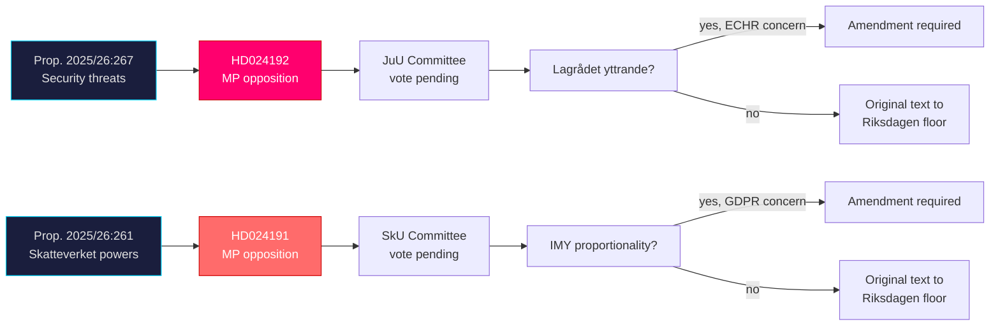

# Cross-Reference Map — Motions 2026-05-26

**Date**: 2026-05-26 | **Analyst**: James Pether Sörling

---

## Policy Clusters

### Cluster 1: National Security / Migration Law
- **HD024192** → prop. 2025/26:267 (parent proposition)
- Committee: JuU (Justitieutskottet)
- Cross-links: ECHR Art. 5/8; Barnkonventionen (SFS 2018:1197); UN CRC Art. 37; Migrationsverket implementation

### Cluster 2: Administrative Law / Data Protection
- **HD024191** → prop. 2025/26:261 (parent proposition)
- Committee: SkU (Skatteutskottet)
- Cross-links: GDPR Art. 5; Skatteverket mandates; folkbokföring register; IMY oversight

---

## Legislative Chains

---

## Coordinated Activity Patterns

**Pattern observed**: Both motions are filed by MP on the same date (2026-05-22) and both oppose government-backed propositions in different committees (JuU and SkU). This is a coordinated political communications strategy — a single news cycle to establish MP's opposition platform before the summer recess.

**Underlying theme**: Both motions invoke EU/international legal frameworks (ECHR, GDPR) as the basis for opposition — suggesting a consistent strategy of framing Swedish government overreach in EU law terms for international credibility.

---

## Sibling Folder References

- `analysis/daily/2026-05-26/propositions/` — analysis of government propositions including potentially prop. 2025/26:267 and 2025/26:261 (check sibling folder)
- `analysis/daily/2026-05-26/committeeReports/` — check for any JuU or SkU reports relevant to these motions

---

## Related Document Index

| Type | dok_id / reference | Relation |
|------|--------------------|----------|
| Parent proposition | 2025/26:267 | HD024192 responds to this |
| Parent proposition | 2025/26:261 | HD024191 responds to this |
| Legal basis | ECHR Art. 5 | Constitutional constraint on HD024192 |
| Legal basis | ECHR Art. 8 | Family life — HD024192 children's detention |
| Legal basis | GDPR Art. 5 | Proportionality — HD024191 Skatteverket |
| Swedish law | Barnkonventionen SFS 2018:1197 | Binding on HD024192 analysis |
| Institutional | Lagrådet (lagradet.se) | Constitutional review of both propositions |
| Institutional | IMY (imy.se) | GDPR oversight of prop. 2025/26:261 |

---

*Sources: HD024192 [A2], HD024191 [A2]; legislative database analysis*
