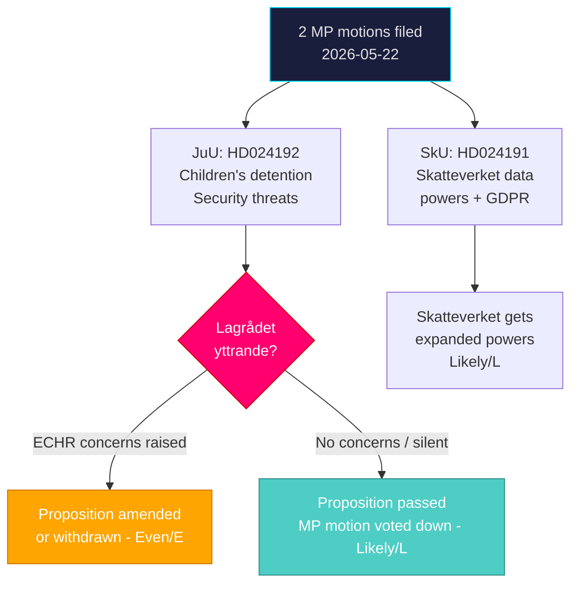

# Executive Brief — Swedish Opposition Motions: Children's Detention and Skatteverket Powers

**Date**: 2026-05-26 | **Type**: Motions Analysis | **Depth**: Deep
**Author**: James Pether Sörling | **Classification**: PUBLIC — GDPR Art. 9(2)(e,g)

---

## BLUF

Two Miljöpartiet (MP) committee motions filed 2026-05-22 oppose specific provisions of government propositions advancing through Riksdagen: MP seeks to block children's detention in the security-threat proposition (prop. 2025/26:267, HD024192/JuU) and calls for stronger data protections in the Skatteverket folkbokföring expansion (prop. 2025/26:261, HD024191/SkU). Both motions will likely be voted down by the Tidö-coalition majority but represent strategic election-year positioning on rights and privacy by a party polling at 4–5% and seeking identity differentiation.

## 60-Second Intelligence Summary

- **HD024192** (MP, JuU): Opposes children's detention provisions in prop. 2025/26:267 on qualified security threats; invokes UN CRC, ECHR Art. 5/8, and Barnkonventionen. Likely rejected by JuU majority (M+SD+KD+L). ⚠️ *Constitutional risk*: ECHR compliance of children's detention is genuinely contested; Lagrådet review status unverified.
- **HD024191** (MP, SkU): Calls for government to return with proposals ensuring GDPR-compliant data protection in Skatteverket's expanded population-register powers (prop. 2025/26:261). Likely rejected by SkU majority but proposal may influence committee report language.
- **Election signal**: Both motions are public positioning ahead of September 2026 riksdagsval. MP frames itself as the rights-protective opposition.
- **IMF economic context** (WEO Apr-2026): Sweden's GDP growth projected +2.4% (2026), fiscal surplus maintained; Skatteverket expansion is within normal administrative budget envelope.
- **Top forward trigger**: Lagrådet yttrande on prop. 2025/26:267 — if Lagrådet raises ECHR concerns on children's detention, government may be forced to amend the proposition before JuU vote.

## Decisions This Analysis Supports

1. **Policy analysts and civil society**: Monitor Lagrådet yttrande on prop. 2025/26:267 — it is the key pivot for whether children's detention provisions survive.
2. **Political risk analysts**: Assess whether S and V will support or oppose HD024192 in JuU — their position determines whether the government faces a broader coalition challenge.
3. **Privacy practitioners / NGOs**: Track SkU committee report on prop. 2025/26:261 to assess whether data protection concerns raised by MP are incorporated into final text.

## Key Intelligence Assessment

## Top Forward Trigger (72h–week horizon)

**Lagrådet yttrande on prop. 2025/26:267** — expected within JuU deliberation window (before summer recess). If Lagrådet raises Art. 5 ECHR concerns on children's detention, this becomes a L2+ intelligence event requiring immediate reassessment. Monitor: https://www.lagradet.se/

**WEP confidence**: The outcome is Likely (L) that motions are voted down, Even (E) that ECHR issues force amendments.

---

*Sources: HD024192 (data.riksdagen.se, 2026-05-22, [A2]); HD024191 (data.riksdagen.se, 2026-05-22, [A2]); IMF WEO Apr-2026 [B1]*
