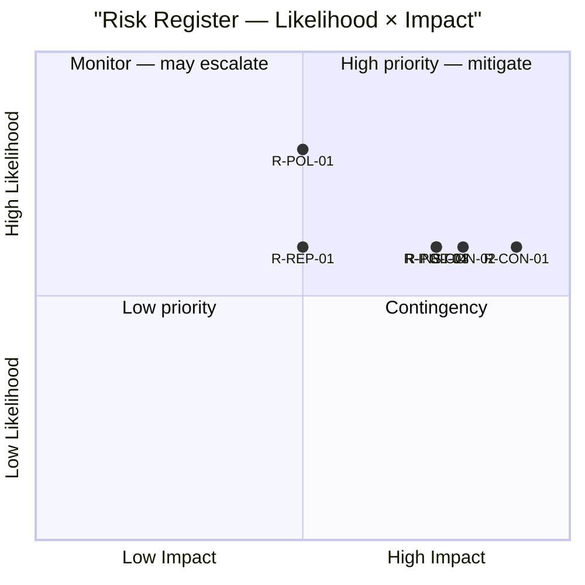

# Risk Assessment — MP Motions on Security and Taxation, 2026-05-26

**Framework**: 5-dimension political risk register (L×I scores, cascading chains)
**Date**: 2026-05-26 | **Analyst**: James Pether Sörling

---

## 5-Dimension Risk Register

### Dimension 1: Constitutional/Legal Risk

| Risk ID | Description | Likelihood (L) | Impact (I) | L×I | Source | Admiralty |
|---------|-------------|---------------|-----------|-----|--------|-----------|
| R-CON-01 | Prop. 2025/26:267 children's detention provisions violate ECHR Art. 5 → European Court of Human Rights condemnation | 3 | 5 | **15** | HD024192; ECHR Art. 5 jurisprudence | C3 |
| R-CON-02 | Lagrådet raises constitutional concerns on RF Chapter 2 (liberty rights) for children's detention | 3 | 4 | **12** | HD024192; RF 2 kap. 8§ | C2 |
| R-CON-03 | Prop. 2025/26:261 Skatteverket powers violate GDPR Art. 5 proportionality — IMY enforcement action | 2 | 3 | **6** | HD024191; GDPR Art. 5 | D3 |

**Posterior probability estimate**: P(R-CON-01 materialises within 24 months) = 0.35 | P(R-CON-02 in JuU deliberation) = 0.40

### Dimension 2: Political Risk

| Risk ID | Description | L | I | L×I | Source | Admiralty |
|---------|-------------|---|---|-----|--------|-----------|
| R-POL-01 | MP motion is isolated — S and V vote with government majority on security proposition | 4 | 3 | **12** | Parliamentary composition analysis | B3 |
| R-POL-02 | Opposition mounts broader challenge (C joins MP on ECHR grounds) | 2 | 4 | **8** | Centerpartiet historical support for Barnkonventionen | C3 |
| R-POL-03 | Government forced to amend prop. 2025/26:267 before summer recess (political cost) | 2 | 3 | **6** | HD024192; C3 |
| R-POL-04 | MP fails to clear 4% threshold in Sept. 2026 — motions become historical footnotes | 3 | 4 | **12** | Poll data (approx. 4–5%) | B4 |

### Dimension 3: Institutional Risk

| Risk ID | Description | L | I | L×I | Source | Admiralty |
|---------|-------------|---|---|-----|--------|-----------|
| R-INST-01 | Skatteverket folkbokföring expansion implemented without adequate data protection review → trust erosion | 3 | 3 | **9** | HD024191; GDPR Art. 5 | C3 |
| R-INST-02 | JuU fails to conduct adequate rights review of prop. 2025/26:267 → constitutional legitimacy challenge | 2 | 4 | **8** | HD024192 | C3 |
| R-INST-03 | Barnkonventionen invoked in domestic court challenge to children's detention post-enactment | 3 | 4 | **12** | Swedish law since 2020 | C2 |

### Dimension 4: Economic Risk

| Risk ID | Description | L | I | L×I | Source | Admiralty |
|---------|-------------|---|---|-----|--------|-----------|
| R-ECON-01 | Skatteverket expansion requires IT procurement and staffing above current budget envelope | 3 | 2 | **6** | HD024191; IMF WEO Apr-2026 SWE fiscal | B2 |
| R-ECON-02 | ECtHR damages award to child detainees → state liability | 2 | 2 | **4** | HD024192; ECtHR jurisprudence | D3 |

**IMF economic context** (WEO Apr-2026): Sweden GDP growth 2026 est. +2.4%; fiscal surplus maintained. Skatteverket IT expansion is within budget envelope of a fiscally sound state. Economic risk is low.

### Dimension 5: Reputational/International Risk

| Risk ID | Description | L | I | L×I | Source | Admiralty |
|---------|-------------|---|---|-----|--------|-----------|
| R-REP-01 | UN Committee on the Rights of the Child (CRC) issues recommendation against Sweden's child detention | 3 | 3 | **9** | HD024192; UN CRC review cycle | C3 |
| R-REP-02 | EU Commission monitoring of GDPR compliance in Skatteverket expansion | 2 | 3 | **6** | HD024191; GDPR Art. 5 | D3 |
| R-REP-03 | Sweden's international human rights reputation damaged if ECHR violation confirmed | 2 | 4 | **8** | HD024192 | C3 |

---

## Risk Priority Matrix

## Top 5 Risks by L×I Score

| Rank | Risk ID | Score | Description |
|------|---------|-------|-------------|
| 1 | R-CON-01 | 15 | ECHR violation — European Court judgment on children's detention |
| 2 | R-CON-02 | 12 | Lagrådet constitutional concerns |
| 2 | R-POL-01 | 12 | MP isolated in JuU vote |
| 2 | R-INST-03 | 12 | Post-enactment Barnkonventionen domestic challenge |
| 2 | R-POL-04 | 12 | MP election threshold risk |

---

## Cascading Risk Chains

**Chain 1**: Lagrådet raises ECHR concerns (R-CON-02) → Government forced to amend (R-POL-03) → Committee delay → Summer recess postpones vote → ECHR monitoring closes (reduces R-CON-01)

**Chain 2**: Prop. 2025/26:267 passes unchanged → Barnkonventionen domestic challenge (R-INST-03) → ECtHR filing → Judgment against Sweden (R-CON-01) → Compensatory damages + reputational damage (R-REP-03)

**Chain 3**: Skatteverket expansion without amendment (HD024191 voted down) → IMY opens proportionality inquiry (R-CON-03) → GDPR compliance proceedings → Reputational pressure on SkU

---

*Sources: HD024192 [A2], HD024191 [A2]; ECHR Art. 5/8 [A1]; GDPR Art. 5 [A1]; Barnkonventionen SFS 2018:1197 [A1]; IMF WEO Apr-2026 [B1]*
