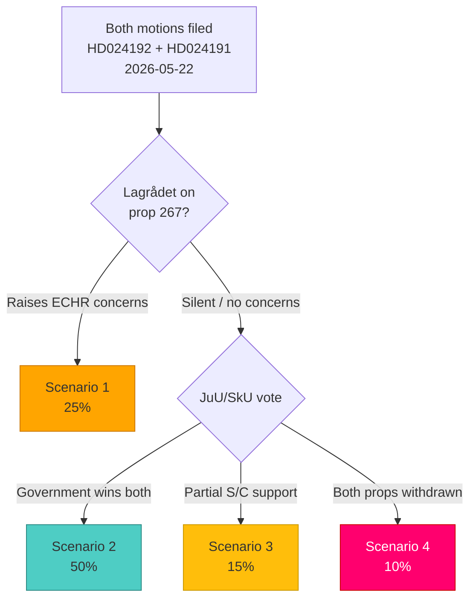

# Scenario Analysis — MP Motions on Security and Taxation, 2026-05-26

**Scenarios**: 4 (covering children's detention and Skatteverket dimensions)
**Date**: 2026-05-26 | **Analyst**: James Pether Sörling

---

## Scenario Framework

Four scenarios covering the most likely outcomes for both motions, with probabilities summing to 100%:

**Probability total**: 25 + 50 + 15 + 10 = 100% ✓

---

## Scenario 1: Constitutional Correction (25%)

**Description**: Lagrådet raises ECHR Art. 5/CRC Art. 37 concerns on children's detention provisions of prop. 2025/26:267. Government agrees to amend the proposition, removing or significantly restricting child detention powers. JuU passes amended version. HD024192 motion's core demand is substantially met — though MP does not receive formal credit.

**Leading indicators**:
- Lagrådet yttrande publication mentioning Art. 5 ECHR or Barnkonventionen in the next 2–3 weeks
- JuU committee requesting additional consultation or requesting government to return with amendments
- Media reports of government legal department revising proposition

**Outcome for motions**: HD024192 achieves de facto outcome without parliamentary vote win. HD024191 likely voted down regardless (SkU). MP can claim vindication.

**IMF economic impact**: Negligible — security legislation does not affect GDP or fiscal balance.

---

## Scenario 2: Status Quo / Majority Win (50%)

**Description**: Both propositions pass through JuU and SkU without substantive amendment. Both MP motions are voted down. Government argues security necessity (prop. 267) and administrative efficiency (prop. 261). Skatteverket receives expanded powers. Security-threat detention framework enacted including controversial child detention provisions.

**Leading indicators**:
- Lagrådet silent or raises only minor technical concerns
- S-party JuU members signal support for government majority
- No extraordinary committee hearings called
- JuU and SkU committee reports published on schedule (June 2026)

**Outcome for motions**: Both voted down. MP uses parliamentary record for election campaign. Risk of post-enactment ECHR challenge remains.

---

## Scenario 3: Partial Amendment — SkU Compromise (15%)

**Description**: SkU incorporates some data protection language into its committee report on prop. 2025/26:261, reflecting concerns raised by MP and potentially supported by C or L members with liberal rights traditions. JuU votes down HD024192 without significant amendment. Government accepts minor SkU language changes. A hybrid outcome — MP partially successful on privacy, unsuccessful on security.

**Leading indicators**:
- SkU committee hearing invites IMY testimony on GDPR proportionality
- C or L SkU members signal support for privacy safeguards
- JuU proceeds without amendment request

**Outcome for motions**: HD024191 achieves partial outcome via committee influence. HD024192 voted down.

---

## Scenario 4: Summer Deferral / Withdrawal (10%)

**Description**: One or both propositions are deferred past the summer recess due to unresolved constitutional or legislative process issues (Lagrådet concerns, inter-ministerial disagreement, coalition pressure). Motions remain on record but the vote is postponed to riksmöte 2026/27 — after the September 2026 election. In the post-election scenario, a changed parliamentary composition could alter the outcome entirely.

**Leading indicators**:
- Government formally withdraws or defers proposition before JuU/SkU scheduled committee report
- Coalition disagreement reported (e.g. L rebelling on children's detention)
- Summer recess begins without committee report publication

**Outcome for motions**: Motions archived; re-filed or superseded by post-election legislation.

---

## Scenario Probability Summary

| Scenario | Probability | Key driver | Primary beneficiary |
|----------|-------------|-----------|---------------------|
| 1 — Constitutional correction | 25% | Lagrådet ECHR concern | MP (de facto win on HD024192) |
| 2 — Status quo / majority win | 50% | Government majority cohesion | Tidö coalition |
| 3 — SkU partial compromise | 15% | Privacy coalition in SkU | MP partial (HD024191) |
| 4 — Summer deferral | 10% | Constitutional/coalition issue | Uncertain; election reset |

---

*Sources: HD024192 [A2], HD024191 [A2]; parliamentary composition [B3]; ECHR jurisprudence [A1]*
