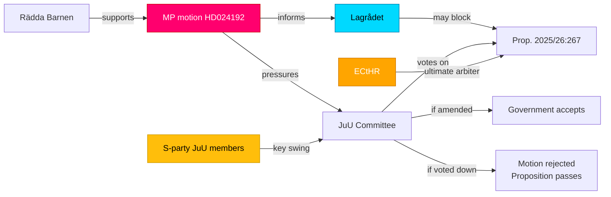

# Stakeholder Perspectives — MP Motions on Security and Taxation, 2026-05-26

**Framework**: 6-lens stakeholder matrix + influence network
**Date**: 2026-05-26 | **Analyst**: James Pether Sörling

---

## Primary Stakeholders

### Lens 1: Parliamentary Actors

| Actor | Position | Interest | Influence | Evidence | Admiralty |
|-------|----------|----------|-----------|----------|-----------|
| MP (Miljöpartiet) | OPPOSE both propositions | Rights protection; election positioning | Low (minority ~4–5%) | HD024192, HD024191 — motion authors | A2 |
| M (Moderaterna) | SUPPORT both propositions | Government party; security credibility | High (government lead) | Tidö coalition | B3 |
| SD (Sverigedemokratarna) | SUPPORT prop. 2025/26:267; likely SUPPORT 2025/26:261 | Anti-immigration security; administrative efficiency | High (government partner) | Tidö coalition | B3 |
| KD (Kristdemokraterna) | SUPPORT both propositions | Government party; Christian democratic family values present tension on children's detention | Medium-High | Tidö coalition | B3 |
| L (Liberalerna) | SUPPORT both propositions; potential tension on rights | Government party; liberal rights tradition in tension with children's detention | Medium-High | Tidö coalition | B3 |
| S (Socialdemokraterna) | AMBIGUOUS on HD024192; likely SUPPORT HD024191 | Main opposition; security credibility; data protection | High (main opposition) | [unconfirmed — no S statement found] | C4 |
| V (Vänsterpartiet) | Likely OPPOSE HD024192 children's detention | Consistent rights protection position | Low | [unconfirmed] | D4 |
| C (Centerpartiet) | UNCERTAIN on HD024192; Barnkonventionen history | Historically supported Barnkonventionen; possible ECHR concern | Medium | [unconfirmed] | D4 |

### Lens 2: Government and Administration

| Actor | Position | Interest | Influence |
|-------|----------|----------|-----------|
| Justitiedepartementet | Supports prop. 2025/26:267 | Security framework implementation | High |
| Finansdepartementet | Supports prop. 2025/26:261 | Skatteverket operational capacity | High |
| Skatteverket | Supports expanded powers (HD024191 opposed) | Operational mandate, fraud reduction | Medium |
| Migrationsverket | Implements prop. 2025/26:267 | Security-threat detention operations | Medium |

### Lens 3: Judiciary and Legal Bodies

| Actor | Position | Interest | Influence |
|-------|----------|----------|-----------|
| Lagrådet | PENDING review of prop. 2025/26:267, 261 | Constitutional compliance | Very High (can force amendment) |
| Swedish courts (förvaltningsdomstolar) | Neutral/implementers | Legal certainty; ECHR compliance | High (post-enactment) |
| IMY (Integritetsskyddsmyndigheten) | Oversight of prop. 2025/26:261 | GDPR Art. 5 compliance | Medium-High |

### Lens 4: International Bodies

| Actor | Position | Interest | Influence |
|-------|----------|----------|-----------|
| European Court of Human Rights | Potential case jurisdiction | ECHR Art. 5/8 compliance | Very High (post-enactment; long timeline) |
| UN Committee on the Rights of the Child | Monitoring Swedish compliance | CRC Art. 37 | Medium (soft pressure, reporting cycle) |
| EU Commission | GDPR monitoring | Art. 5 proportionality | Medium |
| UNHCR | Monitoring children's detention in migration | Refugee children's protection | Medium |

### Lens 5: Civil Society and NGOs

| Actor | Position | Interest | Influence |
|-------|----------|----------|-----------|
| Rädda Barnen (Save the Children Sweden) | OPPOSE children's detention (aligned with HD024192) | Child welfare | Medium (public opinion) |
| ECPAT Sverige | Concerned about child detention security context | Child protection | Low-Medium |
| Civil Rights Defenders | Oppose both propositions on rights grounds | Rights protection | Low-Medium |
| Integritetsskyddsföreningen (privacy NGOs) | Oppose HD024191 scope | Data privacy | Low |

### Lens 6: Public and Media

| Actor | Position | Interest | Influence |
|-------|----------|----------|-----------|
| Swedish public opinion | Divided: security vs. rights | Security AND rights | High (election context) |
| Public broadcaster (SVT/SR) | Neutral reporting | Democratic accountability | High (agenda-setting) |
| Aftonbladet/Expressen | Historically populist on security | Audience engagement | Medium |

---

## Influence Network Diagram

---

## Key Named Actors

- **Ulrika Westerlund (MP)**: Lead signatory, HD024192. Party spokesperson on rights issues. Visible voice on LGBTQ+ and children's rights.
- **Annika Hirvonen (MP)**: Lead signatory, HD024191. Party spokesperson on legal affairs and data protection.
- **JuU committee chair**: Holds procedural power on agenda and timeline for prop. 2025/26:267 deliberation.
- **SkU committee chair**: Procedural power on prop. 2025/26:261 deliberation.

---

*Sources: HD024192 [A2], HD024191 [A2]; Parliamentary composition data [B3]; [unconfirmed] party positions noted where source not found*
