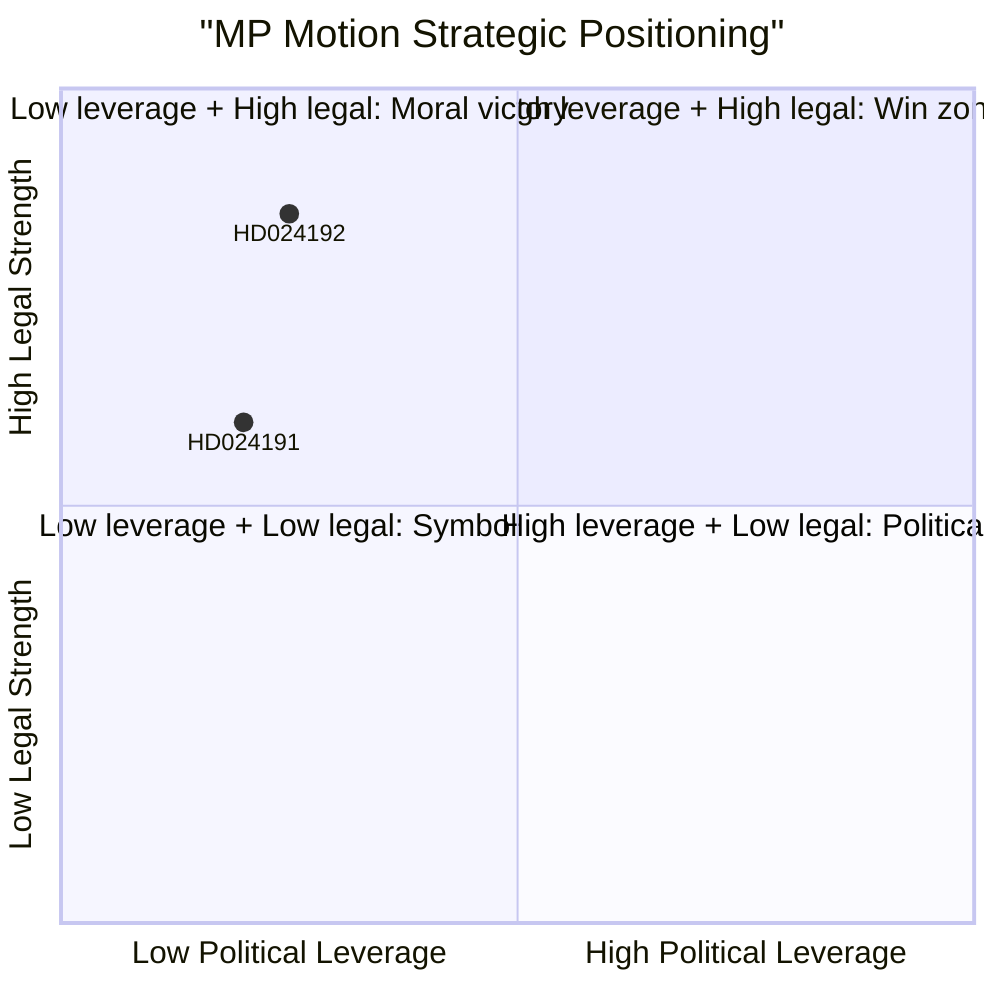

# SWOT Analysis — MP Motions on Security Threats and Skatteverket, 2026-05-26

**Date**: 2026-05-26 | **Analyst**: James Pether Sörling
**Framework**: Political SWOT with TOWS matrix and cross-SWOT integration

---

## SWOT Matrix

### Strengths

| Evidence row | dok_id | Admiralty |
|---|---|---|
| **S1 — Rights-based legal arguments**: HD024192 invokes Barnkonventionen (Swedish law since 2020), UN CRC Art. 37, and ECHR Art. 5/8 — all binding. The legal case against child detention is substantively strong and supported by established international jurisprudence. | HD024192 | B2 |
| **S2 — Cross-party resonance potential**: Children's rights arguments (HD024192) may attract support from centrist parties (C) that have historically supported Barnkonventionen implementation. | HD024192 | C3 |
| **S3 — GDPR alignment**: HD024191's data protection arguments align with EU regulatory direction — GDPR Art. 5 proportionality is an established norm. IMY has enforcement authority. | HD024191 | B2 |
| **S4 — Public salience of children's rights**: Child detention by the state is viscerally salient to Swedish public opinion, amplifying media attention potential. | HD024192 | B3 |

### Weaknesses

| Evidence row | dok_id | Admiralty |
|---|---|---|
| **W1 — Minority position**: MP holds approximately 4–5% support in polls; the party cannot pass these motions without broader coalition support. | B3 |
| **W2 — Asymmetric framing risk**: Opposing security-threat legislation risks being framed as "soft on terrorism" by Tidö-coalition actors (SD especially). | HD024192 | C3 |
| **W3 — No specific alternative model**: HD024191 calls for government to return with proposals but does not offer specific design for GDPR-compliant folkbokföring alternative — weakens the motion's constructive appeal. | HD024191 | B2 |
| **W4 — Limited SkU allies**: SkU committee composition likely reflects government majority; MP has limited leverage to force substantive amendments to prop. 2025/26:261. | HD024191 | B3 |

### Opportunities

| Evidence row | dok_id | Admiralty |
|---|---|---|
| **O1 — Lagrådet intervention**: If Lagrådet raises ECHR Art. 5 concerns on children's detention in prop. 2025/26:267, government may be forced to amend — MP's motion becomes validated. | HD024192 | C2 |
| **O2 — EU Commission scrutiny**: Increasing EU-level scrutiny of member states' compliance with ECHR in immigration cases provides external support for MP's position. | HD024192 | C3 |
| **O3 — IMY enforcement**: If Integritetsskyddsmyndigheten opens inquiry into Skatteverket expansion, MP's data protection arguments gain institutional backing. | HD024191 | D3 |
| **O4 — Election 2026 momentum**: Rights-protective positioning generates media visibility that MP needs to cross the 4% threshold in September 2026. | B3 |

### Threats

| Evidence row | dok_id | Admiralty |
|---|---|---|
| **T1 — Security narrative dominance**: Post-2024 geopolitical environment (Russia-Ukraine, terrorism incidents) creates political risk in opposing security legislation. | HD024192 | B3 |
| **T2 — S-party ambiguity**: If S votes to support prop. 2025/26:267 (including child detention) in JuU, MP is isolated as far-left position rather than broad centre-left coalition. | HD024192 | C3 |
| **T3 — Technocratic efficiency framing**: Government can frame folkbokföring expansion as anti-fraud measure (ghost addresses, benefit fraud) — politically popular across party lines. | HD024191 | B2 |
| **T4 — Electoral threshold risk**: At 4–5% polls, MP faces existential pressure; controversial positions on security may alienate moderate voters the party needs. | D4 |

---

## TOWS Matrix (Strategic options)

| | **Opportunities** | **Threats** |
|---|---|---|
| **Strengths** | **S-O (Maxi-Maxi)**: Leverage Lagrådet (O1) + Barnkonventionen (S1) to build a strong legal-constitutional case that attracts C (Centerpartiet) coalition — potential procedural win even if vote fails. | **S-T (Maxi-Mini)**: Use ECHR/GDPR legal precision (S1, S3) to neutralise "soft on security" framing (T1) — focus messaging on legal obligation rather than sympathy arguments. |
| **Weaknesses** | **W-O (Mini-Maxi)**: Address W3 by developing specific GDPR-compliant folkbokföring model — could attract IMY support (O3) and make HD024191 more constructively credible. | **W-T (Mini-Mini)**: MP's fundamental vulnerability (W1, W4) + security narrative (T1) = low-probability of changing legislative outcome; accept motions as positioning instruments, not policy change tools. |

---

## Cross-SWOT Integration

Both motions share a common strategic logic: MP is a rights-protective minority party using formal legislative instruments to go on record before the 2026 election. The SWOT pattern is similar for both — legally strong but politically weak. The key differentiator is HD024192's higher external leverage (ECHR, UN) which creates genuine uncertainty about the proposition's constitutional sustainability.

---

*Sources: HD024192 [A2], HD024191 [A2]; IMF WEO Apr-2026 [B1]; Admiraity Code applied throughout*
