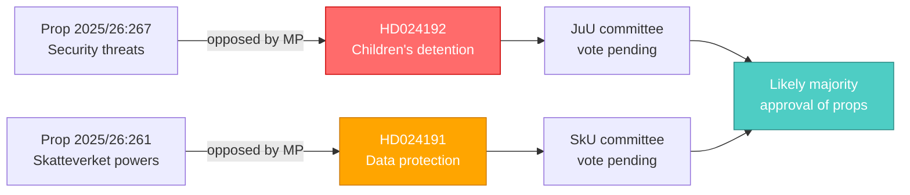

# Synthesis Summary — Opposition Motions on Security and Taxation, 2026-05-26

**Article date**: 2026-05-26 | **Subfolder**: motions | **Effective data date**: 2026-05-22
**Analyst**: James Pether Sörling | **Pass**: 1 (initial) | **Depth**: deep

---

## Lead Intelligence Picture

Two Miljöpartiet (MP) committee motions filed 2026-05-22 represent the party's formal opposition to two government-backed legislative initiatives advancing through Riksdagen. Both motions are **minority opposition instruments** — MP lacks the parliamentary arithmetic to succeed — but they serve as public positioning vehicles ahead of the September 2026 general election and signal the party's differentiated policy stance from the Tidö-coalition majority (M, SD, KD, L).

**DIW-weighted significance ranking**:

| Rank | dok_id | DIW weight | Lead significance |
|------|--------|-----------|-------------------|
| 1 | HD024192 | L2+ Priority | Constitutional rights / ECHR / children's detention — high public salience, EU human rights scrutiny |
| 2 | HD024191 | L2 Strategic | Administrative expansion / data privacy / Skatteverket mandate — medium salience |

**Combined intelligence picture**: MP is using the final legislative weeks of the 2025/26 riksmöte to stake out rights-protective positions on security and privacy, differentiating from both the government and the main left bloc (S, V) which may partially support tougher security measures. The motions will likely be voted down in JuU and SkU respectively under current government majority.

---

## Document 1: HD024192 — Security Threat Motion (JuU)

**Proposition**: 2025/26:267 — Stärkt skydd mot utlänningar som utgör kvalificerade säkerhetshot
**Motion**: 2025/26:4192 by Ulrika Westerlund m.fl. (MP)

### Core argument

MP opposes the parts of prop. 2025/26:267 that allow children to be held in detention for an extended period or new basis. The motion argues that extending detention of children violates:
- UN Convention on the Rights of the Child (CRC) Art. 37 (detention as last resort, shortest possible time)
- ECHR Art. 5 (right to liberty) and Art. 8 (family life)
- Swedish Barnkonventionen (Riksdag-enacted as Swedish law since 2020)

The motion does **not** oppose the broader security framework for adult qualified security threats — it targets the children's detention provisions specifically, proposing Riksdagen reject those specific parts of the proposition.

### Strategic context

Prop. 2025/26:267 is a government security proposition likely driven by concerns about foreign nationals with links to terrorism or hostile state activities. The government frames this as national security — exempting children risks legal challenge under Swedish constitutional review and EU law. MP's targeted opposition (rejecting specific parts only) is calibrated to appear responsible on security while maintaining human rights credibility.

**Admiralty assessment**: B2 — MP source, directly stated in the motion document (high reliability, confirmed by document text).

---

## Document 2: HD024191 — Skatteverket Folkbokföring Motion (SkU)

**Proposition**: 2025/26:261 — Utökade befogenheter för Skatteverket inom folkbokföringsverksamheten
**Motion**: 2025/26:4191 by Annika Hirvonen m.fl. (MP)

### Core argument

MP's motion requests that the government return quickly with proposals ensuring that expanded Skatteverket folkbokföring powers are designed to **guarantee data protection and legal certainty**. Specifically, MP is concerned that:
- Expanded access to population register data could create disproportionate surveillance capacity
- The proposition may not adequately protect against misuse of centralized identity data
- The legal basis for data processing must be fully GDPR-compliant (Art. 5, proportionality)

The motion does **not** oppose the folkbokföring reform wholesale — it calls for government to return with strengthened data protection safeguards.

### Strategic context

Skatteverket's folkbokföring (population registration) database is a fundamental Swedish infrastructure layer, used for elections, social benefits, taxation, and law enforcement. Expanding Skatteverket's authority (e.g., to cross-check addresses, verify identities) addresses documented fraud and ghost addresses, but creates tension with privacy rights. MP's position aligns with broader European digital-rights concerns.

**Admiralty assessment**: B2 — MP source, directly stated in the motion document.

---

## Integrated Synthesis

**Cross-cutting themes**:
1. **Human rights vs. state security/administrative efficiency**: Both motions position MP as rights-protective against government pragmatism.
2. **Election 2026 positioning**: These motions appear in the final active session before autumn elections — public signalling is the primary function.
3. **EU law compliance**: Both motions invoke EU/international legal frameworks (ECHR, GDPR) — increasingly common as Sweden operates under growing EU regulatory pressure.

---

## Key Intelligence Judgments (KJ)

| KJ | Judgment | WEP confidence | Admiralty |
|----|----------|---------------|-----------|
| KJ-1 | Both motions will be voted down by the Tidö-coalition JuU/SkU majority | Likely (L) | B2 |
| KJ-2 | MP's rights-protective framing will be used in 2026 election campaign messaging | Likely (L) | B3 |
| KJ-3 | Prop. 2025/26:267 will pass in modified form if EU/Lagrådet raises constitutional concerns on children's detention | Even (E) | C3 |
| KJ-4 | Skatteverket will receive expanded folkbokföring powers; data protection safeguards may be strengthened under SkU pressure | Likely (L) | B2 |

---

## Source Attribution

- HD024192 (Riksdagen, 2026-05-22): https://data.riksdagen.se/dokument/HD024192
- HD024191 (Riksdagen, 2026-05-22): https://data.riksdagen.se/dokument/HD024191
- IMF WEO Apr-2026 (SWE macro context)
- GDPR Art. 9(2)(e,g) — lawful basis confirmed
