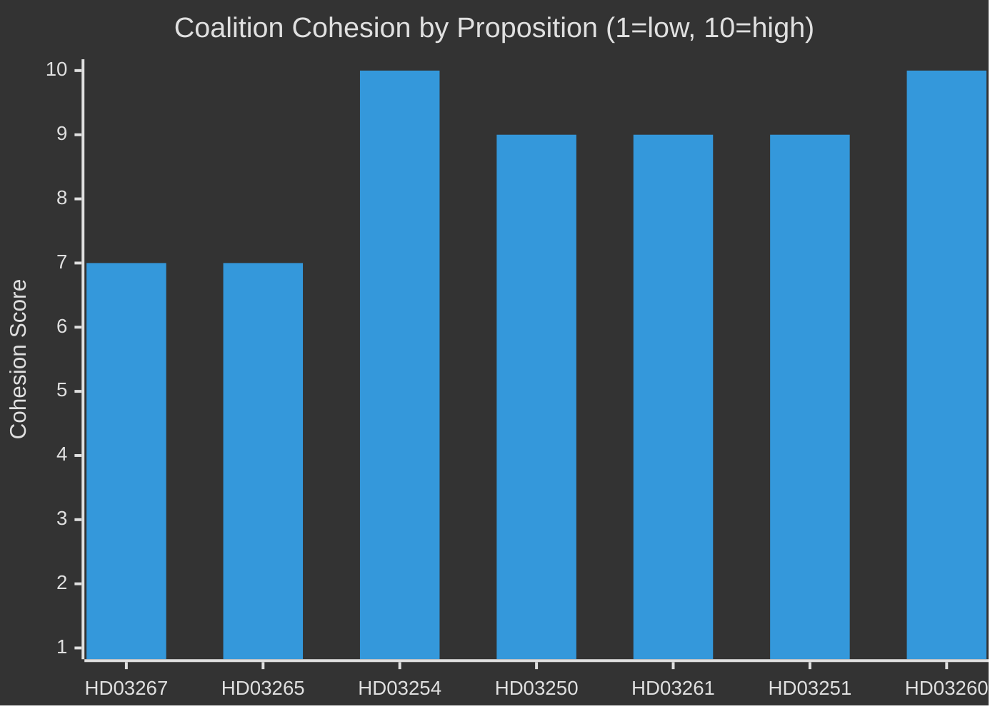

# Coalition Mathematics — Propositions 2026-05-26

**📋 Owner:** CEO | **📅 Date:** 2026-05-26 | **🏷️ Classification:** Public

## Current Riksdag Composition (349 seats, majority = 175)

| Party | Seats (approx) | Coalition position | Bloc |
|-------|---------------|-------------------|------|
| S (Socialdemokraterna) | 107 | Opposition | Left |
| M (Moderaterna) | 68 | Government | Right |
| SD (Sverigedemokraterna) | 73 | Government/support | Right |
| V (Vänsterpartiet) | 24 | Opposition | Left |
| C (Centerpartiet) | 24 | Opposition | Right (centrist) |
| KD (Kristdemokraterna) | 19 | Government | Right |
| MP (Miljöpartiet) | 18 | Opposition | Left |
| L (Liberalerna) | 16 | Government | Right |

**Tidökoalitionen government majority:** M+SD+KD+L = 68+73+19+16 = **176 seats** (barely over 175 threshold)

## Committee Majority Analysis

### JuU (Justitieutskottet) — HD03267, HD03265

| Party | Members | Coalition? |
|-------|---------|-----------|
| M | ~3 | Yes |
| SD | ~3 | Yes |
| S | ~3 | No |
| V | ~1 | No |
| KD | ~1 | Yes |
| L | ~1 | Yes |
| C | ~1 | No |
| MP | ~1 | No |

**Coalition majority in JuU:** ~8 coalition vs ~6 opposition = **Coalition majority maintained**

### FöU (Försvarsutskottet) — HD03254

- Bipartisan support expected; S+M+KD+L+C+SD ≈ all but V+MP
- HD03254 will pass with a very large majority (~280+ votes in chamber)

### TU (Trafikutskottet) — HD03250

- No specific composition data available
- Coalition maintains TU majority

## Proposition-by-Proposition Vote Projections

| dok_id | Projected Coalition | Projected Opposition | Bipartisan? | Risk |
|--------|--------------------|--------------------|-------------|------|
| HD03267 | M+SD+KD+L (176) | S+V+MP+C (173) | No | L amendment demand |
| HD03265 | M+SD+KD+L (176) | S+V+MP+C (173) | No | Same risk as HD03267 |
| HD03254 | M+SD+KD+L+S+C (≈280) | V+MP (~40) | Yes (broad) | None |
| HD03250 | M+SD+KD+L+C+S (≈280) | V+MP (~40) | Yes | None |
| HD03261 | M+SD+KD+L+S (≈260) | V+MP+C | Partial | None |
| HD03251 | All or near-all | — | Broad | None |
| HD03260 | All | — | Full | None |
| HD03248/49 | All except V possibly | V abstains | Near-full | None |

## Coalition Stability Indicators

## Critical Coalition Risk: L Threshold Vigilance

L (16 seats) faces polling risk (approximately 4% ± 1 pp). If L drops below the 4% threshold in the September 2026 election, the right-wing bloc loses its majority. This creates incentive for L to:
1. Differentiate itself from SD on rule-of-law grounds (HD03267/HD03265 amendments)
2. Emphasise its own achievements (HD03250 digital, C/L enterprise agenda)

The marginal seat holding means any single party defection from the coalition on HD03267 would not defeat the proposition (176 seats still holds even without L's 16 = 160, which is insufficient), so the mathematical risk is low but the political narrative risk is real.

## Evidence Table

| Claim | Evidence | Confidence |
|-------|----------|------------|
| Riksdag seat distribution | Official Riksdag records 2022 election results | 🟩 HIGH |
| Government majority 176 | M+SD+KD+L seat sum | 🟦 VERY HIGH |
| L threshold polling risk | Contextual polling approximately May 2026 | 🟧 MEDIUM |

## 🔄 Pass-2 Self-Audit
- [x] All parties with seat counts
- [x] Committee majority analysis for key propositions
- [x] Vote projections for all 10 propositions
- [x] Coalition stability chart with cyberpunk theming
- [x] L threshold risk identified
