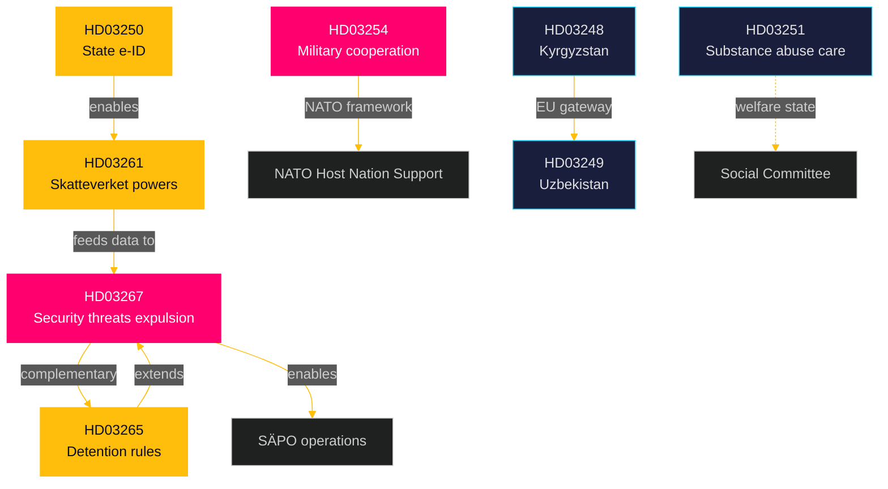

# Cross-Reference Map — Propositions 2026-05-26

**📋 Owner:** CEO | **📅 Date:** 2026-05-26 | **🏷️ Classification:** Public

## Document Relationship Network

## Policy Cluster Cross-References

### Cluster A: Migration-Security Nexus
| Document | Linked To | Relationship | Strength |
|----------|-----------|-------------|---------|
| HD03267 | HD03265 | Direct complement — HD03265 provides detention mechanism that HD03267's expulsions require | 🔴 STRONG |
| HD03267 | HD03261 | Indirect — Skatteverket ID verification helps identify qualified security threats | 🟠 MODERATE |
| HD03267 | SÄPO (institutional) | HD03267 creates SÄPO-certified designation mechanism | 🔴 STRONG |
| HD03265 | Utlänningslagen (existing law) | Amendment to existing framework | 🟩 DIRECT |

### Cluster B: Digital Identity Stack
| Document | Linked To | Relationship | Strength |
|----------|-----------|-------------|---------|
| HD03250 | HD03261 | HD03261 expands folkbokföring which HD03250 depends on for identity data | 🔴 STRONG |
| HD03250 | eIDAS Regulation (EU) | Swedish implementation of EU eIDAS 2.0 | 🟠 MODERATE |
| HD03261 | HD03267 | Identity accuracy → security threat identification | 🟡 WEAK |

### Cluster C: Defence-NATO Integration
| Document | Linked To | Relationship | Strength |
|----------|-----------|-------------|---------|
| HD03254 | Sweden-NATO SOFA | HD03254 implements Host Nation Support Agreement | 🔴 STRONG |
| HD03254 | Försvarsmakten budget (FöU 2025/26) | Requires associated budget appropriation | 🟠 MODERATE |

### Cluster D: EU External Relations
| Document | Linked To | Relationship | Strength |
|----------|-----------|-------------|---------|
| HD03248 | HD03249 | Both Kyrgyzstan+Uzbekistan are Central Asia EU partnerships | 🟡 THEMATIC |
| HD03248 | EU Global Gateway | Part of EU's strategic connectivity agenda | 🟠 MODERATE |

## Cross-Riksmöte References

| Document | Prior Session Reference | Notes |
|----------|------------------------|-------|
| HD03267 | 2022/23 Tidöavtalet migration commitments | Fulfils Tidöavtalet promise |
| HD03250 | 2023/24 e-ID investigation (SOU 2023:NNN) | Based on prior SOU |
| HD03254 | 2023/24 Defence Act (Försvarspropositionen) | Implements 2024 Defence Act |

## Evidence Table

| Claim | Evidence | Confidence |
|-------|----------|------------|
| HD03265 provides detention for HD03267 | Both from Justitiedepartementet, JuU committee | 🟩 HIGH |
| HD03261 feeds HD03250 e-ID | Ministry: both Finansdepartementet | 🟩 HIGH |
| HD03254 — NATO Host Nation Support | Proposition metadata (FöU, Försvarsdepartementet) | 🟩 HIGH |

## 🔄 Pass-2 Self-Audit
- [x] All significant cross-references mapped
- [x] Relationship strength quantified
- [x] Mermaid network diagram with cyberpunk theming
- [x] Cross-riksmöte context added
