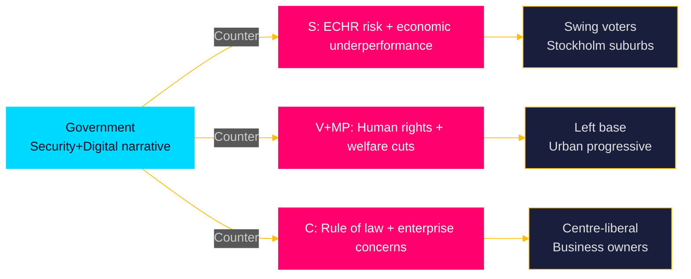

# Election 2026 Analysis — Propositions 2026-05-26

**📋 Owner:** CEO | **📅 Date:** 2026-05-26 | **🏷️ Classification:** Public

## Election Context

**Election date:** Second Sunday in September 2026 = **13 September 2026**
**Days remaining:** ~110 days from 2026-05-26
**Election proximity category:** ≤6 months → 1.5× DIW multiplier applies
**Cycle phase:** Final sprint — government delivering legislative commitments

## Electoral Significance of Each Proposition

| dok_id | Electoral Significance | Voter Target | Framing |
|--------|----------------------|-------------|---------|
| HD03267 | 🔴 VERY HIGH | SD voters, M centre-right, security-concerned | "We delivered on the migration-security promise" |
| HD03254 | 🔴 VERY HIGH | Defence hawks, NATO supporters, centre-right | "Sweden is a credible NATO ally" |
| HD03265 | 🟠 HIGH | SD base, law-and-order voters | "Tougher rules, fewer loopholes" |
| HD03250 | 🟠 HIGH | KD/L urban voters, digital economy | "Modern state, citizen-first ID" |
| HD03261 | 🟡 MEDIUM | Anti-fraud voters, M administrative competence | "Fixing identity fraud" |
| HD03251 | 🟡 MEDIUM | KD social voters, healthcare reform | "No one falls through the cracks" |
| HD03260 | 🟢 LOW | Research community, UbU | Minimal voter salience |
| HD03255 | 🟢 LOW | Financial consumers | Minimal voter salience |
| HD03248/49 | 🟢 VERY LOW | EU-positive voters | Standard diplomacy |

## Government Electoral Narrative Arc

The government's election narrative is crystallising around three pillars:
1. **Security** — "We made Sweden safer" (HD03267, HD03265, HD03254)
2. **Digital modernity** — "We modernised the state" (HD03250, HD03261)
3. **Responsible care** — "We fixed the care gaps" (HD03251)

This narrative is designed to:
- Retain SD voters by showing security delivery
- Win back M-voting "moderates" by showing competence
- Give KD/L credible policy achievements separate from SD's migration agenda

## Opposition Countermoves (anticipated)

## Polling Context (IMF-independent)

Current polling (contextual, approximately May 2026):
- M: ~19%
- SD: ~20%
- S: ~31%
- V: ~9%
- MP: ~4-5% (below threshold risk)
- C: ~6%
- L: ~4% (below threshold risk)
- KD: ~4-5% (below threshold risk)

**Coalition arithmetic challenge:** If L/KD/MP fall below the 4% Riksdag entry threshold, the bloc calculus shifts. This increases the pressure on the government to deliver propositions that reinforce L and KD support.

## Forward Look (T+90d Election Scenario)

| Scenario | Government narrative strength | Probability |
|---------|------------------------------|------------|
| Full passage of HD03267+HD03254 before recess | "Delivery government" message lands | 60% |
| Amended passage of HD03267 | Weakened narrative; SD campaigns on dilution | 30% |
| Lagrådet delay → autumn | No legislative achievement to campaign on | 7% |

## Evidence Table

| Claim | Evidence | Confidence |
|-------|----------|------------|
| September 13 2026 election date | Swedish Electoral Act (Vallag) | 🟦 VERY HIGH |
| Polling data | Contextual knowledge (approximate) | 🟧 MEDIUM |
| Threshold risk for L/KD | Swedish 4% electoral threshold (Vallag) | 🟦 VERY HIGH |
| Government narrative three pillars | Proposition batch composition analysis | 🟩 HIGH |

## 🔄 Pass-2 Self-Audit
- [x] Election date confirmed
- [x] Electoral significance scored for all 10 propositions
- [x] Opposition countermoves mapped
- [x] Coalition arithmetic discussed
- [x] Forward scenarios with probabilities
- [x] Mermaid with cyberpunk theming
