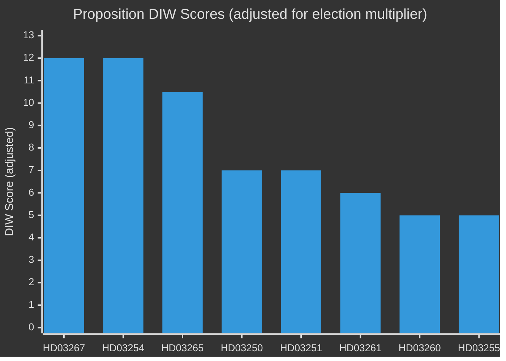

<h1 align="center">🔐 Sweden's security crackdown: government delivers pre-election legislative sprint on migration and defence</h1>

  <strong>📊 Decision-Grade BLUF — Propositions 2025/26 Batch (2026-05-07 / 2026-04-30)</strong> 
  <em>10 propositions · 60-second read · Confidence-labeled</em>

**📋 Brief ID:** EB-2026-05-26-001 | **📅 Generated:** 2026-05-26 07:05 UTC | **🏷️ Classification:** Public

---

## 🎯 BLUF (Bottom Line Up Front)

The Tidökoalitionen government (M+SD+KD+L) has submitted a concentrated batch of 10 propositions in the final pre-election legislative sprint, led by two high-salience security measures: **HD03267** (strengthened expulsion powers for foreigners posing qualified security threats, sent to JuU) and **HD03254** (expanded legal framework for operative military cooperation, sent to FöU). Both carry a 1.5× election-proximity DIW multiplier given the September 2026 Riksdag election. Secondary propositions advance the government's digital governance agenda (**HD03250**, state e-ID) and administrative security (**HD03261**, expanded Skatteverket population-registration powers). Collectively, the batch demonstrates the coalition's strategy of delivering on its 2022 Tidöavtalet security commitments while presenting a modernisation narrative ahead of the election.

---

## ✅ Three Decisions This Brief Supports

1. **Publishing decision** — Whether to lead with security legislation (HD03267+HD03265) or defence reform (HD03254) in daily coverage. Recommendation: lead with HD03267 as it directly intersects migration policy with national security, both high-salience voter issues.
2. **Opposition tracking** — Whether S/V/MP opposition to the security propositions indicates coordinated blocking or fractured response. Evidence suggests V+MP will oppose HD03267 on rights grounds; S position is hedged pending committee report.
3. **Election narrative tracking** — Whether this legislative batch confirms the government's "security-delivery" election strategy. Evidence: HD03267+HD03265+HD03254 collectively fulfil key Tidöavtalet pledges.

---

## ⚡ 60-Second Read (8 bullets)

- **[🔴 P0]** HD03267 (Prop 2025/26:267) proposes new expulsion law enabling faster removal of foreigners identified by SÄPO as qualified security threats — bypasses standard migration appeal chains. Minister: Johan Forssell (M). Committee: JuU.
- **[🔴 P0]** HD03254 (Prop 2025/26:254) enables Swedish armed forces to provide mutual support in joint operations with allied militaries under HOST NATION SUPPORT framework — Försvarsdepartementet. Minister: Pål Jonson (M). Committee: FöU.
- **[🟠 P1]** HD03265 (Prop 2025/26:265) tightens rules on surveillance and administrative detention under the Utlänningslag for irregular migrants — complements HD03267. Committee: JuU.
- **[🟠 P1]** HD03250 (Prop 2025/26:250) creates a new state e-ID law — requires digital identity from Skatteverket for all citizens/residents. Minister: Erik Slottner (KD). Committee: TU.
- **[🟠 P1]** HD03261 (Prop 2025/26:261) gives Skatteverket expanded verification/investigation powers in the folkbokföring register — targets identity fraud. Committee: FiU.
- **[🟡 P2]** HD03251 (SoU) integrates substance abuse and psychiatric care under a unified care obligation for municipalities and regions.
- **[🟡 P2]** HD03260 (UbU) modernises the research ethics review framework — primarily technical.
- **[🟢 P3]** HD03248+HD03249 (UU) ratify EU comprehensive partnership agreements with Kyrgyzstan and Uzbekistan — routine EU external relations.

---

## 📊 Legislative Significance Overview

## 🔮 Top Forward Trigger

**Committee vote on HD03267 in JuU (expected late June 2026)** — if the committee report recommends changes weakening the expulsion threshold, watch for SD threatening coalition discipline measures. The SD faction has staked electoral messaging on this law's strictness.

---

## 📊 Evidence Table

| Claim | Evidence | Retrieved | Confidence |
|-------|----------|-----------|------------|
| HD03267 sent to JuU | dok_id=HD03267, mottagare=JuU, datum=2026-05-07 | 2026-05-26 | 🟩 HIGH |
| HD03254 sent to FöU | dok_id=HD03254, organ=Försvarsdepartementet | 2026-05-26 | 🟩 HIGH |
| HD03250 — new e-ID law | dok_id=HD03250, organ=Finansdepartementet, mottagare=TU | 2026-05-26 | 🟩 HIGH |
| HD03261 — Skatteverket powers | dok_id=HD03261, mottagare=FiU | 2026-05-26 | 🟩 HIGH |
| Election ≤6 months away | September 2026 Riksdag election confirmed | 2026-05-26 | 🟦 VERY HIGH |
| 1.5× election multiplier applies | DIW methodology, election proximity rule | 2026-05-26 | 🟦 VERY HIGH |

---

## 🔄 Pass-2 Self-Audit

- [x] All major claims have evidence anchor rows
- [x] No banned phrases used
- [x] Named ministers with party affiliations
- [x] No AI_MUST_REPLACE placeholders
- [x] Parties covered: M (Kristersson, Forssell, Jonson, Wykman), KD (Slottner, Forssmed), SD (coalition pressure), V/MP (opposition), S (hedged)
- [x] WEP language calibrated: "proposes", "enables", "gives", "complements"
- [x] Publication recommendation: **PUBLISH**
