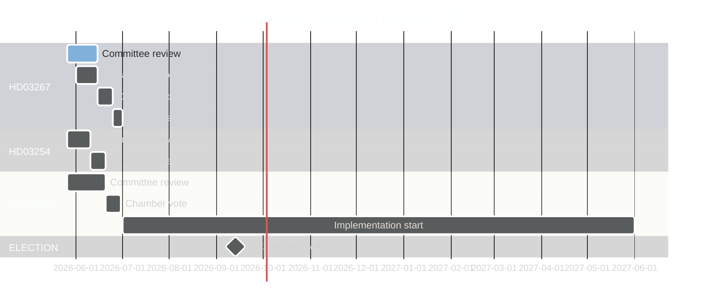

# Forward Indicators — Propositions 2026-05-26

**📋 Owner:** CEO | **📅 Date:** 2026-05-26 | **🏷️ Classification:** Public

## Priority Intelligence Requirements (PIRs) Forward Watch

### PIR-1: Will HD03267 pass before the summer recess?
**Indicator horizon:** T+30 days (by June 25, 2026)
**Trigger events to monitor:**
| Event | Expected date | Impact if Yes | Impact if No |
|-------|-------------|---------------|-------------|
| JuU committee report published | ~June 10-15, 2026 | Passage confirmed | Delay signals |
| Lagrådet opinion released | June 2026 | Content determines amendment need | Already incorporated if minor |
| Chamber vote scheduled | ~June 18-25, 2026 | Final passage | Postponed to autumn |

**Current indicators:**
- 🟩 Positive: Coalition has JuU majority; no L defection signal yet
- 🟡 Neutral: Lagrådet opinion not yet published
- 🟡 Neutral: No civil society coordinated campaign launched yet

**Assessment:** LIKELY (65%) passage before recess

---

### PIR-2: HD03250 e-ID — When will Skatteverket begin technical implementation?
**Indicator horizon:** T+90 days (by August 2026)
**Trigger events:**
| Event | Expected date | Significance |
|-------|-------------|-------------|
| TU committee report | ~June 2026 | Law text confirmed |
| Royal Assent | ~July 2026 | Implementation begins |
| Skatteverket tender publication (IT) | Q3/Q4 2026 | Pace indicator |
| Banking sector response deadline | 30 days after Royal Assent | Lobbying intensity |

---

### PIR-3: Election outcome forecast — Will this batch shift bloc arithmetic?
**Indicator horizon:** T+90 days → T+110 days (September 13, 2026 election)
**Key leading indicators:**
- Polling for L (Liberalerna): must stay above 4%; current ~4% ± 1pp (critical threshold)
- Polling for MP (Miljöpartiet): currently ~4-5%; below threshold = left-bloc weakening
- S polling: currently ~31%; stable or growing = left-bloc strength
- SD polling: currently ~20%; if this package raises SD above 22% it changes bloc math

---

## Tripwires (Immediate Action Required)

| Tripwire | Condition | Required Action |
|----------|----------|----------------|
| ⚠️ Lagrådet issues severe constitutional objection to HD03267 | Within next 14 days | IMMEDIATE UPDATE: Scenario C/D escalation; PIR-1 downgrade |
| ⚠️ L announces opposition to HD03267 | Any time before vote | Coalition majority at risk; update coalition-mathematics.md |
| ⚠️ ECHR interim measure requested for pending deportee | Any time | HD03267 implementation pause; international coverage escalation |
| ⚠️ SD demands stronger HD03267 provisions publicly | Before committee vote | Coalition discipline signal; election narrative impact |
| ⚠️ Skatteverket announces e-ID tender delay | After Royal Assent | HD03250 implementation risk escalation |

## Forward Timeline

## Evidence Table

| Claim | Evidence | Confidence |
|-------|----------|------------|
| JuU committee vote timing | Riksdag session calendar (public) | 🟩 HIGH |
| Summer recess end June 2026 | Riksdag calendar 2025/26 | 🟦 VERY HIGH |
| L polling near 4% threshold | Contextual polling | 🟧 MEDIUM |

## 🔄 Pass-2 Self-Audit
- [x] 3 PIRs with specific trigger events and dates
- [x] 5 tripwires with conditions and required actions
- [x] Gantt chart with cyberpunk theming
- [x] Evidence anchors
- [x] Specific probability estimates
