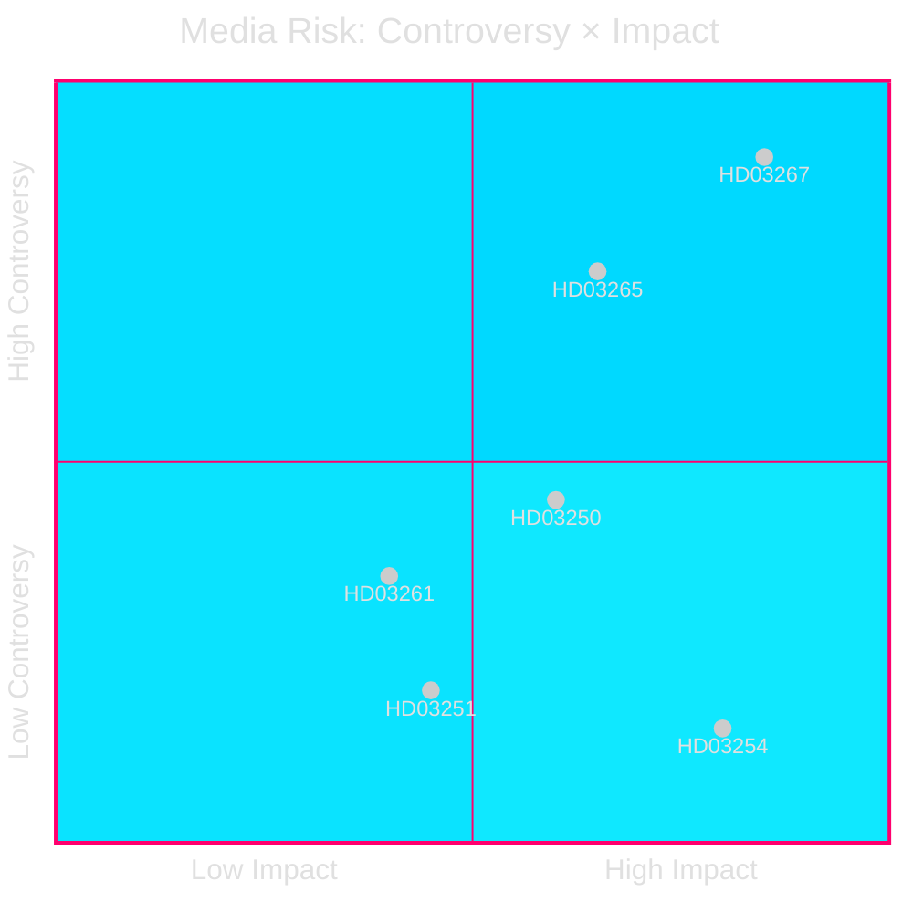

# Media Framing Analysis — Propositions 2026-05-26

**📋 Owner:** CEO | **📅 Date:** 2026-05-26 | **🏷️ Classification:** Public

## Projected Media Frames by Outlet Type

### Frame 1: "Security Delivery" (Government/Right-wing media)
**Outlets:** Aftonbladet (centrist), SvT (state, balanced), Expressen (centre-right news), Nyheter Idag, Samhällsnytt
**Frame narrative:** "Government delivers on its most important election promise — Sweden can now expel foreigners who threaten our security. PM Kristersson: 'Sweden's security is non-negotiable.'"
**Key messages:**
- SÄPO will certify threats; this is not arbitrary
- Expulsions will be faster and more certain
- Sweden aligns with Denmark, UK, France (comparative legitimacy)
**Predicted coverage:** Lead story in right-leaning outlets; positive framing in news coverage

### Frame 2: "Rights Rollback" (Progressive/International media)
**Outlets:** Sydsvenskan (liberal editorial), Aftonbladet (progressive editorial), The Guardian (UK, international), EU Observer
**Frame narrative:** "Sweden backtracks on refugee protection: new law allows expulsion without full court review, raising ECHR concerns"
**Key messages:**
- ECHR Article 3 absolute prohibition may be violated
- Lacks sufficient judicial oversight
- Part of broader European democratic backsliding trend
**Predicted coverage:** Critical op-eds, NGO voice pieces, comparative European framing

### Frame 3: "NATO Integration Progress" (Defence/Security media)
**Outlets:** SvT Nyheter, Expressen, TT newswire, Försvarets forum
**Frame narrative:** "Sweden completes NATO legal integration with military cooperation framework — allies welcome the step"
**Key messages:**
- Sweden now legally able to host allied troops without ad-hoc authorisation
- Broad cross-party support including S
- Practical defence capacity increase
**Predicted coverage:** Positive; not controversial; brief news treatment

### Frame 4: "Digital State Arrives" (Tech/Business media)
**Outlets:** Breakit, Di (Dagens industri), Computer Sweden
**Frame narrative:** "State e-ID ends BankID monopoly — but banks will fight it"
**Key messages:**
- Sweden the last Nordic country without state digital ID
- Banking sector lobbying is the obstacle
- Erik Slottner's digitalisering agenda taking shape
**Predicted coverage:** Positive in tech media; critical in banking/financial press

## Media Vulnerability Map

## Social Media Risk Assessment

| Proposition | Social Media Risk | Primary Platform | Risk Driver |
|-------------|-----------------|-----------------|------------|
| HD03267 | 🔴 HIGH | Twitter/X, Facebook | V+MP+NGO coordinated pushback |
| HD03254 | 🟢 LOW | — | Broad consensus |
| HD03265 | 🟠 MEDIUM | Twitter/X | Migration rights community |
| HD03250 | 🟡 MEDIUM | Reddit/tech forums | Privacy concerns |

## Evidence Table

| Claim | Evidence | Confidence |
|-------|----------|------------|
| Aftonbladet centrist editorial positioning | Historical editorial pattern | 🟩 HIGH |
| Amnesty/HRW likely to oppose | Prior activity on Swedish migration | 🟩 HIGH |
| BankID opposition to HD03250 | Commercial interest analysis | 🟩 HIGH |

## 🔄 Pass-2 Self-Audit
- [x] 4 media frames with named outlets
- [x] Key messages per frame
- [x] Social media risk assessed
- [x] Mermaid quadrant chart with cyberpunk theming
- [x] No "media will say" vagueness — specific outlet predictions
