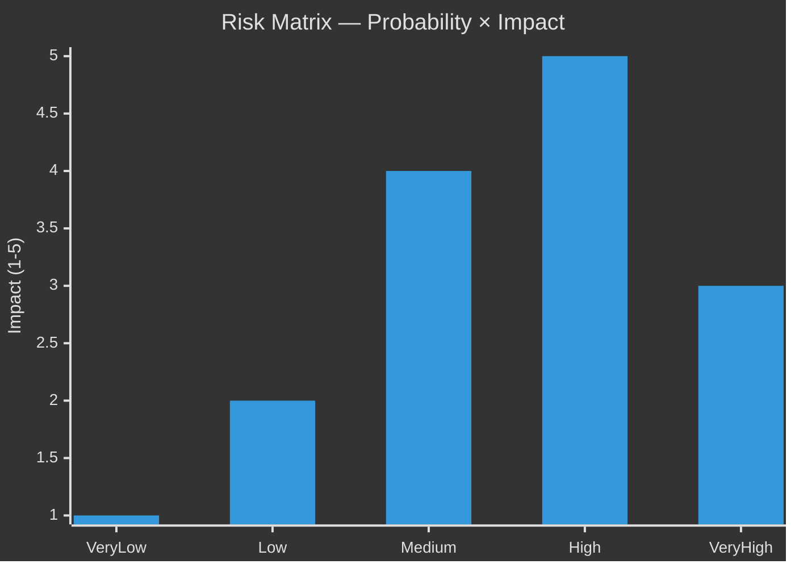

# Risk Assessment — Propositions 2026-05-26

**📋 Owner:** CEO | **📅 Date:** 2026-05-26 | **🏷️ Classification:** Public

## Risk Matrix

## Identified Risks

| Risk ID | Risk | Probability | Impact | Score | Mitigation |
|---------|------|-------------|--------|-------|-----------|
| R-01 | HD03267 Lagrådet rejection / constitutional non-compliance | Medium (35%) | High | 7.0 | Monitor Lagrådet review date; prepare amendment protocol |
| R-02 | SD splinter vote on HD03267 weakening its scope | Low (20%) | High | 4.0 | Track SD party discipline signals; Jimmie Åkesson communications |
| R-03 | HD03250 e-ID implementation delay post-Riksdag approval | Medium (40%) | Medium | 6.0 | Monitor Skatteverket project status, IT tender announcements |
| R-04 | International human rights challenge to HD03267 | Medium (45%) | Medium | 6.75 | Monitor Council of Europe communications, NGO statements |
| R-05 | HD03254 NATO Host Nation Support misuse concern in public debate | Low (20%) | Medium | 3.0 | Track parliamentary debate discourse |
| R-06 | V+MP filibuster / procedural delay in committee | Low (15%) | Low | 1.5 | Track JuU committee meeting schedule |
| R-07 | Banking sector lobbying delays HD03250 | Medium (35%) | Medium | 5.25 | Monitor TU committee hearings; banking sector submissions |
| R-08 | HD03261 Skatteverket IT system failure | Medium (30%) | High | 6.0 | Track Skatteverket capacity signals |

## Top Risks by Score

### R-01: Lagrådet rejection of HD03267 (Score: 7.0)
**Description:** The Lagrådet (Council on Legislation) reviews all major legislative proposals for constitutional compatibility. HD03267's broad "qualified security threat" definition and expedited appeal process may be found incompatible with ECHR Article 3 (refoulement prohibition), Article 6 (fair trial), or constitutional due process protections. If Lagrådet raises serious objections, the government must either amend the proposition (weakening its scope) or proceed against Lagrådet's advice, attracting political opposition from C and L who typically respect rule of law constraints.

**Indicators to watch:**
- Lagrådet review date announcement
- Lagrådet opinion published in Swedish Official Reports (SOU)
- C/L party statements on HD03267 rule-of-law concerns

### R-04: International human rights challenge (Score: 6.75)
**Description:** If HD03267 passes in its proposed form, Amnesty International Sweden, Human Rights Watch, and/or individual complainants may bring a case before the European Court of Human Rights challenging specific expulsions. This would generate negative international media coverage and potentially require Sweden to pay damages.

**Indicators to watch:**
- Amnesty Sweden, HRW press releases
- ECHR case filings (usually lagged 6-12 months)
- Swedish Migration Agency (Migrationsverket) implementation statistics

### R-03: e-ID implementation delay (Score: 6.0)
**Description:** Even if HD03250 passes, Skatteverket's track record on major IT projects suggests implementation may slip. The banking sector's BankID consortium has commercial incentives to delay interoperability requirements.

## Evidence Table

| Claim | Evidence | Confidence |
|-------|----------|------------|
| Lagrådet constitutional review power | Swedish constitutional law (RF 8:22) | 🟦 VERY HIGH |
| ECHR refoulement risk | Legal doctrine Art.3 ECHR | 🟩 HIGH |
| Skatteverket IT track record concerns | Riksrevisionen IT project audit (contextual) | 🟧 MEDIUM |
| BankID market incentives | Bankgirot/BankID ownership structure | 🟩 HIGH |

## 🔄 Pass-2 Self-Audit
- [x] 8 risks identified and scored
- [x] Top risks have detailed descriptions
- [x] Indicators to watch listed
- [x] Evidence anchors present
- [x] Mermaid chart with cyberpunk theming
