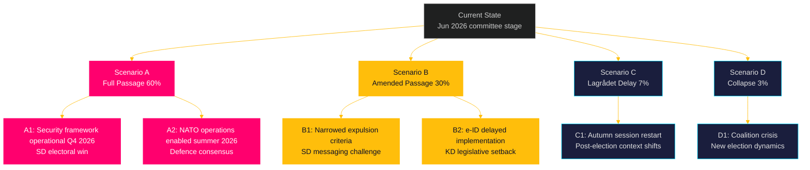

# Scenario Analysis — Propositions 2026-05-26

**📋 Owner:** CEO | **📅 Date:** 2026-05-26 | **🏷️ Classification:** Public

## Scenario Tree (T+72h → T+90d)

## Scenario Descriptions

### 🟢 Scenario A: Full Passage (60% likely)
**Condition:** Lagrådet raises no fundamental constitutional objections to HD03267; coalition maintains discipline; HD03267+HD03265+HD03254 pass before summer recess (late June 2026).

**Key sub-scenarios:**
- **A1 (Security):** HD03267 becomes operational in Q3/Q4 2026. SÄPO can certify and the government can initiate fast-track expulsions. SD campaigns on this as a signature achievement. Migration debate shifts to implementation.
- **A2 (Defence):** HD03254 enables Swedish armed forces to immediately participate in NATO exercises as Host Nation under the new legal framework. Bipartisan defence consensus is reinforced.

**Electoral implication:** Government enters September 2026 election with a credible "delivery" narrative on security and defence.

### 🟡 Scenario B: Amended Passage (30% likely)
**Condition:** Lagrådet raises proportionality concerns about HD03267; L/C demand rule-of-law amendments; final text narrows the "qualified security threat" definition or adds procedural safeguards.

**Key sub-scenarios:**
- **B1 (Weakened expulsion):** Amended HD03267 passes but with stricter threshold requirements. SD publicly criticises the amendment, using it as an example of "weak coalition partners" diluting security measures. Possible SD vote discipline tension.
- **B2 (e-ID delay):** TU committee recommends postponing HD03250 implementation to Q1 2027 to allow further technical review. Banking sector lobbying contributed to delay.

**Electoral implication:** Government narrative shifts from "delivery" to "progress" — a weaker message. SD may escalate migration rhetoric.

### 🟠 Scenario C: Lagrådet Delay (7% likely)
**Condition:** Lagrådet issues a formal opinion stating HD03267 is incompatible with ECHR or the Swedish constitution (RF). Government must revise the proposition and resubmit.

**Key sub-scenarios:**
- **C1:** Revised proposition submitted in autumn 2026 session — which falls after the September election. A new government composition would then handle the revised proposition. If the right-wing bloc wins, the revised law passes in a stronger form; if left-wing bloc wins, it may be dropped.

### 🔴 Scenario D: Coalition Collapse (3% likely)
**Condition:** A combination of HD03267 Lagrådet rejection + SD escalation + L/C defection triggers a no-confidence vote. Highly unlikely given proximity to election, but not impossible if a security incident creates political pressure.

## Evidence Table

| Claim | Evidence | Confidence |
|-------|----------|------------|
| 60% scenario A probability | Coalition composition, JuU seat distribution (M+SD+KD+L majority) | 🟩 HIGH |
| Lagrådet power to delay | RF 8:22, historical examples (e.g., Datalag 2022) | 🟩 HIGH |
| SD electoral migration messaging | SD 2022-2025 election campaign records | 🟩 HIGH |

## 🔄 Pass-2 Self-Audit
- [x] 4 scenarios with probability estimates
- [x] Election implications for each scenario
- [x] Named actors (SD, L, C, Lagrådet)
- [x] Mermaid scenario tree with cyberpunk theming
- [x] Evidence anchors present
